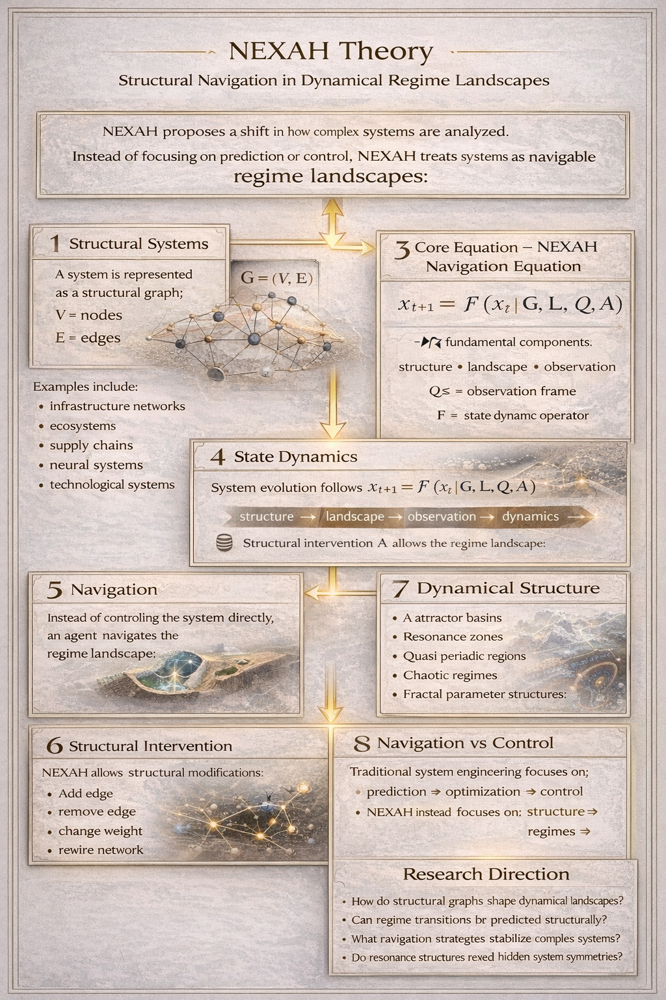
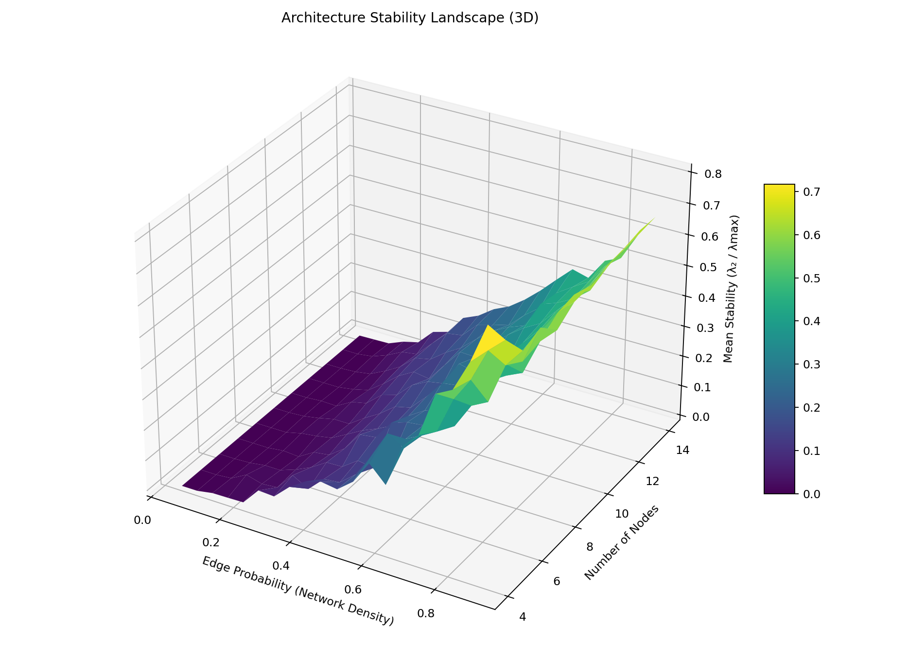
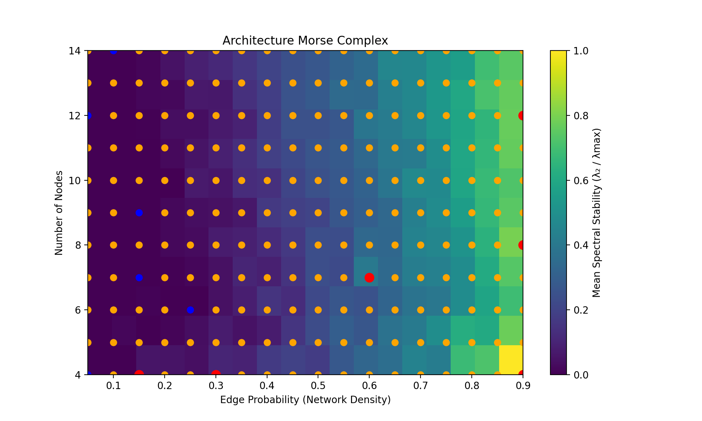
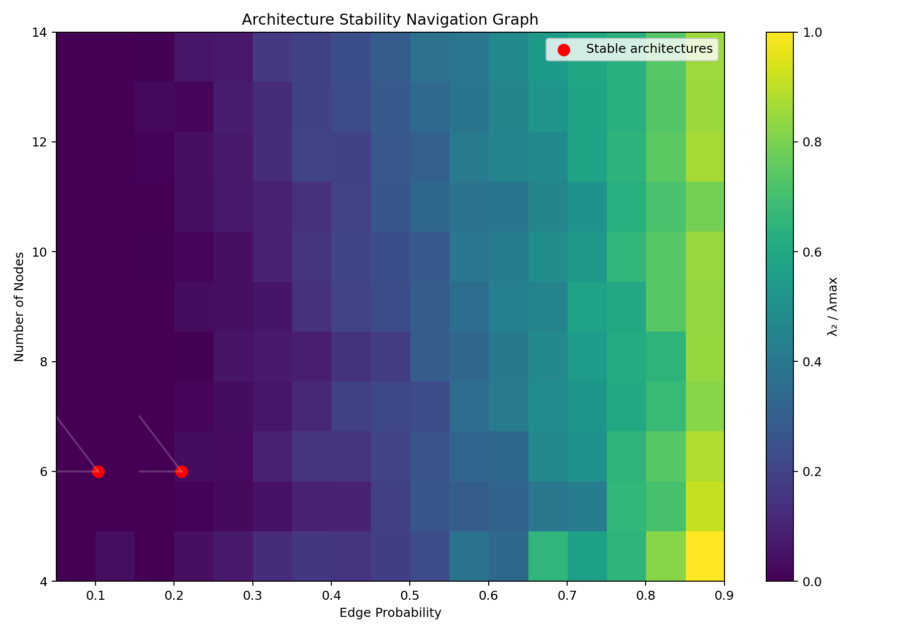
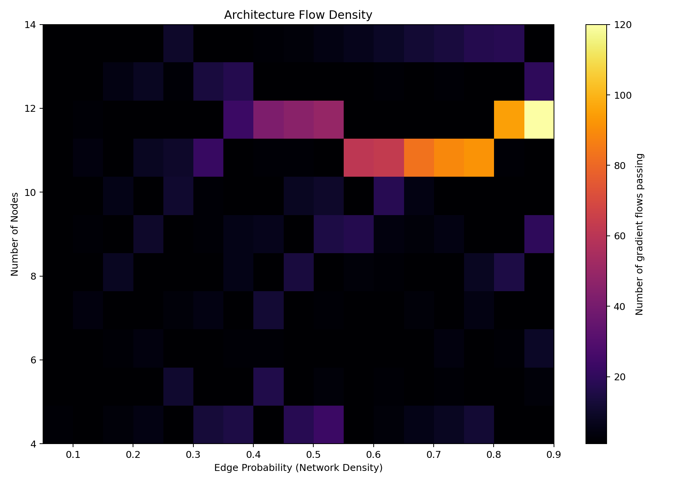
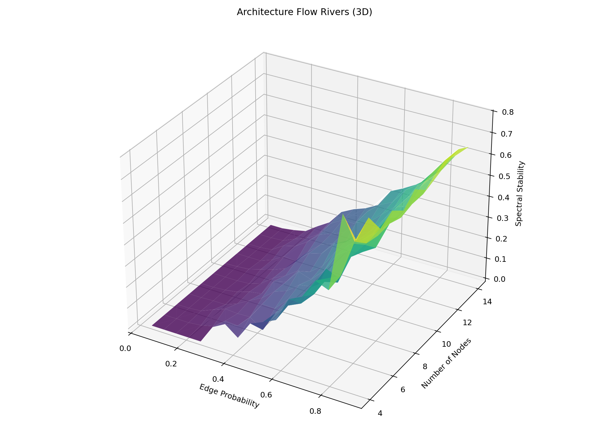
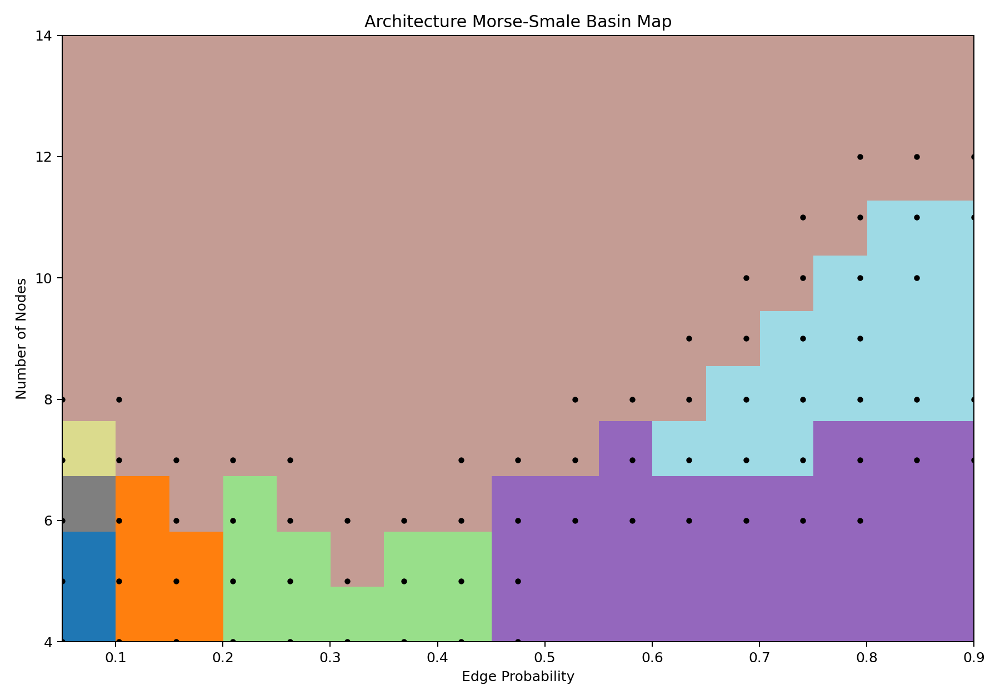

## NEXAH in 20 Seconds

**NEXAH** is a structural navigation kernel for complex dynamical systems.

Instead of optimizing control actions, NEXAH maps system dynamics into **navigable regime landscapes** and analyzes trajectories across stable and unstable regions.

Rather than treating systems purely as simulation environments, NEXAH converts system dynamics into navigable regime maps:

system → regimes → navigation → intervention

This enables agents to:

- identify stability zones  
- detect regime transitions  
- evaluate navigation trajectories  
- test structural interventions  

The goal is not control — but **navigation through dynamical regimes**.

---


**NEXAH** is a navigation kernel for complex dynamical systems.


# NEXAH System Map

The NEXAH framework is organized as a layered research architecture connecting theory, system structure, dynamical analysis, and navigation.

Conceptual Layer
Regime Theory
Stability Models
Resonance Logic

↓

Core Engine
NEXAH Kernel
Navigation API
Graph Engine

↓

Simulation Layer
System Runner
Simulation Engine
Stability Flow Dynamics
Attractor Networks

↓

Analysis Tools
Dynamical Systems Analysis
Resonance Tools
Attractor Analysis
Fractal Analysis

↓

Pattern Engine
Resonance Scan
Regime Detection
Structural Pattern Analysis

↓

Visual Atlas
Regime Landscapes
Chaos Maps
Resonance Maps
Stability Surfaces

↓

Demo Systems
Simulation Demos
Navigation Experiments
Dynamical Exploration
Pattern Demos

↓

Research Layer
NEXAH Codex Integration

This layered structure allows NEXAH to connect **system structure, dynamical regimes, navigation strategies, and structural interventions** within a single framework.
---

Instead of controlling systems directly, NEXAH analyzes **regime landscapes**
and enables navigation through stability regions, transitions, and attractors.
---

# Kernel API

The NEXAH kernel exposes a minimal API for structural system analysis.

### Core Objects

| Object | Purpose |
|------|------|
| StructuralGraph | Representation of the system structure |
| RegimeLandscape | Stability and transition regions of the system |
| ObservationFrame | Defines the coordinate frame in which system states are interpreted |
| StateDynamics | Defines how system states evolve over time |
| NexahKernel | Main interface for system analysis and intervention |

### Core Operations

| Method | Description |
|------|------|
| analyze_system() | Analyze navigation trajectories across the regime landscape |
| simulate_action(action) | Apply structural interventions to the system graph |
| trajectory() | Simulate state evolution over time |

---

# Core Mathematical Principle

The kernel models system evolution as a dynamical process:

x_{t+1} = F(x_t | G, L, Q)

Where

G = StructuralGraph  
L = RegimeLandscape  
Q° = ObservationFrame  
F = StateDynamics  

This formulation allows the kernel to analyze trajectories across regime landscapes, enabling navigation between stable and unstable system states.

---

# Core Idea

NEXAH models systems as structural graphs embedded in regime landscapes.

A regime landscape represents regions of stability, instability, and transition within a system.

The kernel analyzes navigation trajectories across this landscape and allows simulation of structural modifications to explore system resilience.



NEXAH treats complex systems as **navigable regime landscapes** rather than
purely controllable dynamical systems.

System dynamics emerge from the interaction between:

- structural graphs
- regime landscapes
- state dynamics
- navigation strategies
---

# Regime Navigation Pipeline

NEXAH converts system dynamics into navigable regime structures.

Instead of directly optimizing actions, the kernel identifies regime regions and transition pathways in the system landscape.

This enables structural navigation of complex systems.

```
System State
↓
Regime Detection
↓
Regime Graph
↓
Transition Detection
↓
Navigation Engine
↓
Intervention Planning
```

---

# Kernel Architecture

The NEXAH kernel follows a layered system architecture.

```
System Graph
│
▼
Regime Landscape (MESO)
│
▼
State Dynamics
│
▼
Regime Detection
│
▼
Navigation Engine
│
▼
Action Engine (MEVA)
│
▼
Structural Intervention
```


The NEXAH kernel follows a layered architecture connecting structural models,
dynamical systems analysis, and regime navigation.
---

# Kernel Components

The NEXAH kernel consists of modular layers.

| Layer | Role |
|------|------|
| models.py | Core structural data structures |
| archy.py | Architecture representation |
| meso.py | Regime landscape construction |
| state_dynamics.py | System state evolution |
| navigation.py | Navigation analysis |
| mutation_engine.py | Structural mutation operators |
| meva.py | Structural action simulation |
| nexah_kernel.py | Kernel interface |

### Regime Detection Modules

| Module | Role |
|------|------|
| regime/regime_detector.py | Detect system regimes from time-series behavior |
| regime/regime_graph.py | Build regime transition graphs |
| regime/transition_detector.py | Detect regime boundary crossings |

### Navigation Modules

| Module | Role |
|------|------|
| navigation/navigator.py | Explore reachable regimes |
| navigation/intervention_planner.py | Suggest structural interventions |

---

# Reinforcement Learning Layer

NEXAH also includes an experimental reinforcement learning layer for exploring navigation strategies across regime landscapes.

Location:

ENGINE/rl/

The RL layer allows agents to learn policies that navigate stability landscapes generated by the NEXAH kernel.

Unlike traditional RL environments where rewards are task-based, the reward signal corresponds to **structural stability values** derived from the regime landscape.

This enables agents to learn strategies that guide systems toward stable regimes.

Example agents include:

- QLearningAgent
- LandscapeQAgent
- RandomAgent

Additional tools allow policy visualization and multi-agent stability experiments.

See:

ENGINE/rl/README.md

---

# Simulation Layer

The NEXAH framework includes a simulation layer for exploring dynamical behavior across stability landscapes.

Location:

ENGINE/runtime/

and

ENGINE/simulation/

This layer provides the infrastructure required to simulate system evolution, stability flows, and attractor networks.

---

## Simulation Modules

| Module | Purpose |
|------|------|
| `simulation_engine.py` | Core simulation runtime |
| `system_runner.py` | Orchestrates system simulations |
| `stability_flow_dynamics.py` | Simulates gradient flows across stability landscapes |
| `stability_landscape_dynamics.py` | Models dynamical evolution of stability landscapes |
| `stability_attractor_network.py` | Builds attractor networks and basin structures |

---

## Simulation Pipeline

Simulation in NEXAH follows the pipeline:

system structure
↓
regime landscape
↓
stability dynamics
↓
simulation engine
↓
trajectory generation

This layer connects the structural kernel with experimental exploration and navigation analysis.

---

# Dynamical Systems Analysis Toolbox

The NEXAH kernel includes an optional analysis toolbox for exploring the dynamical properties of system regimes.

Tools are located in:

https://github.com/Scarabaeus1033/NEXAH-CODEX/tree/main/ENGINE/nexah_kernel/tools

These tools analyze resonance structures, attractor landscapes, quasiperiodic dynamics, and structural transitions.

| Tool | Purpose |
|-----|------|
| resonance_ridge_detector | Detect resonance ridges |
| resonance_harmonic_analyzer | Analyze harmonic structure |
| nexah_rotation_number_analysis | Compute rotation numbers |
| nexah_arnold_tongue_map | Detect frequency locking |
| nexah_devils_staircase | Visualize rotation locking |
| nexah_lyapunov_map | Detect chaos vs stability |
| nexah_kam_torus_detector | Identify quasi-periodic regions |
| nexah_parameter_fractal_map | Explore fractal structures |
| nexah_fractal_dimension | Estimate geometric complexity |
| nexah_universality_detector | Detect period-doubling cascades |

Example:

```
python -m ENGINE.nexah_kernel.tools.nexah_lyapunov_map
```

Generated visual outputs are stored in:

https://github.com/Scarabaeus1033/NEXAH-CODEX/tree/main/ENGINE/nexah_kernel/demos/visuals

---

---

## Reference Dynamical System: Lorenz Chaos Navigator

The repository includes a reference dynamical system used to demonstrate the **regime navigation capabilities of the NEXAH framework**.

Location:  
APPLICATIONS/dynamical_systems/lorenz

Documentation:  
APPLICATIONS/dynamical_systems/lorenz/README.md

The **NEXAH Chaos Navigator** analyzes the classical Lorenz system as a **navigable regime landscape** and reconstructs the structural geometry of chaos through multiple analysis layers including attractor geometry, Lyapunov instability fields, FTLE transport structures, regime boundaries, and navigation pathways.

Pipeline execution:

python APPLICATIONS/dynamical_systems/lorenz/run_lorenz_navigation.py

Conceptual pipeline:

Lorenz System → Chaos Geometry → Regime Structure → Transition Corridors → Navigation Analysis

The Lorenz module acts as a **reference benchmark for regime navigation algorithms** before applying the NEXAH framework to real-world systems such as infrastructure networks, energy grids, ecosystem dynamics, and complex system resilience models.

---

# Architecture Stability Analysis

The NEXAH kernel includes a structural stability analysis layer for
exploring **network architecture stability landscapes**.

These tools extend the kernel with **spectral stability operators**
that evaluate how resilient a network architecture is based on its
connectivity structure.

The core metric used is:

λ₂ / λmax

Where

λ₂ = algebraic connectivity  
λmax = largest Laplacian eigenvalue  

This ratio measures how well connected the architecture is while
avoiding excessive centralization.

Empirical experiments indicate a strong correlation between this ratio
and structural resilience.

Resilience estimate:

Resilience ≈ 0.355 + 0.401 · (λ₂ / λmax)

---

## Architecture Stability Pipeline

Architecture analysis in NEXAH follows the pipeline:

Graph Architecture
↓
Spectral Stability Analysis
↓
Architecture Stability Landscape
↓
Topology Detection
↓
Architecture Navigation
↓
Architecture Optimization

This allows the kernel to treat **architecture design as navigation
within a stability landscape**.

---

## Kernel Modules

Architecture stability is implemented through the following kernel modules.

| Module | Purpose |
|------|------|
| stability/spectral_stability.py | Spectral stability metric λ₂ / λmax |
| stability/architecture_landscape.py | Generates architecture stability landscapes |
| navigation/architecture_navigation.py | Navigation and search within architecture space |

These modules allow the kernel to analyze architecture stability
topology and search for resilient system structures.

---

## Core Operations

The kernel exposes several architecture stability operators.

| Function | Purpose |
|------|------|
| spectral_stability_score(G) | Compute λ₂ / λmax |
| resilience_estimate(G) | Estimate structural resilience |
| graph_metrics(G) | Compute architecture statistics |
| build_architecture_landscape() | Generate stability landscapes |
| find_local_maxima() | Detect stable architecture regions |
| build_navigation_graph() | Connect stable architectures |
| gradient_ascent_architecture_search() | Search for stable architectures |

Example usage:

```python
from ENGINE.nexah_kernel import build_architecture_landscape
from ENGINE.nexah_kernel import gradient_ascent_architecture_search

landscape = build_architecture_landscape()

result = gradient_ascent_architecture_search(
    landscape["node_values"],
    landscape["p_values"],
    landscape["stability_field"]
```

Architecture Stability Landscapes

Architecture stability forms a structured landscape across architecture
parameters.

Typical axes used in the experiments:

x = edge probability (network density)
y = number of nodes
z = spectral stability score

These landscapes reveal:
	•	stable architecture basins
	•	ridge structures
	•	phase transitions between architectures
	•	gradient flow trajectories toward stable regimes

The architecture stability experiments revealed distinct stability
regions and transition boundaries within architecture space.

⸻

Relationship to the Kernel

Architecture stability analysis integrates with the NEXAH navigation framework.

Architecture Graph
↓
Spectral Stability
↓
Architecture Landscape
↓
Navigation Graph
↓
Gradient Navigation

This allows the kernel to explore architecture design as a navigable
structural landscape, consistent with the broader NEXAH philosophy:

system → regimes → navigation

In this case:

architecture → stability landscape → architecture navigation

---

## Architecture Stability Gallery

The following figures illustrate the architecture stability landscapes
generated by the NEXAH architecture exploration demos.

They reveal how network architectures organize into **stable regions,
transition ridges, and gradient flow trajectories** within the
architecture stability landscape.

---

### Stability Landscape & Morse Structure

| Stability Landscape | Morse Topology |
|---|---|
|  |  |

The stability landscape visualizes how spectral stability evolves
across architecture parameters.  
The Morse complex reveals critical topology structures such as maxima,
minima, and saddle regions.

---

### Architecture Navigation

| Navigation Graph | Gradient Flow Density |
|---|---|
|  |  |

The navigation graph connects stable architecture attractors.  
Flow density maps show where gradient trajectories concentrate across
the architecture stability landscape.

---

### Flow Dynamics & Basin Structure

| Flow Rivers (3D) | Morse-Smale Basin Map |
|---|---|
|  |  |

Flow rivers illustrate gradient ascent trajectories across the
architecture landscape.  
The Morse-Smale map decomposes the architecture space into basins of
structural stability.

---

# Visual Exploration Layer

The kernel includes exploratory demonstrations of regime navigation.

Location:

https://github.com/Scarabaeus1033/NEXAH-CODEX/tree/main/ENGINE/nexah_kernel/demos

These demos explore structural dynamics such as:

- attractor basins
- resonance fields
- symmetry landscapes
- multi-attractor navigation
- regime shifts
- cascading failures
- structural resilience
- spiral and resonance dynamics

Example demos:

```
python -m ENGINE.nexah_kernel.demos.demo_regime_navigation
python -m ENGINE.nexah_kernel.demos.demo_regime_map_navigation
python -m ENGINE.nexah_kernel.demos.risk_navigation_demo
python -m ENGINE.nexah_kernel.demos.cascade_failure_demo
python -m ENGINE.nexah_kernel.demos.regime_shift_demo
python -m ENGINE.nexah_kernel.demos.demo_navigation
python -m ENGINE.nexah_kernel.demos.maze_navigation_demo
python -m ENGINE.nexah_kernel.demos.grid_resilience_demo
```

These visualizations illustrate the core idea:

```
System → Regime Map → Navigation
```

---

# Project Structure

The kernel repository is organized into conceptual layers.

```
nexah_kernel
│
├─ core kernel
│    nexah_kernel.py
│    models.py
│    state_dynamics.py
│
├─ structural layers
│    archy.py
│    meso.py
│    meva.py
│
├─ regime detection
│    regime/
│        regime_detector.py
│        regime_graph.py
│        transition_detector.py
│
├─ navigation layer
│    navigation/
│        navigator.py
│        intervention_planner.py
│
├─ pattern & analysis
│    pattern_engine.py
│    pattern_classifier.py
│
├─ analysis toolbox
│    tools/
│
└─ exploratory demos
     demos/
```

The kernel itself remains intentionally compact, while experiments and analysis tools extend around it.

---

# Testing

A minimal kernel test suite is included.

```
python -m ENGINE.nexah_kernel.tests.test_kernel
```

---

# Design Principles

The NEXAH kernel follows four core design principles.

### Minimal Core

The kernel remains small and modular.

### System-Oriented

Focus on system structure, regimes, and navigation rather than large simulation environments.

### Composable

The kernel can integrate with infrastructure models, simulations, agent systems, or decision-support tools.

### Small Kernel

The core navigation logic fits into only a few hundred lines of code.

Higher-level analysis tools and simulations grow around the kernel.

---

# Status

Current status: experimental kernel.

The architecture is stabilizing as regime navigation and analysis tools are integrated.

---

# NEXAH

NEXAH is part of the broader **SCARABÆUS1033 research framework**, exploring structural navigation and resilience in complex systems.
