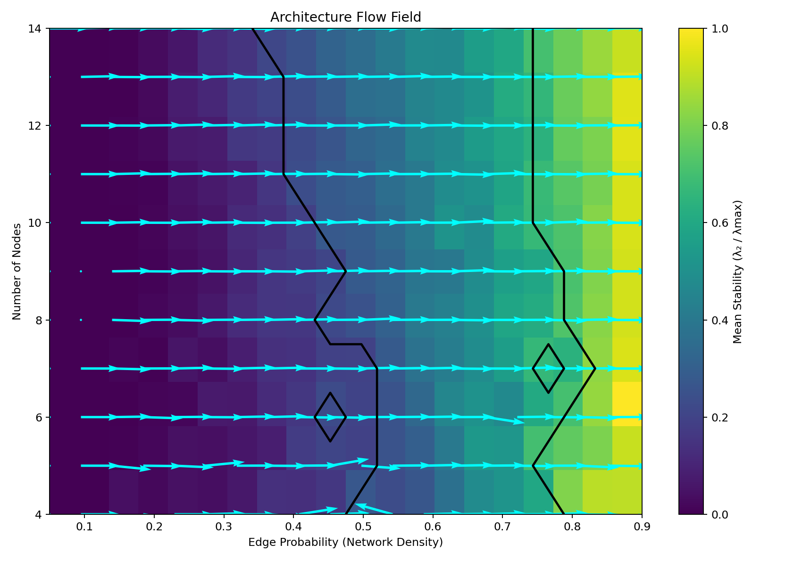
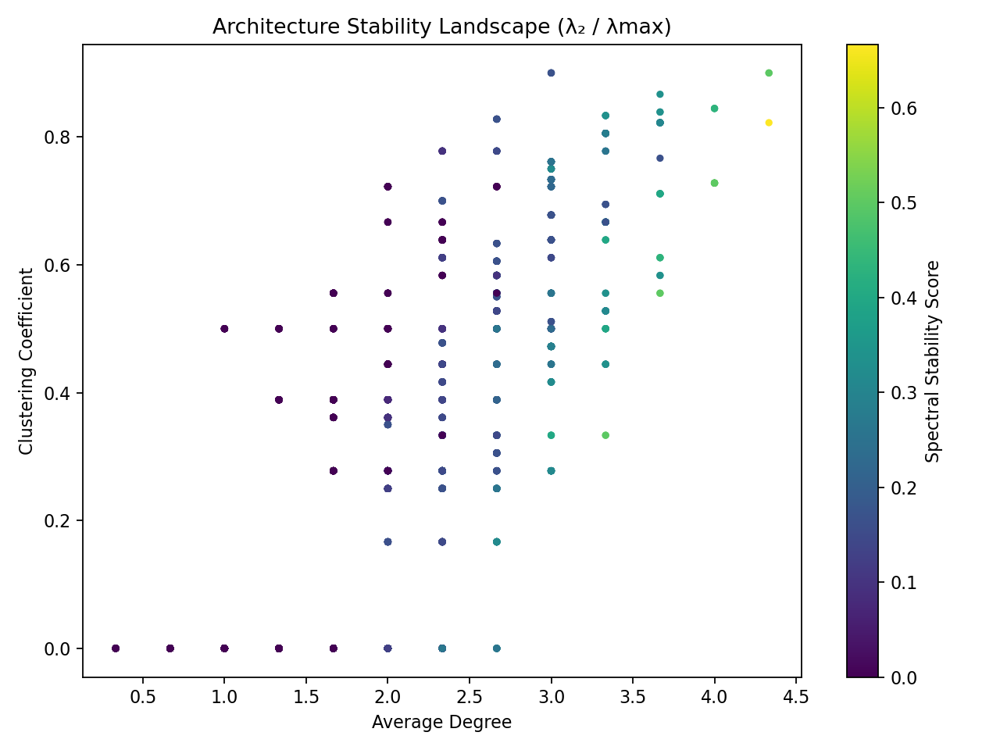
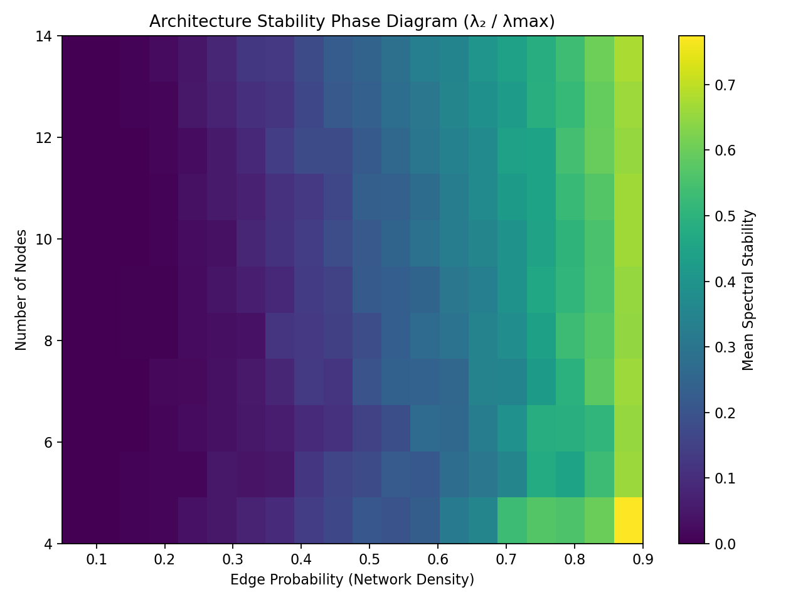
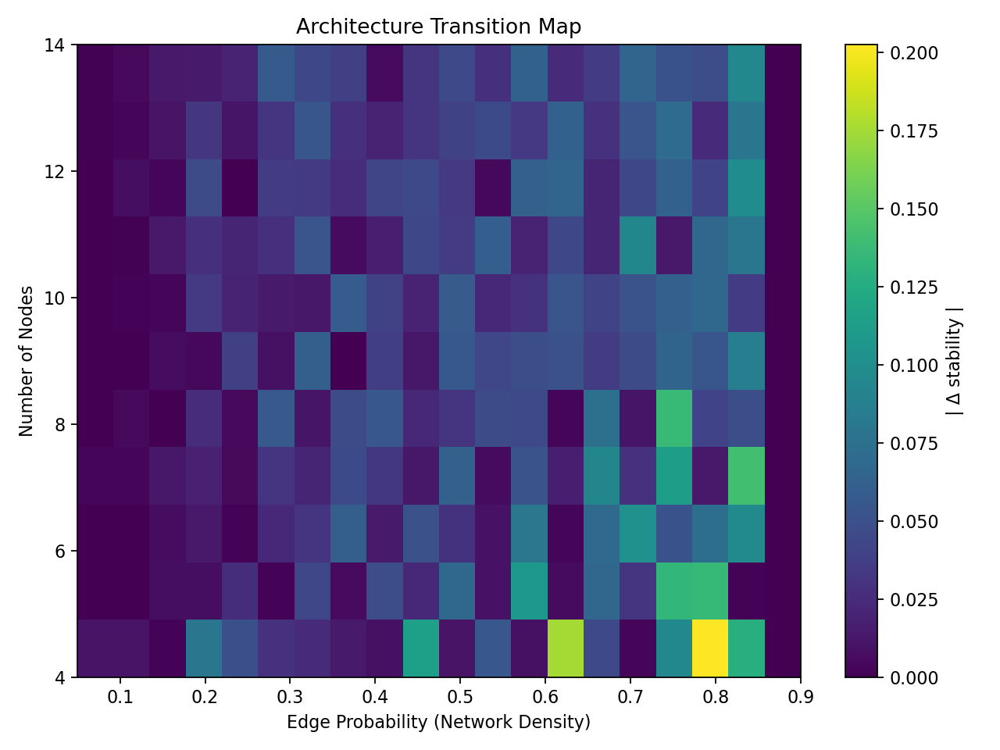
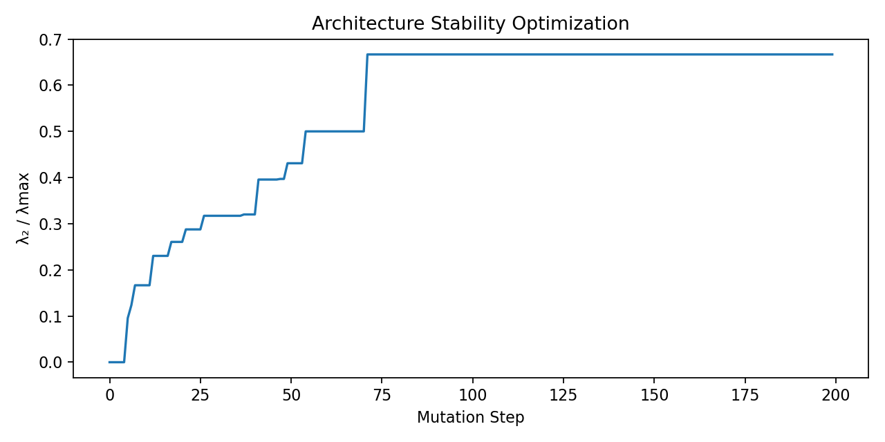
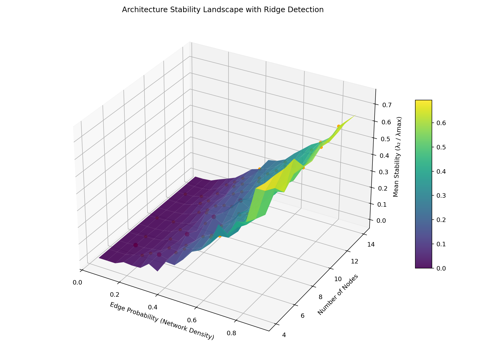
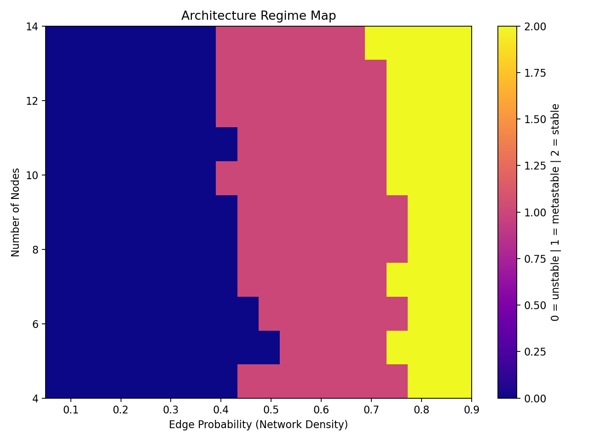
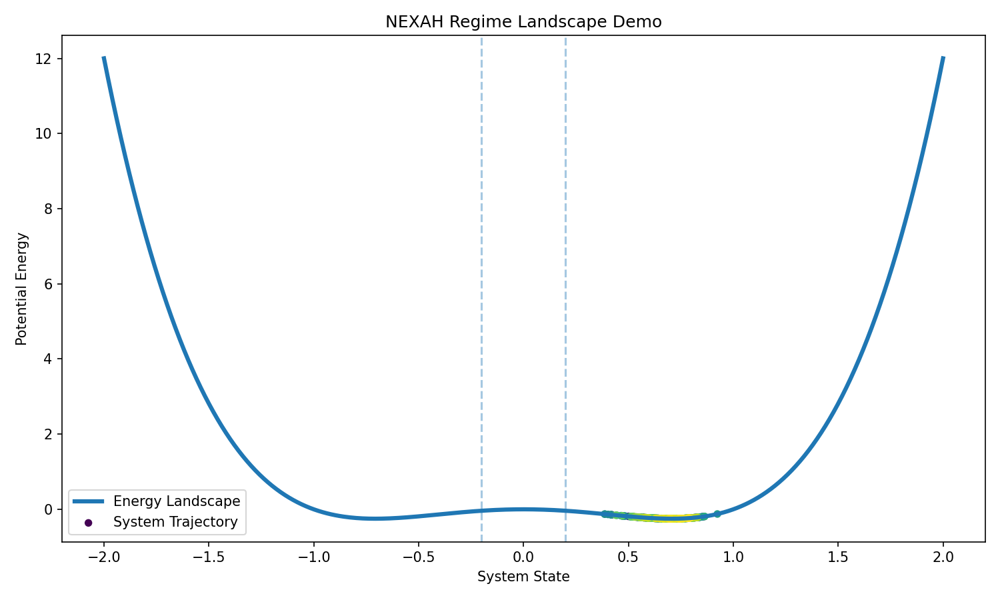

# NEXAH Demonstrations & Visual Exploration

The `demos` module contains runnable demonstrations and visual
exploration tools built on top of the NEXAH kernel.

These scripts illustrate how the kernel can be used to explore
**structural dynamics, regime landscapes, and navigation strategies** in
complex systems.

The demos are intentionally exploratory.\
Their purpose is not benchmarking or performance testing, but
**understanding structural regimes and transitions** in dynamical
systems.

------------------------------------------------------------------------

# Concept

The NEXAH kernel models systems as **regime landscapes**.

Within this framework, system dynamics are interpreted as motion across
a structured parameter landscape.

The demos visualize these landscapes by generating:

-   attractor basins\
-   stability fields\
-   symmetry landscapes\
-   spiral dynamics\
-   multi-attractor systems\
-   navigation trajectories\
-   regime transitions\
-   cascade failures

Many demos produce visual datasets that reveal hidden structures in
system dynamics.

------------------------------------------------------------------------

# Exploration Pipeline

experiment\
↓\
demo\
↓\
visual exploration\
↓\
analysis tools\
↓\
kernel integration

Experiments explore dynamical behavior.\
Demos visualize the resulting regime landscapes.\
Analysis tools extract reusable algorithms that may later become part of
the kernel.

------------------------------------------------------------------------

# Running Demos

Example:

python -m ENGINE.nexah_kernel.demos.demo_regime_navigation

------------------------------------------------------------------------

# Core Landscape Demos

  --------------------------------------------------------------------------------------
  Demo                               Description
  ---------------------------------- ---------------------------------------------------
  demo_regime_navigation.py          Basic regime detection and navigation pipeline

  demo_double_well_navigation.py     Navigation across attractor basins in a double-well
                                     system

  demo_regime_map_visualization.py   Visualizes trajectories within an energy landscape

  demo_regime_phase_map.py           Generates regime maps across parameter space
  --------------------------------------------------------------------------------------

------------------------------------------------------------------------

# Navigation & Regime Analysis

  -----------------------------------------------------------------------------------------
  Demo                                  Description
  ------------------------------------- ---------------------------------------------------
  demo_navigation.py                    Basic system navigation example

  risk_navigation_demo.py               Navigation through risky and safe system regions

  maze_navigation_demo.py               Navigation through complex state spaces

  spiral_landscape_navigation_demo.py   Navigation in spiral-shaped landscapes

  state_landscape_navigation_demo.py    Visualization of regime transitions
  -----------------------------------------------------------------------------------------

------------------------------------------------------------------------

# System Stability & Failures

  Demo                      Description
  ------------------------- ------------------------------------------
  cascade_failure_demo.py   Simulates cascading failures in networks
  regime_shift_demo.py      Demonstrates structural regime shifts
  grid_resilience_demo.py   Tests resilience of network structures

------------------------------------------------------------------------

# Symmetry & Structural Field Exploration

  --------------------------------------------------------------------------------------
  Demo                               Description
  ---------------------------------- ---------------------------------------------------
  symmetry_resonance_explorer.py     Explore structural patterns across symmetry orders

  symmetry_resonance_detector.py     Detect symmetry-driven stability peaks

  symmetry_resonance_atlas.py        Generate a visual atlas of symmetry fields

  n_fold_symmetry_explorer_demo.py   Explore dynamics across N-fold symmetries
  --------------------------------------------------------------------------------------

------------------------------------------------------------------------

# Multi-Attractor Systems

  -------------------------------------------------------------------------------------------------
  Demo                                          Description
  --------------------------------------------- ---------------------------------------------------
  multi_attractor_navigation_demo.py            Navigation across multiple attractors

  pentagon_multi_attractor_navigation_demo.py   Navigation within pentagonal attractor systems

  pentagon_multi_attractor_basin_map_demo.py    Visualization of attractor basins
  -------------------------------------------------------------------------------------------------

------------------------------------------------------------------------

# Structural Field Experiments

  -------------------------------------------------------------------------------------------------
  Demo                                          Description
  --------------------------------------------- ---------------------------------------------------
  pentagon_resonance_field_demo.py              Generates pentagonal structural fields

  pentagon_hexagon_interference_field_demo.py   Interference between symmetry systems

  heptagon_octagon_interference_demo.py         Multi-symmetry interference experiments
  -------------------------------------------------------------------------------------------------

------------------------------------------------------------------------

# Architecture Stability Exploration

  -------------------------------------------------------------------------------------------
  Demo                                    Description
  --------------------------------------- ---------------------------------------------------
  demo_architecture_landscape_3D.py       3D stability landscape of network architectures

  demo_architecture_morse_complex.py      Morse-style topology analysis of the stability
                                          field

  demo_architecture_navigation_graph.py   Navigation graph connecting stable architectures

  demo_architecture_flow_density.py       Density map of gradient flows in the architecture
                                          landscape

  demo_architecture_flow_rivers_3D.py     3D visualization of gradient flow trajectories

  demo_architecture_morse_smale_map.py    Basin decomposition of architecture stability
                                          regions
  -------------------------------------------------------------------------------------------

These experiments form the basis of the **NEXAH architecture stability
kernel**.

------------------------------------------------------------------------

---

# Visual Atlas

The NEXAH demos generate a large collection of structural visualizations.

These images illustrate the **geometry of regime landscapes, stability
fields, and navigation structures** discovered by the kernel.

All images are generated automatically by the demo suite.

---

## Architecture Landscape

| | |
|---|---|
|  |  |
|  |  |

---

## Morse Topology

| | |
|---|---|
|  |  |

These visualizations reveal the **topological structure of architecture
stability landscapes**.

---

## Architecture Stability

| | |
|---|---|
|  |  |
|  |  |

---

## Structural Navigation

| | |
|---|---|
|  |  |
|  |  |

---

## Symmetry & Resonance Fields

| | |
|---|---|
|  |  |

These visualizations explore **structural symmetries and resonance
patterns in dynamical systems**.

---

# Generating Visuals

The images in this gallery can be generated automatically by running:

```bash
python -m ENGINE.nexah_kernel.demos.run_architecture_suite
```
Additional demos generate further datasets and structural visualizations.

⸻

# Dataset Output

Generated visual datasets are stored in:

ENGINE/nexah_kernel/demos/visuals/

These visual datasets form the basis of structural regime analysis and
architecture exploration in NEXAH.

------------------------------------------------------------------------

# NEXAH

Part of the **SCARABÆUS1033 research framework**, exploring structural
navigation and stability dynamics in complex systems.
