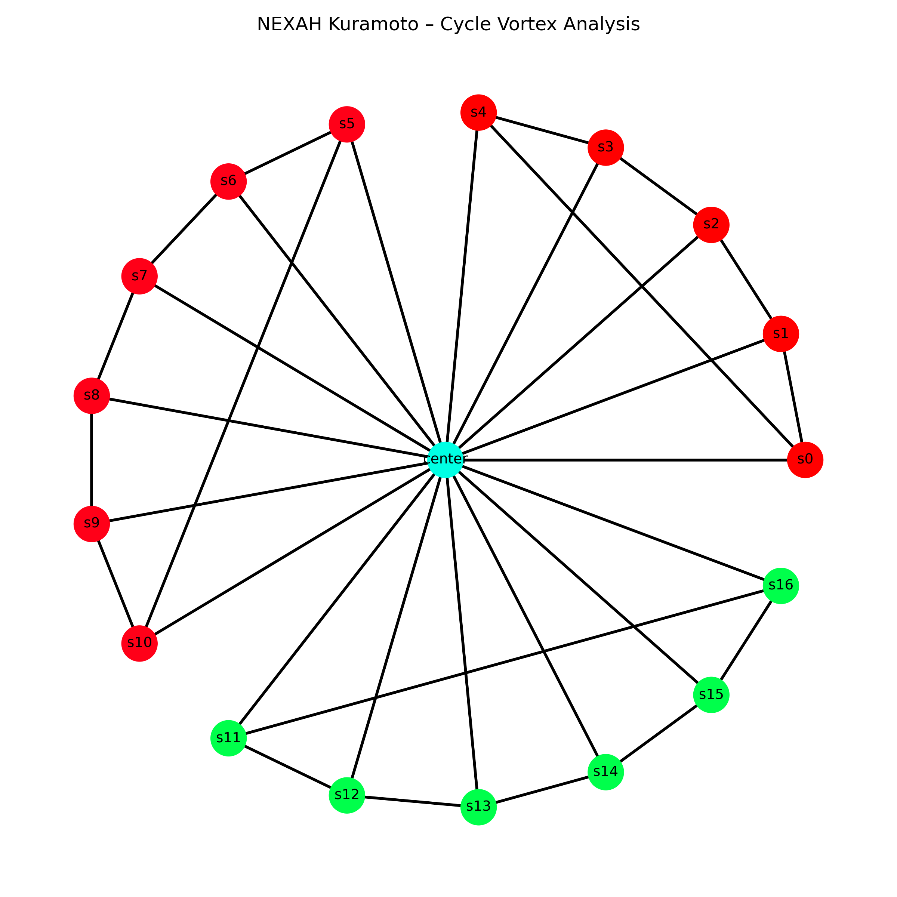

# Structured Oscillator Networks

This experiment series investigates how **structured network topology**
influences synchronization dynamics, vortex formation, and phase transitions
in coupled oscillator systems.

Using Kuramoto-type models on intentionally designed graph topologies,
the experiments explore how **hub–cycle structures, ring shells, and layered
symmetry graphs** shape emergent dynamical behavior.

The goal is to identify **topology-driven synchronization regimes and
vortex structures** that may appear in engineered oscillator networks.

The experiments are based primarily on **Kuramoto-type oscillator models** implemented on structured graphs.

These graphs combine:

- hub coupling
- ring structures
- cycle layers
- structured symmetry patterns

This allows the study of **topology-driven dynamical phenomena**.

---

# Research Motivation

Coupled oscillator systems are fundamental models in nonlinear dynamics.

They appear in many domains including:

- power grids
- neural networks
- biological rhythms
- chemical oscillators
- synchronization in complex networks

While many studies focus on **random or regular networks**, this research explores **intentionally structured topologies**.

The central research question is:

> How does network topology shape synchronization dynamics and vortex structures in oscillator systems?

---

# Relation to Previous Experiments

This experiment series extends the earlier:

symmetry_graph_experiment

which introduced structured symmetry graphs such as:

center node
	•	17 spokes
	•	cycle layers

C5 + C6 + C6

These experiments revealed:

- rapid synchronization in hub–cycle networks
- vortex structures in oscillator phase fields
- metastable synchronization states
- shell sizes producing delayed synchronization

Example result:

Example result:

The current experiment series expands this investigation to **larger classes of oscillator topologies**.

---

# Research Themes

The structured oscillator network experiments focus on several key dynamical phenomena.

---

## 1 — Synchronization Dynamics

How quickly do structured networks synchronize?

Measured quantities include:

- global order parameter R
- synchronization time
- cluster persistence

---

## 2 — Phase Vortex Structures

Phase fields may contain **topological defects** (vortices).

These are detected via:

- phase winding numbers
- cycle phase analysis
- vortex persistence tracking

Vortex structures often appear during intermediate synchronization states.

---

## 3 — Topology-Driven Frustration

Certain network sizes or connectivity patterns may create **frustration**.

Observed indicators include:

- delayed synchronization
- metastable clusters
- persistent vortices
- incomplete phase locking

These effects are often linked to **ring size or symmetry mismatches**.

---

## 4 — Resonance Structures

Structured graphs may support resonance patterns such as:

- phase locking channels
- resonance webs
- synchronization bands

Understanding these structures may reveal hidden dynamical regimes.

---

# Core Network Types

Several network families are studied in this module.

---

## Hub–Ring Networks

Basic topology:

center node
+
N ring oscillators

These systems are used to explore **shell-size synchronization behavior**.

Example investigation:

N = 8 … 200

Measured properties include:

- synchronization time
- vortex density
- cluster formation

---

## Hub–Cycle Networks

Topology:

center node
+
ring nodes
+
cycle edges

Cycle edges provide **local stabilization loops** while the hub provides **global coupling**.

This hybrid topology often produces extremely fast synchronization.

---

## Layered Symmetry Graphs

These extend the symmetry graph experiments with layered cycle structures such as:

C5 + C6 + C6

Layered graphs may produce:

- vortex corridors
- phase domain structures
- toroidal phase dynamics

---

# Experimental Workflow

Typical experiment pipeline:

1. Construct oscillator network topology  
2. Simulate Kuramoto dynamics  
3. Measure synchronization metrics  
4. detect vortex structures  
5. map stability and transition regimes  
6. visualize phase fields and network states  

---

# Output Data

Experiments typically generate:

results/
visuals/

Common outputs include:

- synchronization time statistics
- vortex density maps
- phase field visualizations
- network state diagrams
- regime transition plots

---

# Relation to the NEXAH Kernel

These experiments operate **above the kernel layer**.

The kernel provides:

system → regime landscape → navigation

The structured oscillator experiments explore:

topology → dynamical structure → synchronization regimes

Insights discovered here may later inform:

- kernel models
- navigation strategies
- stability landscape analysis

---

# Status

Active exploratory research.

The experiments aim to reveal how **structured network topology shapes nonlinear oscillator dynamics**.

Future work includes:

- large shell-size scans
- vortex density mapping
- topology–synchronization phase diagrams
- resonance web detection
- multi-layer oscillator networks

---

# NEXAH

Part of the **SCARABÆUS1033 research framework**, exploring structural navigation and dynamical resonance in complex systems.
