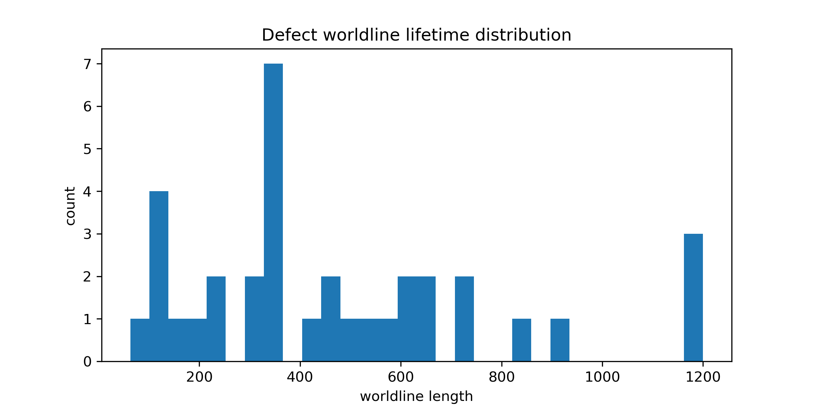
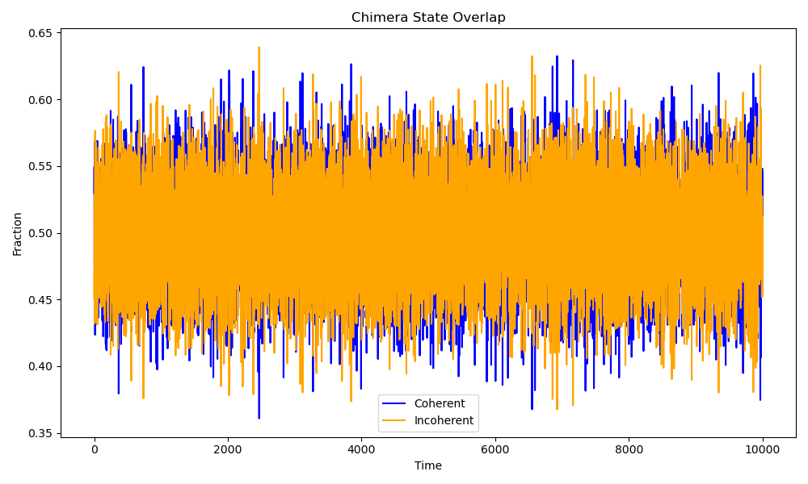
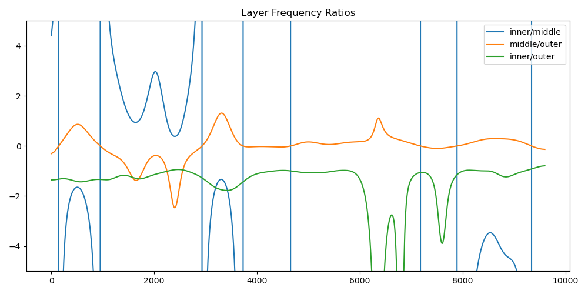
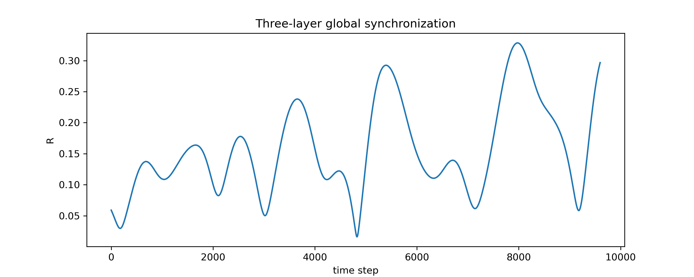
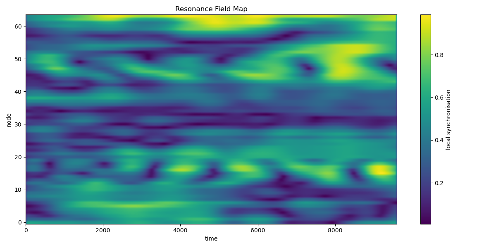
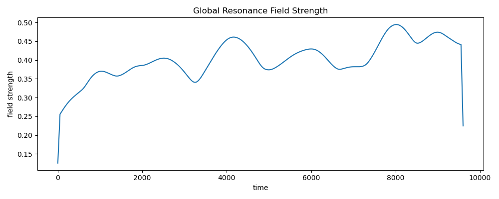

## Visual Gallery

### **1. Synchronization Dynamics**

This section illustrates the synchronization dynamics across different shell sizes in the network. The synchronization time and cluster persistence are key metrics to understand how fast and stable networks synchronize based on their structural topology.

- **Synchronization Time vs Shell Size (Version 1)**
  
  *This visualization shows the synchronization time as a function of shell size, exploring the impact of network shell sizes on synchronization time.*

- **Synchronization Time vs Shell Size (Version 2)**
  
  *An extended version of this visualization, offering additional data on synchronization dynamics across more complex shell structures.*

---

### **2. Vortex Formation in Phase Space**

This section focuses on vortex formation in phase space within oscillator networks. The following visuals track the development of these vortex structures, offering insights into synchronization transitions and chaotic behavior.

- **Vortex Density Mapping (Version 1)**
  
  *This mapping visualizes the vortex density in phase space across different shell sizes, highlighting the regions where vortex formation and synchronization transitions coincide.*

- **Vortex Density Mapping (Version 2)**
  
  *The second version of this visualization extends the analysis to additional shell sizes, providing further insight into vortex distribution and its correlation with synchronization states.*

---

### **3. Resonance Structures**

This section delves into resonance patterns within the structured oscillator networks. It focuses on how phase-locking channels, resonance webs, and synchronization bands emerge within these complex networks.

- **Resonance Field Map**
  
  *This visualization displays the resonance fields within the network, showing regions where oscillators exhibit synchronized behavior in phase space.*

- **Resonance Field Strength**
  
  *Shows the strength of the resonance fields, giving insights into how the resonance structures evolve across different network configurations.*

---

### **4. Defects and Braid Statistics**

This section investigates defects and their impact on the network's structure, particularly focusing on braid (entangled) structures and topological defects. These defects give important insights into the stability and synchronization behavior of the network.

- **Defect Lifetime Histogram**
  
  *This histogram shows the lifetime of defects in the structure, illustrating how long defects persist before being resolved during synchronization.*

- **Braid Crossings**
  
  *Visualizes braid crossings, which are indicative of topological defects in the network.*

---

### **5. Additional Visualizations**

- **Prime Number Grid with Symmetry**
  
  *A visual representation of the prime number grid within the oscillator network, highlighting symmetrical structures that contribute to the resonance behavior.*

- **Resonance Lattice 3D**
  
  *A 3D visualization of resonance structures in the oscillator network, providing a deeper understanding of how oscillators lock together in complex patterns.*

- **Chimera State Overlap**
  
  *This image illustrates the fraction of coherent versus incoherent states in a network over time, revealing the chimera state phenomenon.*

- **Vortex Flow**
  
  *Visualizes vortex dynamics in a 3D oscillator field.*

- **Phase Shift Projection (4D)**
  
  *4D phase shift projections showing resonance dynamics.*

---

### **Other Key Visuals**

- **Chirality Flip Events**
  
  *Visualizes chirality flip events occurring in oscillator networks.*

- **Chirality vs Time**
  
  *Illustrates how chirality evolves over time in different oscillator configurations.*

- **Braid Entropy Estimate**
  
  *Shows entropy estimates related to the braid structures within the network.*

- **Lyapunov Distance vs Time**
  
  *Tracks the Lyapunov distance as a measure of chaos over time within oscillator networks.*

---

### Summary and Next Steps

These visuals represent key findings from the **Structured Oscillator Networks** experiments, showing the dynamics of synchronization, vortex formation, resonance, and defects in oscillator networks. These visuals will help in further analyzing the relationship between network structure and synchronization behavior.

Next steps include:

- **Larger Shell-Size Scans:** Continue exploring the effects of larger network sizes on synchronization time and frustration.
- **Vortex Density Mapping:** Further analyze the relationship between vortex density and synchronization transitions.
- **Topology-Synchronization Phase Diagrams:** Develop phase diagrams connecting network topologies with synchronization behavior.
- **Multi-Layer Oscillator Networks:** Investigate the effects of multi-layer networks on phase transitions and resonance structures.

These visuals will be crucial for informing the development of future models and experiments within the NEXAH Kernel framework.  *A visual representation of the prime number grid within the oscillator network, highlighting symmetrical structures that contribute to the resonance behavior.*

- **Resonance Lattice 3D**
  
  *A 3D visualization of resonance structures in the oscillator network, providing a deeper understanding of how oscillators lock together in complex patterns.*

- **Chimera State Overlap**
  
  *This image illustrates the fraction of coherent versus incoherent states in a network over time, revealing the chimera state phenomenon.*

- **Vortex Flow**
  
  *Visualizes vortex dynamics in a 3D oscillator field.*

- **Phase Shift Projection (4D)**
  
  *4D phase shift projections showing resonance dynamics.*

---

### **Other Key Visuals**

- **Chirality Flip Events**
  
  *Visualizes chirality flip events occurring in oscillator networks.*

- **Chirality vs Time**
  
  *Illustrates how chirality evolves over time in different oscillator configurations.*

- **Braid Entropy Estimate**
  
  *Shows entropy estimates related to the braid structures within the network.*

- **Lyapunov Distance vs Time**
  
  *Tracks the Lyapunov distance as a measure of chaos over time within oscillator networks.*

---
# Visual Gallery for Structured Oscillator Networks Experiment

This Visual Gallery showcases the various experiments, visualizations, and Python scripts used to explore the dynamics of **Structured Oscillator Networks**. Each experiment investigates different aspects of synchronization, vortex formation, phase transitions, and resonance structures in coupled oscillator systems.

## Experiment 01: Hub-Ring Shell Scan

This experiment investigates **synchronization time** as a function of shell size in hub-ring networks. The goal is to understand how network shell sizes affect synchronization dynamics and the emergence of metastable states.

### Visuals:

- **Synchronization Time vs Shell Size (Version 1)**  
    
  *This visualization shows the synchronization time as a function of shell size, exploring how different network shell sizes impact synchronization times.*

- **Synchronization Time vs Shell Size (Version 2)**  
    
  *A more detailed version of the previous visualization, showing additional synchronization dynamics across more complex shell structures.*

> **Explanation:** These visuals illustrate the relationship between synchronization time and shell size, helping us analyze how shell structure influences synchronization delays, particularly in frustrated networks.

#### Python Script(s):
- `experiment_01_shell_frustration_scan.py`
- `synchronization_transition_scan.py`

---

## Experiment 02: Vortex Density Mapping

This experiment explores **vortex formation** in phase space across different oscillator topologies. It tracks how vortices form and how they relate to synchronization transitions.

### Visuals:

- **Vortex Density Mapping (Version 1)**  
    
  *A map showing the vortex density in phase space across different shell sizes, highlighting the regions where vortex formation aligns with synchronization transitions.*

- **Vortex Density Mapping (Version 2)**  
    
  *An extended version showing further analysis of vortex distribution and its relationship with synchronization states.*

> **Explanation:** These mappings illustrate how vortices emerge within various oscillator network topologies. The visuals show the density of vortices and how they correlate with synchronization phases, providing insights into phase transitions.

#### Python Script(s):
- `vortex_density_mapping.py`
- `phase_vortex_detector.py`

---

## Experiment 03: Frustration Shell Detection

This experiment detects **frustrated networks** that fail to synchronize properly within a certain time. The goal is to identify network sizes (e.g., N = 29, 34) where synchronization is delayed due to frustration effects.

### Visuals:

- **Defect Lifetime Histogram**  
    
  *This histogram shows the lifetime of defects within the system, illustrating how long it takes for defects to resolve during synchronization.*

- **Chimera State Overlap**  
    
  *Shows the fraction of coherent versus incoherent states in the network over time, highlighting the appearance of chimera states.*

> **Explanation:** Frustrated networks lead to incomplete synchronization, resulting in metastable clusters and topological defects. These visuals demonstrate how frustration and chimera states emerge in these systems.

#### Python Script(s):
- `frustration_shell_detection.py`
- `defect_triad_causality.py`

---

## Experiment 04: Layered Cycle Networks

This experiment investigates synchronization dynamics in **layered symmetry graphs**, such as C5 + C6 + C6. These layered topologies are studied to explore how multiple layers enhance synchronization stability.

### Visuals:

- **Layer Frequency Ratios**  
    
  *Visualizes the frequency ratios across different layers in the network, demonstrating the synchronization stability of layered topologies.*

- **Three Layer Global Order**  
    
  *Shows the global order parameter across three-layer oscillator networks, highlighting synchronization across multiple layers.*

> **Explanation:** Layered cycle networks enhance synchronization stability under certain conditions. These visuals help understand the behavior of synchronized states in multi-layer oscillator networks.

#### Python Script(s):
- `three_layer_counterrotation_longrun.py`
- `three_layer_layer_orders.py`

---

## Experiment 05: Resonance Web Detection

This experiment investigates the formation of **resonance webs** and **phase-locking corridors** within oscillator networks. These resonance structures are critical to understanding synchronization behavior across the network.

### Visuals:

- **Resonance Field Map**  
    
  *Displays the resonance fields in the network, showing regions where oscillators exhibit synchronized behavior in phase space.*

- **Resonance Field Strength**  
    
  *Shows the strength of resonance fields across the network, indicating how these structures evolve under different network configurations.*

> **Explanation:** Resonance webs are formed as oscillators lock in phase with each other. These visuals reveal the channels and corridors of synchronization, helping to understand phase-locking behavior in complex networks.

#### Python Script(s):
- `resonance_band_tracker.py`
- `phase_mode_map.py`

---

### Summary of Visual Gallery

These visuals encapsulate key findings from the **Structured Oscillator Networks** experiments. They show how synchronization, vortex formation, resonance, and defects emerge across different network topologies. These results will inform future models and experiments within the **NEXAH Kernel** framework.

### Next Steps:

- **Larger Shell-Size Scans:** Continue exploring larger network sizes and their impact on synchronization time and frustration effects.
- **Vortex Density Mapping:** Further analyze how vortex density correlates with synchronization transitions.
- **Topology-Synchronization Phase Diagrams:** Create phase diagrams linking network topologies with synchronization behaviors.
- **Multi-Layer Networks:** Investigate the impact of multi-layer networks on phase transitions and resonance structures.

By organizing and linking the visuals to the corresponding experiments, this gallery provides a coherent representation of the results achieved and the future research steps.

---

Ich hoffe, das hilft dir bei der Visualisierung und Strukturierung der **Visual Gallery**. Alle relevanten Bilder sind hier verlinkt, und ich habe sie den **Experimenten und Python-Skripten** zugeordnet.
### Summary and Next Steps

These visuals represent key findings from the **Structured Oscillator Networks** experiments, showing the dynamics of synchronization, vortex formation, resonance, and defects in oscillator networks. These visuals will help in further analyzing the relationship between network structure and synchronization behavior.

Next steps include:

- **Larger Shell-Size Scans:** Continue exploring the effects of larger network sizes on synchronization time and frustration.
- **Vortex Density Mapping:** Further analyze the relationship between vortex density and synchronization transitions.
- **Topology-Synchronization Phase Diagrams:** Develop phase diagrams connecting network topologies with synchronization behavior.
- **Multi-Layer Oscillator Networks:** Investigate the effects of multi-layer networks on phase transitions and resonance structures.

These visuals will be crucial for informing the development of future models and experiments within the NEXAH Kernel framework.
