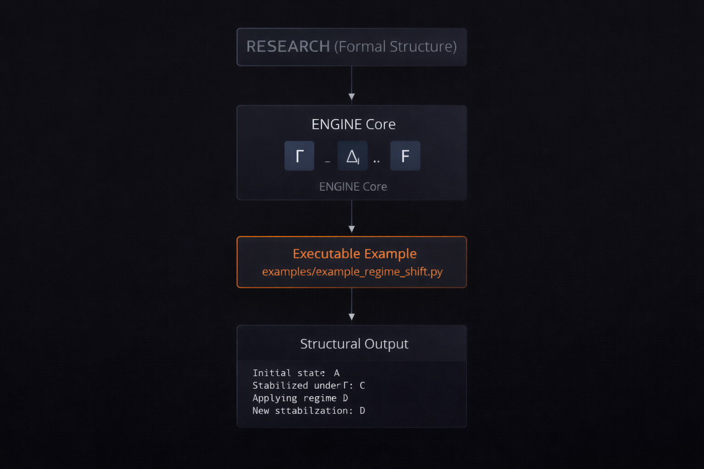

# NEXAH Engine (v0.1)

The NEXAH Engine is the minimal executable core of the NEXAH framework.

It implements finite-order structural modeling using:

- Finite partially ordered sets
- Monotone closure operators (Γ)
- Regime restriction operators (Δ)
- Frame projection operators (F)
- Fixpoint detection

The engine operates strictly within finite discrete order theory.

No metric geometry.  
No continuous time.  
No physical simulation.

---

## Purpose

The goal of the engine is to demonstrate:

- Structural stabilization
- Regime-induced restriction
- Frame-dependent projection
- Multi-regime interaction

This repository moves NEXAH from formal framework to executable structural model.

---

## Core Components
