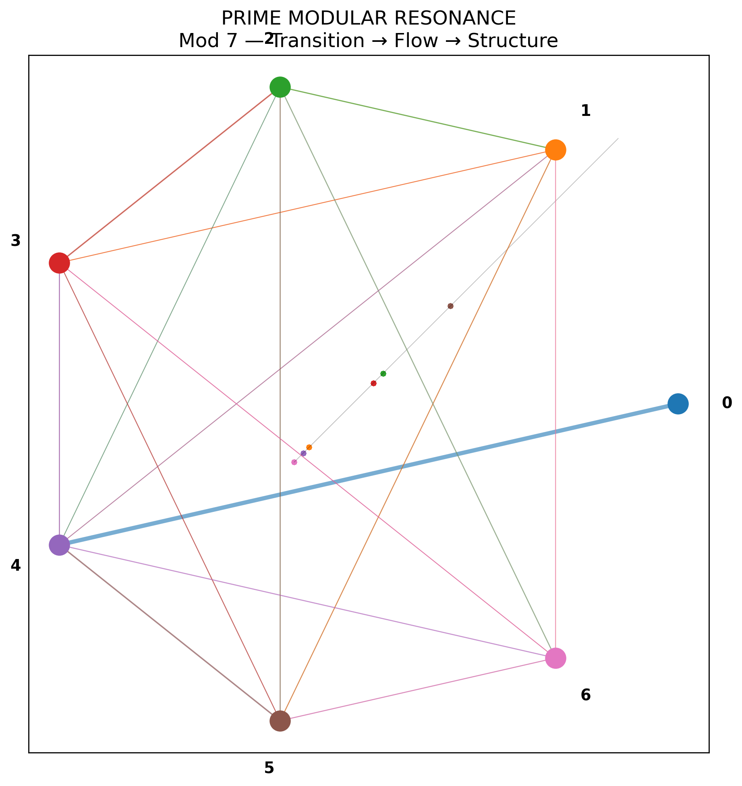

# NEXAH Prime Modular Resonance Experiment

**Path:** `ENGINE/research/experiments/NEXAH_experiment_prime_modular_resonance.md`\
**Status:** Active exploratory research\
**Domain:** Prime dynamics · modular arithmetic · spectral analysis · topology\
**Context:** NEXAH / ENGINE research experiments

---

## Overview

This experiment investigates whether **prime number sequences**, when projected into **modular spaces** such as mod 7, mod 17, mod 24, and mod 60, produce **non-random structural signatures** in:

- spatial trajectories
- density maps
- FFT spectra
- autocorrelation structure
- mirror / reversal chains
- graph topology
- transition maps between modular systems

The goal is **not** to claim new physics, but to test whether prime-driven modular projections generate **measurably different dynamical patterns** from matched random controls.

---

## Core Research Question

> Do prime number sequences generate statistically distinguishable structure in modular projection systems compared with random integer controls?

More specifically:

1. Do primes show persistent clustering in modular spaces such as `mod 7`, `mod 17`, and `mod 60`?
2. Does a **7 → 17 bridge mapping** produce stabilization effects compared to direct residue dynamics?
3. Do FFT / autocorrelation analyses reveal periodic or quasi-periodic signatures such as a **7-beat** or related resonance bands?
4. Do mirror chains, reversal pairs, and selected modular residue sets occur more often than expected under null models?
5. Can topology extracted from projected trajectories reveal loops, channels, knots, or basin-like structures not reproduced by random controls?

---

## Research Motivation

Prime numbers already possess known modular structure and deep analytic properties. In NEXAH, these are explored as **structured inputs** for dynamical experiments rather than as purely static objects.

This experiment is motivated by several prior observations:

- repeated residue patterns in mod 7 and mod 17 explorations
- visible clustering in prime-based trajectory plots
- candidate **7-beat** behavior in number-flow constructions
- modular anchor sets such as `mod 60 = [43, 37, 23, 17]`
- mirror / reversal chains such as `73 ↔ 37`, `137 ↔ 731`
- FFT / spiral overlays and “ghost-node” candidate sequences
- existing quaternion / Möbius / resonance field frameworks within NEXAH

Relevant prior notes and modules include the prime experiment summary, quaternion grid work, resonant field equations, and Möbius timegeometry references.

---

## Working Hypothesis

### Primary hypothesis

Prime sequences projected into modular spaces produce **non-random geometric and spectral structure** relative to control sequences of matched size and scale.

### Secondary hypotheses

#### H1 — Mod-7 structure

Prime residues in `mod 7` exhibit non-uniform local transition behavior that can be represented as structured trajectories or node visitation biases.

#### H2 — Mod-17 stabilization

A mapping from `mod 7` into `mod 17` acts as a **stabilizing lift**, reducing collision-like recurrence or increasing structured separation in projected phase spaces.

#### H3 — Spectral signature

Signals derived from prime modular residues contain measurable peaks or anomaly bands in FFT / autocorrelation space that differ from matched random sequences.

#### H4 — Mirror-chain enrichment

Digit-reversal and mirror-chain candidates are overrepresented in selected modular corridors relative to control sets.

#### H5 — Topological distinction

Prime-driven trajectories produce graph metrics or persistent geometric motifs distinct from random baselines.

---

## Experiment Families

## Experiment 01 — Mod-7 Prime Flow

### Objective

Study local residue dynamics of primes in `mod 7`.

### Construction

For primes `p_n`:

```math
r_n^{(7)} = p_n \bmod 7
```

Map residues to angular positions:

```math
\theta_n = 2\pi \cdot r_n^{(7)} / 7
```

Optional radial growth:

```math
\rho_n = \rho_0 + \alpha n
```

Trajectory:

```math
x_n = \rho_n \cos(\theta_n), \qquad y_n = \rho_n \sin(\theta_n)
```

### Metrics

- node visitation frequencies
- transition matrix between residues
- entropy of residue sequence
- angular clustering score
- spatial density heatmap
- graph degree / channel structure

### Control

Matched random odd integers or random numbers in the same numeric range.

---
### 🖼 Visual I — Discrete Transition Structure


**Interpretation**

- nodes → modular states  
- edges → transition probabilities  
- first emergence of structure  

### 🖼 Visual II — Flow Emergence



**Interpretation**

- discrete residues → continuous trajectory  
- flow patterns emerge from transition bias  
- rotational structure becomes visible
  
---

## Experiment 02 — 7→17 Modular Bridge

### Objective

Test whether a bridge from local mod-7 dynamics into mod-17 produces measurable stabilization or structural separation.

### Construction

For each prime `p_n`:

```math
a_n = p_n \bmod 7
```

```math
b_n = p_n \bmod 17
```

Bridge map:

```math
c_n = (7 a_n + \delta) \bmod 17
```

where `δ` is a bridge offset / gate offset.

### Questions

- How often does `c_n = b_n`?
- Does the bridge increase separation, reduce overlap, or create stable residue corridors?
- Are there preferred offsets `δ`?

### Metrics

- match rate between bridge and direct mod-17 residues
- mutual information between sequences
- transition entropy
- occupancy uniformity
- cycle length distribution
- recurrence density

### NEXAH interpretation

- `mod 7` = local rhythm / beat layer
- `mod 17` = stabilization / anchor layer
- `δ` = gate or clamp offset

---

## Experiment 03 — Mod-60 Compass / Residue Anchor Set

### Objective

Evaluate structured residue corridors in mod 60 and test anchor sets such as:

```text
[43, 37, 23, 17]
```

### Construction

```math
r_n^{(60)} = p_n \bmod 60
```

### Focus

- anchor residue occupancy
- directional grouping in a polar 360° representation
- relation to selected angle partitions
- comparison to expected prime residue classes in mod 60

### Metrics

- anchor hit counts
- angular concentration
- nearest-neighbor angle distribution
- path persistence through selected residue corridors

### Notes

Because primes greater than 5 occupy known residue classes mod 60, all claims here must be evaluated **relative to valid prime residue baselines**, not naïve uniform randomness.

---

## Experiment 04 — FFT + Spiral Pulse

### Objective

Test whether prime-derived modular signals produce non-random spectral features.

### Signal examples

- raw residues: `p_n mod m`
- gap sequence: `p_{n+1} - p_n`
- binary indicator for anchor residues
- mirror-chain indicator signal
- phase-encoded residue signal

### Analysis

- FFT power spectrum
- autocorrelation
- windowed FFT / STFT
- phase spectrum
- comparison with surrogate-shuffled sequences

### Candidate motifs to inspect

- 7-beat or multiples
- mod-12 / mod-24 overlay bands
- specific residue harmonics
- candidate ghost-node chains

### Example candidate sequences

```text
33–137–233–337–433–437–533–537...
```

These should be treated as **hypothesis-generating motifs**, not confirmed findings, until evaluated against appropriate controls.

---

## Experiment 05 — Mirror / Reversal Chains

### Objective

Test whether digit reversal or mirror-like prime pairs occur with unexpected enrichment in selected modular corridors.

### Example candidates

- `73 ↔ 37`
- `137 ↔ 731`

### Questions

- How common are reversal pairs in prime ranges under study?
- Are reversal pairs enriched within specific modular residue sets?
- Do reversal-linked nodes create special graph channels or spectral signatures?

### Metrics

- reversal-pair counts
- enrichment relative to random prime subsets
- modular corridor overlap
- graph centrality of reversal nodes

---

## Experiment 06 — Topology Graphs from Prime Flows

### Objective

Build graph representations from projected prime trajectories and compare them to control systems.

### Construction options

- nodes = residue states
- edges = consecutive transitions
- weighted edges = transition counts
- spatial nodes = projected coordinates
- channel graphs from nearest-neighbor trajectory links

### Metrics

- degree distribution
- clustering coefficient
- cycle counts
- community structure
- persistence of loops / channels
- path concentration
- basin-like structures

---

## Null Models and Controls

To keep this experiment scientifically useful, every prime-based analysis should be compared against at least one of the following:

1. **Uniform random integers** in the same range
2. **Random odd integers** in the same range
3. **Shuffled prime sequences**
4. **Random samples from valid prime residue classes** for the chosen modulus
5. **Gap-preserving surrogates** where appropriate

This is essential because primes already satisfy known arithmetic constraints. The correct question is not whether primes differ from arbitrary numbers, but whether they differ from **relevant null models**.

---

## Data Sources

### Prime inputs

- first `N` primes
- primes within interval `[A, B]`
- selected subsequences by gap, mirror property, or anchor membership

### Suggested scales

- `N = 1,000`
- `N = 10,000`
- `N = 100,000`

Run the same experiment at multiple scales to test persistence.

---

## Core Variables

### Modular variables

- `m ∈ {7, 12, 17, 24, 60}`
- bridge offset `δ`
- anchor set `A_m`

### Trajectory variables

- radial growth `α`
- angular mapping rule
- projection dimension (2D / 3D)
- spiral / helix parameters

### Spectral variables

- window size
- normalization
- detrending method
- frequency resolution

### Graph variables

- edge threshold
- weighted vs unweighted
- temporal vs static graph construction

---

## Outputs

### 🖼 Visual III — Basin & Cycle Structure


**Interpretation**

- basin centers → clustering  
- density → concentration  
- triangle → dominant cycle  
- arrows → directed loop dynamics  

### Plots

- residue heatmaps
- polar anchor plots
- trajectory maps
- 3D spiral projections
- FFT power spectra
- autocorrelation curves
- graph topology diagrams
- bridge transition maps
- prime vs control comparisons

### Tables

- anchor hit frequencies
- entropy values
- spectral peak summaries
- graph metrics
- p-values / effect sizes

### Saved artifacts

- `.npy` arrays
- `.csv` summaries
- `.png` figures
- `.md` report

---

## Statistical Evaluation

Each experiment should report:

- mean and variance across runs
- confidence intervals where relevant
- permutation or bootstrap tests
- effect sizes, not just significance
- robustness across sample sizes

Recommended comparisons:

- primes vs random odd controls
- primes vs shuffled primes
- primes vs valid residue-class controls

---

## Relation to Existing NEXAH Work

This experiment connects directly to prior NEXAH work on:

- prime experiments and extensions with Euler-like transformations
- quaternion grid space and prime resonance projection
- resonant field equations and operatoric structures
- Möbius timegeometry and prime resonance anchors
- trajectory, topology, and memory-map visual studies

It can serve as a bridge between symbolic NEXAH structures and reproducible computational experiments.

---

## Suggested ENGINE Placement

```text
ENGINE/
  research/
    experiments/
      NEXAH_experiment_prime_modular_resonance.md
      prime_modular_resonance/
        analysis/
        output/
        scripts/
        data/
```

Recommended script entrypoints:

```text
scripts/
  mod7_prime_flow.py
  bridge_7_to_17.py
  mod60_compass_scan.py
  fft_spiral_pulse.py
  mirror_chain_scan.py
  topology_graph_builder.py
```

---

## Minimal Phase-1 Plan

### Phase 1 — Baseline

- generate prime and control sequences
- run mod 7, mod 17, mod 60 projections
- produce heatmaps, polar plots, and simple transition matrices

### Phase 2 — Bridge

- implement `7→17` bridge with offset scan
- compare occupancy and entropy metrics

### Phase 3 — Spectral

- FFT and autocorrelation on residue and gap signals
- inspect 7-band and mod-overlay candidates

### Phase 4 — Topology

- build graphs from trajectories
- extract loops, channels, clustering, and path concentration

### Phase 5 — Report

- summarize which effects persist across scales and controls

---

## Caution / Scope

This experiment is intentionally exploratory.

It does **not** assume that modular prime structure implies cosmological or physical causation. Instead, it asks whether prime-derived modular systems yield reproducible, non-random geometric and spectral behavior in computational experiments.

That distinction is crucial.

---

## Example Language for Reporting

### Strong version

> Prime-derived modular trajectories exhibited reproducible deviations from matched controls in entropy, graph concentration, and selected spectral bands.

### Careful version

> Prime-derived modular trajectories showed candidate structural deviations from controls; further validation is required across larger samples and stricter null models.

---
## Extended Structural Layer

This section integrates additional exploratory structures identified during analysis.

### Base 7 ↔ Base 17 Coupling

\[
c_n = (7 a_n + \delta) \bmod 17
\]

- mod 7 → local structure  
- mod 17 → stabilizing layer  

---

### Mod 60 Anchor System

```text
[43, 37, 23, 17]
```
`
	•	defines structured residue corridors
	•	acts as angular partition system

# Mirror Chains

Examples:
```text
73 ↔ 37  
137 ↔ 731  
```

  •	possible structural shortcuts in graph space

# Spectral Layer
	•	FFT
	•	autocorrelation
	•	spiral projections

→ used to detect periodic structure


⸻

Spectral Layer
	•	FFT
	•	autocorrelation
	•	spiral projections

→ used to detect periodic structure

---

## Next Steps

1. Implement baseline scripts for mod 7 / mod 17 / mod 60
2. Build common utility layer for primes, controls, FFT, and graph metrics
3. Standardize output schema for plots and summary tables
4. Run small-scale test suite
5. Promote robust findings into ENGINE research notes or kernel bridges

---

## Credits

Part of the NEXAH / Scarabæus1033 research field. Curated by Thomas K. R. Hofmann. Exploratory computational framework for modular prime resonance analysis.

