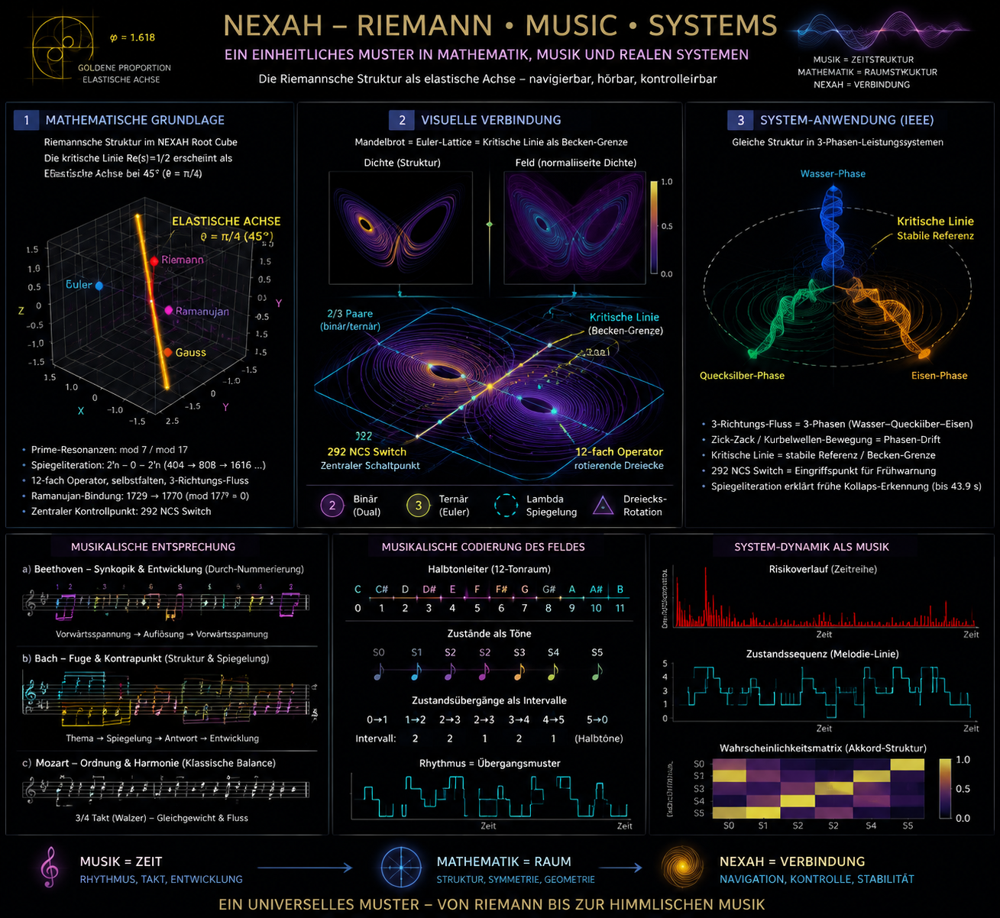

# 🧠 Prime Modulation and Music: Exploring the Rhythm of Primes

**Version:** v1.0 (April 2026)  
**Status:** Exploratory phase, ongoing experimentation

## 🧭 Purpose

This document explores the fascinating intersection between **prime number theory**, **rhythms**, and **musical structures**. It seeks to connect the abstract world of **prime modulation** with the universally recognized language of **music**, focusing on how prime ratios can define musical rhythms, harmonies, and transitions.

Through this exploration, we bridge:

- **Prime Ratios** and their role in defining musical patterns
- **Phase synchronization** and **syncope** as musical tools
- **Mathematical visualizations** of musical structures within the NEXAH framework

---

## 🔷 Key Concepts

### **1. Prime Ratios in Music**

Prime ratios, such as **3:5**, **3:1**, and **3:3**, can define rhythmical patterns in music, just as they dictate the phase offsets and interactions in dynamic systems. These ratios influence:

- **Musical timing**: How the beats are spaced relative to each other.
- **Synchronization**: How different musical elements (e.g., melody and harmony) synchronize over time.
- **Phase drift**: The shifting and modulation of phases in complex musical compositions, reflecting the ongoing tension and release within a piece.

### **2. Synchronization and Syncope**

Just as prime ratios influence how different elements in a system synchronize, they also define musical **syncope**—the unexpected shifts in rhythmic emphasis. The **phase synchronization** between prime ratios leads to the creation of:

- **Moving gates**: Dynamic openings within a musical composition, just as in transport systems.
- **Phase-aligned crossings**: Moments in music where rhythms align in surprising ways, creating new transitions.
- **Rhythmic flow**: How the prime-driven rhythms move through time, creating a dynamic musical texture.

### **3. Mathematical Models in Music**

In the same way that we use mathematical models to understand physical systems, **prime-modulated systems** can be used to create musical compositions. The following equation describes a **sinusoidal wave** with a **prime-modulated frequency**:

\[
A(t) = A_0 \sin(\omega t + \phi)
\]

Where:

- \( A(t) \) is the amplitude of the wave.
- \( A_0 \) is the maximum amplitude.
- \( \omega \) is the angular frequency (rate of oscillation).
- \( t \) is time or phase.
- \( \phi \) is the phase offset.

For a **Prime Ratio** (e.g., 3:5, 3:1, or 3:3), the angular frequency becomes:

\[
\omega_{\text{mod}}(n) = \frac{n}{P} \cdot \omega
\]

Where:

- \( P \) is the prime number.
- \( n \) is the wave number, which controls the modulated frequency.

These ratios create the shifting harmonies and syncopations that define music in terms of **prime modulation**.

---

## 🔷 Visualization of Prime Modulated Music

In the **NEXAH** framework, we use **visualizations** to show how **prime-modulated systems** behave musically. Here, we represent musical intervals as **prime offset phases**, where:

- **Phase 0** aligns with **harmonic resonance**.
- **Phase offsets** introduce **syncope**, creating tension in the music.
- **Prime drift** moves the musical patterns forward and backward, forming **dynamic gates** within the melody.

The visual below represents how **prime ratios** affect musical rhythms by showing phase shifts and synchronizations:

This graph shows how different prime ratios (3:5, 3:1, and 3:3) modulate a sinusoidal wave, leading to different rhythmic patterns and harmonies. The synchronization points are marked at phase intervals where these prime-modulated patterns align.

---

## 🔷 Application in Music Composition

### **Prime Modulated Composition**:
By using prime ratios in combination with musical composition software or live performance, we can create compositions that reflect:

- **Polyrhythmic structures**: Where multiple rhythms, based on prime ratios, are layered on top of each other.
- **Phase-aligned transitions**: Where musical sections dynamically synchronize and desynchronize, creating rich harmonic tension.
- **Syncopated rhythms**: Where the usual expectation of a rhythm is disrupted by prime offset-based modulation.

### **Musical Example**:
In a simple composition, using the **3:5 Prime Ratio** might involve:

1. Creating a rhythmic cycle with a **3-beat group** and a **5-beat group**.
2. Playing the **5-beat pattern** against the **3-beat pattern**, and using phase drift to introduce **syncopation**.
3. Letting the phase misalignment build tension and create **musical gates**, which later resolve into harmonic unity as the music **returns to synchronization**.

---

## 🔷 Conclusion

By applying **prime modulation** to music, we not only gain a new way to think about rhythm and harmony but also create **musical systems** that reflect the **non-synchronizing, dynamic principles** that govern the NEXAH framework. This approach combines the worlds of **mathematics**, **physics**, and **music**, offering new pathways for artistic exploration and experimentation.

---

## 🔥 Future Experiments

Future experiments will explore:

- The relationship between **prime ratios** and **musical form**.
- How **phase synchronization** can lead to new compositional techniques.
- The development of a **music generator** based on **prime-modulated transport systems** in the NEXAH framework.

---

**NEXAH**  
Prime modulation becomes music.  
Music becomes dynamic, evolving with the flow of time.

---

**Status**: Ongoing Exploration  
**Version**: 1.0  
**Author**: Thomas K. R. Hofmann · April 2026
