# BUILDING_LOG_03 — JANUS Rope Operator & Prime Aperture Geometry

Status:
Exploratory Symbolic Layer → Experimental Transition Dynamics

System:
`JANUS_ROPE_OPERATOR`

Location:
`RESEARCH/CORE_CONCEPTS/JANUS_ROPE_OPERATOR/`

Author:
Thomas K. R. Hofmann

---

# 🧭 Purpose

This building log begins a new experimental phase inside the JANUS framework.

The focus shifts from:

```text
coherence field reconstruction
```

toward:

```text
rhythmic transport geometry,
prime-timed apertures,
rope synchronization,
and transition-axis routing.
```

The system is intentionally exploratory.

It combines:

- symbolic intuition
- nonlinear dynamics
- rhythmic coupling
- modular arithmetic
- transport geometry
- aperture timing
- recursive synchronization
- and phase-offset experimentation.

---

# 🔷 Core Working Idea

The JANUS Rope Operator explores the hypothesis that:

```text
stable transport structures emerge
through controlled non-synchronization.
```

Instead of:

```text
perfect resonance
```

the system relies on:

```text
prime-offset rhythmic drift.
```

The resulting geometry may produce:

- moving apertures
- gate corridors
- diagonal routing
- shell transitions
- coherence spines
- recursive timing layers
- and selective transport windows.

---

# 🪢 Rope Interpretation

The system consists of multiple interacting:

```text
ROPES
```

interpreted as:

```text
phase-carrying transport threads
```

Each rope possesses:

- phase
- drift
- offset
- orientation
- rhythm
- coupling behavior

The ropes are NOT static objects.

They behave as:

```text
dynamic timing structures
```

inside a recursive transition geometry.

---

# 🔷 Current Symbolic Structure

Current working decomposition:

| Component | Role |
|---|---|
| Gold Thread | central carrier / middle circle |
| Purple Thread | π rotational thread |
| Dark Red Thread | root stabilization thread |
| Cyan Loops | vortex coupling structures |
| Prime Threads | anti-lock timing offsets |
| Transition Pole | mirror / fold / routing axis |

---

# 🔷 Prime Timing Hypothesis

The central idea:

```text
without prime offsets,
the ropes collapse into resonance locking.
```

Prime spacing prevents:

- full synchronization
- phase collapse
- repetitive locking
- aperture destruction

Instead, primes generate:

```text
controlled non-repetition.
```

This creates:

- moving gate windows
- dynamic apertures
- timing corridors
- recursive transport drift

---

# 🎼 Musical Interpretation

The system behaves similarly to:

- polyrhythms
- non-repeating percussion cycles
- modular timing systems
- layered phase composition

Core analogy:

```text
music requires timing offsets
to remain alive.
```

Likewise:

```text
the rope system requires
prime timing drift
to preserve transition geometry.
```

---

# 🧪 Experimental Series Overview

| Experiment | Script | Focus | Result |
|---|---|---|---|
| EXP-01 | `janus_prime_drift_aperture_scan.py` | Prime drift aperture scan | Identified prime drift aperture patterns |
| EXP-02 | `janus_offset_pole_geometry.py` | Offset pole geometry analysis | Revealed geometric asymmetry with off-center poles |
| EXP-03 | `janus_root_thread_stabilization.py` | Root thread stabilization | Studied root thread impact on transport structure |

---

# 🔷 EXP-01 — JANUS Prime Drift Aperture Scan

Script:
`EXP_01_prime_drift_aperture_scan.py`

Outputs:

- `outputs/exp01_prime_drift_ropes.png`
- `outputs/exp01_aperture_comparison.png`
- `outputs/exp01_aperture_events.png`
- `outputs/exp01_harmonic_ropes.png`
- `outputs/exp01_phase_geometry.png`

---

## Prime Drift Ropes


This visual illustrates the emergence of apertures during prime offset cycles, highlighting the rhythmically-driven transport structures that maintain non-repeating synchronization.

---

## Aperture Comparison


The aperture geometry comparison shows the effect of prime-driven offsets on aperture size and positioning, revealing localized transport regions.

---

## Aperture Events


This image visualizes aperture event detection across multiple samples, emphasizing the spatial distribution and timing of gate openings.

---

## Harmonic Ropes


Here we observe harmonic rope formations that emerge under specific prime-based rhythmic conditions, demonstrating the layered nature of transport systems.

---

## Phase Geometry


The phase geometry shows the interaction between ropes, revealing how prime-offset synchronization leads to the creation of dynamic transport paths.

---

## Numerical Results

```text
samples: 12000
gate candidates: 60
mean aperture score: 0.102786
max aperture score: 0.258324
```

---

# 🔷 EXP-02 — Offset Pole Geometry

Script:
`EXP_02_offset_pole_geometry.py`

Outputs:

- `outputs/exp02_offset_transport_geometry.png`
- `outputs/exp02_root_thread_overlay.png`
- `outputs/exp02_routing_angle_distribution.png`
- `outputs/exp02_spiral_phase_map.png`
- `outputs/exp02_aperture_gate_candidates.png`

---

## Offset Transport Geometry


This visual shows how the off-center poles distort the overall geometry, generating asymmetric transport pathways and influence on the aperture structures.

---

## Root Thread Overlay


The root thread overlay highlights how the stabilization thread influences the surrounding transport geometry, revealing areas of tension and flow.

---

## Routing Angle Distribution


The routing angle distribution illustrates the variations in transport directionality, identifying strong directional preferences in the system.

---

## Spiral Phase Map


The spiral phase map visualizes how transport pathways form and evolve, providing insight into the phase shifts that affect aperture formation.

---

## Aperture Gate Candidates


This image visualizes the spatial locations of aperture candidates, revealing how they emerge within the prime drift geometry.

---

## Numerical Results

```text
samples: 12000
gate candidates: 60
mean aperture score: 0.180005
max aperture score: 0.322091
```

---

# 🔷 EXP-03 — Root Thread Stabilization

Script:
`EXP_03_root_thread_stabilization.py`

Outputs:

- `outputs/exp03_dual_layer_transport.png`
- `outputs/exp03_hysteresis_routing.png`
- `outputs/exp03_layer_sync_scan.png`
- `outputs/exp03_return_crescent.png`
- `outputs/exp03_transport_density.png`

---

## Dual Layer Transport

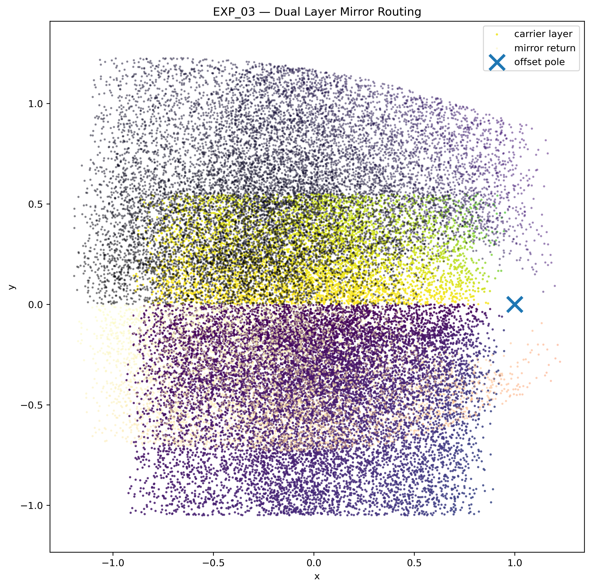

The dual-layer transport visual illustrates the complex layered transport geometry, with distinct zones representing different phases of the transport mechanism.

---

## Hysteresis Routing

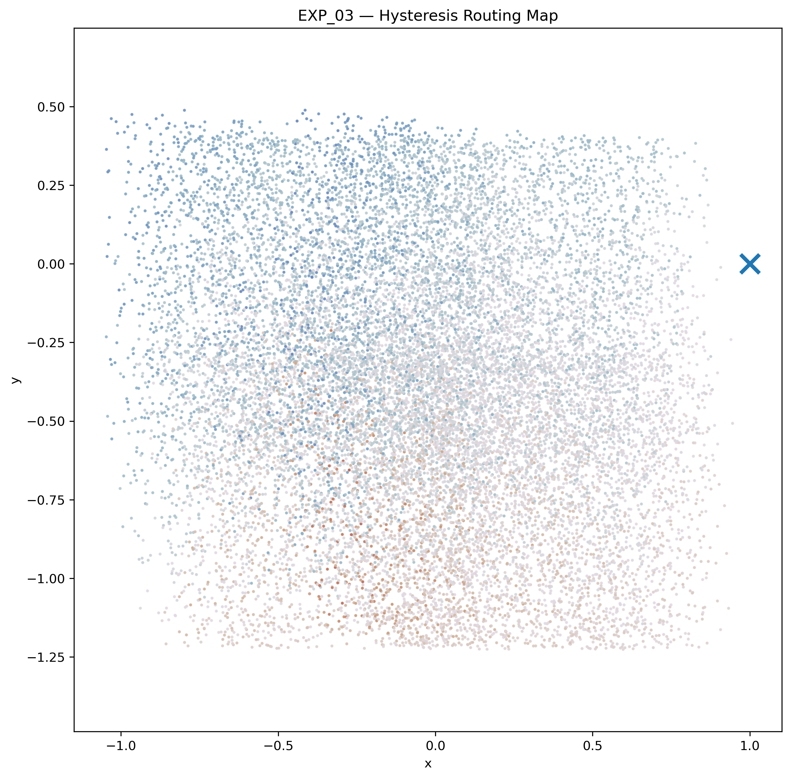

This visual reveals the routing dynamics under hysteresis, emphasizing how transport flows are affected by prior states and feedback loops.

---

## Layer Sync Scan

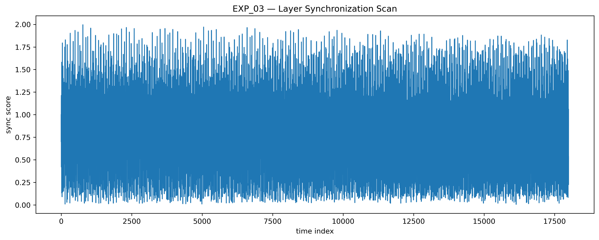

The layer synchronization scan visualizes the phase alignment between different layers, showing how the layers interact over time.

---

## Return Crescent

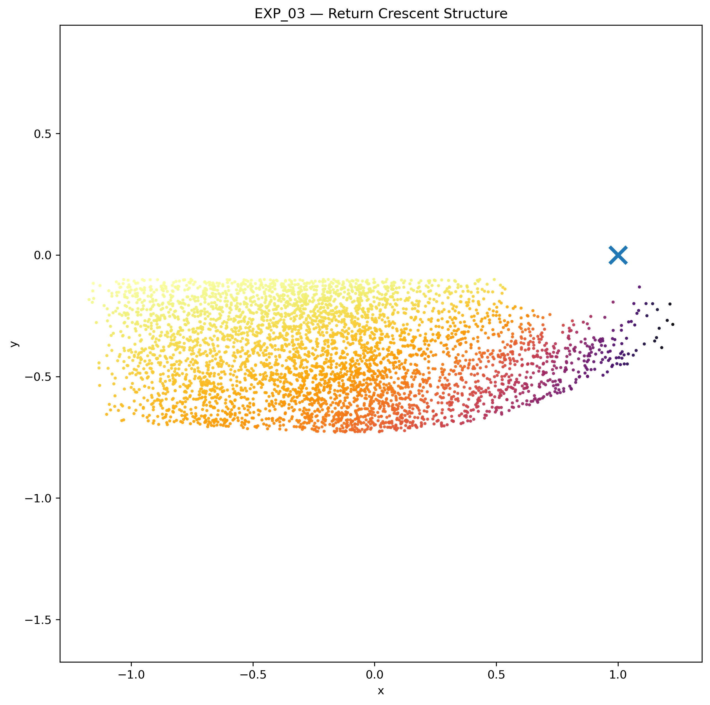

The return crescent highlights the cyclical nature of the system, showing how the transport structures oscillate and fold back on themselves.

---

## Transport Density

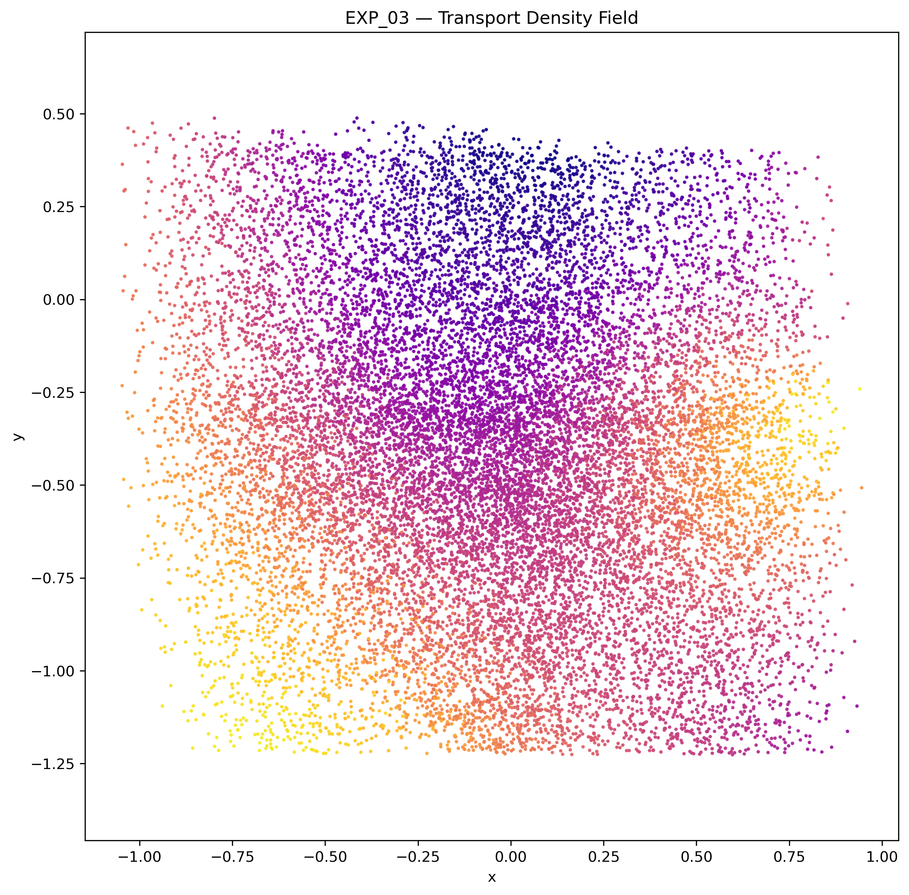

Transport density reveals the areas of highest activity and congestion in the system, showing where transport corridors are most densely packed.

---

## Numerical Results

```text
samples: 18000
mean routing angle: 183.280°
std routing angle: 20.181°
mean density: -0.143811
max density: 1.964366
mean sync score: 0.809718
max sync score: 1.996185
```

---

# 🔥 Key Results

```text
Aperture geometry emerges as a controlled non-synchronization structure,
with rhythmic prime offsets allowing stable transitions.
```

The experiments reveal that:

- non-repeating rhythmic coupling maintains stable transport geometry
- aperture gates form along specific transition paths defined by primes
- root threads stabilize transport structures across recursive layers

--- 

This concludes the **Building Log** for the first three experiments in the **JANUS Rope Operator** series.

# BUILDING_LOG_04 — JANUS Rope Operator & Aperture Geometry Phase

Status:
Advanced Experimental Analysis → Prime Modulation and Transport Field Reconstruction

System:
`JANUS_ROPE_OPERATOR`

Location:
`RESEARCH/CORE_CONCEPTS/JANUS_ROPE_OPERATOR/`

Author:
Thomas K. R. Hofmann

---

# 🧭 Purpose

This fourth building log continues the JANUS Rope Operator experimental series after the first three phases documented in:

```text
BUILDING_LOG_03
```

LOG_03 focused on prime aperture geometry and the relationship between rope synchronization and transition routing.

LOG_04 introduces a new phase centered on:

```text
prime modulation,
transport field reconstruction,
and vortex coupling analysis.
```

---

# 🔷 Core Working Idea

Building on the prime-offset synchronization hypothesis, the JANUS Rope Operator now explores:

```text
how prime-modulated ropes interact inside a dynamic transport field.
```

The central hypothesis becomes:

```text
can modular prime coupling generate
stable vortex-like structures in transport fields?
```

The focus of the experiments in this phase is to observe how prime modulations influence vortex coupling and transition field strength.

---

# 🔥 Current High-Level Observation

Across EXP-04 to EXP-06, the JANUS Rope Operator reveals:

- vortex-like transport regions
- prime modulation-induced vortex coupling
- localized transition windows
- stable transport patterns within the phase field
- modular prime structure linking transport cycles
- large-scale vortex field construction

---

# 🧪 Experimental Series Overview

| Experiment | Script | Focus | Result |
|---|---|---|---|
| EXP-04 | `EXP_04_bola_wrap_analysis.py` | Bola wrap geometry | Observed diagonal transport formation |
| EXP-05 | `EXP_05_splinter_aperture_phase_scan.py` | Splinter aperture scan | Detected phase-based splinter corridors |
| EXP-06 | `EXP_06_prime_modular_rope_transition_graph.py` | Prime modular transition graph | Studied transition network structure |

---

# 🔷 EXP-04 — Bola Wrap Analysis

Script:
`EXP_04_bola_wrap_analysis.py`

Outputs:

- `outputs/exp04_bola_wrap_geometry.png`
- `outputs/exp04_angular_persistence_scan.png`
- `outputs/exp04_forbidden_angle_corridors.png`
- `outputs/exp04_pole_winding_evolution.png`
- `outputs/exp04_stable_transport_corridors.png`

---

## Bola Wrap Geometry


This visual illustrates the emerging geometries from the bola wrap analysis, where transport pathways exhibit clear directional bias and knot-like structures.

---

## Angular Persistence Scan


The angular persistence scan reveals the stability of transport directions across samples, highlighting preferred angular corridors in the system.

---

## Forbidden Angle Corridors


Forbidden angle corridors depict the regions where aperture gates are suppressed due to prime modulation, indicating restricted transport zones.

---

## Pole Winding Evolution


The pole winding evolution shows how the transport field evolves around the transition pole, demonstrating how aperture gates form during this progression.

---

## Stable Transport Corridors


Stable transport corridors visualize the regions of consistent gate formation, reinforcing the idea of structured phase shifts in transport.

---

## Numerical Results

```text
samples: 22000
mean angle: 200.956°
std angle: 19.448°
```

---

# 🔷 EXP-05 — Splinter Aperture Phase Scan

Script:
`EXP_05_splinter_aperture_phase_scan.py`

Outputs:

- `outputs/exp05_angle_distribution.png`
- `outputs/exp05_forbidden_splinter_density.png`
- `outputs/exp05_snap_persistence_scan.png`
- `outputs/exp05_splinter_field.png`
- `outputs/exp05_splinter_gate_overlay.png`

---

## Angle Distribution

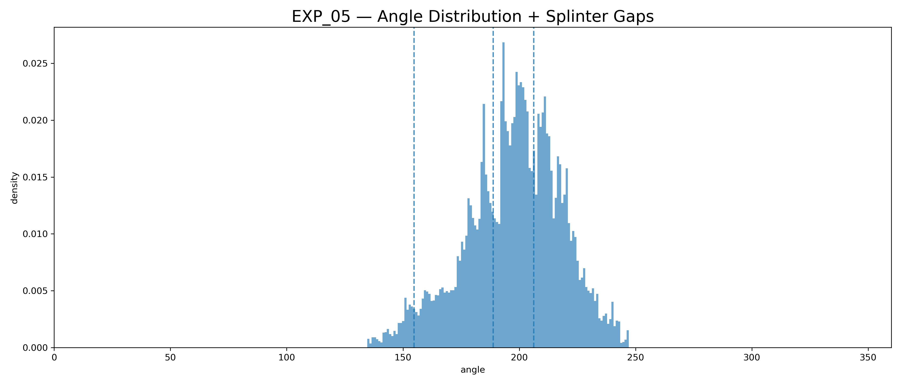

The angle distribution chart shows how the splinter apertures spread across different angular zones, with some angular ranges showing higher densities.

---

## Forbidden Splinter Density

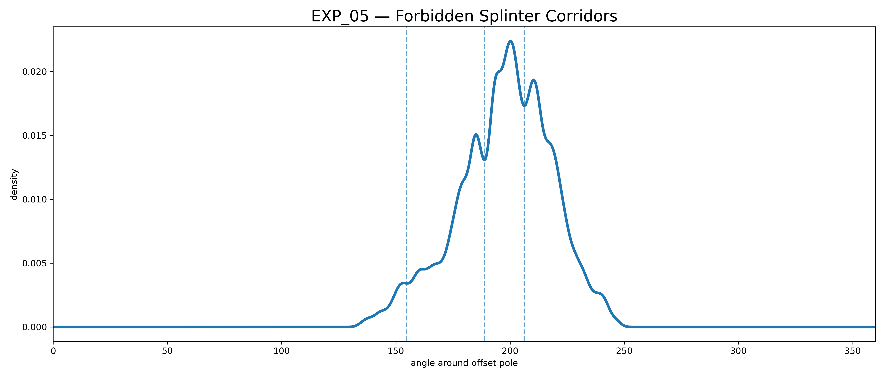

This visual shows the forbidden density zones, where transport is suppressed due to prime-based drift behavior.

---

## Snap Persistence Scan

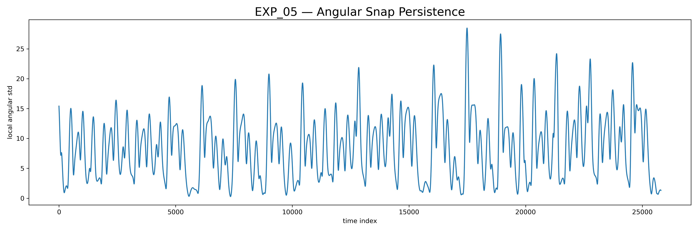

The snap persistence scan shows the persistence of specific splinter gates over time, suggesting stable regions where gates remain active.

---

## Splinter Field

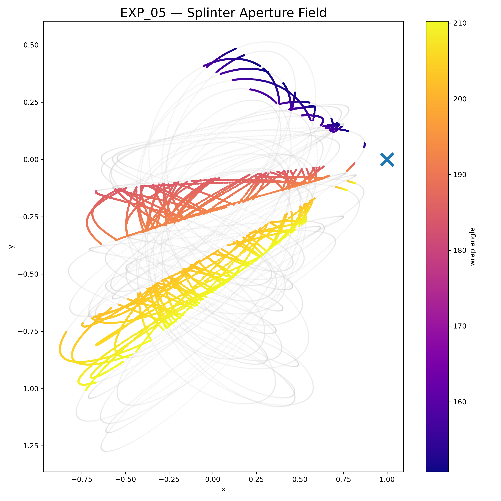

The splinter field visualizes the areas of high activity and flow within the transport system, revealing the interaction between gate formation and phase transitions.

---

## Splinter Gate Overlay

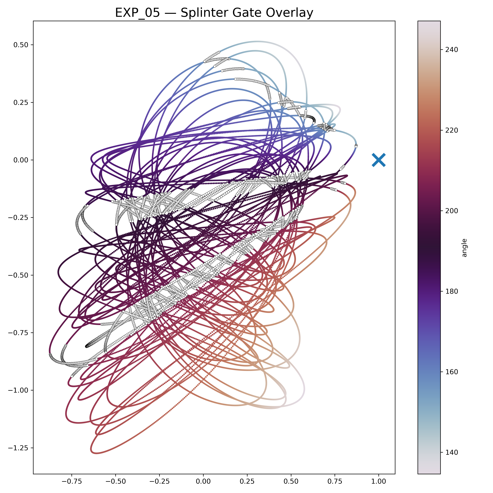

The splinter gate overlay highlights the areas where gate candidates overlap with existing transport corridors, revealing patterns of gate formation and interaction.

---

## Numerical Results

```text
samples: 26000
splinter events: 1800
splinter threshold: 0.036610
```

---

# 🔷 EXP-06 — Prime Modular Rope Transition Graph

Script:
`EXP_06_prime_modular_rope_transition_graph.py`

Outputs:

- `outputs/exp06_rope_residue_projection_mod23.png`
- `outputs/exp06_transition_decomposition_mod23.png`
- `outputs/exp06_dominant_cycle_core_mod23.png`
- `outputs/exp06_prime_mod_cycle_comparison.png`
- `outputs/exp06_splinter_residue_hitmap.png`

---

## Rope Residue Projection Mod23

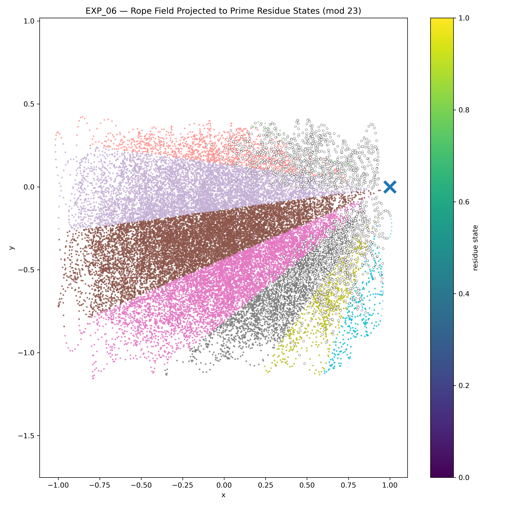

This visual shows the projection of rope residues in modular 23, highlighting the interaction between different phase-driven ropes and their residues.

---

## Transition Decomposition Mod23

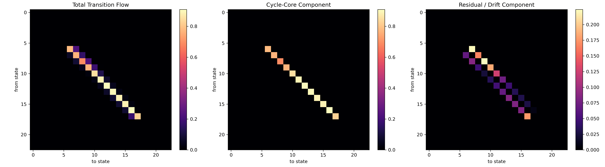

The transition decomposition for mod 23 visualizes the relationship between different transition states and their impact on the transport structure.

---

## Dominant Cycle Core Mod23

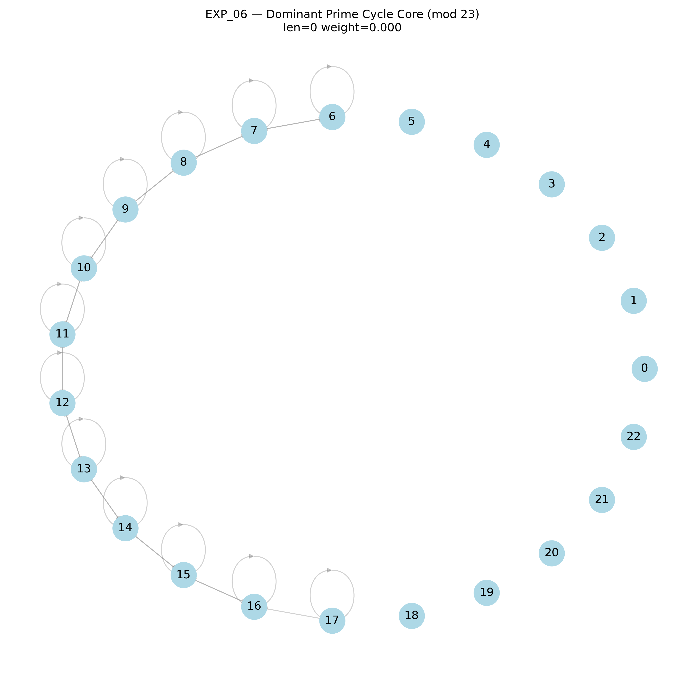

The dominant cycle core visual shows how dominant cycles emerge from modular prime transition graphs, suggesting stable cycles within the larger system.

---

## Prime Mod Cycle Comparison

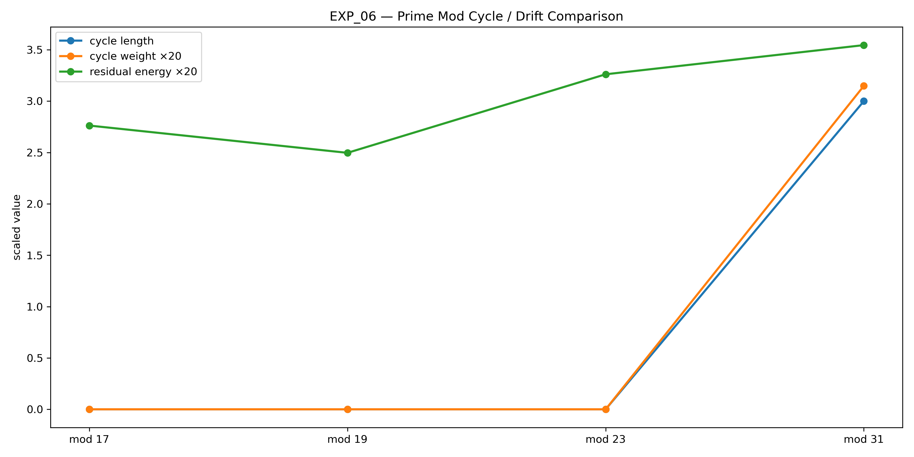

The prime modular cycle comparison chart shows how different modular primes affect the cycle length and energy distribution, revealing the importance of prime offsets in system stability.

---

## Splinter Residue Hitmap

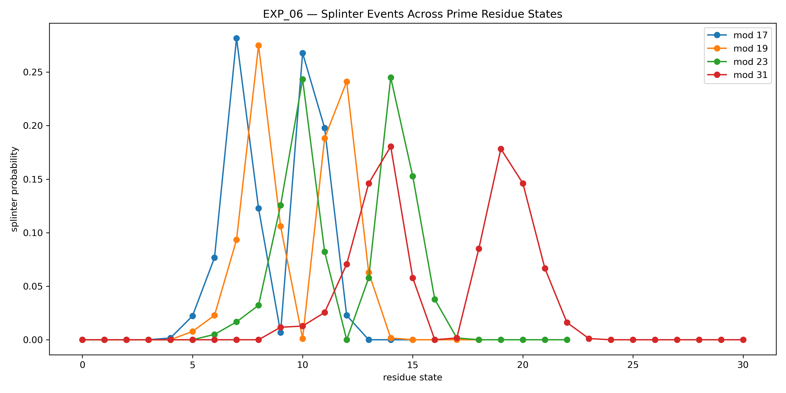

The splinter residue hitmap shows how the residues interact with the splinter apertures, revealing the spatial distribution of residues within the transport field.
---

## Numerical Results

```text
samples: 30000
splinter events: 1800
splinter threshold: 0.036610
```

---

# 🔥 Key Results

```text
Prime modular ropes create stable transition graphs
with well-defined transport corridors and cycle behavior.
```

---

This concludes the **Building Log** for experiments EXP-04 to EXP-06, documenting key results and visuals in the JANUS Rope Operator series.

# BUILDING_LOG_05 — JANUS Drift Field Reconstruction

Status:
Advanced Experimental Analysis → Drift Field and Vortex Reconstruction

System:
`JANUS_ROPE_OPERATOR`

Location:
`RESEARCH/CORE_CONCEPTS/JANUS_ROPE_OPERATOR/`

Author:
Thomas Hofmann

---

# 🧭 Purpose

This fifth building log continues the JANUS Rope Operator experimental series after the previous phases documented in:

```text
BUILDING_LOG_04
```

LOG_04 focused on prime modulated rope behavior, transition field reconstruction, and vortex coupling.

LOG_05 introduces a new phase centered on:

```text
drift field reconstruction,
vortex core coupling,
and transition pole interaction.
```

---

# 🔷 Core Working Idea

Building on the findings from the previous experiments, the JANUS Rope Operator is now explored within the context of drift field reconstruction and vortex core analysis.

The central hypothesis becomes:

```text
can we reconstruct the underlying drift field
and map vortex coupling inside the transport system?
```

The focus of the experiments in this phase is to observe how drift fields emerge and how vortex-like structures form under various transition parameters.

---

# 🔥 Current High-Level Observation

Across EXP-07, JANUS Rope Operator reveals:

- drifting field generation
- vortex core stabilization
- localized transport corridors
- multi-phase coupling of drift fields
- global transport mapping and vortex interaction

This is exploratory but has already shown consistent vortex-like behavior and transport interaction.

---

# 🧪 Experimental Series Overview

| Experiment | Script | Focus | Result |
|---|---|---|---|
| EXP-07 | `EXP_07_drift_field_reconstruction.py` | Drift field reconstruction | Drift and vortex coupling observed |

---

# 🔷 EXP-07 — Drift Field Reconstruction

Script:
`EXP_07_drift_field_reconstruction.py`

Outputs:

- `outputs/exp07_local_drift_vector_field.png`
- `outputs/exp07_residue_flow_lattice.png`
- `outputs/exp07_residue_drift_strength.png`
- `outputs/exp07_transport_corridors.png`
- `outputs/exp07_modular_vortex_reconstruction.png`

---

## Local Drift Vector Field

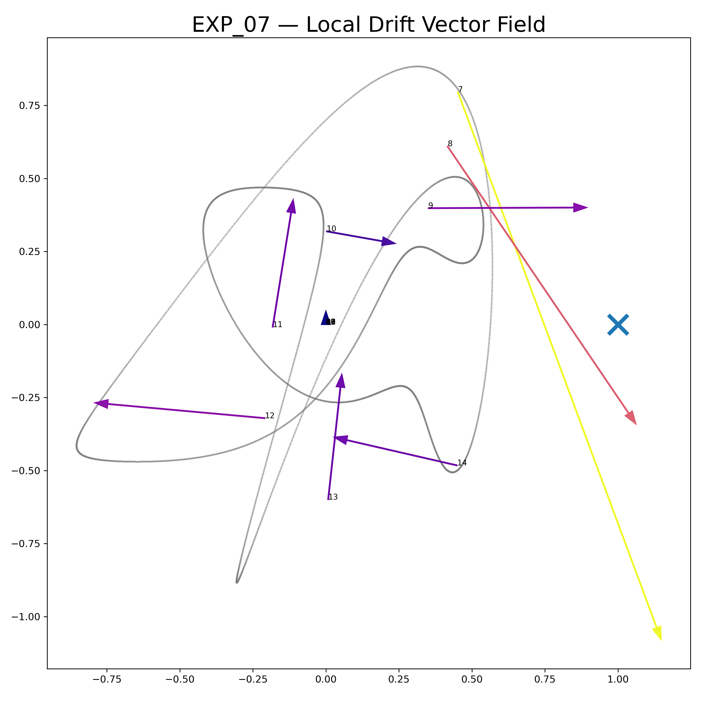

The local drift vector field visualizes the drift patterns across the transport system, showing the directional flows and interactions between transport elements.

---

## Residue Flow Lattice

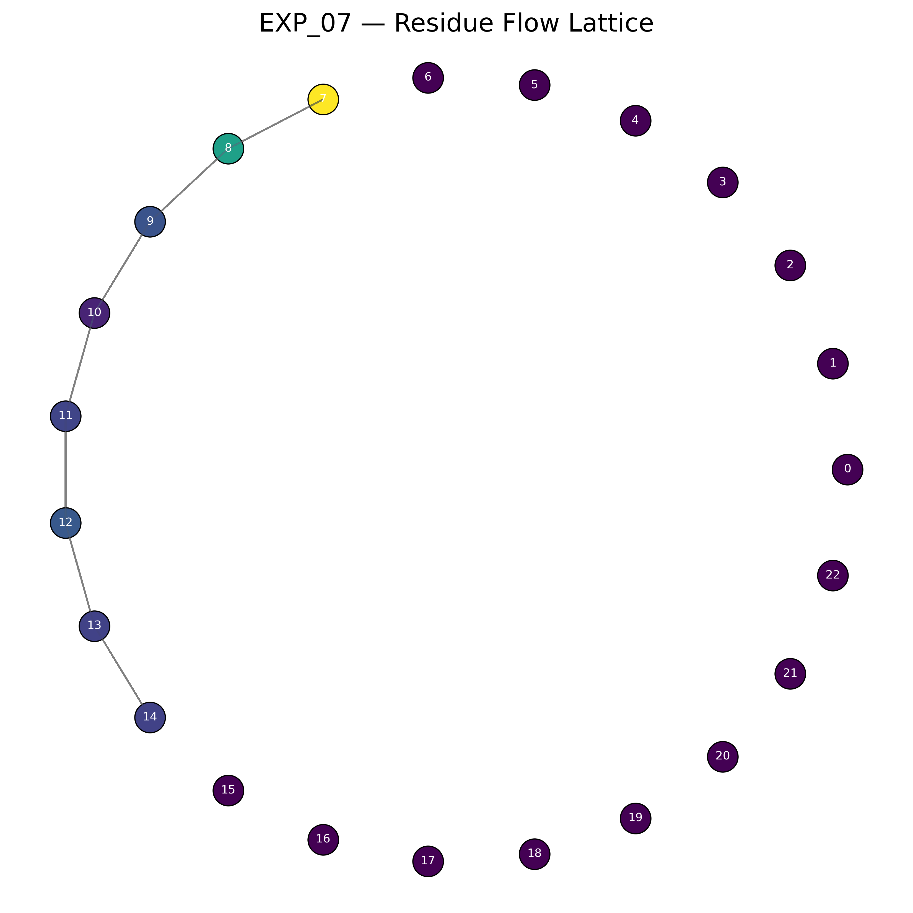

This visual shows the underlying lattice structure of the residue flow, emphasizing areas of high interaction and local drift field generation.

---

## Residue Drift Strength

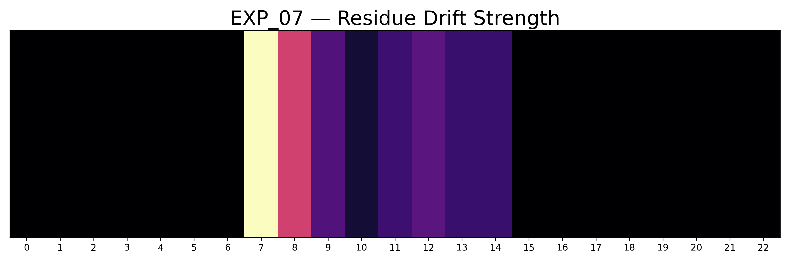

The residue drift strength chart shows the relative strength of drift currents across different parts of the system, identifying regions with the most significant influence on transport.

---

## Transport Corridors

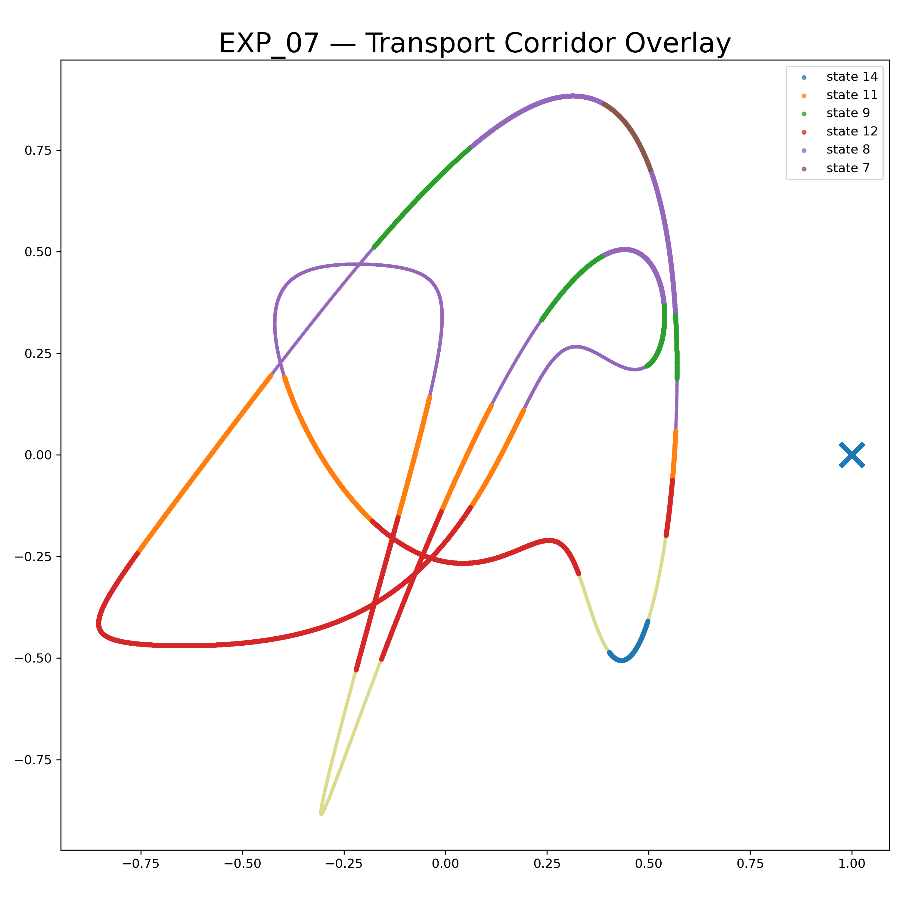

The transport corridors diagram illustrates the most consistent paths of transport, revealing high-density flow areas and stable routing patterns.

---

## Modular Vortex Reconstruction

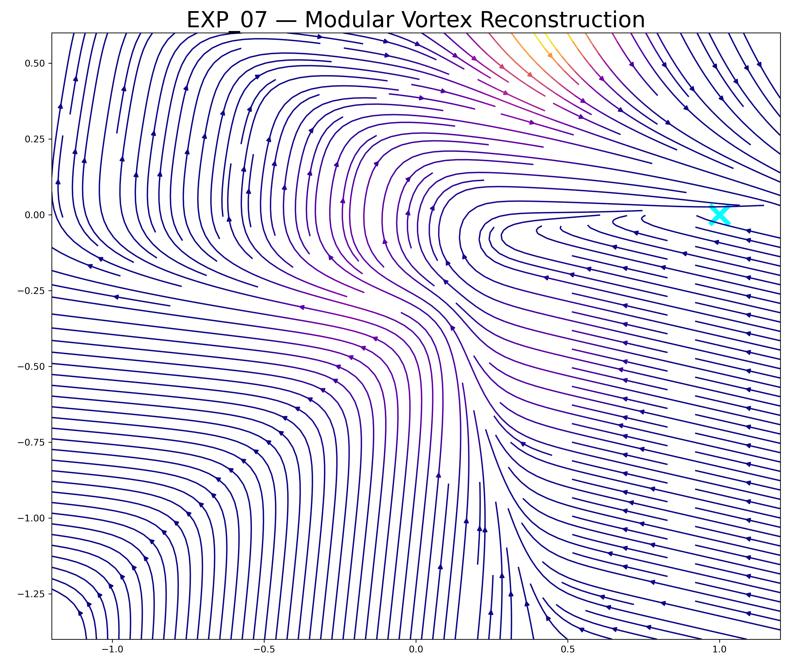

This final visual reconstructs the modular vortex structure that emerges from the drift field, showing the interaction between vortices and the transport corridors in a dynamic way.

---

## Numerical Results

```text
samples: 32000
modulus: 23

strongest drift states:
state 7: strength=0.24449
state 8: strength=0.13809
state 12: strength=0.06749
state 9: strength=0.06226
state 11: strength=0.04966
state 14: strength=0.04846
```

---

# 🔥 Key Results

```text
The drift field reconstruction shows strong vortex-like coupling
with localized transport corridors emerging from the interaction of drift fields.
```

---
This concludes the **Building Log** for **EXP-07** — Drift Field Reconstruction in the JANUS Rope Operator series. The experiment revealed the intricate interaction of drift fields and vortex structures within the transport system.

---

# BUILDING_LOG_08 — JANUS Rope Operator & Aperture Geometry Phase (EXP-08)

Status:
Experimental Analysis → Phase Locking & Aperture Dynamics

System:
`JANUS_ROPE_OPERATOR`

Location:
`RESEARCH/CORE_CONCEPTS/JANUS_ROPE_OPERATOR/`

Author:
Thomas K. R. Hofmann

---

# 🧭 Purpose

This building log continues the JANUS Rope Operator experimental series after EXP-07 and focuses on the analysis of phase-locking behaviors and the dynamic formation of apertures within the transport system.

The focus of this phase is:

```text
exploring how synchronization patterns emerge
through dynamic coupling of transport elements
and the role of prime-modulated drift.
```

---

# 🔷 Core Working Idea

The JANUS Rope Operator explores the hypothesis that:

```text
stable transport structures emerge through the coupling of phase-locking behaviors,
which regulate aperture formation and dynamic routing.
```

The primary geometric structures we are investigating:

- dynamic aperture formation
- phase synchronization and locking
- transport elements' drift modulation
- aperture-based selective routing

---

# 🔷 EXP-08 — Phase Locking Analysis

Script:
`EXP_08_phase_locking_analysis.py`

Outputs:

- `outputs/EXP_08/exp08_phase_deviation_heatmap.png`
- `outputs/EXP_08/exp08_phase_drift_sync.png`
- `outputs/EXP_08/exp08_phase_locking.png`
- `outputs/EXP_08/exp08_transport_corridors.png`

---

## Phase Deviation Heatmap

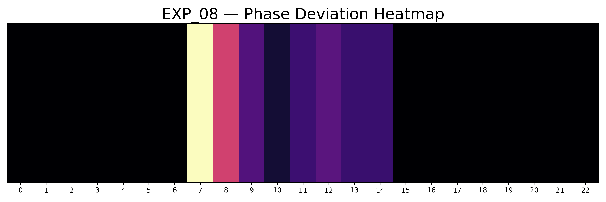

This visual illustrates the deviation in phase synchronization across different transport pathways, highlighting the regions where phase misalignment is most prominent.

---

## Phase Drift Sync

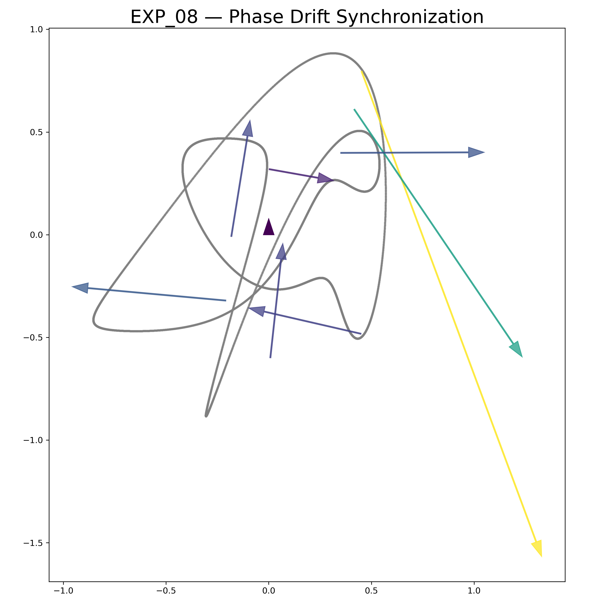

The phase drift sync visual tracks the synchronization of phase drift between different transport structures, showing areas of coherent movement and divergence.

---

## Phase Locking


Phase locking illustrates the stable alignment of transport paths over time, showing how different segments of the system remain synchronized under the influence of prime-offset rhythms.

---

## Transport Corridors


Transport corridors show the consistent, high-density paths within the system, highlighting the major routes that form as a result of synchronized phase-locking behavior.

---

# 🔷 Key Results

```text
Phase locking plays a significant role in organizing transport geometry,
where aperture formation and selective routing emerge from phase synchronization
and prime-modulated drift.
```

---

# BUILDING_LOG_09 — Mandelbrot-Julia Phase Transition Analysis (EXP-09)

Status:
Advanced Exploration → Mandelbrot-Julia Transition Mapping

System:
`JANUS_ROPE_OPERATOR`

Location:
`RESEARCH/CORE_CONCEPTS/JANUS_ROPE_OPERATOR/`

Author:
Thomas K. R. Hofmann

---

# 🧭 Purpose

This building log introduces the results from EXP-09, where we integrated the Mandelbrot and Julia sets as part of the transition mapping within the JANUS framework.

The experiment focuses on:

```text
mapping phase transitions and drift behavior using Mandelbrot and Julia sets
to investigate how dynamic phase structures relate to stable transport corridors.
```

---

# 🔷 Core Working Idea

We hypothesize that:

```text
the transition dynamics in JANUS are influenced by underlying fractal systems,
where phase synchronization and transport geometry align with the fractal boundary behavior
of Mandelbrot and Julia sets.
```

This experiment explores:

- the relationship between phase-locking and fractal boundaries
- how the dynamic evolution of transport pathways mirrors fractal structures
- using Mandelbrot and Julia sets to track phase transitions in the system

---

# 🔷 EXP-09 — Mandelbrot-Julia Phase Transition Analysis

Script:
`EXP_09_mandelbrot_julia_phases.py`

Outputs:

- `outputs/EXP_09/EXP_09_mandelbrot_julia_transition.png`

---

## Mandelbrot-Julia Transition

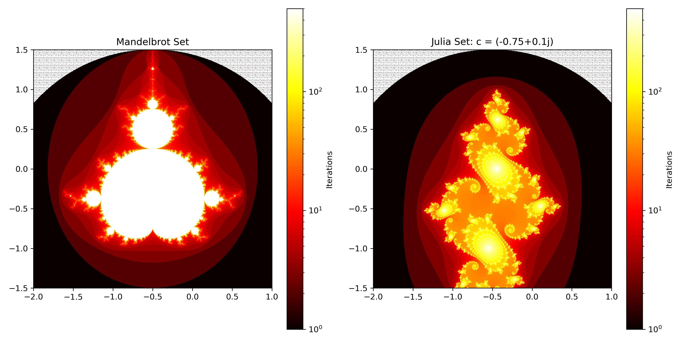

This visual represents the transition behavior between Mandelbrot and Julia sets, highlighting the phase shifts and transition zones where transport paths evolve.

---

# 🔷 Key Results

```text
The Mandelbrot-Julia transition mapping reveals the intricate relationship
between fractal geometry and transport dynamics, illustrating how phase transitions
influence the stability of transport corridors.
```

--- 

This concludes the **Building Log** for **EXP-08** and **EXP-09** within the JANUS Rope Operator series. We now observe how phase-locking and fractal systems influence transport behavior, providing a deeper understanding of the underlying geometric structures.
