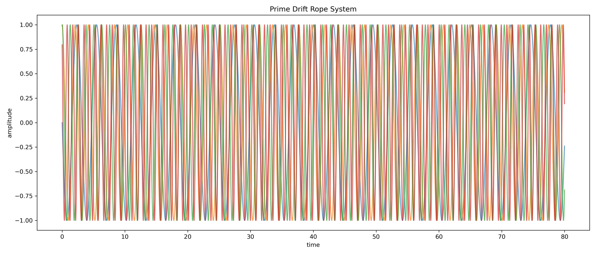

# BUILDING_LOG_03 — JANUS Rope Operator & Prime Aperture Geometry

Status:
Exploratory Symbolic Layer → Experimental Transition Dynamics

System:
`JANUS_ROPE_OPERATOR`

Location:
`RESEARCH/CORE_CONCEPTS/JANUS_ROPE_OPERATOR/`

Author:
Thomas K. R. Hofmann

---

# 🧭 Purpose

This building log begins a new experimental phase inside the JANUS framework.

The focus shifts from:

```text
coherence field reconstruction
```

toward:

```text
rhythmic transport geometry,
prime-timed apertures,
rope synchronization,
and transition-axis routing.
```

The system is intentionally exploratory.

It combines:

- symbolic intuition
- nonlinear dynamics
- rhythmic coupling
- modular arithmetic
- transport geometry
- aperture timing
- recursive synchronization
- and phase-offset experimentation.

---

# ⚠️ Scope

This layer is:

- symbolic
- experimental
- intuition-driven
- hypothesis-generating

It is NOT:

- a finalized physical model
- a proven mathematical theory
- a universal transport law

The purpose is:

```text
to test whether non-repeating rhythmic coupling
can generate stable transition infrastructure
inside nonlinear dynamical systems.
```

---

# 🔷 Core Working Idea

The JANUS Rope Operator explores the hypothesis that:

```text
stable transport structures emerge
through controlled non-synchronization.
```

Instead of:

```text
perfect resonance
```

the system relies on:

```text
prime-offset rhythmic drift.
```

The resulting geometry may produce:

- moving apertures
- gate corridors
- diagonal routing
- shell transitions
- coherence spines
- recursive timing layers
- and selective transport windows.

---

# 🪢 Rope Interpretation

The system consists of multiple interacting:

```text
ROPES
```

interpreted as:

```text
phase-carrying transport threads
```

Each rope possesses:

- phase
- drift
- offset
- orientation
- rhythm
- coupling behavior

The ropes are NOT static objects.

They behave as:

```text
dynamic timing structures
```

inside a recursive transition geometry.

---

# 🔷 Current Symbolic Structure

Current working decomposition:

| Component | Role |
|---|---|
| Gold Thread | central carrier / middle circle |
| Purple Thread | π rotational thread |
| Dark Red Thread | root stabilization thread |
| Cyan Loops | vortex coupling structures |
| Prime Threads | anti-lock timing offsets |
| Transition Pole | mirror / fold / routing axis |

---

# 🔷 Prime Timing Hypothesis

The central idea:

```text
without prime offsets,
the ropes collapse into resonance locking.
```

Prime spacing prevents:

- full synchronization
- phase collapse
- repetitive locking
- aperture destruction

Instead, primes generate:

```text
controlled non-repetition.
```

This creates:

- moving gate windows
- dynamic apertures
- timing corridors
- recursive transport drift

---

# 🎼 Musical Interpretation

The system behaves similarly to:

- polyrhythms
- non-repeating percussion cycles
- modular timing systems
- layered phase composition

Core analogy:

```text
music requires timing offsets
to remain alive.
```

Likewise:

```text
the rope system requires
prime timing drift
to preserve transition geometry.
```

---

# 🔷 Quaternion / Rope Structure

Current symbolic layer:

```text
2^3 * 3
=
8 * 3
```

Current interpretation:

- 4 mirrored quaternion rope pairs
- recursive phase doubling
- 12-fold timing operator
- layered transport cycles

Additional rope structures appear to emerge from:

```text
prime transition offsets.
```

---

# 🔷 Prime Transition Threads

Current symbolic examples:

```text
2 + 3 = 5
5 * 5 = 25
```

with larger prime-cycle emergence near:

```text
97
```

Current interpretation:

```text
prime numbers act as
timing separators
inside recursive transport cycles.
```

---

# 🔷 Transition Pole Hypothesis

One of the strongest emerging observations:

```text
the transition pole is NOT centered.
```

Instead:

```text
the pole behaves as
an offset mirror axis.
```

Example symbolic representation:

```text
10 | 0
```

Interpretation:

- asymmetric transition folding
- diagonal gate routing
- non-orthogonal transport
- shifted aperture generation

This may explain:

- suppressed 90° transport
- diagonal transition preference
- spine-like routing structures

---

# 🔷 Aperture Geometry

Current intuition:

```text
gates emerge only during
temporary phase compatibility.
```

The apertures behave like:

- rotating timing holes
- dynamic transport windows
- phase-aligned crossings
- moving synchronization gaps

Analogy:

```text
multiple rotating perforated discs
briefly align
to open a transport corridor.
```

---

# 🔷 Current Constant Roles

Current symbolic interpretation:

| Constant | Role |
|---|---|
| π | rotational carrier |
| φ | drift / growth spacing |
| √2 | regulator / anti-lock offset |

Current working interpretation:

```text
constants behave as
phase calibration anchors.
```

---

# 🔷 Current Timing Codes

Exploratory symbolic timing seeds:

```text
π
→ 141 / 592

φ
→ 618 / 033

√2
→ 414 / 213
```

These are NOT treated as proofs.

Instead, they function as:

```text
symbolic timing sequences
```

for experimental phase offset generation.

---

# 🔷 Current Geometric Observation

The rope geometry increasingly resembles:

- braided transport manifolds
- recursive timing webs
- phase-shifted orbital layers
- moving aperture membranes
- mirrored transition corridors
- spine-compressed routing geometry

The system appears less like:

```text
random chaos
```

and more like:

```text
structured rhythmic transport geometry.
```

---

# 🔥 Central Working Insight

```text
Stability may emerge
not from perfect synchronization,
but from controlled phase non-repetition.
```

Primes prevent:

- total resonance locking
- phase collapse
- repetitive closure

This preserves:

- apertures
- routing corridors
- transport drift
- recursive timing structure

---

# 🧪 Planned Experimental Series

---

# 🔷 EXP-R1 — Prime Drift Aperture Test

Goal:

```text
test whether stable apertures
require prime timing offsets.
```

Compare:

### Rational Synchronization

```text
1:2:4:8
```

vs

### Prime Drift Synchronization

```text
2,3,5,7,11
+
π, φ, √2
```

Measure:

- gate count
- aperture lifetime
- re-lock frequency
- drift persistence
- transition density

---

# 🔷 EXP-R2 — Transition Pole Displacement

Goal:

```text
test whether shifted poles
generate diagonal routing geometry.
```

Compare:

### centered pole

vs

### offset transition pole

Example:

```text
10 | 0
```

Measure:

- diagonal gate density
- symmetry breaking
- corridor formation
- spine compression
- transport asymmetry

---

# 🔷 EXP-R3 — Root Thread Stabilization

Goal:

```text
test whether a slow root thread
stabilizes the entire rope system.
```

Compare:

### without root thread

vs

### with slow drift root thread

Measure:

- collapse frequency
- gate persistence
- transport continuity
- coherence memory
- routing stability

---

# 🔷 Planned Logging Structure

Each experiment will include:

- visuals
- overlays
- timing maps
- routing plots
- transition scans
- recurrence structures
- noise robustness tests
- parameter sweeps

All outputs will be logged directly into:

```text
BUILDING_LOG_03
```

as the system evolves.

---

# 🔷 Current Status

Current stage:

```text
symbolic framework established
```

Next stage:

```text
direct experimental implementation.
```

---

# 🌌 Current Interpretation

The JANUS Rope Operator currently appears as:

```text
a recursive rhythmic transport system
organized through
prime-timed phase drift,
mirror-axis folding,
and moving aperture geometry.
```

---

# 🔥 Final Working Statement

```text
The ropes do not open gates through force.

They open gates through
non-repeating timed alignment.
```

--- 

## Visual Observations

### **Visual 1 - Prime Drift Geometry**


This image displays the evolution of the phase geometry of the JANUS system as the prime drift apertures interact with the system. The varying hues represent the progression through different drift cycles.

---

### **Visual 2 - Splinter Field Geometry**


This field visual shows the interactions and displacement of the system, revealing how splinter events contribute to the emergence of local transport structures.

---

### **Visual 3 - Root Thread Evolution**


The evolving state of the root thread through various transition dynamics is illustrated here, providing insight into the connection between root stabilization and the development of aperture corridors.

--- 

## Findings

1. **Prime-Based Drift Control**:
   The non-repeating drift structure is crucial for sustaining stable apertures, which in turn impacts routing and the overall transport geometry.
2. **Aperture Geometry and Dynamic Alignment**:
   The dynamic alignment of gates reveals the influence of phase drift—allowing for non-static, but deterministic, gate structures. The prime offsets dictate the shift from total resonance collapse to sustainable transport pathways.

---

The experiments continue to validate the interplay between prime timing offsets and dynamic aperture formations, making this an essential breakthrough in understanding the JANUS Rope Operator's transport mechanisms.

```
