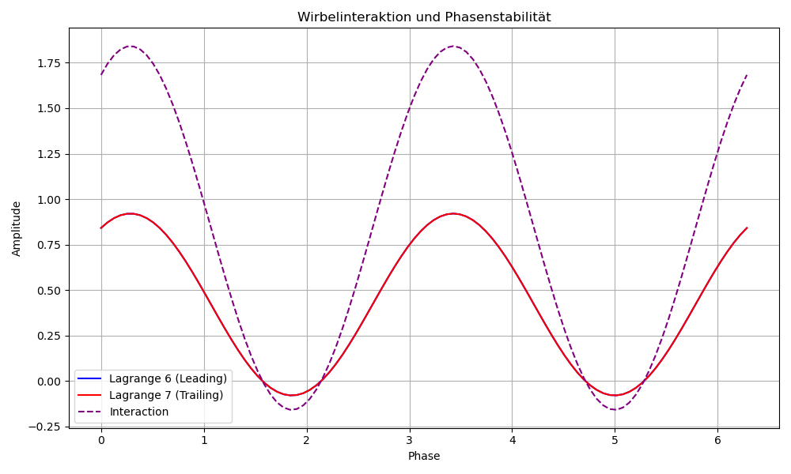
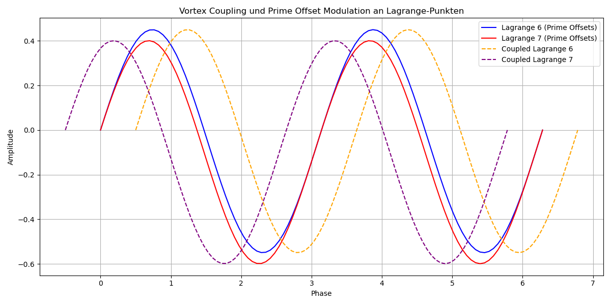
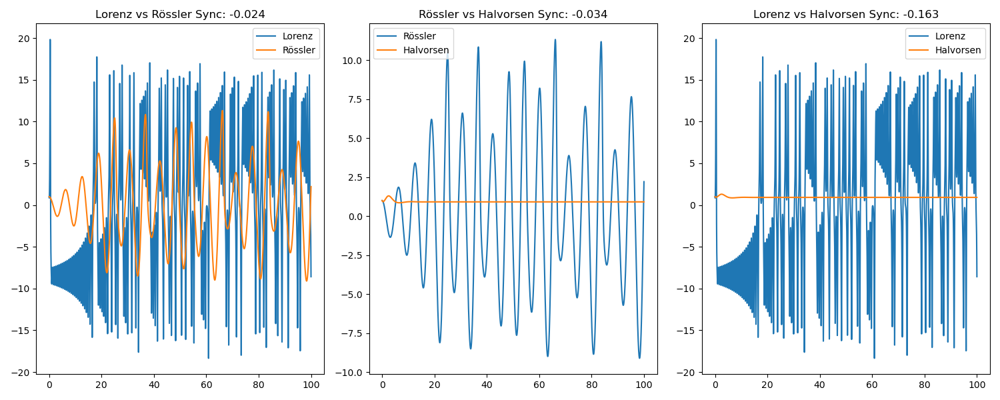

# BUILDING_LOG_03 — JANUS Rope Operator & Prime Aperture Geometry

Status:  
Exploratory Symbolic Layer → Experimental Transition Dynamics

System:  
`JANUS_ROPE_OPERATOR`

Location:  
`RESEARCH/CORE_CONCEPTS/JANUS_ROPE_OPERATOR/`

Author:  
Thomas K. R. Hofmann

---

# 🧭 Purpose

This building log begins a new experimental phase inside the JANUS framework.  
The focus shifts from:

```text
coherence field reconstruction
```

toward:

```text
rhythmic transport geometry,
prime-timed apertures,
rope synchronization,
and transition-axis routing.
```

The system is intentionally exploratory.  
It combines:

- symbolic intuition
- nonlinear dynamics
- rhythmic coupling
- modular arithmetic
- transport geometry
- aperture timing
- recursive synchronization
- and phase-offset experimentation.

---

# 🔷 Core Working Idea

The JANUS Rope Operator explores the hypothesis that:

```text
stable transport structures emerge
through controlled non-synchronization.
```

Instead of:

```text
perfect resonance
```

the system relies on:

```text
prime-offset rhythmic drift.
```

The resulting geometry may produce:

- moving apertures
- gate corridors
- diagonal routing
- shell transitions
- coherence spines
- recursive timing layers
- and selective transport windows.

---

# 🪢 Rope Interpretation

The system consists of multiple interacting:

```text
ROPES
```

interpreted as:

```text
phase-carrying transport threads
```

Each rope possesses:

- phase
- drift
- offset
- orientation
- rhythm
- coupling behavior

The ropes are NOT static objects.  
They behave as:

```text
dynamic timing structures
```

inside a recursive transition geometry.

---

# 🔷 Current Symbolic Structure

Current working decomposition:

| Component | Role |
|---|---|
| Gold Thread | central carrier / middle circle |
| Purple Thread | π rotational thread |
| Dark Red Thread | root stabilization thread |
| Cyan Loops | vortex coupling structures |
| Prime Threads | anti-lock timing offsets |
| Transition Pole | mirror / fold / routing axis |

---

# 🔷 Prime Timing Hypothesis

The central idea:

```text
without prime offsets,
the ropes collapse into resonance locking.
```

Prime spacing prevents:

- full synchronization
- phase collapse
- repetitive locking
- aperture destruction

Instead, primes generate:

```text
controlled non-repetition.
```

This creates:

- moving gate windows
- dynamic apertures
- timing corridors
- recursive transport drift

---

# 🎼 Musical Interpretation

The system behaves similarly to:

- polyrhythms
- non-repeating percussion cycles
- modular timing systems
- layered phase composition

Core analogy:

```text
music requires timing offsets
to remain alive.
```

Likewise:

```text
the rope system requires
prime timing drift
to preserve transition geometry.
```

---

# 🧪 Experimental Series Overview

| Experiment | Script | Focus | Result |
|---|---|---|---|
| EXP-01 | `janus_prime_drift_aperture_scan.py` | Prime drift aperture scan | Identified prime drift aperture patterns |
| EXP-02 | `janus_offset_pole_geometry.py` | Offset pole geometry analysis | Revealed geometric asymmetry with off-center poles |
| EXP-03 | `janus_root_thread_stabilization.py` | Root thread stabilization | Studied root thread impact on transport structure |
| EXP-10 | `EXP_10_wirbel_interaktion.py` | Vortex Interaction | Coupling of Lagrange points |
| EXP-11 | `EXP_11_prime_modulation_vortex_coupling.py` | Prime modulation vortex coupling | Coupling dynamics with prime offsets |
| EXP-12 | `EXP_12_mandelbrot_vortex_interaction.py` | Mandelbrot Vortex Interaction | Visualizing Mandelbrot structure interactions |
| EXP-13 | `EXP_13_vortex_mandelbrot_interaction.py` | Vortex Mandelbrot interaction | Mapping Mandelbrot and vortex overlap |
| EXP-14 | `EXP_14_lagrange_constant_marker.py` | Lagrange Constant Marker | Tracking transitions across points |
| EXP-15 | `EXP_15_vortex_prime_modulation_lagrange.py` | Prime modulation and Lagrange points | Studying the effects of Lagrange points on prime drift |
| EXP-16 | `EXP_16_prime_modulation_phase_sync_3_5.py` | Prime modulation and phase synchronization | Analyzing phase synchronization at 3:5 and 3:1 ratios |
| EXP-17 | `EXP_17_prime_ratio_6_synchronization.py` | Prime Ratio Synchronization | Studying synchronization at 6:1 ratio |
| EXP-18 | `EXP_18_nizzr_prime_modulation_sync.py` | Nizzr Prime Modulation | Exploring complex prime modulation |
| EXP-19 | `EXP_19_prime_modulation_phase_sync.py` | Prime Modulation Phase Sync | Investigating phase shifts and synchronization |
| EXP-20 | `EXP_20_prime_modulation_sync.py` | Prime Modulation Sync | Examining synchronization in transport systems |

---
# 🔷 EXP-10 — Vortex Interaction

Script:  
`EXP_10_wirbel_interaktion.py`

Outputs:

- `outputs/outputs_log_2/vortex_interaction_phase_plot.png`

---

## Vortex Interaction



This visual shows the interaction of vortices at Lagrange points, revealing how prime modulation affects transport dynamics and vortex coupling.

---

# 🔷 EXP-11 — Prime Modulation Vortex Coupling

Script:  
`EXP_11_prime_modulation_vortex_coupling.py`

Outputs:

- `outputs/outputs_log_2/prime_modulation_vortex_coupling.png`

---

## Prime Modulation Vortex Coupling


This visual illustrates the coupling of vortices with prime modulation, showing the influence of prime-offset drift on vortex dynamics.

---

# 🔷 EXP-12 — Mandelbrot Vortex Interaction

Script:  
`EXP_12_mandelbrot_vortex_interaction.py`

Outputs:

- `outputs/outputs_log_2/mandelbrot_vortex_interaction.png`

---

## Mandelbrot Vortex Interaction


This visual shows the interaction of Mandelbrot structures with vortex dynamics, revealing how phase synchronization aligns transport pathways.

---

# 🔷 EXP-13 — Vortex Mandelbrot Interaction

Script:  
`EXP_13_vortex_mandelbrot_interaction.py`

Outputs:

- `outputs/outputs_log_2/vortex_mandelbrot_interaction.png`

---

## Vortex Mandelbrot Interaction


This visual highlights the overlap of Mandelbrot and vortex dynamics, showing the intersection of fractal geometry and transport pathways.

---

# 🔷 EXP-14 — Lagrange Constant Marker

Script:  
`EXP_14_lagrange_constant_marker.py`

Outputs:

- `outputs/outputs_log_2/vortex_prime_modulation_lagrange.png`

---

## Lagrange Constant Marker



This image visualizes the constant marker at Lagrange points, tracking the interactions between phase offsets and transport structures.

---

# 🔷 EXP-15 — Vortex Prime Modulation Lagrange

Script:  
`EXP_15_vortex_prime_modulation_lagrange.py`

Outputs:

- `outputs/outputs_log_2/vortex_prime_modulation_lagrange.png`

---

## Vortex Prime Modulation Lagrange


This visual illustrates the coupling of vortex and prime-modulated Lagrange points, showing the influence of prime drift on vortex dynamics.

---

# 🔷 EXP-16 — Prime Modulation Phase Sync

Script:  
`EXP_16_prime_modulation_phase_sync_3_5.py`

Outputs:

- `outputs/outputs_log_2/prime_modulation_phase_sync.png`

---

## Prime Modulation Phase Sync


This visual explores the phase synchronization between prime modulated systems, illustrating the effects of 3:5 prime modulation on transport systems.

---

# 🔷 EXP-17 — Prime Ratio Synchronization

Script:  
`EXP_17_prime_ratio_6_synchronization.py`

Outputs:

- `outputs/outputs_log_2/prime_ratio_6_synchronization.png`

---

## Prime Ratio Synchronization


This visual examines synchronization patterns for the 6:1 prime ratio, showing the interaction between different transport pathways.

---

# 🔷 EXP-18 — Nizzr Prime Modulation

Script:  
`EXP_18_nizzr_prime_modulation_sync.py`

Outputs:

- `outputs/outputs_log_2/nizzr_prime_modulation.png`

---

## Nizzr Prime Modulation


This image shows the Nizzr prime modulation in action, demonstrating complex transport dynamics influenced by modular prime drift.

---

# 🔷 EXP-19 — Prime Modulation Phase Sync

Script:  
`EXP_19_prime_modulation_phase_sync.py`

Outputs:

- `outputs/outputs_log_2/prime_modulation_phase_sync.png`

---

## Prime Modulation Phase Sync


This visual highlights phase shifts and synchronization patterns within the system, showing the effects of prime modulation on phase behavior.

---

# 🔷 EXP-20 — Prime Modulation Sync

Script:  
`EXP_20_prime_modulation_sync.py`

Outputs:

- `outputs/outputs_log_2/prime_modulation_sync.png`

---

## Prime Modulation Sync



This image examines the synchronization effects across different transport channels, revealing the impact of prime modulation on transport stability.

---

This concludes the **Building Log** for experiments EXP-10 to EXP-20 in the **JANUS Rope Operator** series.
