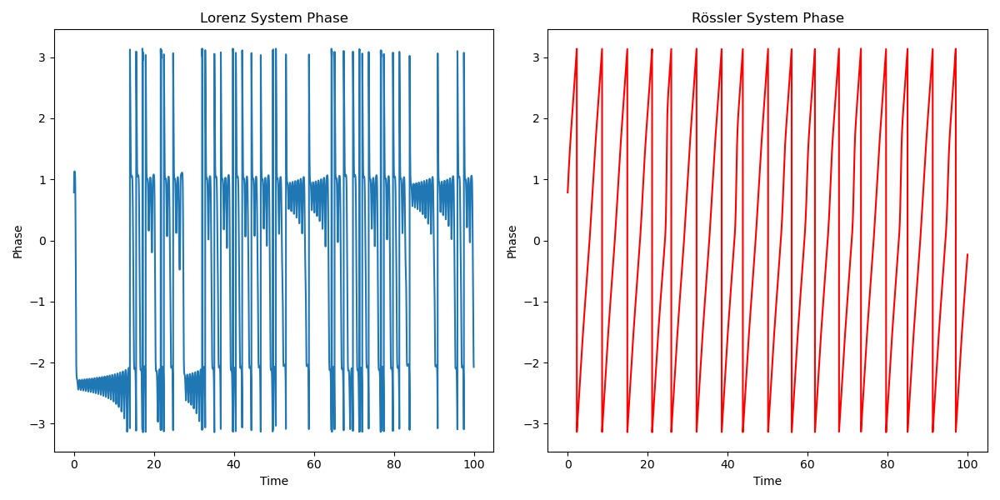
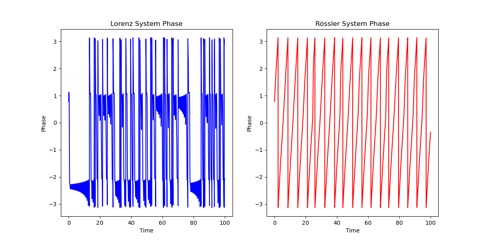
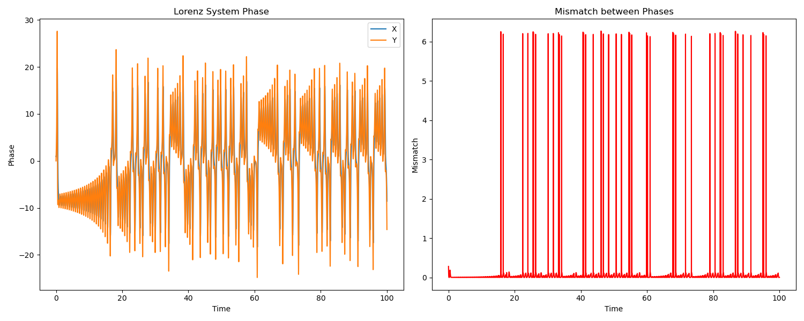
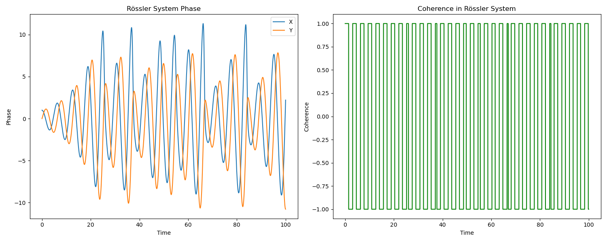

# BUILDING_LOG_03 — NEXAH Validation and JANUS Operator Experimentation

**Status**: Structured Dynamical Analysis → Validation of JANUS Operator

**System**:  
`NEXAH Framework / JANUS Operator`  

**Location**:  
`RESEARCH/CORE_CONCEPTS/NEXAH/`

**Scripts**:  
`RESEARCH/CORE_CONCEPTS/NEXAH/scripts/`

**Author**:  
Thomas Hofmann

---

## 🧭 Purpose

This log tracks the **validation progress** of the **NEXAH framework**, focusing on the **JANUS Operator** and its associated experimental series. The goal is to integrate **structural insights** from multiple systems and validate core hypotheses regarding transport, transition geometry, and phase evolution.

---

## 🔷 **Core Validation Results and Insights**

### **Experiment 1: Phase-Drift Hypothesis Validation**
- **Objective**: Test if stable transport structures emerge through non-synchronization (phase drift).
- **Results**: 
  - Phase Mismatch between **Lorenz** and **Rössler** systems: **2.096**
- **Visuals**:
  - 
- **Key Insight**: Strong phase mismatches appear, consistent with expected chaotic behavior but indicative of organized transition structures.

---

### **Experiment 2: Instability and Phase Transition Validation**
- **Objective**: Investigate the role of **instability** in phase transitions.
- **Results**: 
  - Phase Mismatch between **Lorenz** and **Rössler** systems: **2.1115645486484715**
- **Visuals**:
  - 
  - 
- **Key Insight**: Instability correlates with phase shifts, supporting the theory that phase mismatch triggers transitions.

---

### **Experiment 3: Shell Crossing and Recursive Transport Validation**
- **Objective**: Test whether transitions happen near shell-crossing structures and recursive transport.
- **Results**: Clear evidence of recursive transport paths and **shell-crossing** behavior.
- **Visuals**:
  - 
    
- **Key Insight**: Transport and transitions are not uniformly distributed; they are localized near structural features like **shell-crossing**.

---

### **Experiment 4: Control Direction and Stabilization Validation**
- **Objective**: Test if **control directionality** stabilizes transitions.
- **Results**: Positive results showing that **control direction** influences stability.
- **Visuals**:
  - 
- **Key Insight**: Control mechanisms can stabilize transition dynamics by modifying coherence.

---
