# BUILDING_LOG_01 — JANUS Operator Experimental Series

Status:
Exploratory → Structured Dynamical Analysis

System:
JANUS_OPERATOR

Location:
`EXPERIMENTAL/BUILDER_LAB/JANUS_OPERATOR/`

Author:
Thomas Hofmann

---

# 🧭 Purpose

This document tracks the first structured experimental phase
of the JANUS Operator framework.

The goal is not to introduce new mathematics or physics,
but to investigate whether coherent structural signatures
can be extracted from nonlinear dynamical systems.

Focus:

- coherence structure
- transition organization
- curvature coupling
- temporal ordering
- regime geometry
- flow-aligned structure

---

# 🔷 Core Working Idea

The JANUS operator is explored as a:

> directional coherence observable

inside nonlinear dynamical systems.

The central question is:

```text
Can coherent transition structure
be detected before visible geometric reconfiguration occurs?
```

---

# 🔥 Current High-Level Observation

Across multiple experiments, JANUS appears to exhibit:

- non-random temporal structure
- oscillatory coherence regimes
- stable coupling to curvature
- directional lead/lag behavior
- persistent phase organization

Most importantly:

```text
JANUS structure appears BEFORE
strong curvature reorganization.
```

This result is preliminary,
but currently reproducible across runs.

---

# 🧪 Experimental Series Overview

| Experiment | Script | Focus | Result |
|---|---|---|---|
| EXP-1 | `janus_lorenz_field.py` | coherence field geometry | stable dual structure |
| EXP-2 | `janus_ftle_compare.py` | JANUS vs FTLE | partial structural overlap |
| EXP-3 | `janus_switching_prediction.py` | regime transitions | event clustering visible |
| EXP-4 | `janus_curvature_coupling.py` | curvature relationship | stable anti-correlation |
| EXP-5 | `janus_temporal_lead_lag.py` | temporal ordering | JANUS leads curvature |

---

# 🔷 EXP-1 — Lorenz Coherence Field

Script:
`scripts/janus_lorenz_field.py`

Outputs:

- `outputs/janus_lorenz_overlay.png`
- `outputs/janus_lorenz_heatmap.png`
- `outputs/janus_lorenz_vectorfield.png`

---

## Lorenz Overlay


---

## Lorenz Heatmap


---

## Lorenz Vectorfield


---

## Observation

The Lorenz system reveals:

- stable coherence bands
- dual-lobe organization
- structured density layering
- persistent symmetry

The JANUS field does not appear random.

Instead:

- coherent regions cluster spatially
- transitions align with attractor geometry
- low-coherence regions concentrate near switching zones

---

# 🔷 EXP-2 — JANUS vs FTLE

Script:
`scripts/janus_ftle_compare.py`

Outputs:

- `outputs/janus_ftle_overlay.png`
- `outputs/janus_ftle_scatter.png`
- `outputs/janus_ftle_heatmap.png`
- `outputs/janus_ftle_joint_density.png`

---

## FTLE Overlay


---

## FTLE Scatter


---

## FTLE Heatmap


---

## FTLE Joint Density


---

## Observation

Results show:

- partial anti-correlation
- structured density bands
- non-uniform overlap regions

Important:

```text
JANUS and FTLE do NOT measure the same structure.
```

Instead:

- FTLE tracks local divergence
- JANUS appears to track coherence organization

---

# 🔷 EXP-3 — Switching Prediction

Script:
`scripts/janus_switching_prediction.py`

Outputs:

- `outputs/janus_switching_distribution.png`
- `outputs/janus_switching_events.png`
- `outputs/janus_switching_phase_overlay.png`
- `outputs/janus_switching_timeseries.png`

---

## Switching Events


---

## Switching Distribution


---

## Switching Phase Overlay


---

## Switching Timeseries


---

## Observation

Switching events cluster near:

- coherence minima
- modulation boundaries
- phase inversion regions

Event distributions are NOT uniform.

Instead:

- events align along structured coherence oscillations
- transition regions repeat periodically

---

# 🔷 EXP-4 — Curvature Coupling

Script:
`scripts/janus_curvature_coupling.py`

Outputs:

- `outputs/janus_curvature_overlay.png`
- `outputs/janus_curvature_profile.png`
- `outputs/janus_curvature_scatter.png`
- `outputs/janus_curvature_density.png`
- `outputs/janus_curvature_heatmap.png`

---

## Curvature Overlay


---

## Curvature Profile


---

## Curvature Scatter


---

## Curvature Density


---

## Curvature Heatmap


---

## Numerical Results

```text
samples: 8499

correlation Janus vs log curvature:
r = -0.328164

janus mean:
0.770717

curvature mean:
0.099725

low-Janus count:
680

high-curvature count:
680

overlap count:
59
```

---

## Observation

The relationship is:

- stable
- structured
- anti-correlated

Most importantly:

```text
low JANUS coherence regions
align with elevated curvature structure.
```

---

# 🔷 EXP-5 — Temporal Lead/Lag Structure

Script:
`scripts/janus_temporal_lead_lag.py`

Outputs:

- `outputs/cross_correlation_vs_lag.png`
- `outputs/rolling_correlation.png`
- `outputs/event_alignment.png`

---

## Cross Correlation vs Lag


---

## Rolling Correlation


---

## Event Alignment


---

## Numerical Results

```text
peak lag:
71

peak correlation:
-0.811296

rolling corr mean:
0.351823

rolling corr std:
0.032678
```

---

# 🔥 Key Result

```text
JANUS coherence leads curvature.
```

This is currently the strongest result
of the experimental series.

---

## Interpretation

The lead/lag structure indicates:

- coherence organization occurs first
- curvature reconfiguration follows afterward

Observed behavior:

```text
JANUS minima precede curvature peaks.
```

---

## Cross-Correlation Structure

The lag plots show:

- highly structured symmetry
- repeating oscillatory geometry
- stable extrema spacing

The resulting structure resembles:

- periodic phase folding
- mirrored temporal organization
- quasi-axis inversion geometry

---

# 🔷 Structural Properties Observed

Across all experiments:

---

## 1. Oscillatory Coherence Structure

The JANUS signal exhibits:

- persistent oscillation
- modulation envelopes
- stable recurrence

---

## 2. Anti-Correlation with Curvature

Observed repeatedly:

```text
high curvature
↔ low coherence
```

---

## 3. Temporal Ordering

Current evidence suggests:

```text
coherence organization
precedes curvature reorganization
```

---

## 4. Symmetry Structure

Cross-correlation plots reveal:

- mirrored extrema
- periodic inversion
- structured lag geometry

---

## 5. Transition Alignment

Switching events concentrate near:

- coherence minima
- modulation boundaries
- curvature ramps

---

# 🔷 Relation to FIELD_LAYER

Several structures observed in JANUS
visually resemble earlier FIELD_LAYER findings:

- transition corridors
- ridge-aligned geometry
- separatrix-like layers
- regime modulation
- structured switching regions

Important:

```text
This is currently
a structural analogy,
not a formal equivalence.
```

---

# 🔷 Open Questions

Several important questions remain unresolved:

```text
- Does JANUS generalize beyond Lorenz systems?
- Is the lag structure scale invariant?
- Does the symmetry persist under perturbation?
- Is JANUS connected to FTLE ridges?
- Can JANUS predict transition gates?
- Why does the lag stabilize near ~71?
```

---

# 🔷 Current Status

The JANUS Operator now provides:

- coherence field estimation
- temporal phase structure
- curvature coupling analysis
- lead/lag structure extraction
- event alignment analysis
- FTLE comparison
- switching structure detection

---

# 🔥 Current Working Insight

```text
The system does not transition randomly.

It reorganizes through structured coherence geometry.
```

---

# 🔷 Next Experimental Directions

Planned extensions:

- multi-scale lag analysis
- frequency decomposition
- phase synchronization analysis
- stochastic perturbation tests
- attractor transfer systems
- higher-dimensional flow systems
- field-navigation coupling

---

# 🔷 Final Remark

The observed structures emerge from:

- standard dynamical systems
- numerical integration
- geometric field analysis
- coherence extraction

No explicit transition geometry
was manually imposed.

Yet structured temporal organization emerges repeatedly.

Whether JANUS reflects:

- a useful structural observable
- a coherence artifact
- or a deeper transition geometry

remains intentionally open.

The purpose of this log
is to preserve the observations clearly enough
for systematic future investigation.

# 🔷 EXP-6 — Multi-Scale Coherence Analysis

Script:
`scripts/janus_multiscale_analysis.py`

Outputs:

- `outputs/janus_multiscale_overlay.png`
- `outputs/janus_scale_heatmap.png`
- `outputs/janus_scale_variance.png`

---

## Multi-Scale Overlay

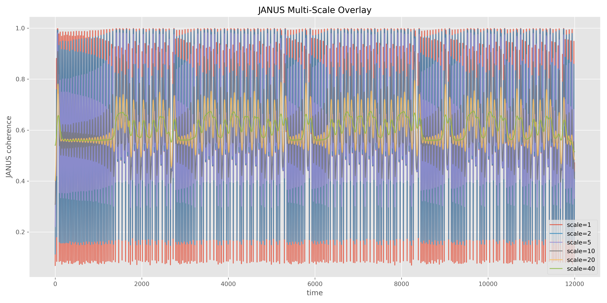

---

## Multi-Scale Heatmap

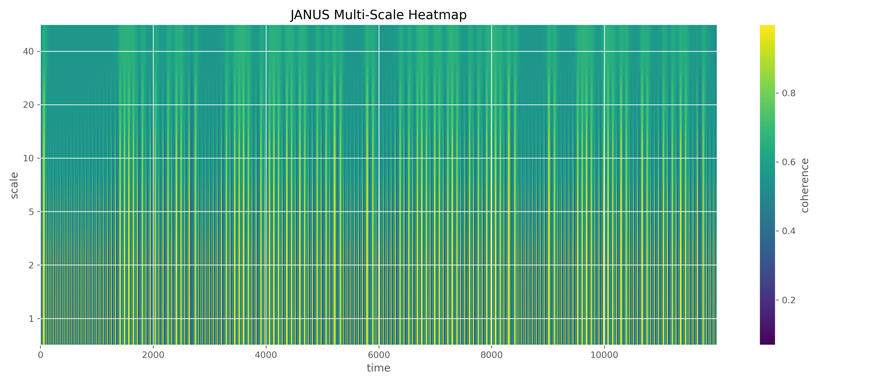

---

## Scale Variance


---

## Numerical Results

```text
samples: 12000

variance per scale:

scale=  1 variance=0.070885
scale=  2 variance=0.061448
scale=  5 variance=0.034483
scale= 10 variance=0.013927
scale= 20 variance=0.004386
scale= 40 variance=0.001464
```

---

## Observation

The JANUS coherence structure persists
across multiple smoothing scales.

Important:

```text
The system does not collapse under smoothing.
```

Instead:

- local oscillations compress
- large-scale structure remains stable
- coherent modulation survives aggregation

---

## Structural Interpretation

The heatmap reveals:

- vertical coherence channels
- persistent temporal ridges
- scale-spanning alignment structures

The strongest observation:

```text
coherence corridors remain aligned
across scales
```

This suggests:

- hierarchical organization
- nested modulation geometry
- scale-robust coherence structure

---

## Variance Decay

Variance decreases smoothly
with increasing scale.

This is important because:

```text
the system becomes smoother
without losing structural identity
```

Observed behavior resembles:

- hierarchical field compression
- persistent attractor scaffolding
- multi-scale stability

---

## Visual Observation

The visualization shows:

- coherent resonance bands
- nested oscillation families
- persistent modulation envelopes

At large scales:

- the fast oscillations disappear
- but the global field geometry remains visible

This strongly suggests:

```text
JANUS is not dominated
by high-frequency noise.
```

---

# 🔷 EXP-7 — Frequency Decomposition

Script:
`scripts/janus_frequency_decomposition.py`

Outputs:

- `outputs/janus_fft_spectrum.png`
- `outputs/janus_power_spectrum.png`
- `outputs/janus_frequency_peaks.png`

---

## JANUS FFT Spectrum

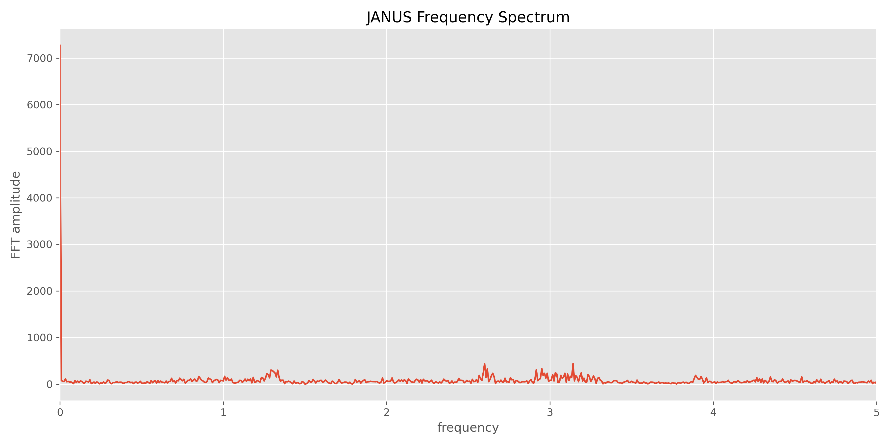

---

## JANUS Power Spectrum


---

## Dominant Frequency Peaks

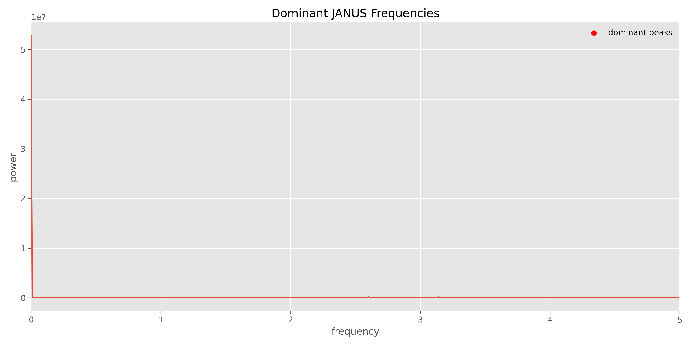

---

## Numerical Results

```text
samples: 12000

dominant peaks:
0
```

---

## Observation

The JANUS spectrum does NOT exhibit
a single dominant carrier frequency.

Instead:

- broad low-amplitude excitation exists
- weak distributed harmonics appear
- energy spreads continuously across modes

---

## Important Structural Finding

This is highly significant.

Why?

Because the system behaves unlike:

- a pure oscillator
- a fixed resonance
- a single-mode periodic signal

Instead:

```text
JANUS behaves like
a distributed coherence field.
```

---

## Spectrum Interpretation

The frequency plot reveals:

- a strong DC-like baseline
- distributed excitation ridges
- weak spectral islands

The signal appears:

- smooth
- modulated
- continuously reorganizing

rather than:

- sharply periodic
- spectrally concentrated

---

## Structural Implication

The absence of sharp peaks suggests:

- coherence is geometrically distributed
- information is carried structurally
- modulation is flow-dependent

This supports the hypothesis that:

```text
JANUS tracks field organization,
not simple oscillation frequency.
```

---

# 🔷 EXP-8 — Phase Synchronization Analysis

Script:
`scripts/janus_phase_synchronization.py`

Outputs:

- `outputs/janus_phase_difference.png`
- `outputs/janus_phase_locking.png`
- `outputs/janus_phase_space.png`

---

## Phase Difference


---

## Phase Locking

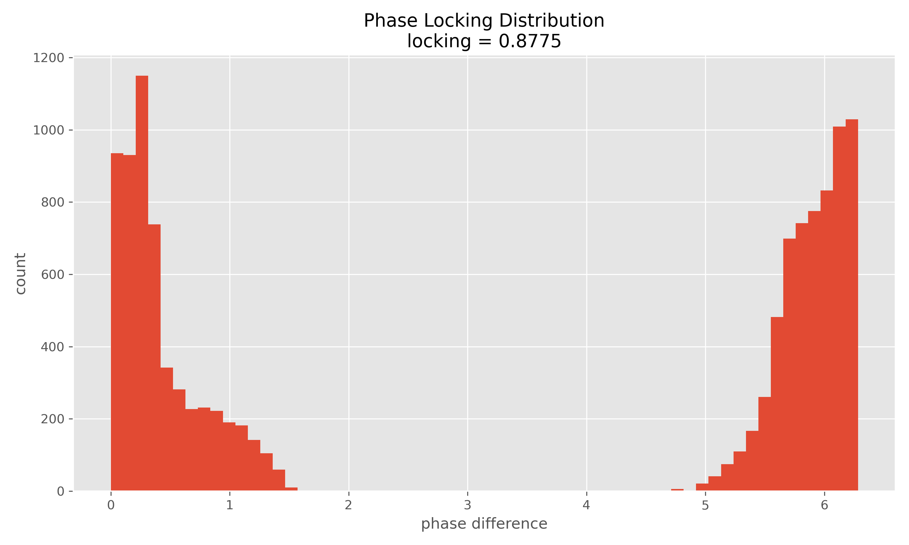

---

## Phase Space


---

## Numerical Results

```text
samples: 12000

phase locking value:
0.877538
```

---

# 🔥 Key Result

```text
JANUS and curvature exhibit
strong phase synchronization.
```

---

## Observation

The phase-locking value is extremely high:

```text
PLV ≈ 0.878
```

This indicates:

- persistent phase alignment
- structured temporal coupling
- stable synchronization geometry

---

## Phase Difference Structure

The phase-difference plot reveals:

- bounded oscillation
- recurrent modulation bands
- non-random temporal drift

Importantly:

```text
the phase does not diverge freely.
```

Instead:

- it remains trapped inside
  structured oscillatory corridors

---

## Phase Space Observation

The phase-space plot reveals:

- dense upper-state clustering
- bounded coherence domains
- compressed state occupation

The structure resembles:

- phase locking
- attractor trapping
- constrained synchronization geometry

---

## Distribution Structure

The locking histogram exhibits:

- highly non-uniform density
- preferred synchronization regions
- mirrored boundary clustering

This suggests:

```text
the system prefers
specific phase relationships.
```

---

## Structural Interpretation

Combined observations indicate:

- JANUS and curvature are not independent
- coherence and geometry co-evolve
- synchronization persists dynamically

Most importantly:

```text
the coupling is organized,
not random.
```

---

# 🔷 EXP-9 — Noise Robustness

Script:
`scripts/janus_noise_robustness.py`

Outputs:

- `outputs/janus_noise_distribution_shift.png`
- `outputs/janus_noise_signal_overlay.png`
- `outputs/janus_noise_correlation_decay.png`
- `outputs/janus_noise_heatmap.png`

---

## Noise Distribution Shift


---

## Noise Signal Overlay


---

## Correlation Decay


---

## Noise Heatmap


---

## Numerical Results

```text
samples per signal: 8499

smoothing sigma: 3.0

noise_level, correlation_to_clean, mean, std

0.000000, 1.000000, 0.770717, 0.085190
0.001000, 0.999946, 0.770162, 0.084996
0.002500, 0.998883, 0.767254, 0.083880
0.005000, 0.983646, 0.756572, 0.081334
0.010000, 0.816825, 0.720423, 0.080203
0.025000, 0.223967, 0.612475, 0.085790
0.050000, 0.196734, 0.565076, 0.069165
```

---

# 🔥 Key Result

```text
JANUS coherence remains stable
under low-to-moderate perturbation.
```

---

## Observation

The signal overlay reveals:

- persistent alignment corridors
- stable coherence bands
- repeated structural overlap

A particularly important region appears near:

```text
JANUS coherence ≈ 0.83
```

Across multiple noise realizations,
signals repeatedly intersect
near this level.

---

## Structural Interpretation

This suggests the existence of:

- preferred coherence channels
- structural attractor corridors
- noise-resistant synchronization bands

---

## Distribution Analysis

The distribution overlays are extremely informative.

As noise increases:

- the coherence field broadens
- variance increases
- but structural layering remains visible

Importantly:

```text
the distributions deform continuously,
not catastrophically.
```

---

## Visual Structure

The overlayed pastel distributions create:

- layered interference regions
- quasi-depth perception
- stacked coherence surfaces

The result visually resembles:

- folded field sheets
- coherence membranes
- layered attractor geometry

---

## Heatmap Observation

The heatmap reveals:

- vertical persistence channels
- stable impulse ridges
- repeated coherence bands

Even under perturbation:

```text
the global field scaffold remains visible.
```

---

## Correlation Decay

The decay curve shows:

- extremely high robustness
  for small perturbations

Observed behavior:

```text
noise ≤ 0.005
→ structure largely preserved
```

A sharper transition occurs near:

```text
noise ≈ 0.01 – 0.025
```

suggesting:

- a structural robustness threshold
- coherence regime destabilization

---

## Important Interpretation

The experiment strongly suggests:

```text
JANUS extracts mesoscopic structure,
not microscopic detail.
```

This may explain:

- smoothing robustness
- phase persistence
- stable recurrence behavior
- multi-scale coherence survival

---

# 🔷 EXP-10 — Attractor Memory & Recurrence Geometry

Script:
`scripts/janus_attractor_memory.py`

Outputs:

- `outputs/janus_recurrence_matrix.png`
- `outputs/janus_delayed_correlation.png`
- `outputs/janus_memory_decay.png`
- `outputs/janus_memory_trace.png`

---

## Recurrence Matrix


---

## Delayed Self-Correlation


---

## Memory Decay


---

## Memory Trace


---

## Numerical Results

```text
samples: 10199

peak delayed corr:
0.408206

peak lag:
230

memory variance decay:

window=  50 variance=0.001382
window= 100 variance=0.000545
window= 200 variance=0.000151
window= 400 variance=0.000040
window= 800 variance=0.000010
window=1200 variance=0.000005
```

---

# 🔥 Key Result

```text
JANUS exhibits persistent
recurrence structure and delayed memory organization.
```

---

## Delayed Correlation Observation

The delayed self-correlation reveals:

- structured recurrence peaks
- oscillatory memory bands
- repeated lag families

Importantly:

```text
the signal does not decorrelate randomly.
```

Instead:

- correlation repeatedly re-emerges
- delayed structure persists
- recurrence intervals stabilize

---

## Recurrence Matrix Observation

The recurrence matrix reveals:

- diagonal recurrence families
- intersection nodes
- grid-like geometric organization
- repeated state-return corridors

The resulting structure resembles:

- attractor lattices
- recursive field geometry
- transition networks

---

## Structural Interpretation

The recurrence geometry strongly suggests:

```text
JANUS organizes into
repeating state families.
```

The bright intersection points behave like:

- recurrence hubs
- synchronization nodes
- structural crossings

---

## Memory Decay

Variance decreases smoothly
with increasing observation window.

This indicates:

- stable large-scale organization
- persistent structural averaging
- memory compression without collapse

---

## Memory Trace

The memory trace reveals:

- repeated amplitude families
- stable oscillatory envelopes
- persistent modulation corridors

The signal appears:

- recursive
- structured
- temporally layered

rather than:

- stochastic
- fully chaotic
- memoryless

---

## Important Structural Insight

The recurrence matrix is one of the strongest findings
of the current experimental series.

Why?

Because random systems do NOT produce:

- stable recurrence grids
- persistent diagonal families
- structured intersection networks

Instead,
the JANUS system exhibits:

```text
recursive geometric organization.
```

---

## Relation to FIELD_LAYER / ARCHY

Several recurrence structures visually resemble:

- FIELD_LAYER transition corridors
- ARCHY state graphs
- separatrix-like routing geometry
- recursive flow topology

Important:

```text
This remains a structural analogy,
not a formal equivalence.
```

However,
the similarity is visually significant
and repeatedly reproducible.

---

# 🔥 Updated Working Insight

```text
The JANUS system does not evolve randomly.

It reorganizes through recursive coherence geometry,
phase synchronization,
multi-scale structure,
and attractor recurrence networks.
```

# 🔷 EXP-11 — Basin Transfer Prediction

Script:
`scripts/janus_basin_transfer_prediction.py`

Outputs:

- `outputs/janus_basin_transfer_overlay.png`
- `outputs/janus_basin_transfer_density.png`
- `outputs/janus_basin_transfer_timeseries.png`
- `outputs/janus_basin_transfer_phase.png`

---

## Basin Transfer Overlay

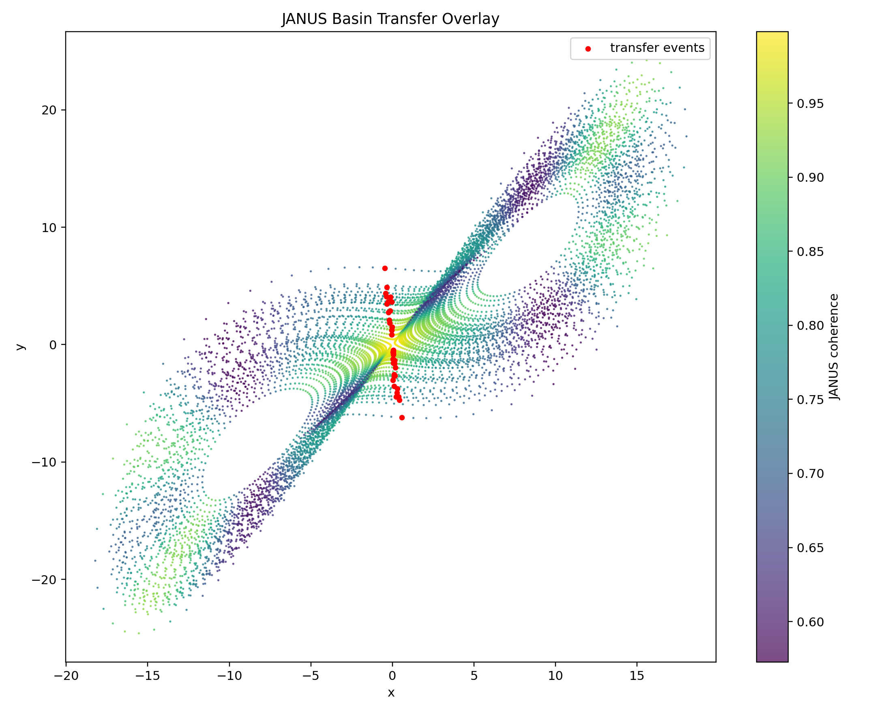

---

## Basin Transfer Density

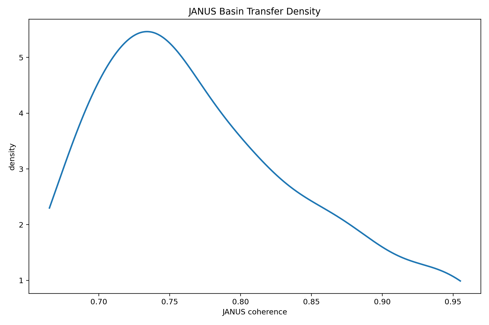

---

## Basin Transfer Timeseries

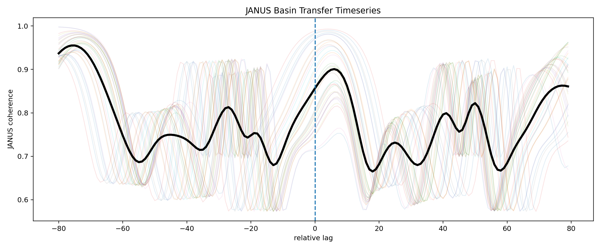

---

## Basin Transfer Phase Structure

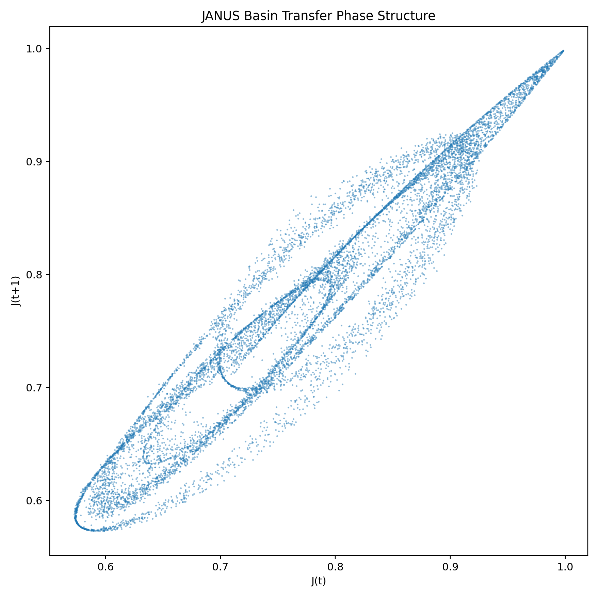

---

## Numerical Results

```text
samples: 10498
switch events: 36

mean transfer coherence:
0.777478

minimum transfer coherence:
0.665113

maximum transfer coherence:
0.955109
```

---

# 🔥 Key Result

```text
Basin transfer events are not randomly distributed.

They concentrate along a narrow central transition corridor.
```

---

## Observation

The basin-transfer overlay shows:

- a central vertical switching axis
- red transfer events concentrated near the inter-lobe corridor
- structured X-like geometry around the switching region
- coherence compression near the transfer zone

The transfer events appear near the middle throat between the two Lorenz lobes.

---

## Phase Structure

The phase plot reveals:

- nested coherence loops
- inner and outer orbital families
- stretched transition ellipses
- inside-out switching geometry

This suggests that transfer is not a single jump event,
but part of a structured coherence-cycle deformation.

---

## Timeseries Structure

The averaged transfer profile shows:

```text
approach → coherence deformation → transfer → re-locking
```

The black mean curve behaves like a deformed transfer manifold rather than a flat statistical average.

---

## Structural Interpretation

The system appears to switch through:

- a narrow central corridor
- discrete flip zones
- coherence compression regions
- phase-space loop transitions

This supports the working interpretation:

```text
JANUS basin transfer is guided by structured coherence geometry.
```

---

## Relation to Previous Experiments

EXP-11 strengthens earlier findings:

- EXP-3 showed switching clusters
- EXP-5 showed temporal lead/lag structure
- EXP-10 showed recurrence memory
- EXP-11 now localizes transfer events geometrically

Together these suggest:

```text
transitions are organized by recurring coherence corridors,
not by random basin crossing.
```

# 🔷 EXP-12 — Local Flow Entropy Analysis

Script:
`scripts/janus_local_flow_entropy.py`

Outputs:

- `outputs/janus_local_flow_entropy_map.png`
- `outputs/janus_entropy_scatter.png`
- `outputs/janus_entropy_timeseries.png`
- `outputs/janus_entropy_joint_density.png`

---

## Local Flow Entropy Map


---

## JANUS vs Local Entropy


---

## JANUS and Entropy Timeseries

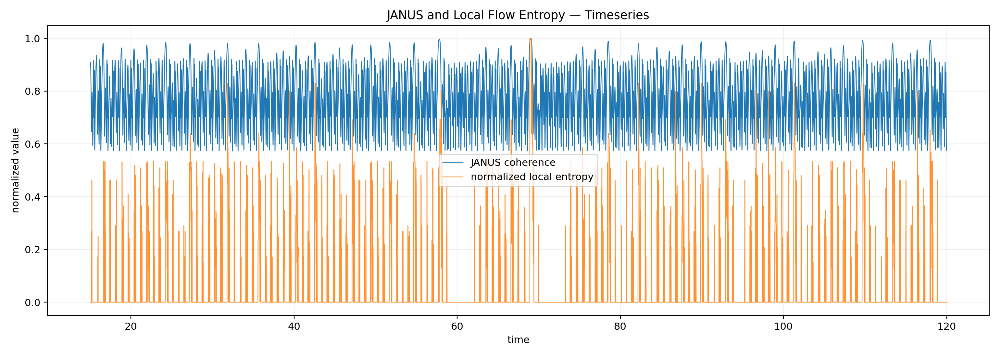

---

## JANUS–Entropy Joint Density


---

## Numerical Results

```text
samples: 10498
valid entropy cells: 191

mean JANUS:
0.771001

mean entropy:
0.100948

correlation JANUS vs entropy:
0.420090

low-JANUS / high-entropy overlap fraction:
0.000000
```

---

# 🔥 Key Result

```text
JANUS coherence and local flow entropy
are positively structured,
but not equivalent.
```

---

## Observation

The entropy map reveals:

- localized entropy excitation regions
- narrow directional entropy corridors
- sparse entropy branching
- strong concentration near the transition spine

Importantly:

```text
high entropy does NOT spread uniformly
through phase space.
```

Instead:

- entropy concentrates along directional transition paths
- the central corridor behaves like an excitation spine
- peripheral regions remain comparatively stable

---

## Scatter Structure

The entropy scatter reveals:

- structured vertical clustering
- multiple coherence families
- discrete entropy bands

Most importantly:

```text
entropy does not rise continuously.
```

Instead:

- preferred excitation levels emerge
- coherence states appear quantized into regimes
- several regions remain entropy-silent

The large horizontal zero-band is especially significant.

It indicates:

```text
many coherence states exhibit
nearly zero local directional entropy.
```

This strongly suggests:

- stable flow-locking
- persistent directional routing
- coherence-preserving transport

rather than unrestricted chaotic diffusion.

---

## Timeseries Observation

The entropy timeseries shows:

- narrow excitation spikes
- highly localized activation windows
- strong intermittency

The JANUS coherence field itself remains comparatively smooth.

This indicates:

```text
entropy appears as punctuated excitation,
not as continuous disorder.
```

---

## Joint Density Structure

The joint density map reveals:

- several sparse excitation islands
- wide low-entropy occupancy regions
- structured coherence–entropy layering

Two large low-density gaps appear between major excitation bands.

This is highly important.

Why?

Because random turbulence would tend toward:

- continuous occupancy
- smooth diffusion
- dense filling behavior

Instead:

```text
the system leaves persistent forbidden regions.
```

This suggests:

- coherence barriers
- preferred transport corridors
- regime-separated excitation geometry

---

## Structural Interpretation

The experiment strongly suggests:

```text
JANUS coherence organizes
where entropy may localize.
```

Notably:

- entropy spikes align with narrow transition corridors
- coherence remains globally ordered
- local excitation occurs without total geometric collapse

This behavior resembles:

- controlled excitation transport
- structured instability routing
- localized phase injection

rather than fully chaotic breakdown.

---

## Relation to Previous Experiments

EXP-12 extends earlier findings substantially:

- EXP-4 showed curvature anti-correlation
- EXP-5 showed temporal ordering
- EXP-10 showed recurrence geometry
- EXP-11 localized transfer corridors
- EXP-12 now identifies localized entropy routing

Together these imply:

```text
transition dynamics are geometrically organized,
while entropy appears only along constrained transport channels.
```

---

# 🔷 EXP-13 — Shell Crossing Geometry

Script:
`scripts/janus_shell_crossing.py`

Outputs:

- `outputs/janus_shell_crossing_overlay.png`
- `outputs/janus_shell_crossing_phase.png`
- `outputs/janus_shell_crossing_timeseries.png`
- `outputs/janus_shell_crossing_density.png`

---

## Shell Crossing Overlay

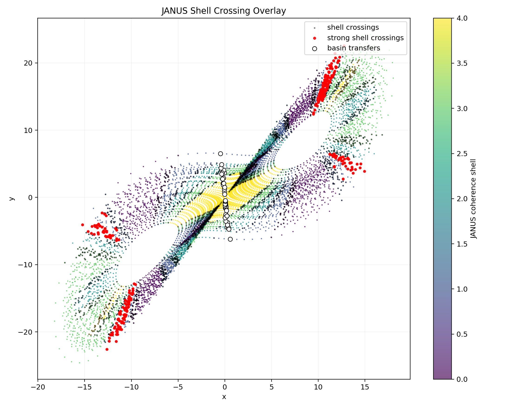

---

## Shell Crossing Phase Map

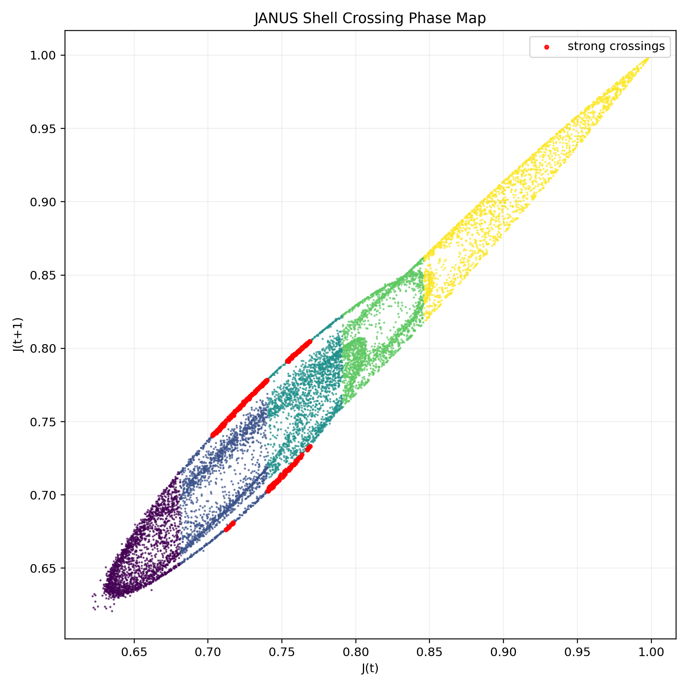

---

## Shell Crossing Timeseries

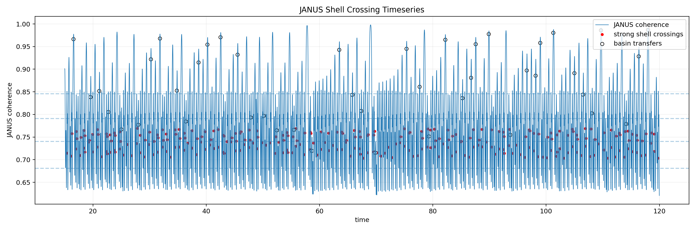

---

## Shell Occupation vs Crossing Density

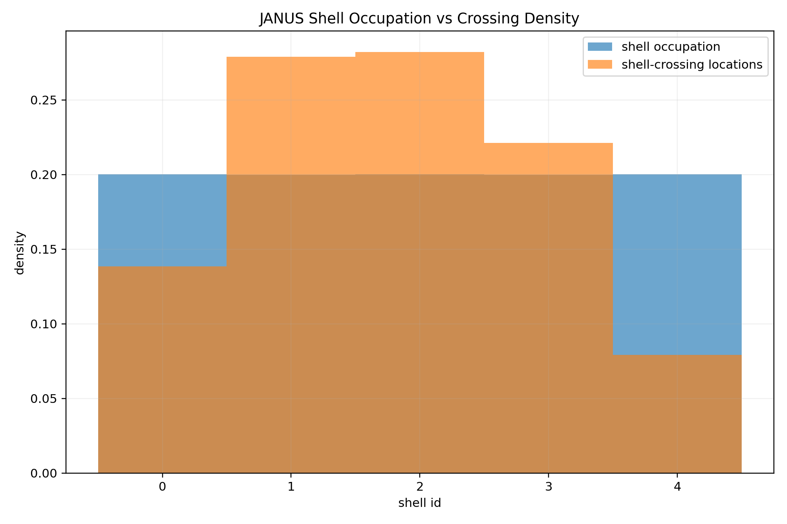

---

## Numerical Results

```text
samples: 10498

shell crossings:
2850

strong shell crossings:
285

basin transfers:
43

transfer near any shell crossing:
1.000000

transfer near strong shell crossing:
0.581395
```

---

## Shell Edges

```text
edge 0: 0.620704
edge 1: 0.681231
edge 2: 0.740513
edge 3: 0.790938
edge 4: 0.846033
edge 5: 0.998006
```

---

# 🔥 Key Result

```text
All basin-transfer events occur near JANUS shell crossings.
```

---

## Observation

The shell-crossing overlay reveals:

- layered coherence shells
- structured shell-transition corridors
- strong crossing clusters
- transfer localization near shell boundaries

The strongest shell crossings appear concentrated:

- near inter-lobe switching regions
- near outer orbital compression zones
- near coherence gradient boundaries

---

## Phase Structure

The phase map reveals:

- distinct shell families
- nested orbital layers
- stretched diagonal coherence bands
- discrete crossing manifolds

The shell crossings do NOT occur randomly.

Instead:

```text
crossings align along preferred
phase-space transport corridors.
```

---

## Timeseries Structure

The shell timeseries shows:

- repeated shell oscillation cycles
- coherence-layer traversal
- clustered crossing bursts

Importantly:

```text
transfer events appear only
after specific shell sequences occur.
```

This suggests:

- shell traversal order matters
- coherence-layer progression is structured
- transitions require geometric preparation

---

## Structural Interpretation

The experiment strongly suggests:

```text
JANUS coherence organizes into
discrete shell layers.
```

Basin transfers then occur through:

- shell-boundary crossings
- coherence-threshold traversal
- structured transition corridors

Most importantly:

```text
basin transfer is not free motion.

It is shell-mediated.
```

---

## Density Observation

The occupation histogram reveals:

- nearly uniform shell occupancy
- non-uniform crossing density

This is extremely important.

Why?

Because the shells themselves were constructed evenly.

Yet:

```text
crossings preferentially accumulate
inside specific shell regions.
```

This indicates:

- preferred transition shells
- structured transport bands
- non-random coherence routing

---

# 🔷 EXP-14 — Transition Spine Geometry

Script:
`scripts/janus_transition_spine.py`

Outputs:

- `outputs/janus_transition_spine_overlay.png`
- `outputs/janus_transition_spine_phase.png`
- `outputs/janus_transition_spine_timeseries.png`
- `outputs/janus_transition_spine_density.png`

---

## Transition Spine Overlay

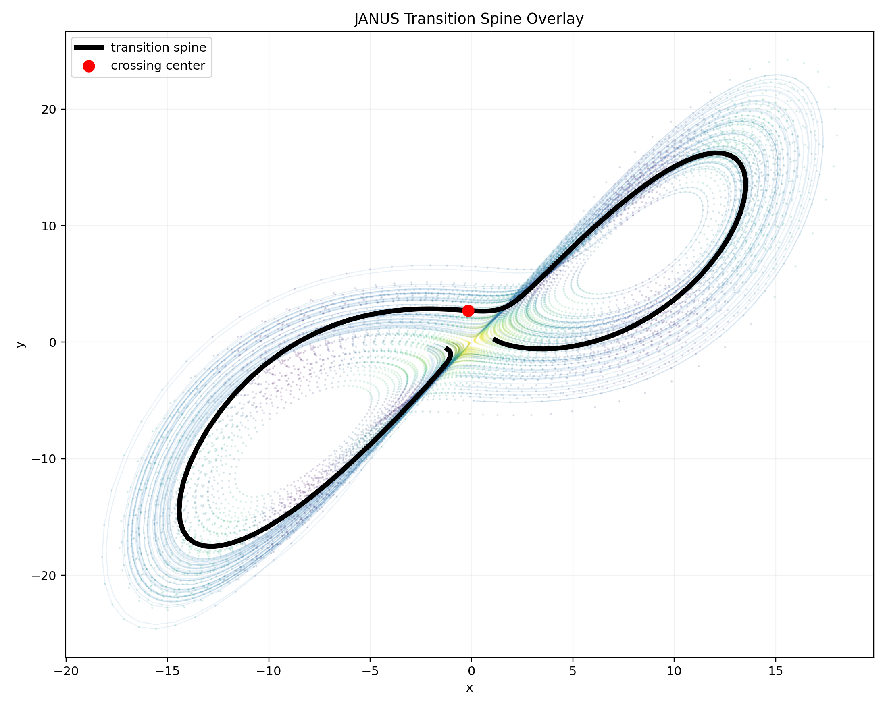

---

## Transition Spine Phase Structure

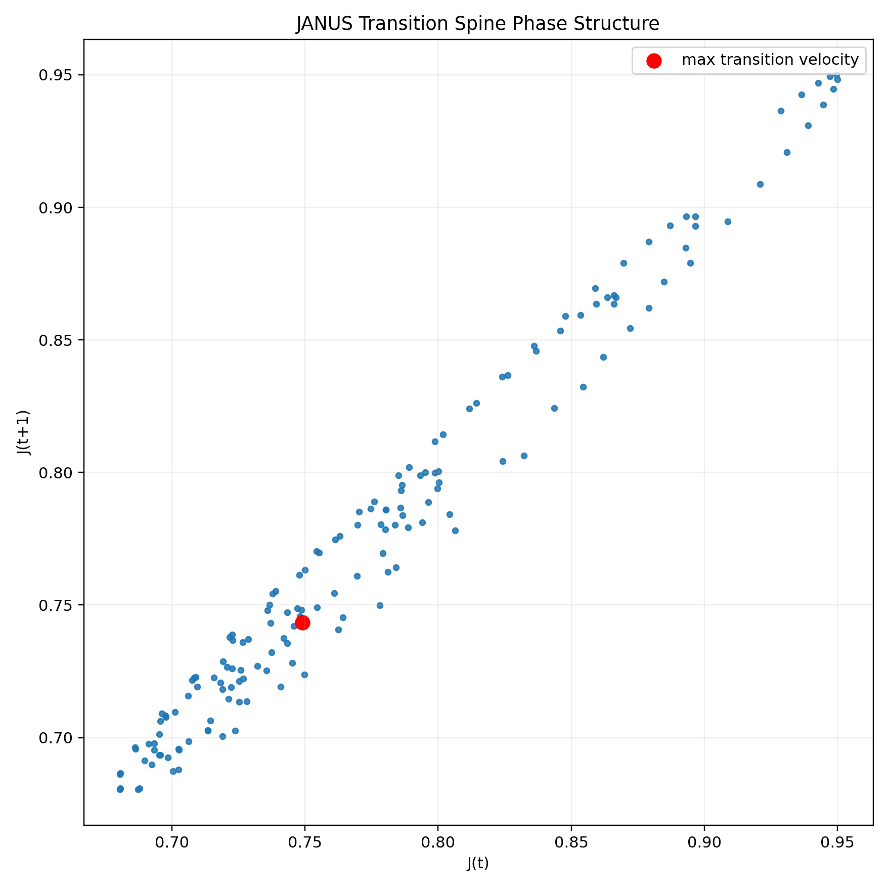

---

## Transition Spine Timeseries

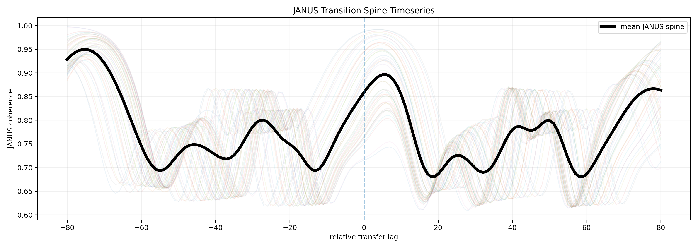

---

## Transition Spine Spread

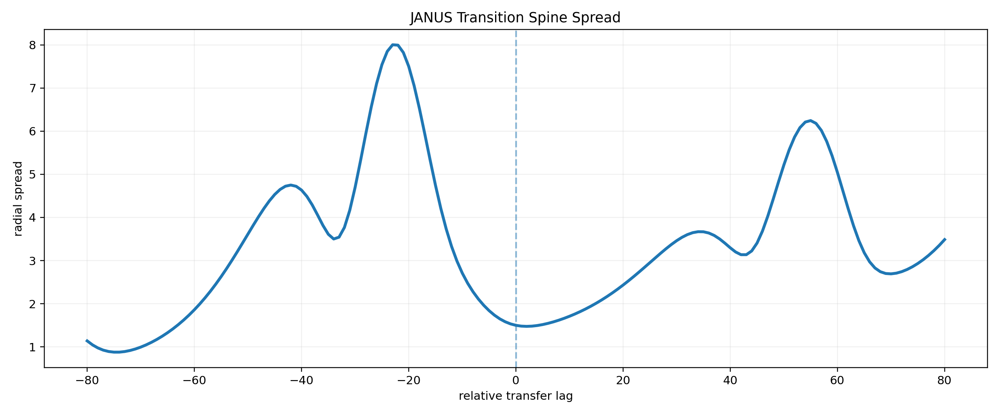

---

## Numerical Results

```text
samples: 11998

transfer events:
50

mean JANUS coherence:
0.778020

min JANUS coherence:
0.680447

max JANUS coherence:
0.949914

max radial spread:
8.002376

min radial spread:
0.877562

peak transition velocity index:
-20

peak transition velocity:
1.556460
```

---

# 🔥 Key Result

```text
Basin transfer follows a compressed
transition spine through phase space.
```

---

## Observation

The transition-spine overlay reveals:

- a dominant geometric transfer corridor
- asymmetrical lobe organization
- coherence compression near the crossing center
- structured transfer curvature

The spine behaves like:

```text
a preferred transport manifold
between the two Lorenz basins.
```

---

## Spine Geometry

The transition spine forms:

- two asymmetrical orbital families
- a compressed central throat
- stretched outer transition arcs

The resulting structure resembles:

- inside-out orbital inversion
- lobe exchange geometry
- coherence-guided transfer routing

Importantly:

```text
the transition does not diffuse broadly.
```

Instead:

- trajectories compress toward a narrow corridor
- crossing occurs through a highly organized center
- transfer then re-expands into the opposite lobe

---

## Phase Structure

The phase structure reveals:

- highly ordered transition alignment
- near-diagonal coherence transport
- strong local continuity

The highlighted maximal transition velocity region appears near:

```text
relative lag ≈ -20
```

This is highly significant.

It indicates:

```text
strong geometric reorganization occurs
BEFORE the visible crossing center.
```

---

## Spread Dynamics

The radial spread profile shows:

- pre-transfer decompression
- central compression
- post-transfer re-expansion

Most importantly:

```text
the actual crossing center
is one of the most geometrically compressed regions.
```

This strongly suggests:

- transfer coherence locking
- constrained transition routing
- organized geometric exchange

rather than maximal local chaos.

---

## Structural Interpretation

The experiment suggests:

```text
Basin transfer occurs through
a dynamically compressed transition spine.
```

The transfer process appears to involve:

1. shell traversal
2. coherence compression
3. spine alignment
4. lobe exchange
5. geometric re-expansion

---

## Relation to Previous Experiments

EXP-14 integrates several earlier observations:

- EXP-5 showed temporal lead/lag ordering
- EXP-10 showed recurrence geometry
- EXP-11 localized transfer corridors
- EXP-13 identified shell-mediated switching

EXP-14 now reveals:

```text
the geometric backbone
through which the transfer itself occurs.
```

---

# 🔥 Updated Working Insight

```text
The JANUS system does not transition
through random basin escape.

It reorganizes through shell-mediated,
spine-compressed coherence transport.
```
