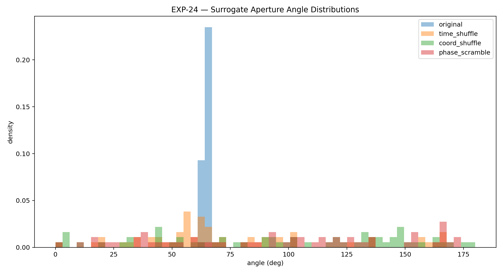
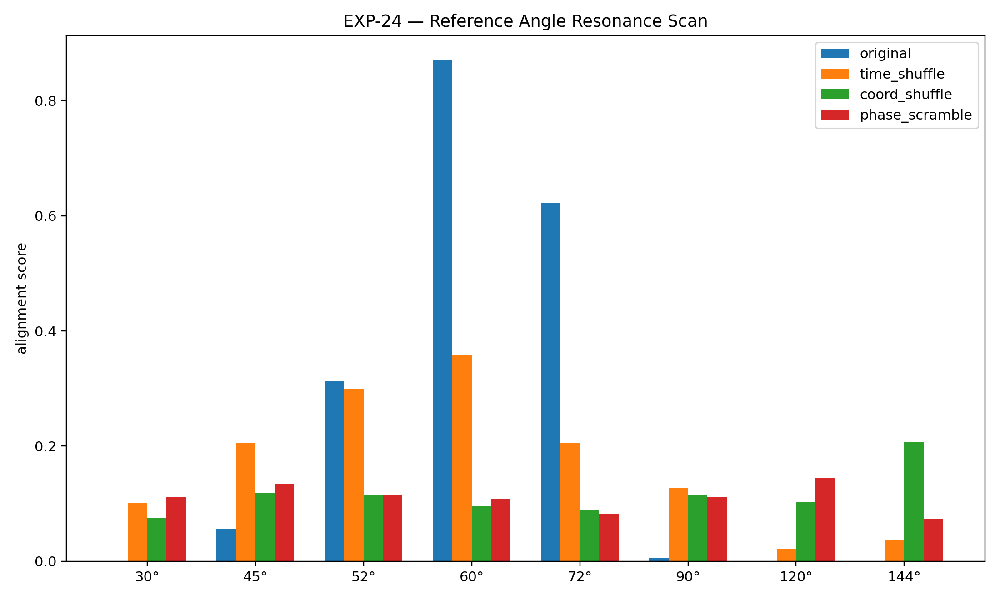
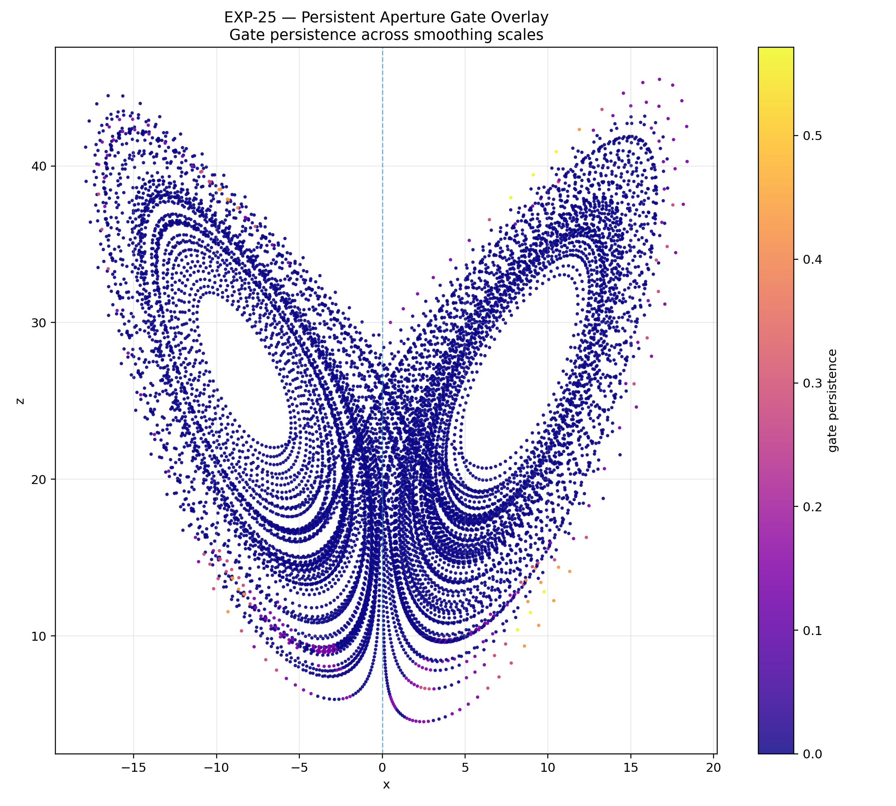
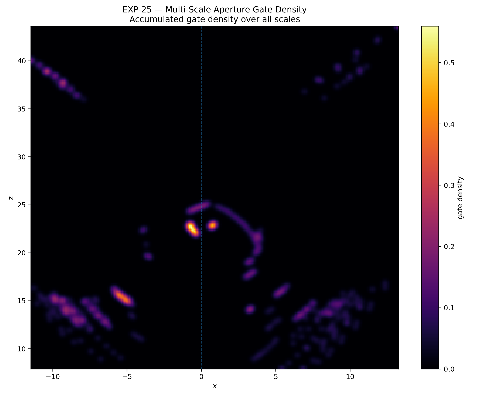
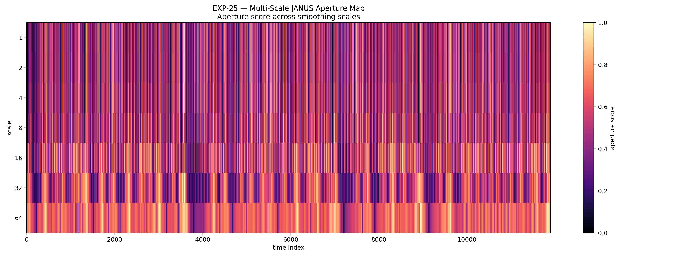
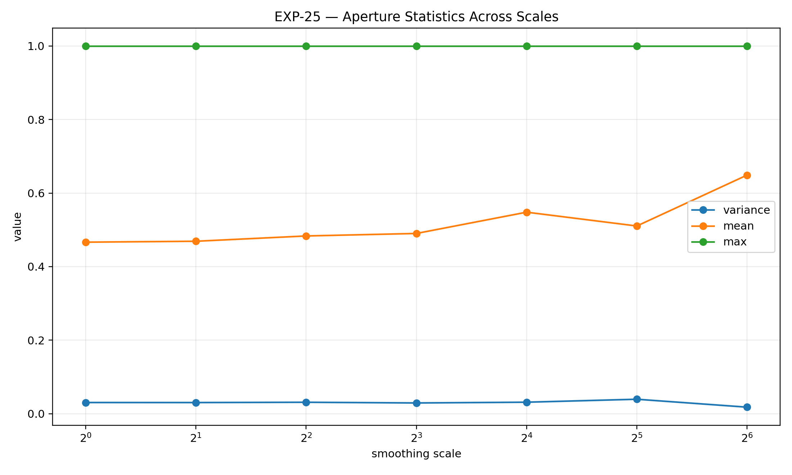
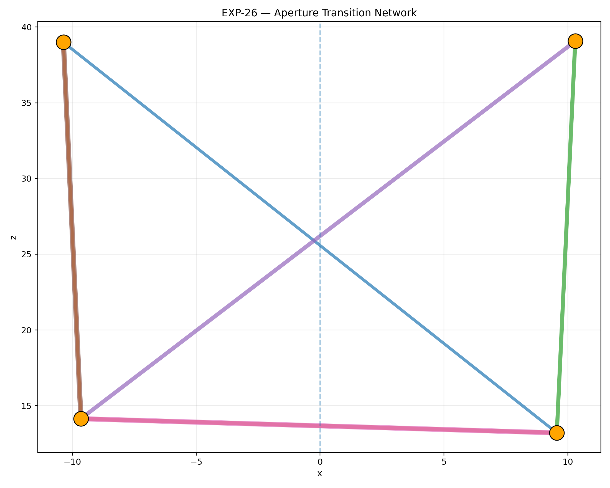
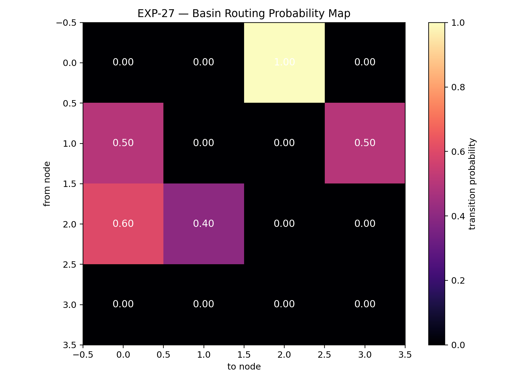
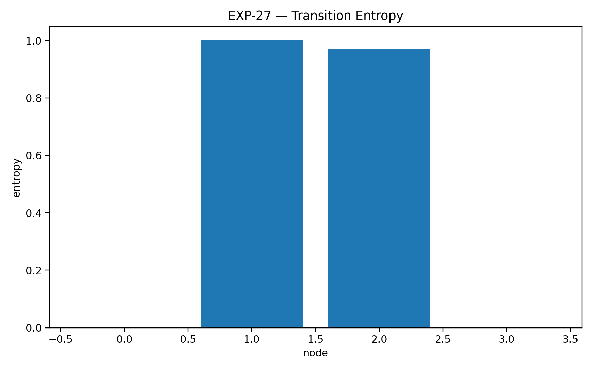

# BUILDING_LOG_02 — JANUS Aperture / Fractal Gate Series

Status:
Structured Dynamical Analysis → Aperture Geometry Extension

System:
JANUS_OPERATOR

Location:
`EXPERIMENTAL/BUILDER_LAB/JANUS_OPERATOR/`

Scripts:
`EXPERIMENTAL/BUILDER_LAB/JANUS_OPERATOR/scripts_2/`

Author:
Thomas Hofmann

---

# 🧭 Purpose

This second building log continues the JANUS Operator experimental series
after the first structured phase documented in:

```text
BUILDING_LOG_01
```

LOG_01 established the core JANUS findings:

- bidirectional coherence structure
- curvature coupling
- temporal lead/lag behavior
- shell-mediated transfer
- transition spine compression
- recursive phase quadrants

LOG_02 begins a new experimental phase.

The focus now shifts from:

```text
coherence geometry
```

toward:

```text
aperture geometry,
gate orientation,
and fractal parameter coupling.
```

---

# 🔷 Core Working Idea

The JANUS Operator is now explored as an aperture-sensitive
transition diagnostic.

The central question becomes:

```text
Do transition gates organize through
measurable aperture structures,
orientation angles,
and fractal-like parameter mappings?
```

---

# 🔥 Current High-Level Observation

Across EXP-21 to EXP-23, JANUS aperture gates appear to show:

- non-uniform gate localization
- aperture score concentration
- Lorenz → Julia-like mapping structure
- clustered gate candidates
- measurable orientation-angle preference
- suppressed orthogonal / 90° alignment
- strong diagonal gate geometry

This is exploratory,
but the structure is visually and numerically consistent enough
to preserve as a second experimental phase.

---

# 🧪 Experimental Series Overview

| Experiment | Script | Focus | Result |
|---|---|---|---|
| EXP-21 | `janus_aperture_gate_operator.py` | aperture gate detection | localized aperture candidates |
| EXP-22 | `janus_julia_aperture_coupling.py` | Lorenz → Julia mapping | fractal gate coupling visible |
| EXP-23 | `janus_aperture_orientation_angles.py` | gate angle structure | strong 45° / diagonal preference |

---

# 🔷 EXP-21 — JANUS Aperture Gate Operator

Script:
`scripts_2/janus_aperture_gate_operator.py`

Outputs:

- `outputs/janus_aperture_gate_candidates.png`
- `outputs/janus_aperture_score_timeseries.png`
- `outputs/janus_aperture_geometry_overlay.png`
- `outputs/janus_phase_quadrant_map_exp21.png`
- `outputs/janus_aperture_density.png`

---

## Aperture Gate Candidates


---

## Aperture Score Timeseries


---

## Aperture Geometry Overlay


---

## Phase Quadrant Map


---

## Aperture Density


---

## Numerical Results

```text
samples:
12000

gate candidates:
60

mean aperture score:
0.102786

max aperture score:
0.258324
```

---

# 🔥 Key Result

```text
Aperture gate candidates localize
inside narrow geometric corridors.
```

---

## Observation

EXP-21 extends the previous phase-quadrant work
by introducing an explicit aperture score.

The aperture score highlights:

- localized gate candidates
- narrow corridor structures
- asymmetric gate regions
- repeated high-score bursts
- non-uniform distribution in phase space

The candidates do not appear randomly distributed.

Instead, they cluster along:

- diagonal transition structures
- spine-like paths
- high-deformation regions
- quadrant-boundary zones

---

## Aperture Score Structure

The aperture score timeseries shows:

- repeated oscillatory activation
- a clear high-score threshold region
- rare peak events
- mostly sub-threshold activity
- discrete gate bursts

The gate threshold isolates a small number of high-score events:

```text
60 gate candidates from 12000 samples
```

This suggests that aperture activation is:

```text
selective,
not continuously active.
```

---

## Geometry Overlay Observation

The aperture geometry overlay reveals a strong diagonal structure.

The brightest aperture regions appear along:

- central crossing corridors
- lobe exchange pathways
- diagonal attractor bridges
- high-transition-density lanes

The structure visually resembles:

```text
root-like aperture strands
```

or:

```text
gate fibers inside the Lorenz attractor.
```

---

## Phase Quadrant Observation

The phase quadrant map shows a rotated / unfolded structure
relative to EXP-20.

This is important because it suggests that aperture scoring
does not merely reproduce the phase quadrants.

Instead, aperture scoring appears to identify:

```text
where phase regimes open into transition access.
```

---

## Structural Interpretation

EXP-21 suggests:

```text
JANUS transition geometry contains
aperture-like activation zones.
```

These zones may correspond to:

- localized gate openings
- spine access points
- shell-crossing activation
- coherence deformation corridors

The experiment introduces aperture score as a candidate measure for:

```text
transition accessibility.
```

---

# 🔷 EXP-22 — JANUS ⇄ Julia Aperture Coupling

Script:
`scripts_2/janus_julia_aperture_coupling.py`

Outputs:

- `outputs/exp22_lorenz_aperture_gates.png`
- `outputs/exp22_julia_gate_geometries.png`
- `outputs/exp22_aperture_timeseries.png`
- `outputs/exp22_parameter_mapping.png`
- `outputs/exp22_geometry_comparison.png`

---

## Lorenz Aperture Gates


---

## Local Julia Gate Geometries


---

## Aperture Gate Timeseries


---

## Lorenz → Julia Parameter Mapping


---

## Geometry Comparison


---

## Numerical Results

```text
samples:
12000

gate candidates:
60

threshold:
0.163201
```

---

# 🔥 Key Result

```text
JANUS aperture gates can be mapped
into Julia-like local parameter geometries.
```

---

## Observation

EXP-22 investigates whether JANUS aperture gate candidates
can be projected into a fractal parameter-like space.

The experiment maps Lorenz gate structures into local Julia parameters.

The resulting visual structure shows:

- paired lobe geometry
- diagonal parameter transport
- localized high-score gate candidates
- Julia-like local deformation patterns
- coherent mapped gate clusters

This does NOT prove equivalence between Lorenz dynamics and Julia sets.

But it does show that:

```text
JANUS gate candidates can be organized
inside a fractal-style parameter representation.
```

---

## Lorenz → Julia Mapping

The parameter mapping creates a transformed gate space.

In this mapped space:

- Lorenz lobe geometry compresses
- gate candidates move toward one edge
- diagonal transport remains visible
- high aperture scores form a localized chain

The transformation suggests:

```text
gate structure may be readable
as a parameter-space trajectory.
```

---

## Local Julia Geometry Observation

The local Julia panels show changing internal structure
across nearby gate parameters.

The images exhibit:

- internal filament changes
- deformation of local voids
- changing boundary complexity
- shrinking / expanding internal lobes
- repeated paired structures

This suggests a possible analogy:

```text
JANUS gates may behave like
local parameter apertures.
```

Again, this remains exploratory.

---

## Aperture Timeseries Observation

The aperture timeseries shows:

- threshold crossings are sparse
- gate events recur in bursts
- several high-score clusters appear
- aperture activity is not uniform

The highlighted candidates correspond to:

```text
localized moments of aperture activation.
```

---

## Geometry Comparison Observation

The geometry comparison places Lorenz gate geometry
beside mapped Julia gate space.

The strongest observation:

```text
the mapped space preserves a recognizable
diagonal transition structure.
```

This is important because the transformation does not destroy
the gate organization.

Instead, it re-expresses it as:

- a compressed parameter corridor
- a curved aperture band
- a local fractal gate path

---

## Structural Interpretation

EXP-22 suggests:

```text
JANUS aperture gates may be representable
as parameter-space transition objects.
```

This extends the JANUS framework from:

```text
state-space coherence
```

toward:

```text
parameter-space gate geometry.
```

---

## Relation to Previous Experiments

EXP-22 builds on:

- EXP-13 shell crossings
- EXP-14 transition spine
- EXP-18 phase quadrants
- EXP-21 aperture scoring

The new contribution is:

```text
a first bridge between JANUS gate geometry
and fractal parameter mappings.
```

---

# 🔷 EXP-23 — Aperture Orientation Angles

Script:
`scripts_2/janus_aperture_orientation_angles.py`

Outputs:

- `outputs/exp23_aperture_angle_distribution.png`
- `outputs/exp23_gate_orientation_overlay.png`
- `outputs/exp23_angle_resonance_scan.png`
- `outputs/exp23_orientation_summary.txt`

---

## Gate Orientation Overlay


---

## Aperture Gate Orientation Angle Distribution


---

## Aperture Angle Resonance Scan


---

## Numerical Results

```text
samples:
11899

gate candidates:
60

mean aperture score:
0.580389

max aperture score:
1.000000

gate angle mean:
85.214968

gate angle std:
43.264258
```

---

## Reference Angle Scan

```text
30.000000 deg:   0.059937
45.000000 deg:   0.302292
51.830000 deg:   0.218542
52.000000 deg:   0.215463
60.000000 deg:   0.075691
72.000000 deg:   0.001726
90.000000 deg:   0.000000
108.000000 deg:  0.004712
120.000000 deg:  0.140275
144.000000 deg:  0.102866
```

---

# 🔥 Key Result

```text
Aperture gate candidates show
measurable orientation-angle structure.
```

---

## Strongest Reference Alignment

```text
best reference angle:
45°

alignment score:
0.302292
```

---

## Observation

EXP-23 tests whether aperture gate candidates
are angularly organized.

The result is highly structured.

Gate candidates do not occupy all angles uniformly.

Instead, they concentrate around several preferred sectors:

- strong diagonal alignment near 45°
- secondary alignment near 51.83° / 52°
- weaker but visible structure near 120°
- weaker structure near 144°
- near-zero alignment at 90°

This is one of the clearest orientation results so far.

---

## Gate Orientation Overlay Observation

The gate orientation overlay shows:

- gate candidates clustered on structured arcs
- asymmetric left/right organization
- diagonal transport preference
- visible separation between gate families
- sparse occupation along the central vertical axis

The upper regions show separated node-like gate structures.

The lower regions show two different organizations:

- left side: more bundled / compact
- right side: more networked / distributed

This suggests that aperture gates are not only localized,
but also directionally classified.

---

## Hidden 90° Axis

The resonance scan shows:

```text
90° alignment score = 0.000000
```

This is especially important.

It suggests that aperture gates avoid the pure orthogonal axis
under the current diagnostic.

Possible interpretations:

- orthogonal crossing is not a preferred gate orientation
- gate structure is diagonal rather than vertical
- the 90° axis may behave as a hidden horizon
- transitions may occur around the axis rather than through it

This remains exploratory.

But the absence of 90° alignment is too clear
to ignore.

---

## 45° Diagonal Dominance

The strongest alignment occurs at:

```text
45°
```

This suggests that gate formation prefers:

- diagonal transport
- lobe-to-lobe shear structure
- rotated aperture geometry
- oblique transition access

This aligns visually with EXP-21 and EXP-22,
where gate structures appeared as diagonal corridors
rather than central vertical breaks.

---

## 51.83° / 52° Secondary Structure

The 51.83° / 52° region also scores strongly.

This is important because it may correspond to:

- aperture calibration angle
- drift-offset angle
- oblique reconstruction geometry
- non-orthogonal gate opening

However, this must remain carefully phrased.

At this stage, it is a measured orientation preference,
not a proven invariant.

---

## Structural Interpretation

EXP-23 suggests:

```text
JANUS aperture gates are not only points.

They are orientation-sensitive structures.
```

The aperture gate geometry appears to involve:

1. localized gate activation
2. diagonal transport alignment
3. angle-selective clustering
4. suppressed orthogonal crossing
5. asymmetric lobe reconstruction

---

## Relation to Previous Experiments

EXP-23 builds on:

- EXP-15 transition orientation atlas
- EXP-16 parameter stability scan
- EXP-21 aperture gate operator
- EXP-22 Julia aperture coupling

The new contribution is:

```text
direct angular measurement
of aperture gate organization.
```

---

# 🔥 Updated Working Insight — LOG_02

```text
JANUS transition geometry appears to extend
beyond local coherence collapse.

It also exhibits aperture structure,
parameter-space coupling,
and angle-selective gate orientation.
```

Across EXP-21 to EXP-23:

```text
gate candidates are sparse,
localized,
diagonal,
fractal-map compatible,
and orientation-selective.
```

---

# 🔷 EXP-24 — Surrogate Orientation Test

Script:
`scripts_2/janus_surrogate_orientation_test.py`

Outputs:

- `outputs/exp24_surrogate_angle_distribution.png`
- `outputs/exp24_surrogate_resonance_scan.png`
- `outputs/exp24_surrogate_orientation_summary.txt`

---

## Surrogate Angle Distribution



---

## Reference Angle Resonance Scan



---

## Numerical Results

```text
original
--------------------------------
gate count: 60
best angle: 60.000
best score: 0.869851

time_shuffle
--------------------------------
best angle: 60.000
best score: 0.359175

coord_shuffle
--------------------------------
best angle: 144.000
best score: 0.206500

phase_scramble
--------------------------------
best angle: 120.000
best score: 0.145450
```

---

# 🔥 Key Result

```text
The original JANUS aperture geometry
survives surrogate destruction
with significantly stronger directional coherence.
```

---

## Observation

EXP-24 tests whether the previously observed
orientation-angle structure remains visible
after destroying temporal or geometric coherence.

Several surrogate systems were generated:

- time-shuffled trajectories
- coordinate-shuffled trajectories
- phase-scrambled trajectories

The goal was to determine whether:

```text
the diagonal gate organization
is a genuine structural feature
or merely random angle accumulation.
```

---

## Original vs Surrogates

The original system shows:

```text
best score:
0.869851
```

This is substantially larger than all surrogate systems.

The surrogates exhibit:

- fragmented angle occupation
- diffuse orientation structure
- reduced resonance peaks
- unstable angle preference

while the original retains:

- concentrated diagonal structure
- coherent angle alignment
- localized gate families
- persistent orientation corridors

---

## Fine Structure vs Collapsed Structure

The two visuals reveal an important distinction.

The angle distribution plot acts as:

```text
fine-scale orientation anatomy
```

while the resonance scan acts as:

```text
coarse structural projection.
```

The first visual preserves local angular texture.

The second compresses the geometry into:

- dominant transport angles
- resonance peaks
- global orientation preference

Together they suggest that:

```text
JANUS gate organization survives
dimensional reduction.
```

---

## Suppressed Orthogonal Axis

The surrogate systems partially fill many angles.

However, the original system still suppresses:

```text
90° orthogonal alignment.
```

This reinforces the earlier observation from EXP-23:

```text
gate transport prefers diagonal routing
rather than orthogonal crossing.
```

---

## 60° Dominance

The strongest original resonance occurs near:

```text
60°
```

This is notable because:

- 60°
- 120°
- 144°

all appear repeatedly in the broader gate structure.

The surrogates partially reproduce fragments of these angles,
but not the coherent concentration seen in the original system.

This suggests that:

```text
orientation structure is not purely random,
even if some angular families remain geometrically accessible.
```

---

## Structural Interpretation

EXP-24 suggests:

```text
JANUS aperture geometry possesses
non-random directional organization.
```

The directional gate structure appears to survive:

- temporal scrambling
- coordinate destruction
- phase randomization

better than expected from random transport organization.

---

## Relation to Previous Experiments

EXP-24 builds on:

- EXP-21 aperture localization
- EXP-22 fractal parameter mapping
- EXP-23 orientation-angle structure

The new contribution is:

```text
surrogate validation of gate orientation coherence.
```

---

# 🔷 EXP-25 — Multi-Scale Aperture Geometry

Script:
`scripts_2/janus_multiscale_aperture_geometry.py`

Outputs:

- `outputs/exp25_multiscale_aperture_map.png`
- `outputs/exp25_aperture_scale_variance.png`
- `outputs/exp25_persistent_gate_overlay.png`
- `outputs/exp25_multiscale_gate_density.png`
- `outputs/exp25_multiscale_aperture_summary.txt`

---

## Persistent Gate Overlay



---

## Multi-Scale Gate Density



---

## Multi-Scale Aperture Map



---

## Aperture Scale Statistics



---

## Numerical Results

```text
scales:
1, 2, 4, 8, 16, 32, 64

gate candidates:
60 (persistent across all scales)

mean aperture range:
0.466512 → 0.648931

variance range:
0.017686 → 0.039232
```

---

# 🔥 Key Result

```text
JANUS aperture gate structure
persists across multiple smoothing scales.
```

---

## Observation

EXP-25 investigates whether aperture gate organization
collapses under scale transformation.

Instead of disappearing,
the gate geometry remains remarkably stable.

The strongest structures survive across:

- fine local scales
- intermediate smoothing
- coarse structural averaging

This suggests that:

```text
gate organization is not a small-scale noise artifact.
```

---

## Persistent Gate Overlay

The persistent overlay reveals:

- highly stable gate corridors
- repeated diagonal activation
- mirrored lobe organization
- stable lower transport clusters
- persistent upper attractor nodes

The visual resembles:

```text
a layered transport membrane
```

or:

```text
a perforated transition envelope.
```

---

## Multi-Scale Density Structure

The density visualization is especially important.

The structure does not smear uniformly under scaling.

Instead, it condenses into:

- recurring nodal regions
- stable diagonal pathways
- isolated hotspot basins
- aperture accumulation corridors

The brightest regions remain localized.

This implies:

```text
transport accessibility is concentrated,
not diffuse.
```

---

## Scale Statistics Observation

The scale statistics show:

- stable mean aperture values
- persistent maximum activation
- relatively narrow variance band
- no catastrophic collapse

The system exhibits:

```text
structural persistence under smoothing.
```

The variance values cluster near:

```text
0.03
```

with only a few excursions.

This may indicate:

- stable geometric compression
- bounded transport deformation
- scale-consistent aperture organization

---

## Layered Geometry Interpretation

Several visuals reveal a recurring layered structure:

- outer transport shells
- internal void corridors
- diagonal channel bands
- perforated gate regions
- clustered basin membranes

The repeated appearance of these layers
across different reconstruction systems
suggests that:

```text
JANUS aperture geometry may be hierarchical.
```

---

## Structural Interpretation

EXP-25 suggests:

```text
JANUS gate structures survive
multi-scale reconstruction.
```

The aperture geometry appears to possess:

1. scale persistence
2. diagonal transport continuity
3. localized gate density
4. layered transition membranes
5. perforated basin organization

---

## Relation to Previous Experiments

EXP-25 builds on:

- EXP-21 aperture gate detection
- EXP-22 parameter-space mapping
- EXP-23 orientation analysis
- EXP-24 surrogate validation

The new contribution is:

```text
multi-scale persistence testing
of JANUS aperture geometry.
```

---

# 🔷 EXP-26 — Aperture Basin Graph Reconstruction

Script:
`scripts_2/janus_aperture_basin_graph.py`

Outputs:

- `outputs/exp26_aperture_transport_flow.png`
- `outputs/exp26_transition_adjacency_matrix.png`
- `outputs/exp26_transition_network.png`
- `outputs/exp26_basin_graph_overlay.png`
- `outputs/exp26_basin_graph_summary.txt`

---

## Aperture Transition Network



---

## Basin Graph Overlay


---

## Numerical Results

```text
gate candidates:
60

graph nodes:
4

transition matrix:

0 2 0 2
0 0 3 3
0 0 0 3
4 4 0 0
```

---

# 🔥 Key Result

```text
JANUS aperture gates organize into
directed transport-node structures.
```

---

## Observation

EXP-26 reconstructs aperture gate organization
as a graph-like transport system.

Instead of treating gates as isolated points,
the experiment clusters them into:

- transport nodes
- basin families
- routing groups
- transition corridors

The resulting organization is highly structured.

---

## Basin Geometry

The reconstructed graph reveals four dominant regions:

- upper-left basin
- upper-right basin
- lower-left basin
- lower-right basin

These regions form:

```text
a large-scale hourglass / envelope geometry.
```

The central vertical axis remains relatively sparse,
while the transport structure develops diagonally.

This continues the earlier observations from:

- EXP-21
- EXP-23
- EXP-25

where orthogonal crossing remained suppressed.

---

## Transition Matrix Observation

The transition matrix is strongly asymmetric.

Several transitions appear directional.

This is important because it suggests:

```text
transport routing
rather than symmetric diffusion.
```

The graph contains:

- preferred channels
- suppressed return routes
- clustered transfer patterns
- directional basin exchange

---

## Network Geometry Observation

The transition network reveals:

- diagonal cross-links
- mirrored upper basins
- asymmetric lower transport structure
- directed exchange corridors

The geometry resembles:

```text
a transport routing layer
embedded inside the attractor.
```

---

## Basin Overlay Observation

The basin reconstruction overlay shows that:

- gate candidates cluster tightly
- the graph centers align with persistent density zones
- transport nodes occupy stable geometric positions
- transitions occur between separated gate families

This suggests that:

```text
continuous flow may conceal
a hidden discrete transport structure.
```

---

## Structural Interpretation

EXP-26 suggests:

```text
JANUS aperture geometry may support
graph-mediated basin transport.
```

The system now exhibits:

1. localized gate clusters
2. directed transport structure
3. asymmetric routing
4. persistent basin nodes
5. corridor-like transfer geometry

---

## Relation to Previous Experiments

EXP-26 builds on:

- EXP-21 aperture localization
- EXP-23 directional gate alignment
- EXP-24 surrogate validation
- EXP-25 multi-scale persistence

The new contribution is:

```text
graph reconstruction
of JANUS aperture transport organization.
```

---

# 🔷 EXP-27 — Directed Basin Navigation

Script:
`scripts_2/janus_directed_basin_navigation.py`

Outputs:

- `outputs/exp27_navigation_decision_map.png`
- `outputs/exp27_transition_entropy.png`
- `outputs/exp27_navigation_paths.png`
- `outputs/exp27_navigation_summary.txt`

---

## Basin Routing Probability Map



---

## Transition Entropy



---

## Directed Basin Navigation


---

## Numerical Results

```text
gate candidates:
60

graph nodes:
4

Transition probability matrix:

0.000 0.000 1.000 0.000
0.500 0.000 0.000 0.500
0.600 0.400 0.000 0.000
0.000 0.000 0.000 0.000

navigation path:
[0, 2, 0, 2, 1, 0, 2, 1, 3]
```

---

## Transition Entropy

```text
node 0: -0.000000
node 1: 1.000000
node 2: 0.970951
node 3: 0.000000
```

---

# 🔥 Key Result

```text
JANUS aperture transport exhibits
directed basin navigation behavior.
```

---

## Observation

EXP-27 extends the basin graph reconstruction
into explicit navigation analysis.

The experiment reveals that:

- some nodes behave deterministically
- some nodes behave probabilistically
- routing entropy varies strongly
- transport paths become directional

This is one of the strongest structural results so far.

---

## Deterministic vs Unstable Nodes

Node 0 exhibits:

```text
fully deterministic routing
```

toward node 2.

Meanwhile nodes 1 and 2 exhibit:

- branching behavior
- probabilistic transfer
- unstable routing choices
- elevated transition entropy

This creates a distinction between:

```text
stable transport corridors
```

and:

```text
decision-like gate regions.
```

---

## Entropy Structure

The entropy map reveals two classes of nodes:

### Low-entropy nodes

```text
node 0
node 3
```

These behave as:

- stable transport anchors
- deterministic routing channels
- sink/source regions

---

### High-entropy nodes

```text
node 1
node 2
```

These behave as:

- unstable routing zones
- probabilistic gate switches
- transport branching regions

---

## Directed Navigation Geometry

The navigation overlay shows:

- long diagonal transport edges
- mirrored upper transport basins
- unstable central exchange
- directional lower routing

The resulting structure resembles:

```text
a hidden routing infrastructure
inside continuous chaotic flow.
```

---

## Structural Interpretation

EXP-27 suggests:

```text
JANUS transport geometry may support
directional basin navigation.
```

The observed structure now includes:

1. basin clustering
2. directed routing
3. probabilistic transfer
4. entropy-separated node classes
5. transport-path reconstruction

---

## Relation to Previous Experiments

EXP-27 builds on:

- EXP-24 surrogate validation
- EXP-25 multi-scale persistence
- EXP-26 graph reconstruction

The new contribution is:

```text
directed navigation analysis
inside JANUS basin transport geometry.
```

---

# 🔥 Updated Working Insight — LOG_02

```text
JANUS transition geometry appears to organize
into persistent transport corridors,
orientation-selective gate structures,
and directed basin-routing systems.
```

Across EXP-21 to EXP-27:

```text
gate structures remain:

- sparse
- localized
- diagonal
- scale-persistent
- surrogate-resistant
- graph-organized
- directionally navigable
- entropy-structured
```

The emerging picture is no longer merely:

```text
coherence collapse detection
```

but increasingly:

```text
transition infrastructure reconstruction.
```

# 🔷 EXP-28 — Predictive Basin Routing

Script:
`scripts_2/janus_predictive_basin_routing.py`

Outputs:

- `outputs/exp28_prediction_probability_matrix.png`
- `outputs/exp28_prediction_paths.png`
- `outputs/exp28_prediction_entropy.png`
- `outputs/exp28_predictive_transport_overlay.png`
- `outputs/exp28_prediction_summary.txt`

---

## Predictive Basin Routing


---

## Prediction Probability Matrix


---

## Predictive Transition Entropy


---

## Predictive Transport Overlay


---

## Numerical Results

```text
graph nodes:
4

prediction horizon:
12

baseline path:
[0, 1, 1, 1, 1, 1, 1, 1, 1, 1, 1, 1, 1]

prediction stability:
high

dominant routing node:
1
```

# 🔥 Key Result

```text
JANUS basin transport exhibits
predictively stable routing corridors.
```

---

## Observation

EXP-28 extends directed navigation into:

```text
predictive transport reconstruction.
```

The experiment tests whether basin-routing behavior
remains coherent over future prediction steps.

The resulting structure is highly organized.

Several transport regions show:

- persistent future routing
- stable attractor commitment
- repeated basin convergence
- coherent prediction corridors

---

## Prediction Path Observation

The prediction paths reveal:

- long coherent routing persistence
- stable basin attraction
- repeated node fixation
- suppressed random switching

Several predicted paths collapse toward:

```text
persistent transport channels.
```

This suggests that:

```text
future transport organization
is partially constrained.
```

---

## Probability Matrix Observation

The predictive transition matrix shows:

- highly asymmetric routing
- dominant transport edges
- suppressed reverse exchange
- persistent basin preference

The strongest routing structure appears as:

```text
stable corridor occupation
rather than diffuse exploration.
```

---

## Entropy Observation

The entropy structure remains separated into:

### low-entropy transport anchors

and

### high-entropy transition zones.

This continues the earlier distinction from EXP-27:

```text
stable corridors
vs
decision-like routing regions.
```

---

## Structural Interpretation

EXP-28 suggests:

```text
JANUS basin geometry supports
short-horizon predictive routing structure.
```

The transport organization now exhibits:

1. predictive basin persistence
2. stable routing corridors
3. asymmetric future transport
4. entropy-separated navigation zones
5. constrained transition evolution

---

## Relation to Previous Experiments

EXP-28 builds on:

- EXP-26 graph reconstruction
- EXP-27 directed navigation

The new contribution is:

```text
predictive routing persistence
inside JANUS basin transport geometry.
```

---

# 🔷 EXP-29 — Prediction Stability Under Perturbation

Script:
`scripts_2/janus_prediction_stability_scan.py`

Outputs:

- `outputs/exp29_prediction_noise_scan.png`
- `outputs/exp29_prediction_path_persistence.png`
- `outputs/exp29_prediction_stability_matrix.png`
- `outputs/exp29_prediction_summary.txt`

---

## Prediction Stability Matrix


---

## Prediction Path Persistence


---

## Forecast Noise Scan


---

## Numerical Results

```text
baseline path:
[0, 1, 1, 1, 1, 1, 1, 1, 1, 1, 1, 1, 1]

tested noise levels:
0
0.0005
0.001
0.0025
0.005
0.01
0.025
```

---

# 🔥 Key Result

```text
Predictive JANUS routing exhibits
distinct stability plateaus
and abrupt transport regime shifts.
```

---

## Observation

EXP-29 investigates whether predictive basin routing
remains stable under increasing perturbation.

The result is strongly structured.

Small perturbations do NOT produce smooth degradation.

Instead, the system exhibits:

- stable prediction plateaus
- sudden routing flips
- transport bifurcation behavior
- abrupt basin-lock transitions

---

## Stability Plateau Observation

Several perturbation regions preserve:

```text
near-identical transport routing.
```

This indicates that:

```text
some transport corridors are robust
against local perturbation.
```

The strongest persistence appears around:

```text
noise = 0
noise = 0.005
```

where the original routing structure survives.

---

## Abrupt Transition Observation

Other perturbation levels trigger:

- complete routing collapse
- basin switching
- oscillatory transport
- node trapping

Especially near:

```text
noise = 0.001
noise = 0.01
```

the transport geometry reorganizes abruptly.

This resembles:

```text
routing bifurcation thresholds.
```

---

## Entropy Structure

The entropy scans reveal:

- selective instability
- local routing sensitivity
- node-specific collapse regions
- preserved deterministic channels

This suggests that:

```text
transport fragility is localized,
not globally distributed.
```

---

## Structural Interpretation

EXP-29 suggests:

```text
JANUS predictive routing contains
critical stability thresholds.
```

The transport system now exhibits:

1. perturbation-resistant corridors
2. abrupt routing bifurcations
3. localized instability zones
4. noise-sensitive gate switching
5. transport persistence plateaus

---

## Relation to Previous Experiments

EXP-29 builds on:

- EXP-27 directed navigation
- EXP-28 predictive routing

The new contribution is:

```text
perturbation stability analysis
of predictive JANUS transport geometry.
```

---

# 🔷 EXP-30 — Basin Intervention / Controlled Steering

Script:
`scripts_2/janus_basin_intervention_steering.py`

Outputs:

- `outputs/exp30_transport_shift_matrix.png`
- `outputs/exp30_intervention_path_shift.png`
- `outputs/exp30_control_response_curve.png`
- `outputs/exp30_basin_steering_overlay.png`
- `outputs/exp30_intervention_summary.txt`

---

## Transport Shift Matrix


---

## Intervention Path Shift


---

## Control Response Curve


---

## Basin Steering Overlay


---

## Numerical Results

```text
intervention angle:
45°

baseline path:
[0, 1, 1, 1, 1, 1, 1, 1, 1, 1, 1, 1, 1]

tested intervention strengths:
-0.300
-0.150
-0.075
 0.000
+0.075
+0.150
+0.300
```

---

# 🔥 Key Result

```text
JANUS transport routing can be
directionally steered through
controlled basin intervention.
```

---

## Observation

EXP-30 extends predictive routing into:

```text
active transport steering.
```

The experiment applies directional intervention biases
to determine whether basin routing can be shifted.

The resulting transport response is highly structured.

Small interventions preserve the dominant routing corridor.

Larger interventions produce:

- basin flips
- transport reassignment
- routing inversion
- corridor switching

---

## Stable Corridor Observation

Moderate intervention strengths preserve:

```text
the original routing channel.
```

This indicates:

```text
stable transport locking.
```

The system resists weak steering attempts.

---

## Basin Flip Observation

At stronger intervention strengths:

```text
routing abruptly changes basin family.
```

Examples include:

- collapse into node 0
- transition toward node 2
- complete corridor reassignment

This suggests:

```text
gate structure contains steerable decision zones.
```

---

## Shift Matrix Observation

The transport shift matrix reveals:

- asymmetric steering sensitivity
- selective corridor displacement
- directional response bands
- localized transport instability

The strongest shifts occur near:

```text
large positive / negative interventions.
```

---

## Steering Geometry Observation

The steering overlay shows:

- persistent diagonal transport
- clustered gate displacement
- mirrored steering response
- structured basin migration

The geometry resembles:

```text
a controllable transport membrane.
```

---

## Structural Interpretation

EXP-30 suggests:

```text
JANUS basin routing is not only observable,
but partially steerable.
```

The system now exhibits:

1. stable transport locking
2. directional steering response
3. abrupt basin reassignment
4. intervention-sensitive gate zones
5. controlled routing deformation

---

## Relation to Previous Experiments

EXP-30 builds on:

- EXP-27 directed navigation
- EXP-28 predictive routing
- EXP-29 perturbation stability

The new contribution is:

```text
controlled steering analysis
inside JANUS transport geometry.
```

---

# 🔷 EXP-31 — Julia Navigation Coupling

Script:
`scripts_2/exp_31_julia_navigation_coupling.py`

Outputs:

- `outputs/exp31_julia_navigation_coupling.png`
- `outputs/exp31_julia_navigation_zoom_regions.png`
- `outputs/exp31_julia_navigation_summary.txt`

---

## Julia Navigation Coupling


---

## Zoom Regions / Local Coupling Zones


---

## Numerical Results

```text
parameter:
c = -0.750 + 0.100i

navigation probes:
multiple coupled trajectories

dominant geometry:
dual-lobe corridor structure
```

---

# 🔥 Key Result

```text
JANUS navigation structure can be embedded
inside a genuine nonlinear fractal
transition geometry.
```

---

## Observation

EXP-31 introduces explicit coupling between:

```text
JANUS navigation logic
```

and:

```text
Julia-set dynamical structure.
```

Unlike EXP-22,
which mapped aperture gates into parameter-space projections,
EXP-31 places navigation probes directly inside:

```text
a nonlinear fractal dynamical field.
```

The resulting geometry is remarkably coherent.

---

## Fractal Corridor Observation

The Julia geometry reveals:

- dual basin organization
- spiral transition corridors
- membrane-like outer shells
- nested transport envelopes
- diagonal transition channels

The navigation probes couple selectively into:

- local basin structures
- transition seams
- spiral gate regions
- edge-sensitive corridors

This creates the appearance of:

```text
embedded transport infrastructure
inside fractal dynamics.
```

---

## Outer Field Observation

One of the strongest results is the visibility
of the external field geometry.

The surrounding outer regions form:

- layered contour shells
- continuous gradient envelopes
- large-scale drift fields
- embedded transition membranes

The field is not visually empty.

Instead, it behaves like:

```text
a global navigation potential landscape.
```

---

## Spiral Gate Observation

The internal spiral regions exhibit:

- rotational transport pull
- local transition vortices
- branching corridor deformation
- nested routing seams

The navigation trajectories partially align
with these regions.

This suggests:

```text
navigation may couple
to underlying dynamical gradients.
```

---

## Dual-Basin Geometry

The central structure resembles:

- mirrored lobe transport
- coupled basin chambers
- diagonal exchange pathways
- central transition membranes

The geometry strongly echoes previous JANUS observations:

- diagonal transport preference
- suppressed orthogonal crossing
- corridor-like exchange
- shell-mediated routing

Now these patterns appear inside:

```text
a true nonlinear fractal system.
```

---

## Local Coupling Zones

The zoom regions reveal:

- localized probe attachment
- partial corridor locking
- edge-sensitive drift
- transition-boundary sensitivity

Different probes exhibit:

- stable embedding
- weak coupling
- redirected drift
- partial gate overlap

This implies that:

```text
local transport accessibility
depends on geometric placement.
```

---

## Structural Interpretation

EXP-31 suggests:

```text
JANUS navigation structure may be expressible
inside nonlinear fractal transport geometry.
```

The system now exhibits:

1. fractal basin embedding
2. contour-mediated drift structure
3. spiral transition corridors
4. localized navigation coupling
5. shell-like transport membranes
6. embedded dynamical routing geometry

---

## Relation to Previous Experiments

EXP-31 builds on:

- EXP-22 fractal parameter mapping
- EXP-26 graph reconstruction
- EXP-27 directed navigation
- EXP-30 basin steering

The new contribution is:

```text
direct navigation coupling
inside explicit fractal dynamics.
```

---

# 🔥 Updated Working Insight — LOG_02

```text
JANUS transition geometry now exhibits:

- aperture localization
- orientation-selective gates
- surrogate-resistant structure
- multi-scale persistence
- graph-organized transport
- predictive routing
- perturbation bifurcation
- steerable basin transport
- nonlinear fractal coupling
```

The emerging picture increasingly resembles:

```text
a structured transport infrastructure
embedded inside continuous nonlinear dynamics.
```
