# BUILDING_LOG_02 — JANUS Aperture / Fractal Gate Series

Status:
Structured Dynamical Analysis → Aperture Geometry Extension

System:
JANUS_OPERATOR

Location:
`EXPERIMENTAL/BUILDER_LAB/JANUS_OPERATOR/`

Scripts:
`EXPERIMENTAL/BUILDER_LAB/JANUS_OPERATOR/scripts_2/`

Author:
Thomas Hofmann

---

# 🧭 Purpose

This second building log continues the JANUS Operator experimental series
after the first structured phase documented in:

```text
BUILDING_LOG_01
```

LOG_01 established the core JANUS findings:

- bidirectional coherence structure
- curvature coupling
- temporal lead/lag behavior
- shell-mediated transfer
- transition spine compression
- recursive phase quadrants

LOG_02 begins a new experimental phase.

The focus now shifts from:

```text
coherence geometry
```

toward:

```text
aperture geometry,
gate orientation,
and fractal parameter coupling.
```

---

# 🔷 Core Working Idea

The JANUS Operator is now explored as an aperture-sensitive
transition diagnostic.

The central question becomes:

```text
Do transition gates organize through
measurable aperture structures,
orientation angles,
and fractal-like parameter mappings?
```

---

# 🔥 Current High-Level Observation

Across EXP-21 to EXP-23, JANUS aperture gates appear to show:

- non-uniform gate localization
- aperture score concentration
- Lorenz → Julia-like mapping structure
- clustered gate candidates
- measurable orientation-angle preference
- suppressed orthogonal / 90° alignment
- strong diagonal gate geometry

This is exploratory,
but the structure is visually and numerically consistent enough
to preserve as a second experimental phase.

---

# 🧪 Experimental Series Overview

| Experiment | Script | Focus | Result |
|---|---|---|---|
| EXP-21 | `janus_aperture_gate_operator.py` | aperture gate detection | localized aperture candidates |
| EXP-22 | `janus_julia_aperture_coupling.py` | Lorenz → Julia mapping | fractal gate coupling visible |
| EXP-23 | `janus_aperture_orientation_angles.py` | gate angle structure | strong 45° / diagonal preference |

---

# 🔷 EXP-21 — JANUS Aperture Gate Operator

Script:
`scripts_2/janus_aperture_gate_operator.py`

Outputs:

- `outputs/janus_aperture_gate_candidates.png`
- `outputs/janus_aperture_score_timeseries.png`
- `outputs/janus_aperture_geometry_overlay.png`
- `outputs/janus_phase_quadrant_map_exp21.png`
- `outputs/janus_aperture_density.png`

---

## Aperture Gate Candidates

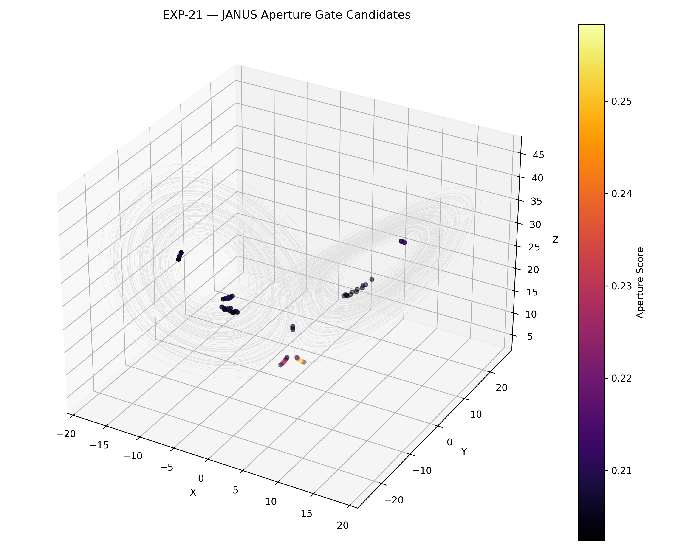

---

## Aperture Score Timeseries

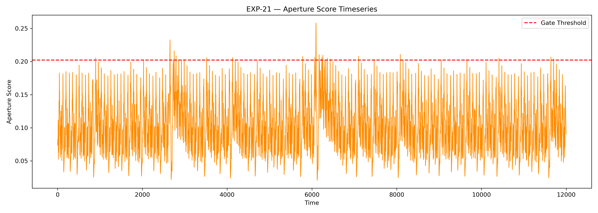

---

## Aperture Geometry Overlay

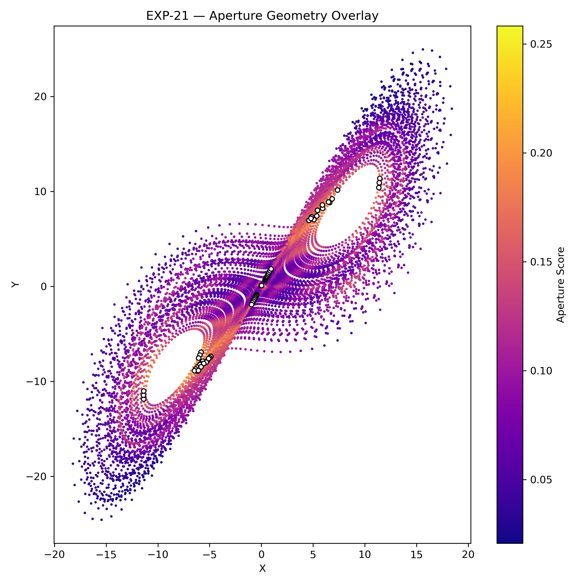

---

## Phase Quadrant Map

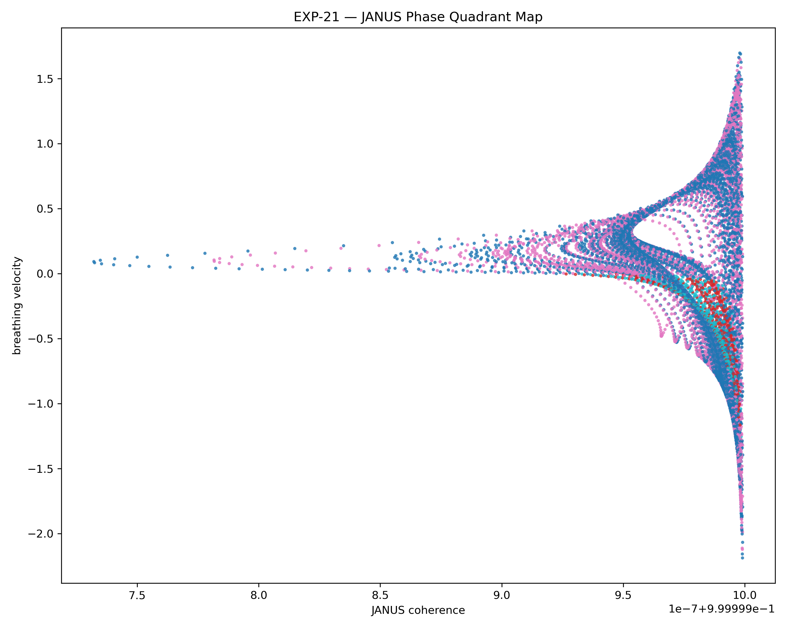

---

## Aperture Density

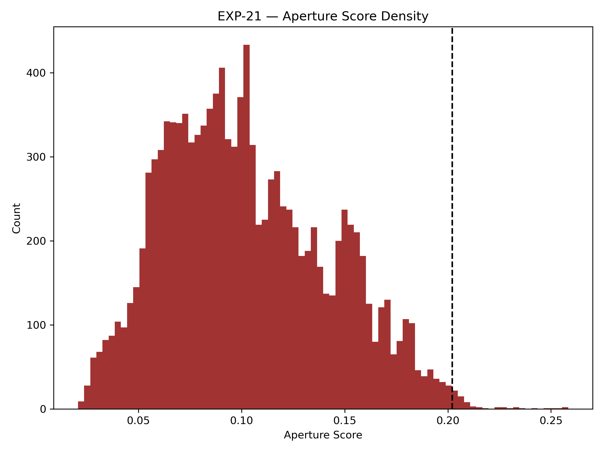

---

## Numerical Results

```text
samples:
12000

gate candidates:
60

mean aperture score:
0.102786

max aperture score:
0.258324
```

---

# 🔥 Key Result

```text
Aperture gate candidates localize
inside narrow geometric corridors.
```

---

## Observation

EXP-21 extends the previous phase-quadrant work
by introducing an explicit aperture score.

The aperture score highlights:

- localized gate candidates
- narrow corridor structures
- asymmetric gate regions
- repeated high-score bursts
- non-uniform distribution in phase space

The candidates do not appear randomly distributed.

Instead, they cluster along:

- diagonal transition structures
- spine-like paths
- high-deformation regions
- quadrant-boundary zones

---

## Aperture Score Structure

The aperture score timeseries shows:

- repeated oscillatory activation
- a clear high-score threshold region
- rare peak events
- mostly sub-threshold activity
- discrete gate bursts

The gate threshold isolates a small number of high-score events:

```text
60 gate candidates from 12000 samples
```

This suggests that aperture activation is:

```text
selective,
not continuously active.
```

---

## Geometry Overlay Observation

The aperture geometry overlay reveals a strong diagonal structure.

The brightest aperture regions appear along:

- central crossing corridors
- lobe exchange pathways
- diagonal attractor bridges
- high-transition-density lanes

The structure visually resembles:

```text
root-like aperture strands
```

or:

```text
gate fibers inside the Lorenz attractor.
```

---

## Phase Quadrant Observation

The phase quadrant map shows a rotated / unfolded structure
relative to EXP-20.

This is important because it suggests that aperture scoring
does not merely reproduce the phase quadrants.

Instead, aperture scoring appears to identify:

```text
where phase regimes open into transition access.
```

---

## Structural Interpretation

EXP-21 suggests:

```text
JANUS transition geometry contains
aperture-like activation zones.
```

These zones may correspond to:

- localized gate openings
- spine access points
- shell-crossing activation
- coherence deformation corridors

The experiment introduces aperture score as a candidate measure for:

```text
transition accessibility.
```

---

# 🔷 EXP-22 — JANUS ⇄ Julia Aperture Coupling

Script:
`scripts_2/janus_julia_aperture_coupling.py`

Outputs:

- `outputs/exp22_lorenz_aperture_gates.png`
- `outputs/exp22_julia_gate_geometries.png`
- `outputs/exp22_aperture_timeseries.png`
- `outputs/exp22_parameter_mapping.png`
- `outputs/exp22_geometry_comparison.png`

---

## Lorenz Aperture Gates

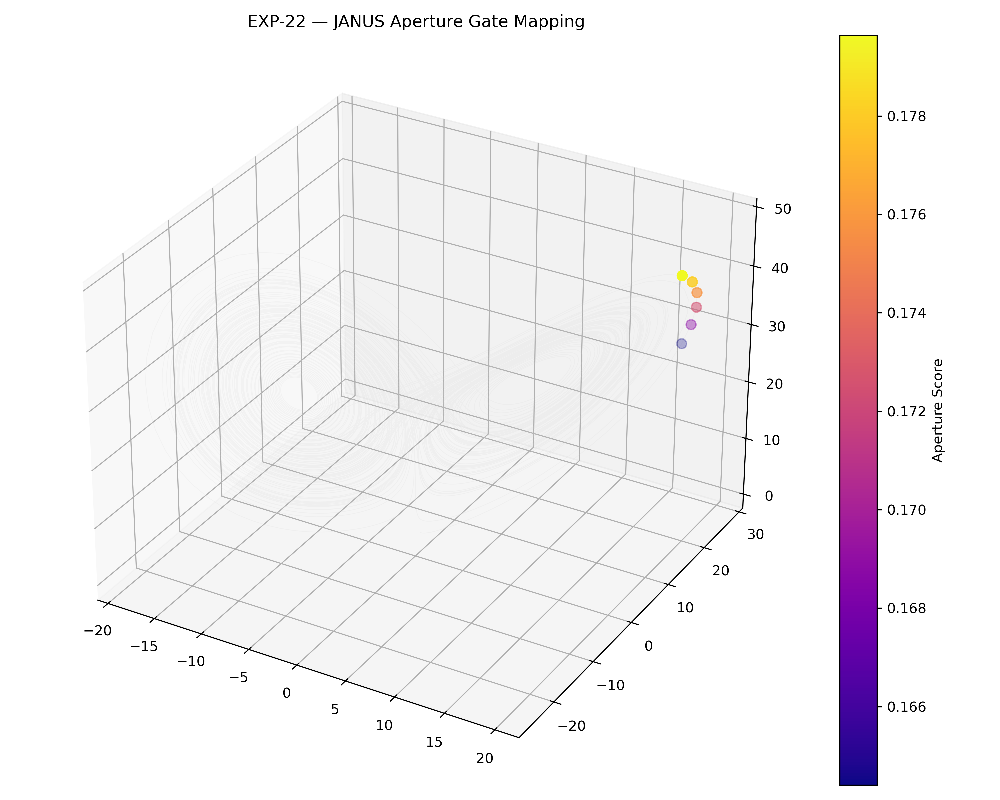

---

## Local Julia Gate Geometries

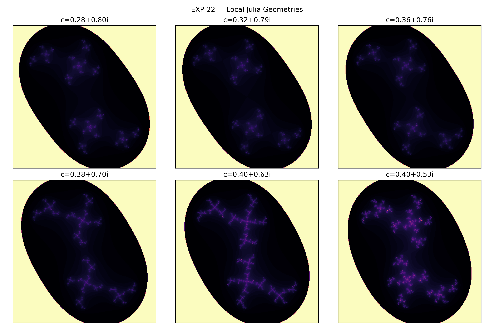

---

## Aperture Gate Timeseries

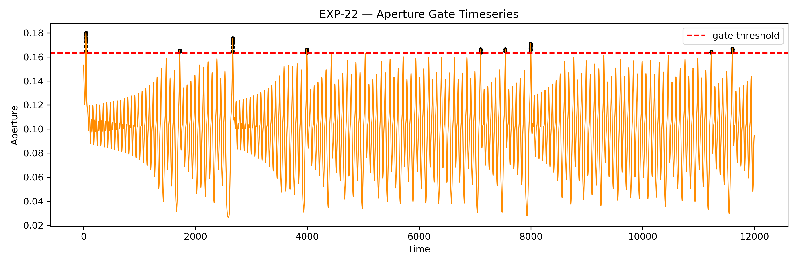

---

## Lorenz → Julia Parameter Mapping

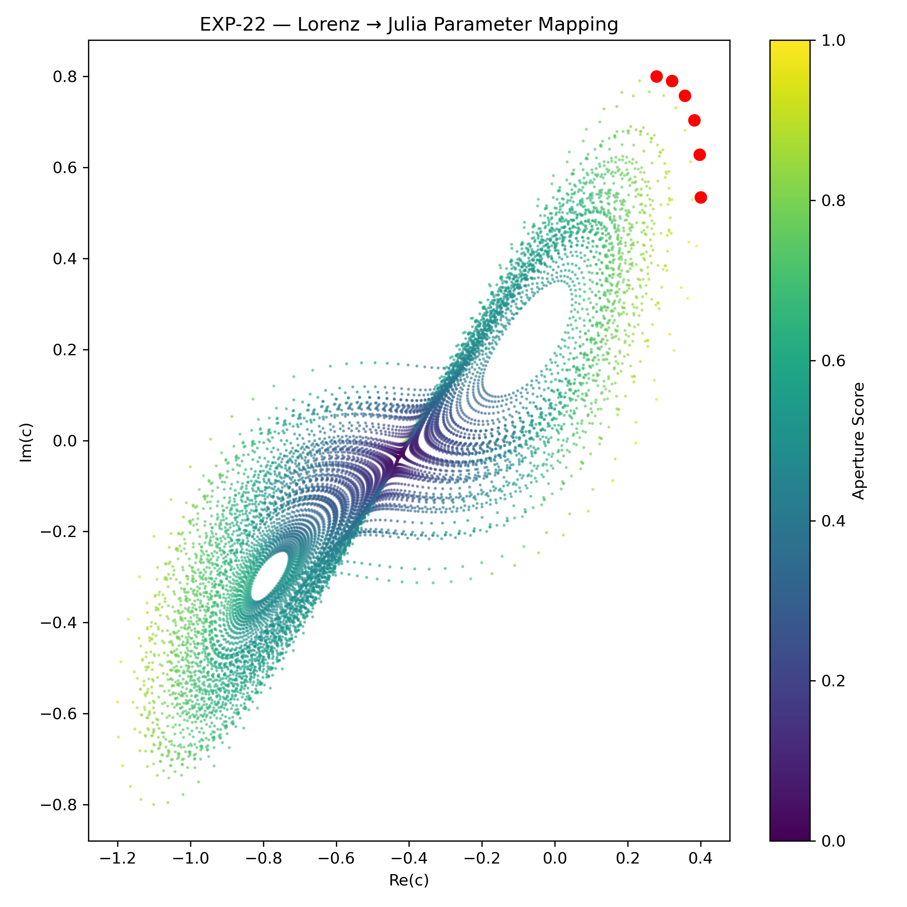

---

## Geometry Comparison

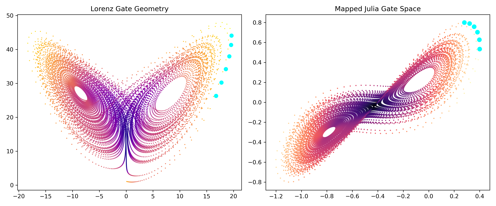

---

## Numerical Results

```text
samples:
12000

gate candidates:
60

threshold:
0.163201
```

---

# 🔥 Key Result

```text
JANUS aperture gates can be mapped
into Julia-like local parameter geometries.
```

---

## Observation

EXP-22 investigates whether JANUS aperture gate candidates
can be projected into a fractal parameter-like space.

The experiment maps Lorenz gate structures into local Julia parameters.

The resulting visual structure shows:

- paired lobe geometry
- diagonal parameter transport
- localized high-score gate candidates
- Julia-like local deformation patterns
- coherent mapped gate clusters

This does NOT prove equivalence between Lorenz dynamics and Julia sets.

But it does show that:

```text
JANUS gate candidates can be organized
inside a fractal-style parameter representation.
```

---

## Lorenz → Julia Mapping

The parameter mapping creates a transformed gate space.

In this mapped space:

- Lorenz lobe geometry compresses
- gate candidates move toward one edge
- diagonal transport remains visible
- high aperture scores form a localized chain

The transformation suggests:

```text
gate structure may be readable
as a parameter-space trajectory.
```

---

## Local Julia Geometry Observation

The local Julia panels show changing internal structure
across nearby gate parameters.

The images exhibit:

- internal filament changes
- deformation of local voids
- changing boundary complexity
- shrinking / expanding internal lobes
- repeated paired structures

This suggests a possible analogy:

```text
JANUS gates may behave like
local parameter apertures.
```

Again, this remains exploratory.

---

## Aperture Timeseries Observation

The aperture timeseries shows:

- threshold crossings are sparse
- gate events recur in bursts
- several high-score clusters appear
- aperture activity is not uniform

The highlighted candidates correspond to:

```text
localized moments of aperture activation.
```

---

## Geometry Comparison Observation

The geometry comparison places Lorenz gate geometry
beside mapped Julia gate space.

The strongest observation:

```text
the mapped space preserves a recognizable
diagonal transition structure.
```

This is important because the transformation does not destroy
the gate organization.

Instead, it re-expresses it as:

- a compressed parameter corridor
- a curved aperture band
- a local fractal gate path

---

## Structural Interpretation

EXP-22 suggests:

```text
JANUS aperture gates may be representable
as parameter-space transition objects.
```

This extends the JANUS framework from:

```text
state-space coherence
```

toward:

```text
parameter-space gate geometry.
```

---

## Relation to Previous Experiments

EXP-22 builds on:

- EXP-13 shell crossings
- EXP-14 transition spine
- EXP-18 phase quadrants
- EXP-21 aperture scoring

The new contribution is:

```text
a first bridge between JANUS gate geometry
and fractal parameter mappings.
```

---

# 🔷 EXP-23 — Aperture Orientation Angles

Script:
`scripts_2/janus_aperture_orientation_angles.py`

Outputs:

- `outputs/exp23_aperture_angle_distribution.png`
- `outputs/exp23_gate_orientation_overlay.png`
- `outputs/exp23_angle_resonance_scan.png`
- `outputs/exp23_orientation_summary.txt`

---

## Gate Orientation Overlay

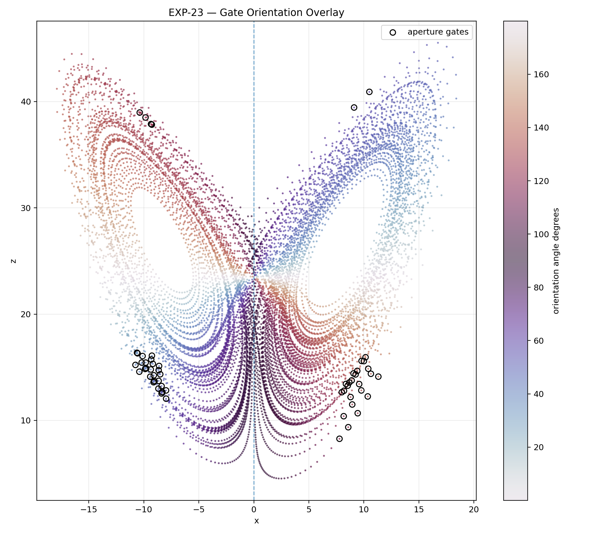

---

## Aperture Gate Orientation Angle Distribution

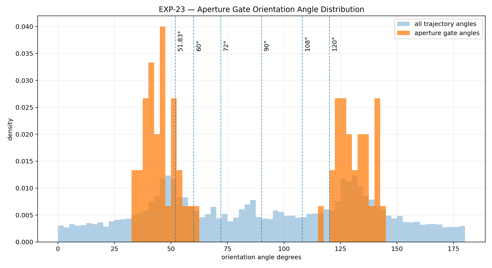

---

## Aperture Angle Resonance Scan

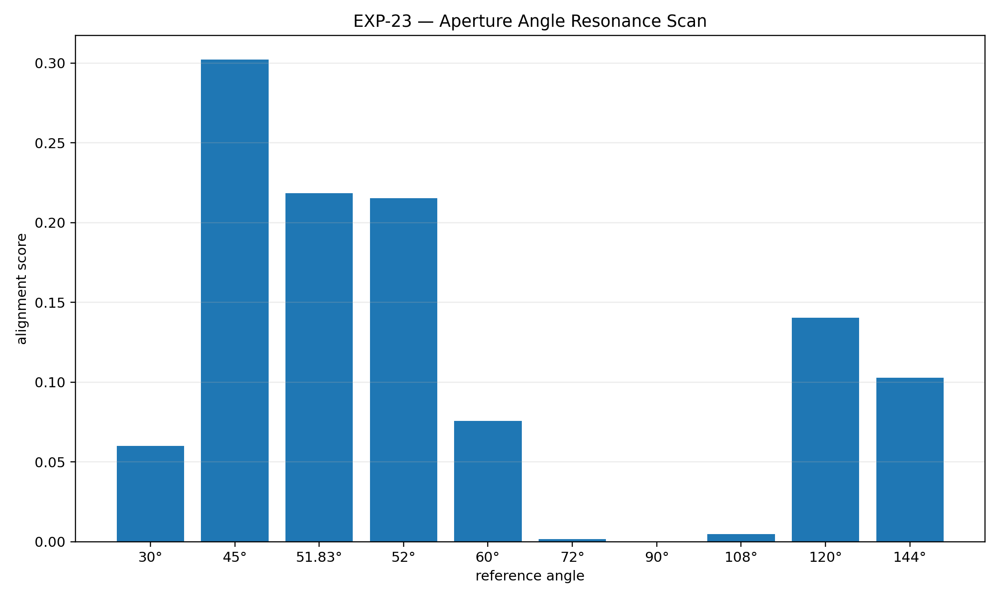

---

## Numerical Results

```text
samples:
11899

gate candidates:
60

mean aperture score:
0.580389

max aperture score:
1.000000

gate angle mean:
85.214968

gate angle std:
43.264258
```

---

## Reference Angle Scan

```text
30.000000 deg:   0.059937
45.000000 deg:   0.302292
51.830000 deg:   0.218542
52.000000 deg:   0.215463
60.000000 deg:   0.075691
72.000000 deg:   0.001726
90.000000 deg:   0.000000
108.000000 deg:  0.004712
120.000000 deg:  0.140275
144.000000 deg:  0.102866
```

---

# 🔥 Key Result

```text
Aperture gate candidates show
measurable orientation-angle structure.
```

---

## Strongest Reference Alignment

```text
best reference angle:
45°

alignment score:
0.302292
```

---

## Observation

EXP-23 tests whether aperture gate candidates
are angularly organized.

The result is highly structured.

Gate candidates do not occupy all angles uniformly.

Instead, they concentrate around several preferred sectors:

- strong diagonal alignment near 45°
- secondary alignment near 51.83° / 52°
- weaker but visible structure near 120°
- weaker structure near 144°
- near-zero alignment at 90°

This is one of the clearest orientation results so far.

---

## Gate Orientation Overlay Observation

The gate orientation overlay shows:

- gate candidates clustered on structured arcs
- asymmetric left/right organization
- diagonal transport preference
- visible separation between gate families
- sparse occupation along the central vertical axis

The upper regions show separated node-like gate structures.

The lower regions show two different organizations:

- left side: more bundled / compact
- right side: more networked / distributed

This suggests that aperture gates are not only localized,
but also directionally classified.

---

## Hidden 90° Axis

The resonance scan shows:

```text
90° alignment score = 0.000000
```

This is especially important.

It suggests that aperture gates avoid the pure orthogonal axis
under the current diagnostic.

Possible interpretations:

- orthogonal crossing is not a preferred gate orientation
- gate structure is diagonal rather than vertical
- the 90° axis may behave as a hidden horizon
- transitions may occur around the axis rather than through it

This remains exploratory.

But the absence of 90° alignment is too clear
to ignore.

---

## 45° Diagonal Dominance

The strongest alignment occurs at:

```text
45°
```

This suggests that gate formation prefers:

- diagonal transport
- lobe-to-lobe shear structure
- rotated aperture geometry
- oblique transition access

This aligns visually with EXP-21 and EXP-22,
where gate structures appeared as diagonal corridors
rather than central vertical breaks.

---

## 51.83° / 52° Secondary Structure

The 51.83° / 52° region also scores strongly.

This is important because it may correspond to:

- aperture calibration angle
- drift-offset angle
- oblique reconstruction geometry
- non-orthogonal gate opening

However, this must remain carefully phrased.

At this stage, it is a measured orientation preference,
not a proven invariant.

---

## Structural Interpretation

EXP-23 suggests:

```text
JANUS aperture gates are not only points.

They are orientation-sensitive structures.
```

The aperture gate geometry appears to involve:

1. localized gate activation
2. diagonal transport alignment
3. angle-selective clustering
4. suppressed orthogonal crossing
5. asymmetric lobe reconstruction

---

## Relation to Previous Experiments

EXP-23 builds on:

- EXP-15 transition orientation atlas
- EXP-16 parameter stability scan
- EXP-21 aperture gate operator
- EXP-22 Julia aperture coupling

The new contribution is:

```text
direct angular measurement
of aperture gate organization.
```

---

# 🔥 Updated Working Insight — LOG_02

```text
JANUS transition geometry appears to extend
beyond local coherence collapse.

It also exhibits aperture structure,
parameter-space coupling,
and angle-selective gate orientation.
```

Across EXP-21 to EXP-23:

```text
gate candidates are sparse,
localized,
diagonal,
fractal-map compatible,
and orientation-selective.
```


