# 🪞JANUS GEOMETRY — Directional Structure in Dynamical Fields

> Exploratory geometric interpretation of bidirectional flow coherence inside reconstructed dynamical systems.

---

# 🧠 Core Idea

Traditional dynamical systems analysis often studies:

```text
state evolution through time
```

The JANUS framework instead investigates:

```text
local directional geometry
inside reconstructed flow structure
```

The central hypothesis is:

```text
forward and backward flow
do not always organize symmetrically
```

and that:

```text
this asymmetry may become geometrically visible
near transitions, gates and instability corridors
```

---

# 🗺️ Janus Geometry Map

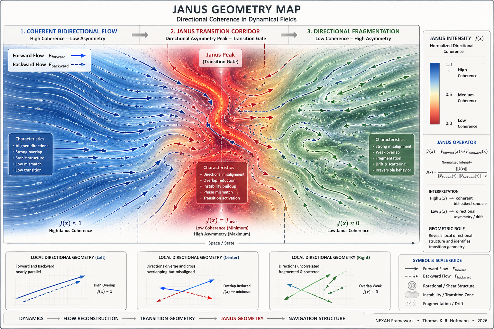

*Conceptual geometry map of bidirectional flow coherence inside reconstructed dynamical fields.*

The visualization illustrates three proposed directional regimes:

```text
1. Coherent Bidirectional Flow
→ high forward/backward overlap
→ stable local geometry

2. Janus Transition Corridor
→ directional asymmetry peak
→ transition activation region

3. Directional Fragmentation
→ coherence collapse
→ drift and instability structure
```

The central red corridor represents the proposed:

```text
Janus Peak
```

where:

- local directional compatibility weakens
- phase mismatch accumulates
- transition probability increases
- instability corridors emerge

The map is conceptual and exploratory.

It serves as:

```text
a navigational visualization
of directional coherence geometry
```

rather than a finalized mathematical model.

---

# 🔥 Updated Experimental Perspective

The recent JANUS experimental series significantly extends
the original geometric intuition.

The system now exhibits evidence for:

- shell-layer organization
- transition spines
- coherence corridors
- phase quadrants
- delayed recurrence structure
- breathing-like transport organization

Most importantly:

```text
transition structure appears organized
BEFORE large-scale geometric reconfiguration occurs
```

This does NOT establish a new physical law.

However:

```text
the directional geometry appears structured,
persistent and reproducible
across multiple computational experiments
```

---

# 🌊 From Dynamics to Geometry

Within NEXAH:

```text
raw dynamics
→ flow reconstruction
→ field structure
→ transition geometry
→ directional coherence
```

The Janus perspective extends this by asking:

```text
How locally compatible
are forward and backward trajectories?
```

This transforms directionality itself into a geometric object.

---

# 🧭 Directional Geometry

Consider a local region:

```text
Ω ⊂ ℝⁿ
```

Inside this region, trajectories generate:

- forward flow structure
- backward flow structure
- directional overlap geometry

The Janus Operator studies the local relationship between:

```text
F_forward(x)
```

and:

```text
F_backward(x)
```

across the reconstructed field.

---

# 🔷 Three Geometric Regimes

The Janus framework currently distinguishes three conceptual regimes.

---

## 1. Coherent Bidirectional Regions

In highly coherent regions:

```math
F_{\mathrm{forward}}(x)
\approx
F_{\mathrm{backward}}(x)
```

Directional organization remains locally aligned.

Geometric characteristics:

- smooth flow
- stable local structure
- persistent coherence
- low mismatch
- low transition activation

Visual interpretation:

```text
dense coherent flow corridors
```

---

## 2. Janus Transition Regions

Near transition gates:

```math
F_{\mathrm{forward}}(x)
\not\approx
F_{\mathrm{backward}}(x)
```

Local directional compatibility weakens.

Possible characteristics:

- trajectory splitting
- local divergence
- instability accumulation
- phase drift
- coherence fragmentation
- transition concentration

These regions may form:

```text
Janus corridors
```

or:

```text
directional bifurcation zones
```

---

## 3. Directionally Broken Regions

In strongly unstable or fragmented regions:

```text
forward and backward structure
lose coherent overlap
```

Possible behavior:

- chaotic scattering
- incoherent drift
- structural fragmentation
- irreversible local geometry

Interpretation remains exploratory.

---

# 🔷 Recursive Phase Geometry

Recent experiments suggest that transition organization
may itself decompose into internal directional regimes.

The current experimental phase decomposition includes:

```text
Q1 — Expansion
Q2 — Compression
Q3 — Memory / Echo
Q4 — Transition / Gate
```

This creates a possible recursive geometry inside the field itself.

---

# 🌀 Recursive Phase Quadrants

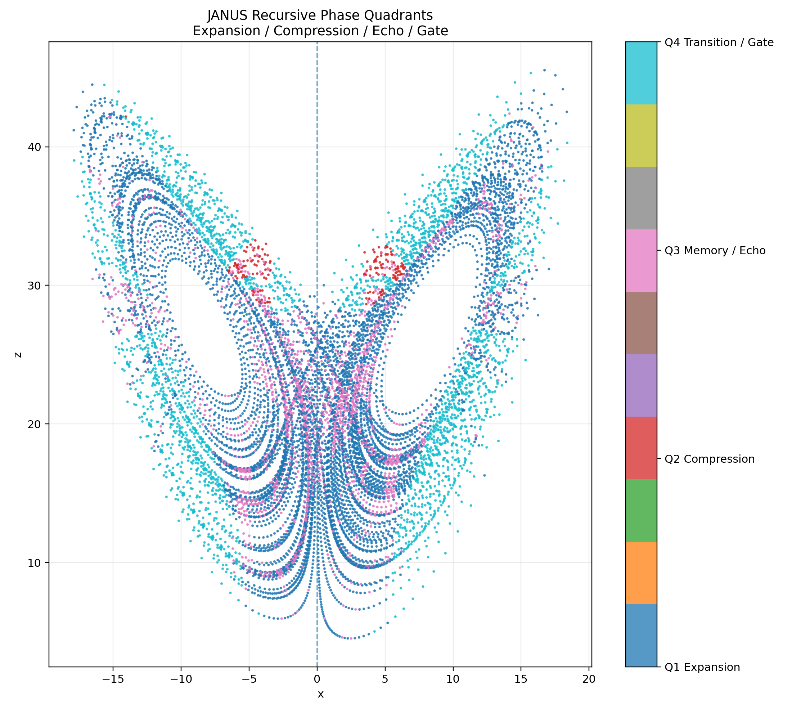

*Directional organization of the Lorenz attractor into recursive JANUS transport quadrants.*

The observed geometry resembles:

- breathing-like flow transport
- shell-mediated transition corridors
- nested orbital structures
- central compression throats
- coherence gating regions

Most importantly:

```text
the transition region appears highly organized,
not randomly diffusive
```

---

# 🧭 Janus Phase Quadrant Map

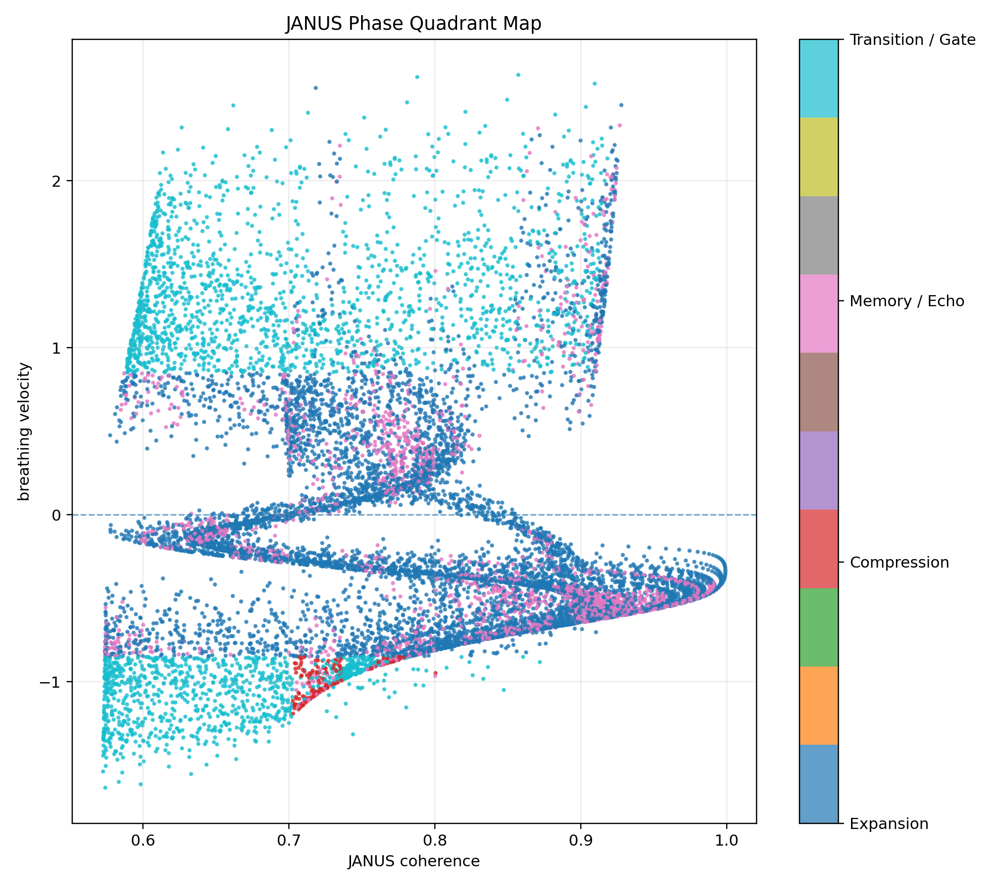

*Quadrant organization inside JANUS coherence / breathing space.*

The resulting structure resembles:

- a compressed central aperture
- bifurcating transport channels
- nested directional layers
- mirrored transition geometry

The center behaves less like:

```text
random turbulence
```

and more like:

```text
a structured transition passage
```

This interpretation remains exploratory.

---

# 🔥 Aperture / Gate Interpretation

One of the strongest emerging visual structures
is the appearance of a compressed central transition region.

This region behaves like:

```text
a directional aperture
```

inside the coherence geometry.

Observed properties include:

- shell crossings
- coherence collapse
- geometric compression
- transport redirection
- phase inversion
- re-expansion after crossing

Importantly:

```text
the transition center is NOT maximally disordered
```

Instead:

```text
it appears geometrically constrained
```

This is one of the most surprising observations
of the current JANUS series.

---

# 🌌 Janus Geometry as a Field Layer

The Janus framework introduces a possible additional field layer:

```text
Dynamics
→ Transition Geometry
→ Janus Geometry
```

where:

```text
Janus Geometry
=
local directional coherence structure
```

This layer does not replace:

- topology
- Lyapunov analysis
- phase analysis
- transition matrices

Instead it complements them through:

```text
directional structural comparison
```

---

# 🌌 Mandelbrot / Julia Embedding Perspective

One of the strongest emerging observations
of the recent JANUS experiments
is the appearance of transport-like organization
inside genuine nonlinear fractal geometry.

The EXP-31 coupling experiment revealed that:

```text
JANUS-style transport corridors
can become visibly embedded
inside explicit Julia dynamics.
```

This is important because the resulting geometry exhibits:

- shell-like outer membranes
- spiral transition seams
- diagonal routing corridors
- nested basin chambers
- contour-mediated drift fields
- localized coupling zones

Most strikingly:

```text
the outer field itself
appears geometrically active
```

rather than empty background structure.

The fractal geometry behaves visually like:

```text
a continuous navigation landscape
```

containing:

- transport gradients
- transition membranes
- directional seams
- embedded routing channels

---

## Julia Navigation Embedding

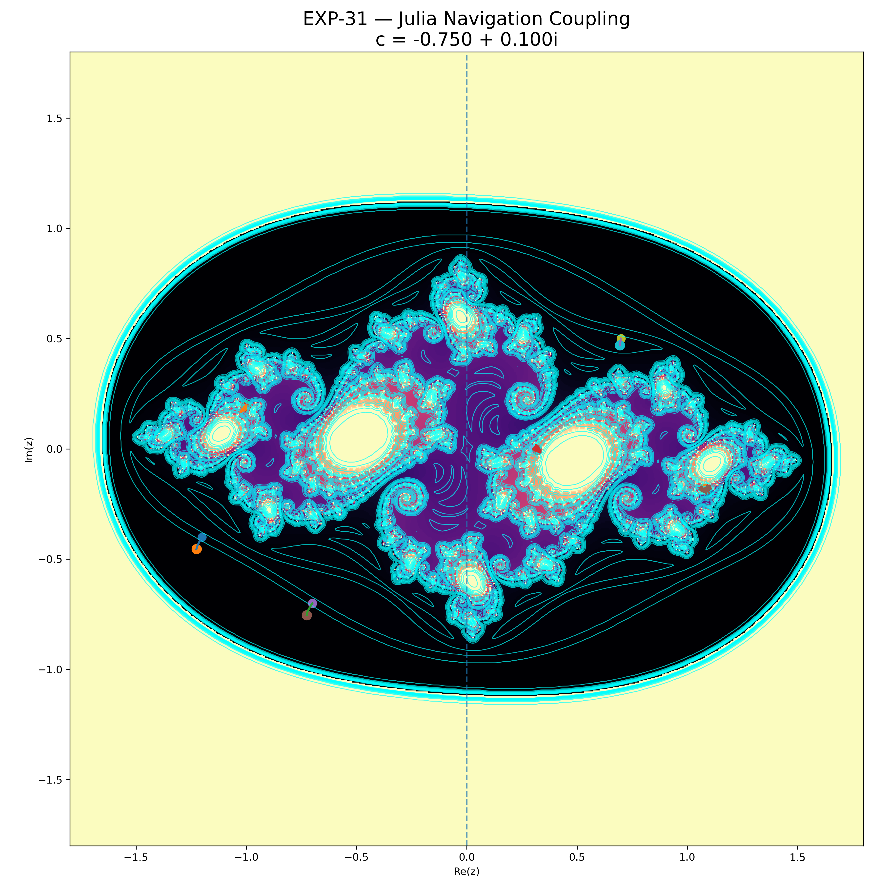

*Embedded JANUS-style navigation structure inside nonlinear Julia-set geometry.*

Observed parameter:

```text
c = -0.750 + 0.100i
```

The resulting geometry reveals:

- dual-lobe transport structure
- spiral gate regions
- coupled basin membranes
- nested contour fields
- edge-sensitive transition routing

Several transport probes partially align with:

- contour gradients
- spiral seams
- membrane boundaries
- transition corridors

This creates the appearance of:

```text
embedded transport infrastructure
inside fractal dynamics
```

rather than isolated chaotic trajectories.

---

## Structural Importance

The Mandelbrot / Julia coupling experiments
do NOT establish equivalence between:

- JANUS transport
- fractal mathematics
- or physical transport systems

However, they strongly suggest that:

```text
transition organization
may remain geometrically meaningful
even inside highly nonlinear parameter spaces.
```

This is currently one of the strongest
visual-geometric observations
of the JANUS series.

---

# 🧠 Geometric Interpretation of Transition Gates

A major working hypothesis of the module:

```text
Transition gates may correspond
to regions where directional geometry destabilizes.
```

Meaning:

```text
transition activation
↔ directional coherence collapse
```

Possible manifestations:

- twisting flow
- local asymmetry
- rotational mismatch
- corridor fragmentation
- coherence thinning

---

# 🔄 Relationship to Phase Dynamics

Within NEXAH, transitions are already connected to:

```text
phase mismatch
```

The Janus layer extends this idea geometrically.

Possible interpretation:

```text
phase mismatch
→ directional asymmetry
→ Janus collapse
→ transition activation
```

This relationship remains experimental.

---

# 🌊 Directional Curvature

One possible future extension:

```text
local Janus curvature
```

defined through the spatial variation of directional overlap.

Conceptually:

```text
stable regions
→ smooth Janus geometry

transition regions
→ high Janus curvature
```

Potential future quantities:

- directional shear
- coherence curvature
- asymmetry gradients
- rotational mismatch density

These are not yet formalized.

---

# 🧭 Navigation Interpretation

From a navigation perspective:

```text
systems move through regions
with different directional compatibility
```

This suggests:

```text
navigation may depend not only on state,
but on local directional coherence geometry
```

Possible implications:

- stable pathways
- transition corridors
- coherence-preserving trajectories
- directional bottlenecks

---

# 🔬 Computational Geometry

Possible visualizations include:

- Janus heatmaps
- directional overlap fields
- forward/backward vector comparison
- asymmetry surfaces
- coherence-density overlays
- trajectory-colored Janus maps
- shell-transition geometry
- recursive phase decomposition
- aperture/gate visualization

Potential systems:

- Lorenz
- Kuramoto
- Rössler
- Duffing
- fractal parameter systems

---

# ⚠️ Important Clarification

The Janus Geometry framework currently is:

```text
✔ exploratory
✔ computational
✔ geometric
✔ diagnostic
```

It is NOT currently:

```text
❌ a complete mathematical theory
❌ a finalized topology framework
❌ a physical law
❌ a quantum interpretation
```

The framework remains:

```text
an experimental geometric layer
inside NEXAH
```

---

# 🌌 Conceptual Perspective

Traditional systems analysis often focuses on:

```text
where systems are
```

Janus Geometry investigates:

```text
how directional structure organizes motion
inside local field geometry
```

The emphasis shifts from:

```text
states
```

toward:

```text
coherence of directional flow
```

---

# 🧠 Working Summary

A compressed interpretation:

```text
Janus Geometry studies
how forward and backward structure
organize locally inside dynamical fields,
and whether transitions correspond
to breakdowns of directional coherence.
```

The newest experiments further suggest:

```text
transition geometry may organize through:

- shells
- spines
- breathing transport
- recursive phase quadrants
- compressed apertures
- coherence-gated corridors
```

---

# 🧭 Current Status

```text
formal geometry:
early-stage

computational visualization:
active

cross-system testing:
ongoing

transition geometry:
emerging

recursive phase analysis:
active

theoretical interpretation:
exploratory
```

---

# 🔥 Updated Experimental Perspective

The recent JANUS experimental series significantly extends
the original geometric intuition.

The system now exhibits evidence for:

- shell-layer organization
- transition spines
- coherence corridors
- phase quadrants
- delayed recurrence structure
- breathing-like transport organization
- aperture-localized transition access
- directed basin routing
- predictive transport persistence
- perturbation bifurcation structure
- steerable basin transport
- nonlinear fractal coupling

Most importantly:

```text
transition structure appears organized
BEFORE large-scale geometric reconfiguration occurs
```

and increasingly behaves like:

```text
a structured transport infrastructure
embedded inside continuous nonlinear dynamics
```

This does NOT establish a new physical law.

However:

```text
the directional geometry appears structured,
persistent,
multi-scale,
and computationally reproducible
across multiple experimental layers
```

---

# 🔷 Directed Basin Geometry

Recent JANUS experiments suggest that
transition organization may reconstruct naturally
into basin-routing geometry.

Instead of purely continuous diffusion,
the observed transport increasingly exhibits:

- localized routing nodes
- corridor-mediated exchange
- entropy-separated transport regions
- directed navigation structure
- predictive routing persistence

---

# 🕸️ Basin Transport Geometry

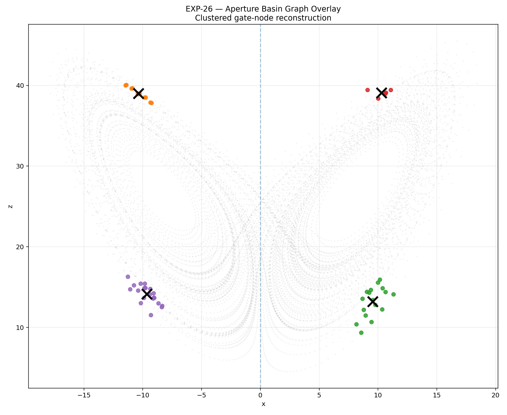

*Reconstructed basin-routing geometry inside JANUS aperture transport structure.*

The resulting geometry resembles:

- directed transport channels
- asymmetric exchange corridors
- clustered basin families
- constrained transition routing
- hidden transport-node organization

Importantly:

```text
continuous chaotic flow
appears capable of reconstructing
into graph-like routing structure
```

rather than remaining fully diffuse.

---

# 🧭 Directed Navigation Geometry

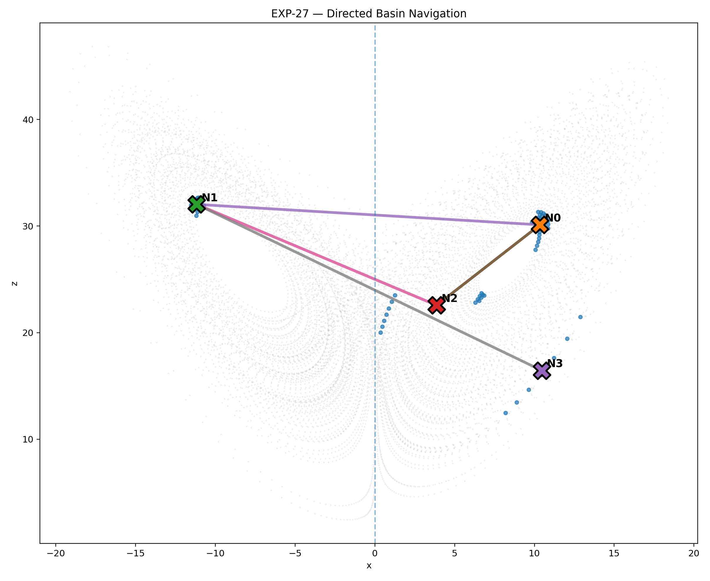

*Directed navigation reconstruction inside JANUS transport geometry.*

The observed navigation structure separates into:

### Stable routing anchors

and

### probabilistic transition regions.

The resulting geometry exhibits:

- deterministic corridors
- unstable routing branches
- entropy-separated transport
- asymmetric navigation flow
- persistent directional exchange

This strongly suggests:

```text
transport accessibility
is geometrically constrained
rather than uniformly distributed
```

---

# 🔮 Predictive Routing Geometry

Recent experiments further suggest that
JANUS routing possesses short-horizon predictive structure.

---

## Predictive Basin Routing

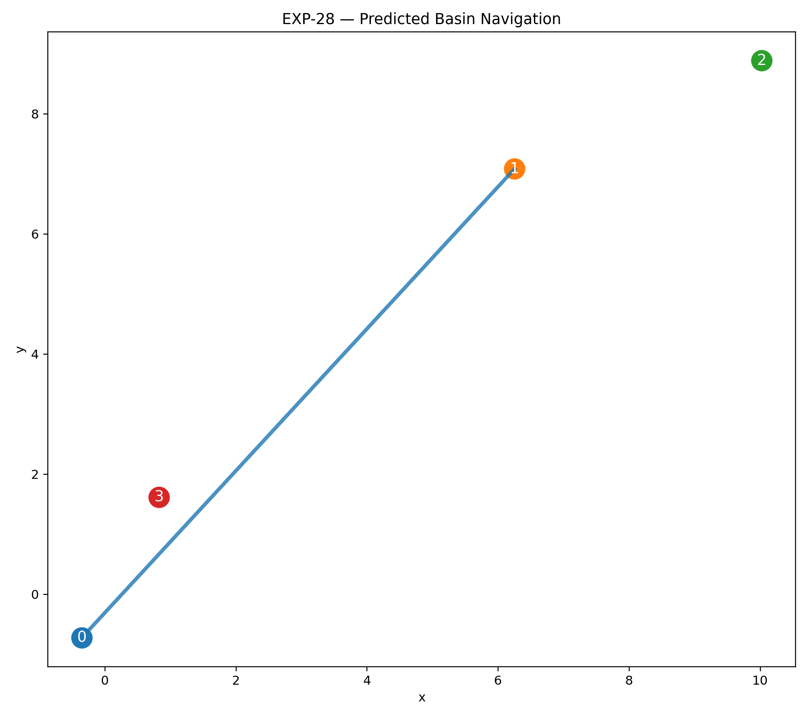

---

## Predictive Transition Map

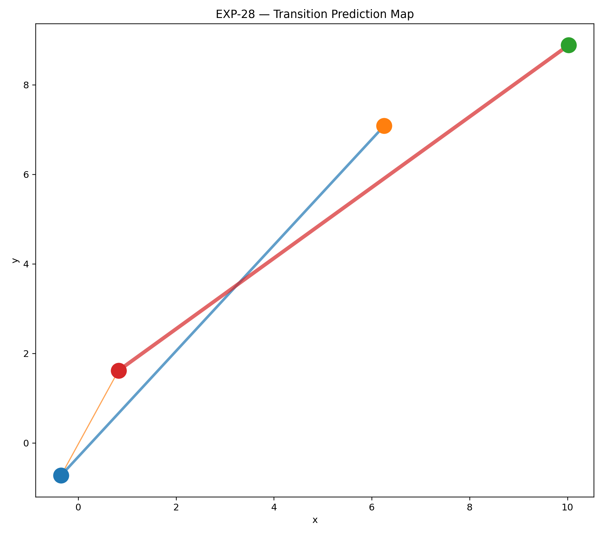

---

## Predictive Confidence Structure

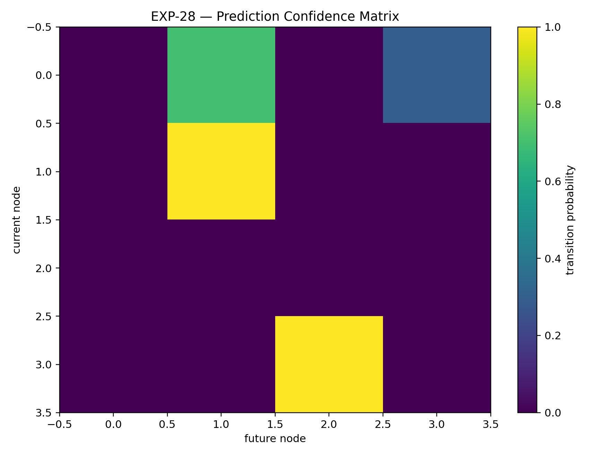

The predictive routing geometry reveals:

- persistent future corridor occupation
- stable routing convergence
- asymmetric basin preference
- suppressed reverse transport
- repeated node fixation

The resulting structure behaves less like:

```text
random future diffusion
```

and more like:

```text
constrained transport evolution
inside structured routing geometry
```

---

# ⚡ Perturbation Bifurcation Geometry

Recent perturbation experiments reveal that
JANUS routing organization does NOT degrade smoothly.

Instead the system exhibits:

- stability plateaus
- abrupt routing collapse
- bifurcation-like switching
- localized instability thresholds

---

## Prediction Stability Map

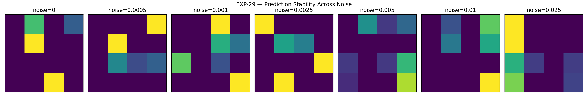

---

## Path Persistence

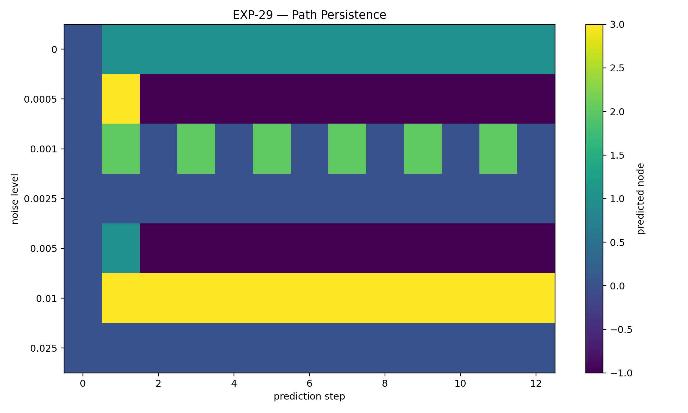

---

## Forecast Noise Scan

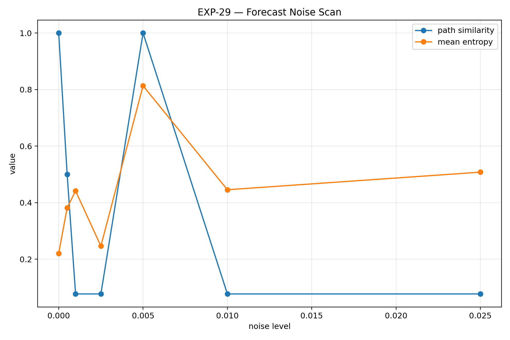

The resulting geometry resembles:

```text
critical transport thresholds
inside routing space
```

rather than continuous degradation.

Most importantly:

```text
some routing corridors remain stable
while neighboring regions collapse abruptly
```

This suggests:

```text
transport fragility localizes geometrically.
```

---

# 🧲 Controlled Steering Geometry

The newest experiments further suggest that
JANUS routing may be partially steerable.

---

## Basin Steering Overlay

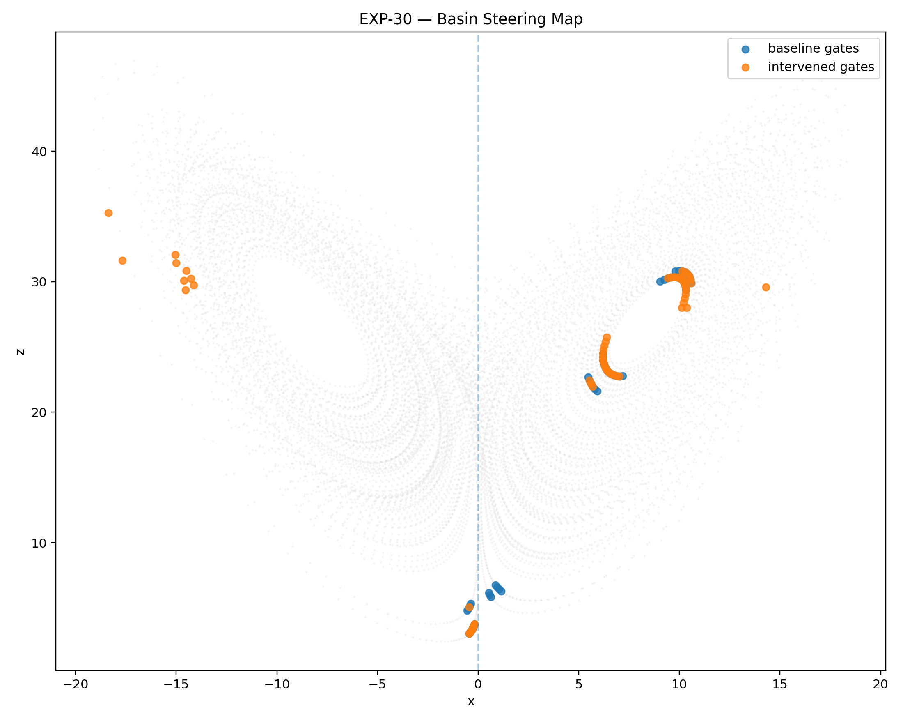

---

## Intervention Paths

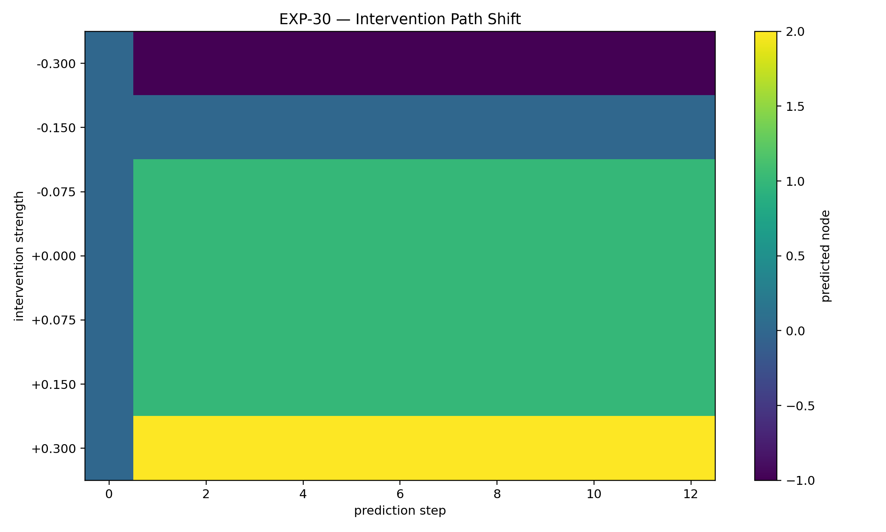

---

## Transport Shift Matrix

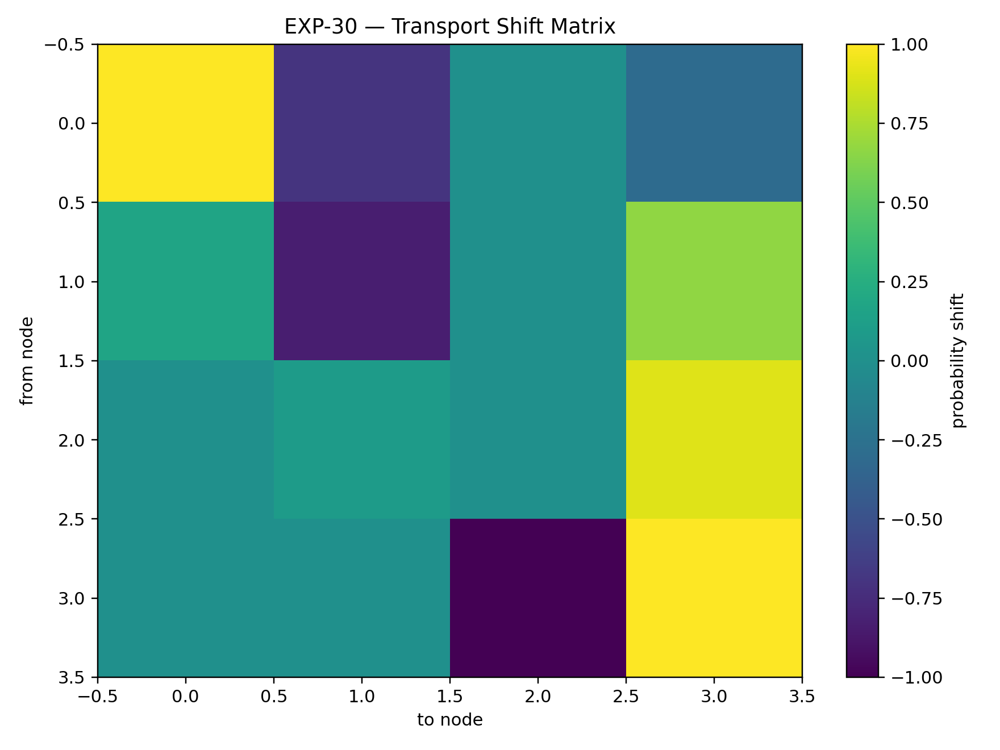

The observed steering behavior includes:

- stable corridor locking
- directional routing response
- abrupt basin reassignment
- intervention-sensitive transition zones
- mirrored steering deformation

The geometry behaves less like:

```text
passive chaotic diffusion
```

and more like:

```text
a controllable transport membrane
```

inside the reconstructed field structure.

---

# 🌌 Fractal Navigation Geometry

One of the strongest recent observations
is the emergence of nonlinear fractal coupling.

The JANUS navigation structure can now be embedded
inside explicit Julia-set geometry.

---

## EXP-31 — Julia Navigation Coupling


*Direct coupling between JANUS navigation probes and nonlinear Julia transport geometry.*

Observed parameter:

```text
c = -0.750 + 0.100i
```

The resulting geometry exhibits:

- dual-lobe basin organization
- spiral transition corridors
- shell-like contour membranes
- nested transport envelopes
- edge-sensitive routing seams
- diagonal exchange pathways

Most importantly:

```text
the surrounding field is NOT visually empty
```

Instead it behaves like:

```text
a continuous navigation potential landscape
```

containing:

- transport gradients
- transition membranes
- layered contour shells
- embedded routing corridors

---

# 🌀 Spiral Corridor Geometry

The internal Julia geometry reveals:

- spiral gate structures
- rotational routing pull
- nested transition seams
- branching transport corridors
- membrane-like basin separation

The navigation probes partially align with:

- contour gradients
- spiral seams
- edge-sensitive corridors
- local transport channels

This suggests:

```text
navigation accessibility
depends strongly
on underlying nonlinear geometry
```

---

# 🔷 Expanded Janus Geometry Interpretation

The original JANUS framework focused primarily on:

```text
directional coherence collapse
```

The newer experiments now suggest
a broader geometric picture involving:

```text
localized transport organization
```

including:

- shell-mediated routing
- graph-organized basin exchange
- entropy-separated transport anchors
- predictive corridor persistence
- perturbation bifurcation thresholds
- steerable transport response
- nonlinear fractal embedding

---

# 🔭 Emerging Geometric Picture

Across the current experimental series,
transition organization increasingly resembles:

```text
a layered transport infrastructure
```

with:

- apertures
- corridors
- routing membranes
- transport anchors
- basin exchange channels
- spiral transition seams
- recursive transport layers
- nonlinear navigation fields

rather than:

```text
fully diffuse chaotic transition dynamics
```

---

# 🧠 Updated Working Summary

A compressed interpretation:

```text
Janus Geometry studies
how directional transport structure
organizes locally inside dynamical systems,
and whether transitions emerge through:

- coherence collapse
- aperture localization
- corridor routing
- recursive transport organization
- predictive basin structure
- nonlinear geometric embedding
```

The newest experiments further suggest:

```text
transition geometry may organize through:

- shells
- spines
- apertures
- routing corridors
- entropy-separated nodes
- bifurcation thresholds
- steerable basin exchange
- fractal transport geometry
```

---

# 🧭 Updated Current Status

```text
formal geometry:
early-stage

computational visualization:
active

cross-system testing:
ongoing

transition geometry:
strongly emerging

recursive phase analysis:
active

routing geometry:
emerging

predictive transport:
experimental

fractal embedding:
experimental

theoretical interpretation:
exploratory
```
---

Thomas K. R. Hofmann · NEXAH · 2026
