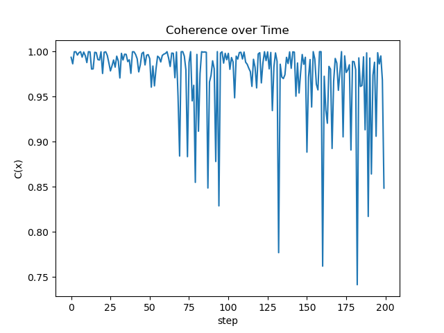
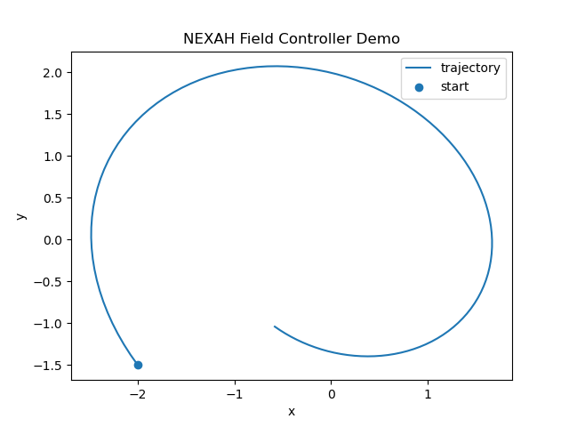
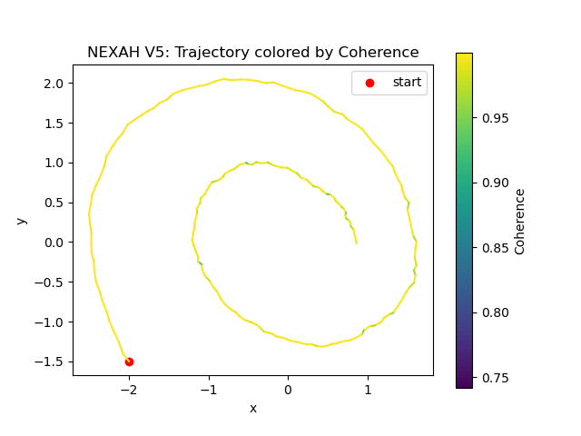
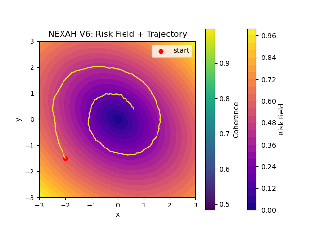
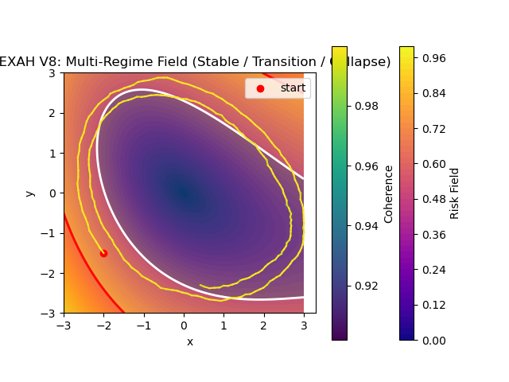
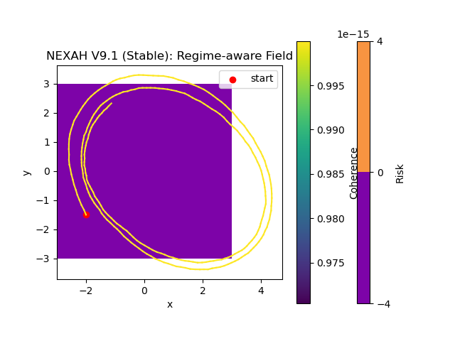
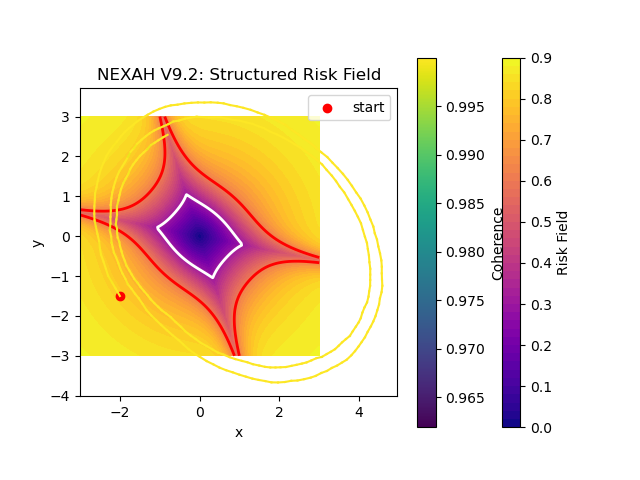
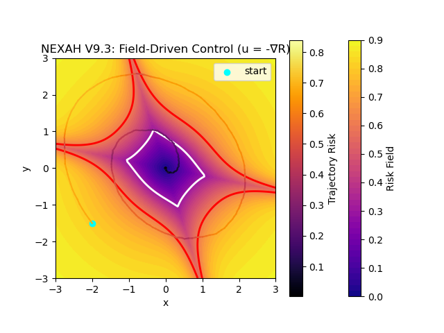

# NEXAH Framework – Visual Gallery

**Version:** v1.0  
**Last updated:** April 2026  

This document provides a structured overview of all core visualizations of the NEXAH framework.

It connects:
- mathematical definitions
- system dynamics
- visual intuition

---

# 🧠 Core Idea

NEXAH models systems as:

> **trajectories moving through a structured stability field**

Stability is not static — it is **alignment with the field geometry**.

---

# 📐 Core Equations

## Dynamical System

\[
\dot{x} = F(x)
\]

## Coherence

\[
C(x) = \frac{\dot{x} \cdot F(x)}{\|\dot{x}\| \cdot \|F(x)\|}
\]

## Risk Field

\[
R(x) = 1 - C(x)
\]

## Stability Region

\[
S = \{ x \mid R(x) < \tau \}
\]

## Control

\[
\dot{x} = F(x) + u(x)
\]

---

# 🌊 V1 – Field + Trajectory

**Concept:**
- Raw vector field \(F(x)\)
- System trajectory \(x(t)\)

**Insight:**
- The system follows the field but is not yet evaluated

---

# 🎯 V2 – Coherence

**Concept:**
- Alignment between motion and field

**Interpretation:**
- Green → stable
- Yellow → transition
- Red → instability

**Key Idea:**
> Stability = alignment with the field

---

# 🔥 V3 – Risk Field

**Concept:**
- Continuous risk landscape

**Interpretation:**
- Dark regions → safe
- Bright regions → high risk

**Key Idea:**
> Risk is geometric, not threshold-based

---

# 🧭 V4 – Control

**Concept:**
- Field-aware control \(u(x)\)

**Interpretation:**
- System is gently steered back into stable regions

**Key Idea:**
> Control modifies direction, not just state

---

# 🟢 V5 – Coherence Visualization

Shows:
- scalar coherence over time

---

---

**Insight:**
- Stability emerges dynamically along the trajectory

---

# 🌍 V6 – Risk Landscape

**Concept:**
- Full 2D risk geometry

**Insight:**
- Systems "live" in landscapes, not points

---

# ⚡ V7 – Separatrix

**Concept:**
- Boundary between regimes

**Insight:**
- Crossing separatrix = regime transition

---

# 🧩 V8 – Multi-Regime System

**Concept:**
- Multiple stable zones

**Insight:**
- Systems can switch between attractors

---

# 🔁 V9 – Structured Field Evolution

## V9.1 Stable Field

---

## V9.2 Structured Risk

---

## V9.3 Field Control

**Insight:**
- Field structure defines navigation possibilities

---

# 🤖 V10 – Multi-Agent System

**Concept:**
- Multiple agents in same field

**Insight:**
- Convergence is collective, not individual

---

# 🌐 V10 – Network Formation

**Concept:**
- Dynamic connectivity

**Insight:**
- Structure emerges from proximity

---

# 🐦 V11 – Swarm + Field

**Concept:**
- Repulsion + attraction + field

**Insight:**
- Agents self-organize while following field dynamics

---

# 🧠 V12 – Full System

**Concept:**
- Field + swarm + communication + network

**Key Features:**
- decentralized control
- local communication
- emergent global stability

---

# 🔑 Final Insight

> Stability is not a fixed point.  
> It is sustained alignment with a structured field.

---

# 🚀 Summary

This gallery shows the progression:

1. Field
2. Coherence
3. Risk
4. Control
5. Geometry
6. Multi-agent dynamics
7. Emergence

---

# 🧭 Next Steps

- Connect visuals to ARCHY (regimes)
- Validate coherence in real systems
- Extend to real-world datasets

---
