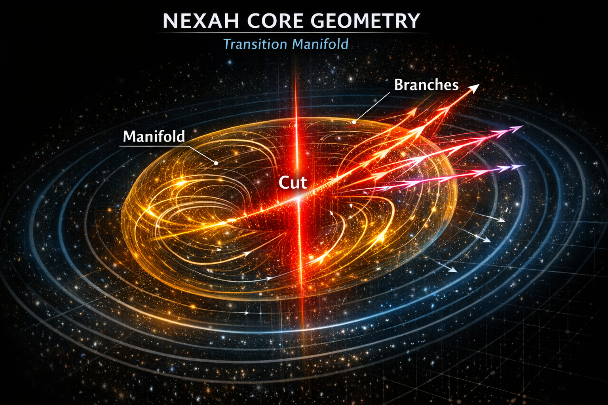
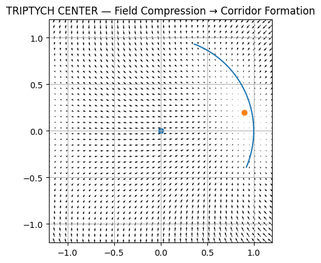
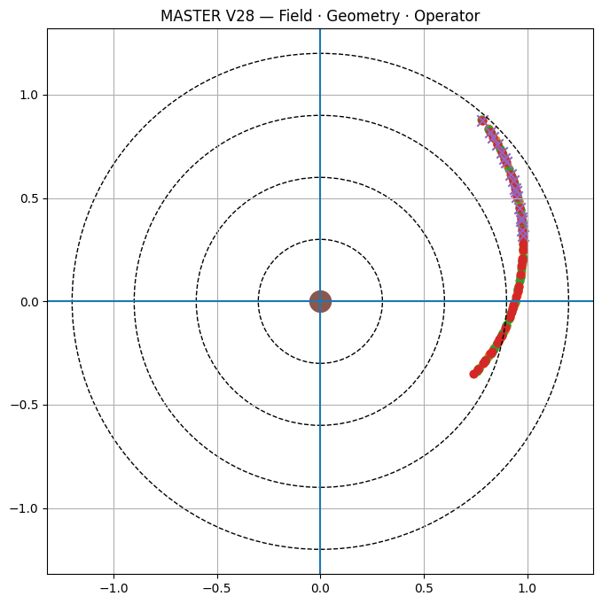
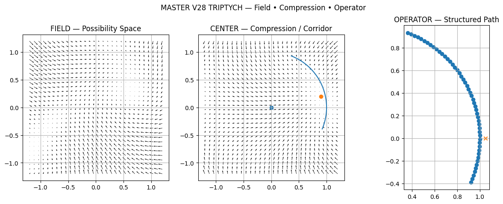

# 🧭 NEXAH — FIELD GEOMETRY OPERATOR  
### Field · Geometry · Operator · Navigation

---

## 🧭 What This Document Is

This document defines the **geometric core of the NEXAH framework**.

It explains how system dynamics are transformed into:

Field → Geometry → Operator → Navigation

This structure underlies all NEXAH applications, from chaotic systems  
to infrastructure networks.

---

## 🧠 Overview

This document provides:

- a **geometric interpretation layer**
- a **structural decomposition of system behavior**
- a **unified visual language linking theory and data**

---

## 🔑 Core Mapping

```text
Field → Geometry → Operator → Navigation
```

## 🔬 Mathematical Layer

Let the system state be:

x ∈ ℝⁿ

The system evolves according to:

dx/dt = F(x)

We define a scalar risk field:

risk : ℝⁿ → ℝ

as described in:

→ [Formal Risk Definition](../docs/risk_field.md)  
→ [Field-Based Control Paper](../docs/field_control.md)

Geometric structures:

- Stability region: Ω = { x | risk(x) < τ }
- Separatrix: S = { x | risk(x) = τ }

Control acts as a geometric operator:

dx/dt = F(x) + u(x)

where u depends on:

- risk(x)
- ∇risk(x)
- geometric structure (distance to S)

This connects the geometric interpretation with the formal framework.


# 🔲 1. FIELD LAYER

## 🌊 Off-Manifold Flow (Empirical Field Structure)


### Interpretation

- vector field = system dynamics  
- arrows = local motion directions  
- trajectories follow structured flow  

👉 **Insight:**  
Dynamics are not random — they are organized by an underlying field.

---

## 🌊 Data-Based Field Approximation


### Interpretation

- reveals intrinsic flow structure  
- shows attractor-like behavior  
- validates field-based representation  

👉 **Insight:**  
Even raw data reconstructs the same underlying field geometry.

# 🔲 2. GEOMETRY LAYER

## 🧬 Transition Manifold



### Interpretation

- transition regions are geometric  
- instability is boundary-based  
- future paths branch structurally  

👉 **Insight:**  
Transitions are not points — they are geometric regions.

---

## 🧭 Separatrix / Decision Boundary

.png)

### Interpretation

- separatrix = boundary between stable / unstable trajectories  
- defines decision structure in the field  

👉 **Insight:**  
Control operates relative to geometry, not thresholds.

---

# 🔲 3. FIELD → GEOMETRY TRANSITION

## 🧩 Compression → Corridor Formation



### Interpretation

- field compresses under stress  
- curvature increases  
- transition corridors emerge  

👉 **Insight:**  
Instability creates navigable geometric channels.

---

# 🔲 4. OPERATOR LAYER

## 🧭 Operator on Navigable Field


### Interpretation

- control operates within field geometry  
- trajectories are reshaped globally  

👉 **Insight:**  
The operator does not merely react to states.  
It acts on the geometry that organizes future motion.

---

## 🧭 Trajectory Steering


### Interpretation

- trajectories are guided away from instability  
- control acts as geometric steering  

👉 **Insight:**  
Control = trajectory shaping in field space.

---

# 🔲 5. SYSTEM INTEGRATION

## 🧭 Structural Navigation Framework


### Interpretation

- integrates field, geometry, and control  
- defines full navigation architecture  

👉 **Insight:**  
Navigation becomes possible once dynamics are represented as field geometry rather than isolated trajectories.

---

## 🧭 Early Collapse Detection


### Interpretation

- collapse emerges geometrically  
- detection is possible before threshold crossing  

👉 **Insight:**  
Risk is not merely statistical.  
It appears as a structural deformation in the field.

---

# 🔲 6. MASTER GEOMETRY SYSTEM

## 🧭 MASTER Geometry Operator



### Interpretation

- summarizes the main geometry-operator relation  
- connects field structure to navigable control  
- provides a compact master view of the framework  

---

## 🧭 MASTER PRO Geometry


### Interpretation

- extends the master operator into a richer structural frame  
- adds higher-order geometry and transition structure  
- clarifies how navigation emerges from field organization  

---

## 🧭 MASTER FINAL — Full System


### Interpretation

- complete synthesis of field, compression, geometry, operator, and navigation  
- expresses the full internal logic of the NEXAH geometry system  
- serves as the visual culmination of the module  

👉 **Insight:**  
This is the full operator view: not motion itself, but the structure from which motion becomes inevitable.

---

# 🔲 7. TRIPTYCH SYSTEM

## 🧩 Field → Compression → Operator



### Interpretation

- field defines the underlying motion structure  
- compression creates geometric concentration and corridor formation  
- operator acts within this geometry to redirect trajectories  

👉 **Insight:**  
The triptych expresses the internal sequence of navigability:
field first, geometry second, intervention third.

---

# 🧠 Unified Interpretation

```text
Field → Compression → Geometry → Operator → Navigation
```

This sequence defines the core logic of the NEXAH framework.

- Field organizes motion  
- Compression concentrates structure  
- Geometry defines boundaries and corridors  
- Operator reshapes trajectory evolution  
- Navigation becomes possible through structured intervention  

---

## 🔥 Core Insight

The system is not defined by trajectories.

It is defined by the geometry that generates them.

---

## 🔗 Connection to Applications

This structure is not abstract.

It appears directly in real systems.

Example:

→ [Lorenz Chaos Navigation](../../APPLICATIONS/dynamical_systems/lorenz/README.md)

The Lorenz system demonstrates:

- field structure  
- separatrix geometry  
- regime transitions  
- navigation pathways  

This validates the Field → Geometry → Operator → Navigation pipeline in a concrete dynamical system.

The same structural logic can then be extended toward:

- power grids  
- infrastructure networks  
- collapse dynamics  
- multi-agent stabilization  
- scientific discovery systems  

---

## 🧭 Final Statement

This is not a visual collection.

It is:

- a structural map  
- a geometric theory  
- a navigation framework  

---

## 🧠 Ultimate Insight

You are not observing motion.

You are observing:

> the structure that makes motion inevitable

