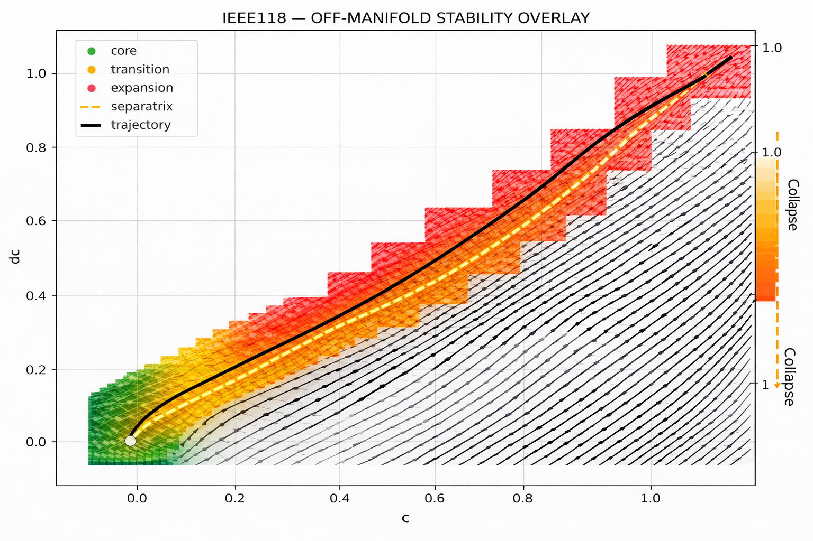
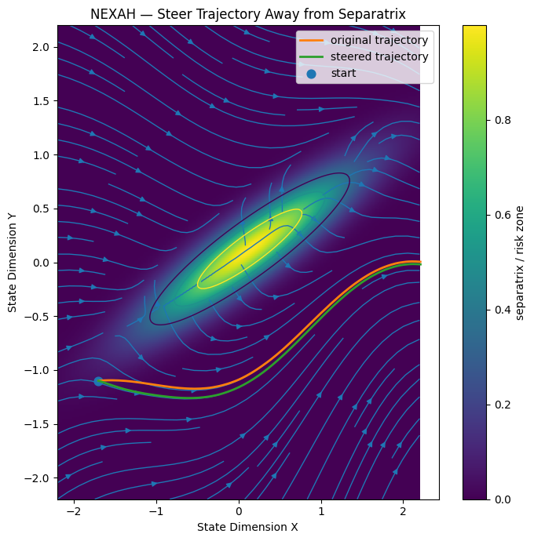
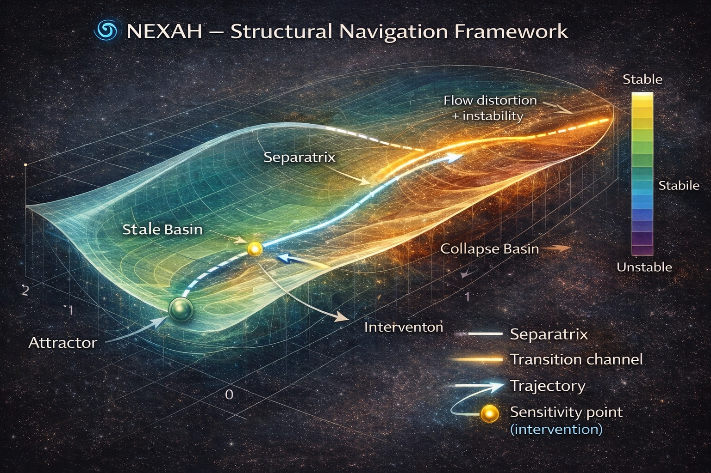

# CORE GEOMETRY — Transition Structure of NEXAH

---

## 🧠 Overview

CORE_GEOMETRY defines the **geometric foundation of regime transitions** in the NEXAH framework.

It formalizes the transition from:

→ discrete system descriptions  
→ continuous, field-aware dynamics  

into a unified model of:

> **transition geometry in phase-coupled dynamical systems**

---

## 🔬 Mathematical Foundation

The geometric interpretation of CORE_GEOMETRY is formalized in:

👉 [Geometric State-Space Framework](./GEOMETRIC_FRAMEWORK.md)

This document defines:

- the geometric embedding of system states  
- the field representation \( \dot{x} = F(x) \)  
- the coherence measure \( C(x) \)  
- the risk field \( R(x) \)  
- the control formulation \( \dot{x} = F(x) + u(x) \)  

It provides the **mathematical backbone** of the NEXAH framework and connects visual intuition with formal system dynamics.

---

## 🔁 Position in the NEXAH Architecture

CORE_GEOMETRY sits between:

- the **Field Layer** (continuous system representation)  
- and the **Operator Layer** (decision and navigation)  

It provides the missing link:

> how transitions actually occur within the field

---

## 🌐 From Geometry to Field

> Systems do not move between states.  
> They move within a **structured field**.

---

## 🌊 Field Structure (Empirical Evidence)



*System trajectories follow structured flow — not randomness.*

- motion is directional  
- instability follows field structure  
- stable and unstable regions emerge geometrically  

👉 **Insight:**  
The system already contains its own navigable structure.

---

## 🔀 Transition Geometry (Separatrix)

.png)

> A regime transition is not a point —  
> it is a **geometric boundary in state space**.

- separatrix = decision boundary  
- defines stable vs unstable trajectories  
- enables early detection of collapse  

---

## 🎯 Control on the Field


> Control is not external.  
> It operates **within the geometry of the field**.

- trajectories are reshaped  
- not just corrected  
- movement is geometry-aware  

---

## 🧭 Trajectory Steering



> Stability is maintained by **steering trajectories away from critical regions**.

- avoids separatrix crossing  
- maintains safe system operation  
- enables predictive control  

---

## ⚡ Early Collapse Detection


> Collapse is detectable **before it happens**.

- up to **43.9 seconds early**  
- based on geometric field structure  
- not threshold-based  

---

## 🧭 Geometric Framework Overview



CORE_GEOMETRY integrates:

- field structure  
- transition manifolds  
- control trajectories  
- navigation logic  

---

## 🔬 Coherence & Field Alignment

Coherence measures alignment between system motion and field direction:

$begin:math:display$
C\(x\) \= \\frac\{\\dot\{x\} \\cdot F\(x\)\}\{\|\\dot\{x\}\| \\\, \|F\(x\)\|\}
$end:math:display$

| Value | Meaning |
|------|--------|
| C ≈ 1 | stable (aligned motion) |
| C ≈ 0 | transition interface |
| C < 0 | opposing flow (collapse tendency) |

---

## 🔁 Field Split (Empirical Observation)

```text
Forward Flow   → C > 0
Interface      → C ≈ 0
Backward Flow  → C < 0
```

👉 **Insight:**  
The interface is not a boundary —  
it is a **region of reorganization**.

---

## ⚙️ Operators (Formal Role)

- **TMO** → transition detection  
- **BSO** → path selection  
- **MBEO** → expansion of futures  
- **CFO** → directional structure  
- **TNP / FANP** → navigation policies  

---

## 🧭 Conceptual Pipeline

```text
Simulation → Field → Geometry → Operator → Navigation → Execution
```

---

## 🎨 Visual Atlas

👉 **[CORE GEOMETRY VISUAL ATLAS](./CORE_GEOMETRY_VISUALS.md)**

Contains:

- full visual exploration  
- experimental structures  
- extended geometry variants  

---

## 🧠 Core Insight

> Systems do not jump between states.  
>  
> They move through structured transition geometry.

---

## 🚀 What CORE_GEOMETRY Enables

- early transition detection  
- branching analysis  
- multi-future modeling  
- field-aware navigation  
- collapse avoidance  
- trajectory control  

---

## 📌 Summary

CORE_GEOMETRY introduces the missing layer between:

→ discrete structure  
→ continuous dynamics  

It transforms NEXAH into:

> a **geometry-aware, field-navigating system**

---

## 🧭 Final Statement

Navigation is not about selecting the next state.

It is about:

> **moving correctly within the geometry that connects them**

---

## 🧠 Ultimate Insight

```text
You are not controlling the system.

You are shaping the geometry  
that makes outcomes possible.
```
