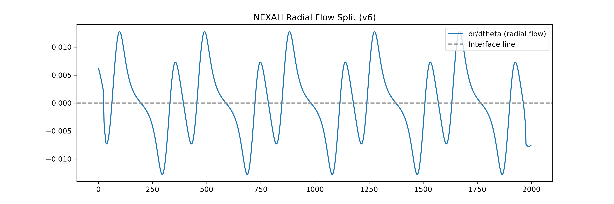
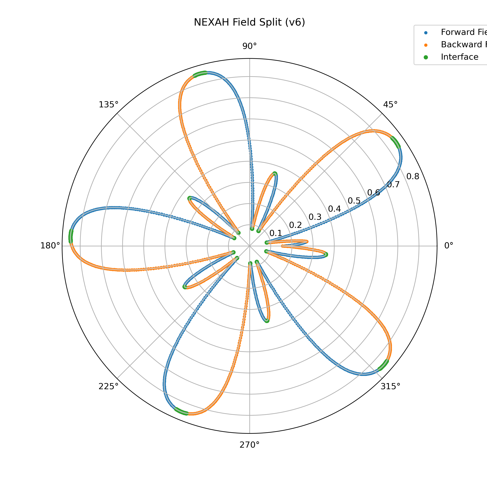
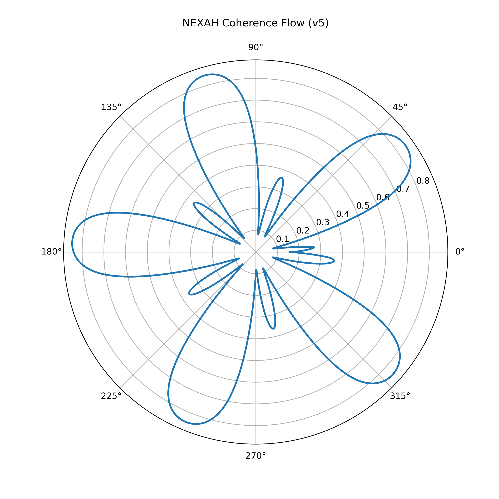
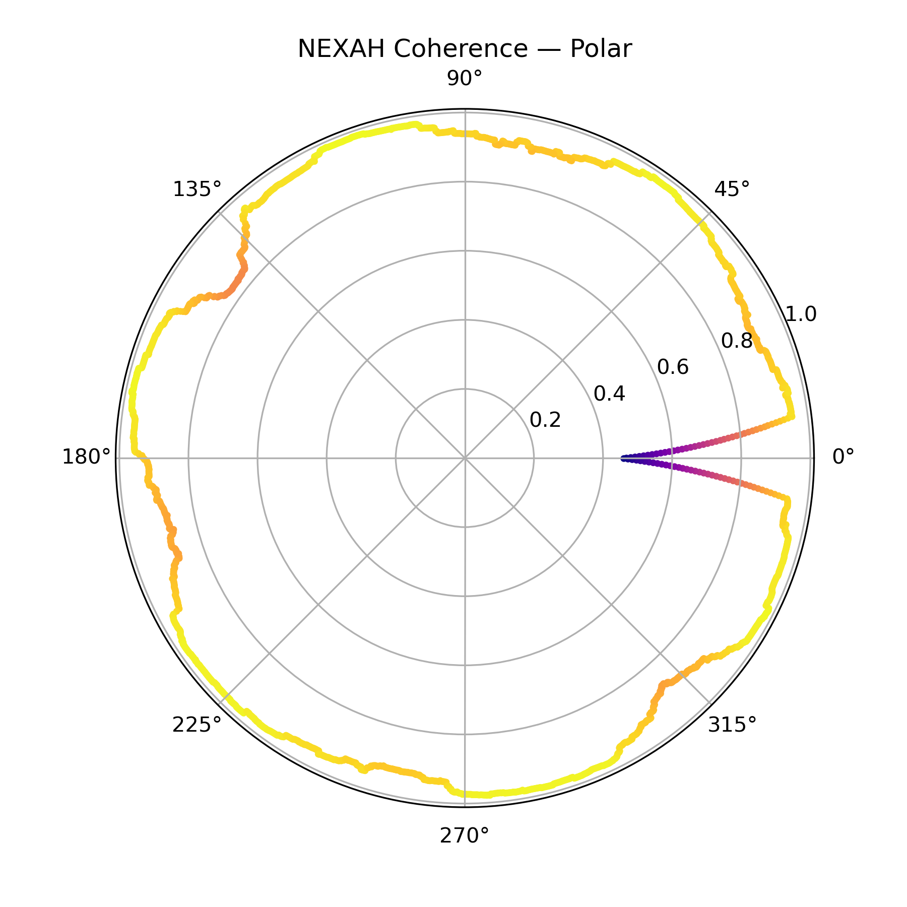

# FIELD SPLIT — Directional Flow Structure in NEXAH

---

## 🧠 Overview

The FIELD SPLIT describes a fundamental structural property of NEXAH:

> System dynamics are not uniform —  
> they split into **opposing directional flows**.

This phenomenon emerges directly from coherence analysis and is observed consistently across CORE_GEOMETRY experiments.

---

## 🔬 Core Observation

Empirical results (v5–v6) show:

- the system separates into **two directional motion fields**
- transitions occur at **coherence interface regions**
- motion is structured, not random

---

## 🔁 Field Decomposition

```text
Forward Field   → motion aligned with the field (C > 0)
Interface Layer → transition region (C ≈ 0)
Backward Field  → motion opposing the field (C < 0)
```

---

## 🔴 Core Insight

```text
The field is not homogeneous.

It is split into opposing directional flows,
connected through a structured interface layer.
```

---

## 🧭 Geometric Interpretation

The field behaves as:

- a **cyclic directional structure**
- composed of alternating flow sectors
- connected through coherence transitions

Observed structure:

- radial oscillation
- sector-based flow separation
- loop closure
- asymmetric flow distribution

---

## 📊 Visual Evidence

### 1. Radial Flow Structure



- shows oscillating flow (dr/dθ)
- zero-crossings define interface regions
- alternating expansion / contraction phases

---

### 2. Field Split (Polar Representation)



- blue → forward flow  
- orange → backward flow  
- green → interface  

Key observation:

→ flows occupy **distinct regions in phase space**

---

### 3. Coherence Flow (Precursor)



- shows continuous coherence evolution  
- reveals transition into structured sectors  

---

### 4. Polar Coherence Structure



- reveals cyclic structure of coherence  
- shows periodic alignment / misalignment  

---

## 🔁 Transition Mechanism

Transitions between flow regimes occur at:

→ **coherence zero-crossings**

Meaning:

- \( C > 0 \) → forward regime  
- \( C < 0 \) → backward regime  
- \( C \approx 0 \) → interface  

---

## 🧠 Interface Layer

The interface is not a boundary.

It is a **dynamic transition region** where:

- direction flips  
- trajectories reorganize  
- system stability is decided  

---

### Properties

- localized in phase space  
- repeatable across cycles  
- structurally stable  
- corresponds to transition manifolds  

---

## 🔄 Temporal Interpretation

The field encodes implicit time direction:

- forward field → future-directed evolution  
- backward field → return / memory dynamics  
- interface → present transition  

---

## 🌀 Topological Structure

The field split produces:

- loop structures  
- nested trajectories  
- asymmetric phase portraits  
- Möbius-like orientation changes  

---

## 🔗 Relation to CORE_GEOMETRY

The FIELD SPLIT emerges from:

- transition manifolds (oval structures)  
- cut regions (thresholds)  
- branching dynamics  

Mapping:

| CORE_GEOMETRY | FIELD SPLIT |
|--------------|------------|
| manifold | continuous field |
| cut | interface |
| branch | directional split |

---

## ⚠️ Collapse Interpretation

Collapse is not immediate.

It occurs when:

```text
the system enters the backward field
and fails to return to forward alignment
```

---

## 🚀 Operational Meaning

The field split enables:

- detection of directional instability  
- identification of transition zones  
- prediction of regime switching  
- flow-aware navigation strategies  

---

## 🧠 Structural Principle

```text
Systems evolve through alternating directional regimes.

Stability depends on maintaining alignment
with the forward flow
or navigating safely through the interface.
```

---

## 🔬 Experimental Status

Validated through:

- coherence-based simulations  
- polar field projections  
- radial flow analysis  
- phase-space comparison  

---

## 🔗 Related

- `coherence.md` → formal definition  
- `RESEARCH_VISION.md` → theoretical integration  
- `theorems.md` → formal derivation (pending update)

---

## 🧠 Final Insight

```text
The system does not move in one direction.

It oscillates between opposing flows.

Coherence defines where the transition happens.
```
