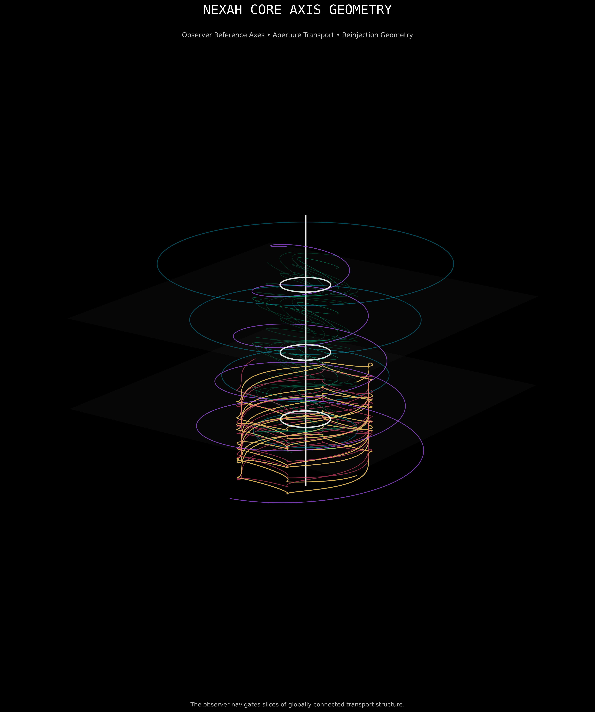
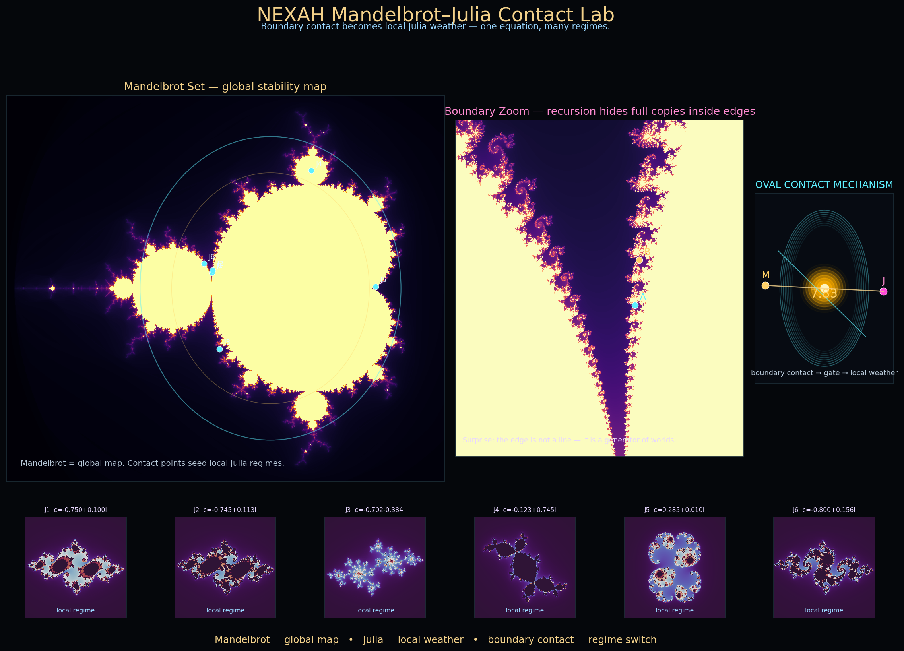

# 👁 NEXAH — Observer Geometry Lab



Experimental exploration of observer-relative geometry, local/global projections, transport organization, and manifold slicing inside complex dynamical systems.

---

# 🧠 Purpose

The Observer Geometry Lab investigates whether:

```text
local observations
can emerge from
globally connected structure
```

through projection, slicing, transport organization, and transition geometry.

This module serves as an experimental bridge between:

```text
transport geometry
→ observer geometry
→ local/global relations
→ navigable structure
```

within the broader NEXAH framework.

---

# 🌌 Core Visual



The Mandelbrot ↔ Julia Contact Lab explores the relationship between:

```text
global parameter structure
        ↓
local dynamical behavior
```

through boundary-contact regions inside fractal geometry.

Current interpretation:

```text
Mandelbrot
→ global landscape

Julia
→ local dynamics

contact point
→ observer position
```

This perspective strongly influenced the development of the Observer Geometry framework.

---

# 🔷 Central Question

Can systems exhibit:

```text
local fragmentation
```

while remaining:

```text
globally connected
```

through hidden transport organization?

The lab investigates whether observed structures such as:

- apertures
- shells
- corridors
- reinjection loops
- transport tubes
- orientation axes

can emerge naturally from projection and transport dynamics.

---

# 🧭 Core Concepts

Current investigations include:

- observer-relative geometry
- local ↔ global structure
- transport corridors
- aperture routing
- reinjection structures
- manifold slicing
- orientation axes
- shell geometry
- transport tubes
- Mandelbrot ↔ Julia relations
- projection-based navigation

---

# 🔑 Working Interpretation

Observation is modeled as:

```text
Global Structure
        ↓
Projection
        ↓
Local Observation
```

Formal relation:

```math
M
\xrightarrow{\Pi}
\mathcal O
```

where:

- $begin:math:text$M$end:math:text$ = global manifold
- $begin:math:text$\\Pi$end:math:text$ = projection operator
- $begin:math:text$\\mathcal O$end:math:text$ = observer slice

The observer never directly accesses the full structure.

Instead:

```text
the observer navigates
projections of globally connected geometry
```

---

# 📚 Module Structure

## Documentation

```text
docs/
```

Contains:

- NEXAH_CORE_AXIS_GEOMETRY.md
- NEXAH_WHITE_TRANSPORT_GEOMETRY.md
- README_WHITE_SERIES_MODUL.md

These documents contain the conceptual foundations of the Observer Geometry investigations.

---

## Scripts

```text
scripts/
```

Contains:

- generate_core_axis_master_visual.py
- nexah_mandelbrot_julia_contact_lab.py
- nexah_mandelbrot_julia_contact_lab_ii.py
- nexah_mandelbrot_julia_contact_lab_iii.py

These scripts generate exploratory visualizations and geometric experiments.

---

## Visuals

```text
visuals/
```

Contains:

- core_axis_master_visual.png
- nexah_mandelbrot_julia_contact_lab.png

Visual representations of transport geometry, observer projections, and local/global relations.

---

## Outputs

```text
outputs/
```

Generated experiment results and future validation artifacts.

---

# 🔬 Relation to NEXAH

Observer Geometry currently sits between:

```text
FRAMEWORK
        ↓
OBSERVER_GEOMETRY_LAB
        ↓
RESEARCH
```

It is currently considered:

```text
experimental
exploratory
under consolidation
```

and has not yet been promoted into the validated NEXAH Research Layer.

---

# 🚀 Future Directions

Potential future work includes:

- observer-dependent topology
- transport manifold reconstruction
- aperture persistence analysis
- reinjection geometry
- shell extraction
- corridor detection
- projection operators
- local/global navigation models
- fractal observer geometry
- transport-oriented manifold slicing

---

# ⚠ Current Status

This module is:

```text
✔ exploratory
✔ geometry-oriented
✔ visualization-driven
✔ conceptually consolidated
```

It is NOT currently:

```text
✘ a validated theory
✘ a formal mathematical framework
✘ an operational NEXAH core component
```

Further validation and integration work remain necessary.

---

# 🧭 NEXAH Principle

> The observer does not see the whole structure.
>
> The observer navigates projections of globally connected geometry.

---

**NEXAH — Observer Geometry Lab**  
Local ↔ Global Structure · Observer Slices · Aperture Transport · Reinjection Geometry  
Thomas K. R. Hofmann · 2026
