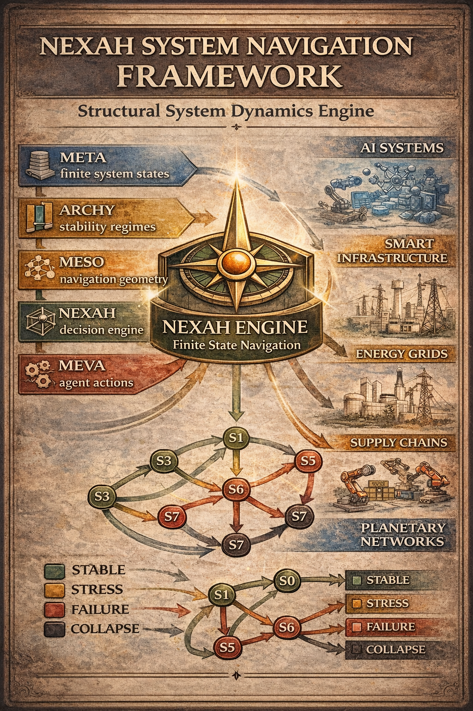
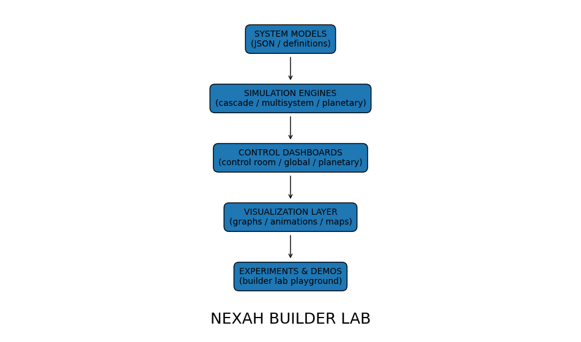

```markdown
# ⚡ NEXAH — Experimental Systems

This directory contains the **experimental and exploratory layers** of the NEXAH ecosystem.

It includes:

- theoretical foundations
- prototype architectures
- exploratory simulations
- navigation systems
- conceptual abstractions
- experimental engines
- builder environments

---

# 🧠 Purpose

The `EXPERIMENTAL/` layer serves as:

> the active exploration space of NEXAH

It bridges:

```text
theory
→ experimentation
→ prototype systems
→ future integration
```

---

# 🧭 Structure Overview

```text
EXPERIMENTAL/
│
├── FRAMEWORK/
├── BUILDER_LAB/
└── ...
```

---

# 🌐 FRAMEWORK/

```text
EXPERIMENTAL/FRAMEWORK/
```

Theoretical and conceptual foundation layer.

Contains:

- original NEXAH abstractions
- mathematical intuition
- coherence models
- regime concepts
- field-based interpretations
- historical architecture layers

The FRAMEWORK explains:

> why geometry, coherence, and navigation emerge from dynamics.

---

## 🧠 Core Concepts

The FRAMEWORK introduces:

```text
trajectory
→ field
→ coherence
→ risk
→ transitions
→ navigation
```

Key ideas include:

- coherence fields
- geometric stability
- regime transitions
- field-aware control
- navigation through structured dynamics

---

## 🔬 Mathematical Foundation

Core equations:

```math
\dot{x} = F(x)
```

Coherence metric:

```math
C(x)
=
\frac{
\dot{x}\cdot F(x)
}{
||\dot{x}||\,||F(x)||
}
```

Risk field:

```math
R(x)=1-C(x)
```

This reframes stability as:

> coherent motion within structured fields.

---

## 🎥 FRAMEWORK Visuals

See:

👉 `FRAMEWORK/FRAMEWORK_visual_gallery.md`

Includes:

- coherence landscapes
- risk geometry
- transition regions
- navigation structures
- field emergence diagrams

---

# ⚡ BUILDER_LAB/

```text
EXPERIMENTAL/BUILDER_LAB/
```

The active experimental sandbox of NEXAH.

This is the primary environment for:

- simulations
- experiments
- navigation systems
- prototype engines
- interactive demonstrations
- cascade dynamics
- multi-system exploration

---

# 🧪 Builder Lab Purpose

The Builder Lab explores systems as:

> navigable structures instead of static states.

It allows experimentation with:

- regime dynamics
- transition structures
- state graphs
- cascading failures
- infrastructure systems
- navigation policies
- multi-agent dynamics

---

# 🧱 Builder Lab Architecture

```text
CORE
→ DYNAMICS_ENGINE
→ RUNTIME
→ NAVIGATION
→ ENGINES
→ VISUALIZATION
```

---

## 🔹 CORE

Mathematical foundation layer:

- lattices
- operators
- state graphs
- convergence systems
- regime operators

---

## 🔹 DYNAMICS_ENGINE

Structure extraction layer:

- basin detection
- phase transition analysis
- topology construction
- flow field analysis
- regime extraction

---

## 🔹 NAVIGATION

Navigation through:

```text
state
→ regime
→ transition
→ action
```

Includes:

- policy systems
- control experiments
- navigation kernels
- adaptive movement systems

---

## 🔹 ENGINES

Application systems:

- energy grids
- infrastructure networks
- cascading failures
- planetary-scale systems
- multi-system simulations

---

## 🔹 VISUALIZATION

Visual interpretation layer:

- stability landscapes
- trajectory plots
- cascade visualizations
- topology maps
- flow structures

---

# 🎥 Builder Lab Visuals

## 🌐 System Navigation Framework



*Navigation through structured state-space systems.*

---

## ⚡ Energy Grid Simulation


*Experimental infrastructure stabilization and cascade modeling.*

---

## 🌍 Applications Map


*Potential application domains for NEXAH navigation systems.*

---

## 🧠 Builder Lab Architecture



*Relationship between simulation, structure extraction, navigation, and visualization.*

---

## 🔥 Cascade Simulation


*Propagation dynamics across connected systems.*

---

## 🧭 System Navigation


*Navigation through evolving regime landscapes.*

---

# 🚀 Running Builder Lab

From repository root:

```bash
python EXPERIMENTAL/BUILDER_LAB/run_builder_lab.py
```

Run demos:

```bash
python EXPERIMENTAL/BUILDER_LAB/demos/nexah_demo.py

python EXPERIMENTAL/BUILDER_LAB/demos/nexah_explorer.py

python EXPERIMENTAL/BUILDER_LAB/demos/nexah_graph_simulation.py
```

---

# 🧭 CLI Navigation

```bash
python EXPERIMENTAL/BUILDER_LAB/nexah_cli.py demo

python EXPERIMENTAL/BUILDER_LAB/nexah_cli.py explorer

python EXPERIMENTAL/BUILDER_LAB/nexah_cli.py systems-list
```

---

# 📚 Inventory & Internal Structure

Detailed inventory:

👉 `BUILDER_LAB/BUILDER_LAB_INVENTORY_INDEX.md`

Includes:

- architecture mapping
- module inventory
- system roles
- integration observations
- future consolidation targets

---

# ⚠️ Current Status

The EXPERIMENTAL layer contains:

```text
✔ active exploration systems
✔ prototype architectures
✔ navigation experiments
✔ conceptual extensions
✔ visualization systems
```

But also:

```text
⚠ fragmented structures
⚠ incomplete kernel integration
⚠ partially isolated subsystems
⚠ experimental abstractions
```

---

# 🧠 Relation to Main NEXAH System

The experimental layer supports:

```text
RESEARCH
→ FRAMEWORK
→ PROTO_CORE
→ NAVIGATION
→ VALIDATION
```

It acts as:

> the evolutionary laboratory of NEXAH.

---

# 🔥 Important Clarification

The systems inside `EXPERIMENTAL/` are:

```text
not finalized
not production-ready
not fully unified
```

Instead, they represent:

> an active structural discovery environment.

---

# 🧠 Final Insight

The experimental systems reveal a central NEXAH observation:

```text
systems evolve through structured regions,
not through random state changes.
```

Navigation, control, and stability emerge from this geometry.

---

# 🧭 Final Orientation

The `EXPERIMENTAL/` layer should currently be understood as:

> the exploratory and conceptual ecosystem of NEXAH —
> where theory, geometry, simulation, and navigation are actively developed.

---

**Thomas K. R. Hofmann · NEXAH · 2026**
```
