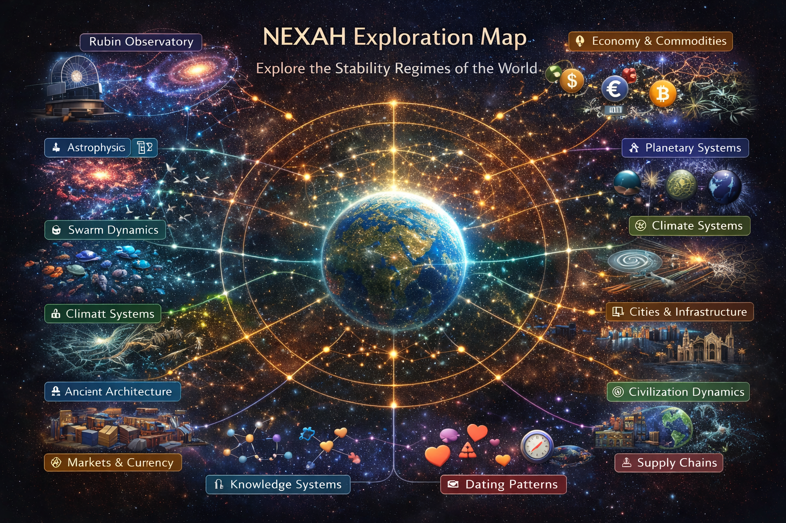
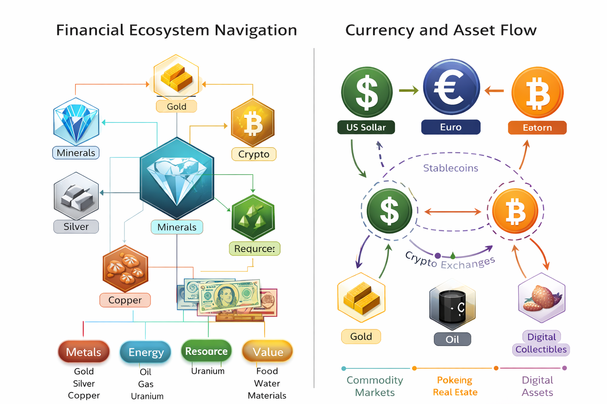
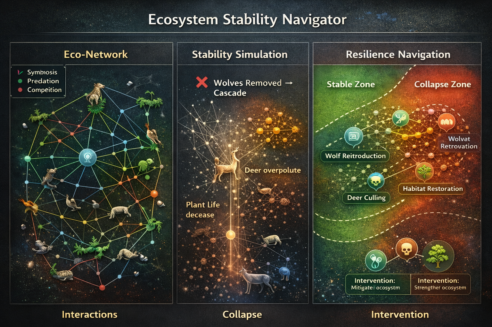
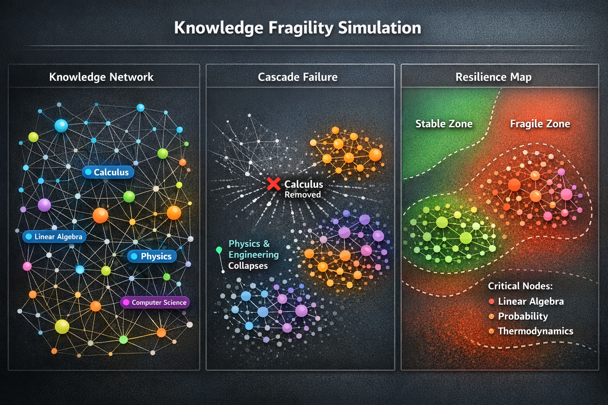

# The First 10 NEXAH Builder Challenges

Status: Open

The **NEXAH Exploration Hub** invites builders to explore complex systems through open modeling challenges.

These challenges focus on **understanding, simulating, and navigating large-scale systems** using the NEXAH framework.

They are intentionally open-ended.  
Builders are encouraged to develop their own models, simulations, visualizations, and navigation strategies.

---

# Exploration Map



The Exploration Hub connects multiple system domains where complex dynamics emerge.

Builders are encouraged to explore interactions between:

- infrastructure
- ecosystems
- financial networks
- planetary systems
- knowledge systems

---

# Challenge Philosophy

Most complex systems share similar structural behavior:

```
Observation
→ Pattern
→ Model
→ Simulation
→ Navigation
```

The goal of these challenges is not only to **analyze systems**, but to explore how they can be **navigated and stabilized**.

---

# Challenge 01  
# Energy Grid Cascade Simulator

Model cascading failures in electrical grids.

Real-world grids are vulnerable to:

- frequency drops
- sudden load changes
- line failures
- regional cascade effects

Possible tasks:

- simulate cascading failures
- test recovery strategies
- explore grid stabilization algorithms

Possible data sources:

- ENTSO-E grid data
- US power grid datasets
- synthetic infrastructure networks

---

# Challenge 02  
# Financial Contagion Network



Global financial systems behave like **interconnected networks**.

Failures propagate through:

- banks
- liquidity channels
- asset correlations
- derivatives networks

Tasks may include:

- modeling contagion spread
- systemic risk detection
- stability regime classification

Possible datasets:

- central bank balance sheets
- global financial network studies
- market correlation matrices

---

# Challenge 03  
# Ecosystem Stability Navigator



Ecosystems are dynamic networks of species interactions.

Key dynamics include:

- predator-prey relationships
- biodiversity thresholds
- collapse tipping points
- resilience cycles

Builders can explore:

- ecosystem collapse modeling
- biodiversity stability indicators
- network resilience simulations

---

# Challenge 04  
# Urban System Resilience

Cities are complex adaptive systems combining:

- energy networks
- logistics systems
- water infrastructure
- human mobility

Tasks:

- simulate cascading infrastructure failures
- design resilient city systems
- model urban recovery dynamics

Datasets may include:

- mobility data
- urban infrastructure networks
- transportation flows

---

# Challenge 05  
# Planetary Infrastructure Map

Modern civilization depends on **planet-scale infrastructure networks**.

Examples:

- satellite constellations
- internet backbone
- global shipping routes
- aviation networks

Possible builder tasks:

- map global infrastructure dependencies
- simulate network disruptions
- visualize planetary system layers

---

# Challenge 06  
# Knowledge Fragility Simulation



Knowledge systems evolve through time but are vulnerable to collapse.

Historical examples include:

- loss of libraries
- destruction of knowledge centers
- scientific paradigm shifts

Builders may explore:

- knowledge network growth models
- fragility of information systems
- cultural knowledge propagation

---

# Challenge 07  
# Pattern Detection in Astronomical Data

Large astronomical surveys generate enormous data streams.

Example datasets:

- Rubin Observatory
- Gaia mission
- Hubble archives

Possible tasks:

- detect structural patterns in astronomical datasets
- cluster celestial objects
- identify unknown system behaviors

---

# Challenge 08  
# Global Supply Chain Dynamics

Supply chains form **global flow networks**.

Important dynamics:

- logistics bottlenecks
- cascading disruptions
- geopolitical dependencies

Builder tasks may include:

- modeling supply chain resilience
- identifying systemic vulnerabilities
- designing adaptive logistics networks

---

# Challenge 09  
# Currency System Evolution

Currency systems evolve through cycles:

- commodity currencies
- fiat systems
- digital currencies
- crypto networks

Builders may explore:

- network models of currency flows
- stability of monetary regimes
- cross-currency system interactions

---

# Challenge 10  
# Multi-Layer System Navigator

Most real-world systems are not isolated.

They interact across layers:

- energy
- finance
- ecology
- infrastructure
- information systems

Example exploration structure:

```
energy system
↓
financial system
↓
supply chain system
↓
urban infrastructure
```

Understanding cross-system interactions is essential for navigating complex planetary systems.

---

# Builder Contributions

Builders are encouraged to contribute:

- simulation models
- datasets
- visualization tools
- system maps
- navigation algorithms

Projects may be implemented using:

- Python
- network science tools
- simulation frameworks
- machine learning systems

---

# Philosophy

The NEXAH framework is based on a simple idea:

```
Complex systems cannot only be observed.
They must be navigated.
```

Understanding **system structure, regime transitions, and navigation strategies** is essential for working with planetary-scale systems.

---

# Join the Exploration

The NEXAH Exploration Hub is an open invitation to explore how complex systems behave and how they can be understood.

Builders are welcome to extend these challenges or create new ones.

```
Library
→ Instrument
→ Exploration
```

```
Orientation is not belief.
It is a design problem.
```
