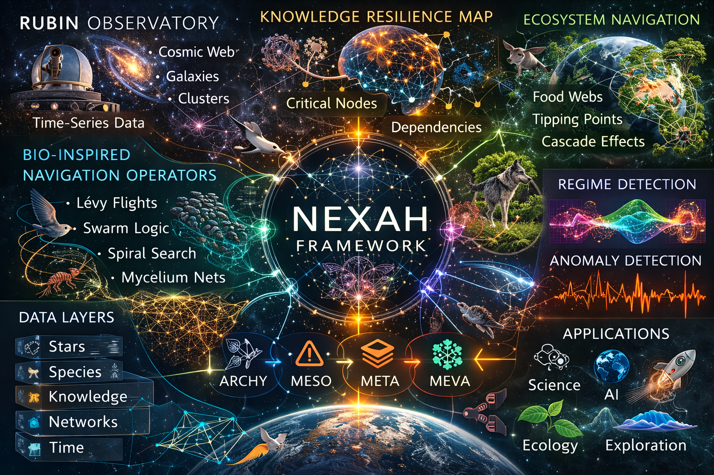
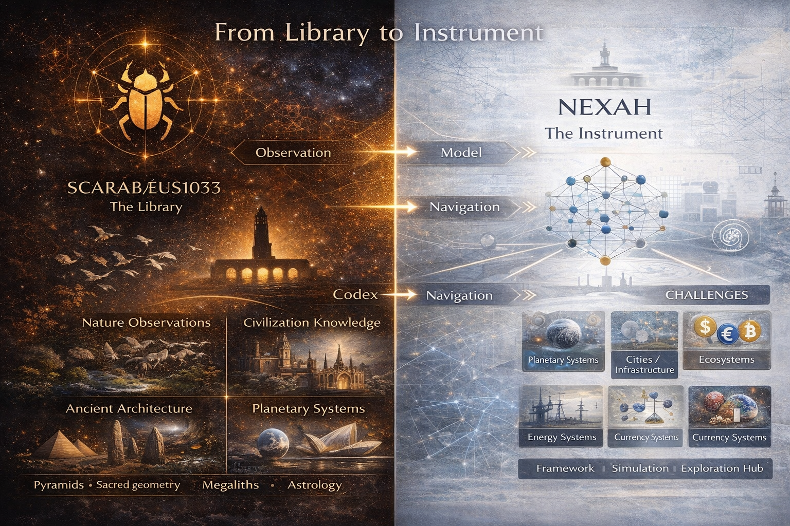

# How to Contribute


The **NEXAH Exploration Hub** is an open builder environment.

Researchers, engineers, data scientists, and explorers are invited to contribute models, simulations, and system explorations.

The goal is to collectively explore how **complex systems behave and how they can be navigated.**

---

# Builder Philosophy

The NEXAH framework follows a simple progression:

```
Observation
→ Pattern
→ Model
→ Simulation
→ Navigation
```

Builders can contribute at **any stage of this chain**.

---

# Framework Orientation



The NEXAH framework connects multiple knowledge and system layers:

- astronomy
- ecology
- infrastructure
- financial systems
- knowledge networks
- anomaly detection

Contributions may focus on **any domain where complex system behavior emerges.**

---

# Types of Contributions

Builders can contribute many kinds of work.

## Simulation Models

Examples:

- infrastructure simulations
- ecosystem dynamics models
- financial network models
- planetary system simulations

---

## Data Integration

Examples:

- astronomical datasets
- ecological network data
- financial system data
- infrastructure topology data

---

## Visualization Systems

Examples:

- system graphs
- network maps
- regime diagrams
- simulation dashboards

---

## Navigation Algorithms

Examples:

- anomaly detection
- system regime detection
- resilience prediction
- cascade risk detection

---

# Example Builder Paths

Builders often start from a domain they already know.

Examples:

### Ecology

Build models of:

- food webs
- species interaction networks
- ecosystem collapse thresholds

---

### Infrastructure

Simulate systems such as:

- power grids
- logistics networks
- urban infrastructure

---

### Finance

Explore:

- financial contagion networks
- currency system dynamics
- systemic risk propagation

---

### Astronomy

Analyze:

- Rubin Observatory datasets
- galaxy clustering
- cosmic structure patterns

---

# Suggested Tools

Many builders use:

- Python
- Jupyter notebooks
- NetworkX
- PyTorch
- graph analysis tools
- simulation frameworks

However, **any language or tool is welcome.**

---

# Contribution Structure

Typical contributions include:

```
model/
    simulation_code.py

data/
    dataset_description.md

visuals/
    graphs_or_maps.png

README.md
```

Explain:

- the system being explored
- the model assumptions
- the navigation questions

---

# Submitting Contributions

Contributions may include:

- simulation models
- datasets
- visualization systems
- research explorations

Contributors can submit work through:

- pull requests
- shared model repositories
- open exploration proposals

---

# Exploration Mindset

The Exploration Hub is not focused on final answers.

Instead it encourages:

- experimentation
- system exploration
- cross-domain thinking
- model comparison

Complex systems often reveal their structure only through **iterative exploration.**

---

# From Library to Instrument



The broader project connects:

```
SCARABÆUS1033
Library of knowledge patterns

↓

NEXAH
System modeling framework

↓

Exploration Hub
Builder environment
```

Builders extend the system by exploring new models and domains.

---

# Final Note

```
Orientation is not belief.
It is a design problem.
```

The Exploration Hub exists to explore how complex systems can be **understood, modeled, and navigated.**

---

NEXAH Framework  
Open Exploration Initiative
