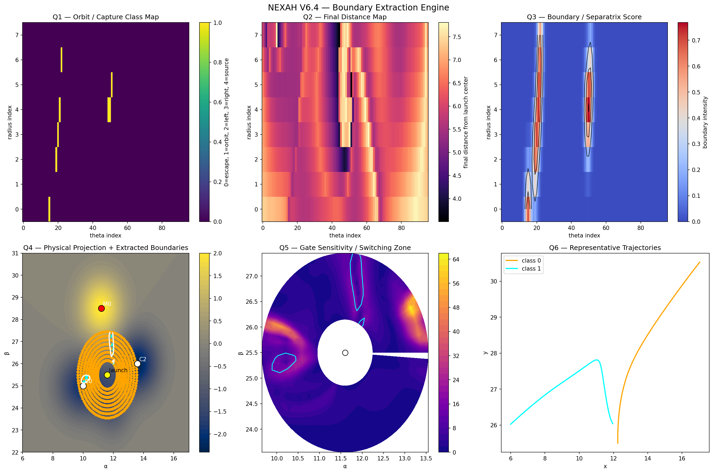

# 🔬 NEXAH — Field Decomposition Layer

## 🔥 What this module shows (in 5 lines)

- complex systems form **structure**, not randomness  
- motion follows **geometry**, not arbitrary paths  
- transitions occur along **specific boundaries**  
- outcomes are **constrained, not freely chosen**  
- stability and change can be **read directly from the field**

---

## 🔬 Field Structure (V6)



→ transition geometry emerges from the field

---

## 🧭 Navigation

| Section | Description |
|--------|------------|
| 👉 [Abstract](abstract.md) | Core idea, method, and main result |
| 📐 [Mathematical Foundations](mathematical_foundation.md) | Formal structure and equations |
| 🔍 [Exploratory Findings](exploratory_findings_log.md) | Observations and patterns |
| 🧱 [Build Log](build_log.md) | Development history and evolution |
| 🖼️ Visual Outputs | `outputs/` — all generated figures |

---

## Overview

This module explores a continuous 2D dynamical field and extracts:

- structure (basins, boundaries, channels)
- dynamics (trajectories, orbits)
- transitions (sensitivity, separatrix-like regions)
- navigation (cost, reachability, optimal flow)
- stability (Lyapunov structure)

It is built through iterative simulation, visualization, and structural analysis.

It is:

→ not a physical theory  
→ not a new mathematical framework  

It is:

→ a **computational system for extracting geometry from dynamics**

---

## Core Idea

> Structure shapes motion.

The system is defined by:

\[
\dot{x} = -\nabla V(x) + R(x)
\]

Where:

- gradient → attraction  
- rotation → curvature and persistence  

Result:

→ motion is not imposed  
→ it **emerges from field geometry**

---

## Pipeline

```text
field
→ trajectories
→ structure detection
→ boundary extraction
→ cost field
→ navigation
→ stability analysis
```

---

## Key Capabilities

- basin detection  
- orbit classification  
- separatrix-like boundary detection  
- sensitivity mapping  
- cost-based navigation  
- energy landscape estimation  
- Lyapunov stability mapping  
- gate detection (weak stability regions)  

---

## Visual System

| Layer | Meaning |
|------|--------|
| Q1 | trajectory class map |
| Q2 | field + trajectories |
| Q3 | sensitivity |
| Q4 | geometric projection |
| Q5 | orbit bands |
| Q6 | representative trajectories |

Extended layers:

- V7 → cost, navigation, reachability  
- V8 → stability (Lyapunov), gates, injection behavior  

---

## Key Observations

Across all phases, the system consistently shows:

- multiple attractor basins  
- orbit-like trajectories  
- structured transition regions ("Riss")  
- narrow transition corridors ("splinter")  
- asymmetric flow behavior  
- layered orbit families  

Important:

→ these structures **emerge from the field**  
→ they are not manually imposed  

---

## Navigation Layer (V7)

- cost field → effort to reach a target  
- navigation field → optimal direction  
- reachability → where motion is possible  

→ motion is **geometrically constrained**

---

## Stability Layer (V8)

- global stability structure  
- weak regions along boundaries ("gates")  
- strong stability inside basins  

```text
The system contains gates, but no decisions.
```

→ all perturbations converge to the same attractor  

---

## Transport & Temporal Layer (V9–V10)

### Transport (V9)

- trajectories map to consistent outcomes  
- flow organizes into channels and regimes  

→ transport is **structured**

---

### Temporal Signals (V10)

- boundaries act as early-warning signals  
- structural change appears before collapse  

```text
The field defines where motion goes — and when it changes.
```
---

## System Interpretation

→ a **directed dynamical system**

- structured flow  
- constrained transitions  
- dominant attractor  
- no branching decision structure  

---

## Example Visuals

### Navigation Field


---

### Energy Landscape


---

### Injection Behavior


---

## Project Structure

```text
FIELD_DECOMPOSITION/

scripts/
├── v2_* → field separation
├── v3_* → structure detection
├── v4_* → unified views
├── v5_* → gradient vs rotation
├── v6_* → boundaries
├── v7_* → navigation
├── v8_* → stability

outputs/
├── v6_*/
├── v7_*/
├── v8_*/
├── v9_*/
├── v10_*/
```

---

## How to Run

```bash
python scripts/v6_6_core.py
python scripts/v7_2_transition_cost_map.py
python scripts/v8_0_lyapunov_map.py
```

---

## Final Insight

```text
The system does not offer choices.

It defines paths.
```

---

## Next Steps

- stochastic perturbation  
- multi-target navigation  
- higher-dimensional extension  
- analytical approximation  
- integration into NEXAH Navigator  

---

## Final Note

Understanding emerges from:

> reading the field — not just observing trajectories


