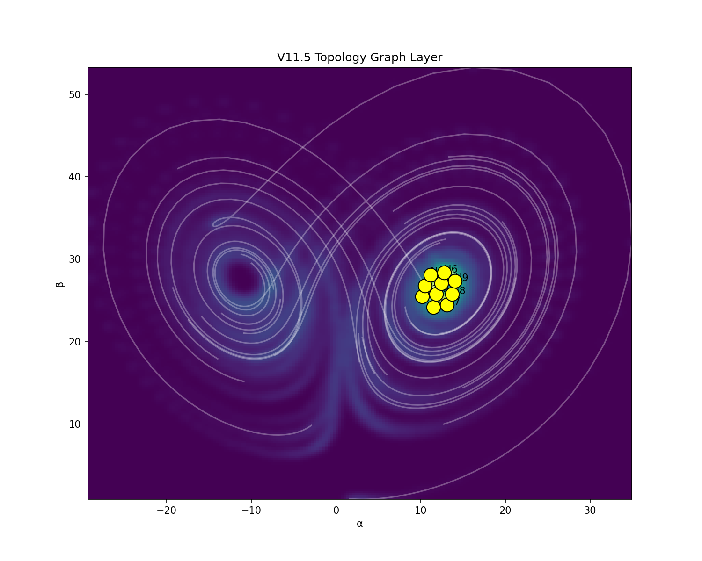
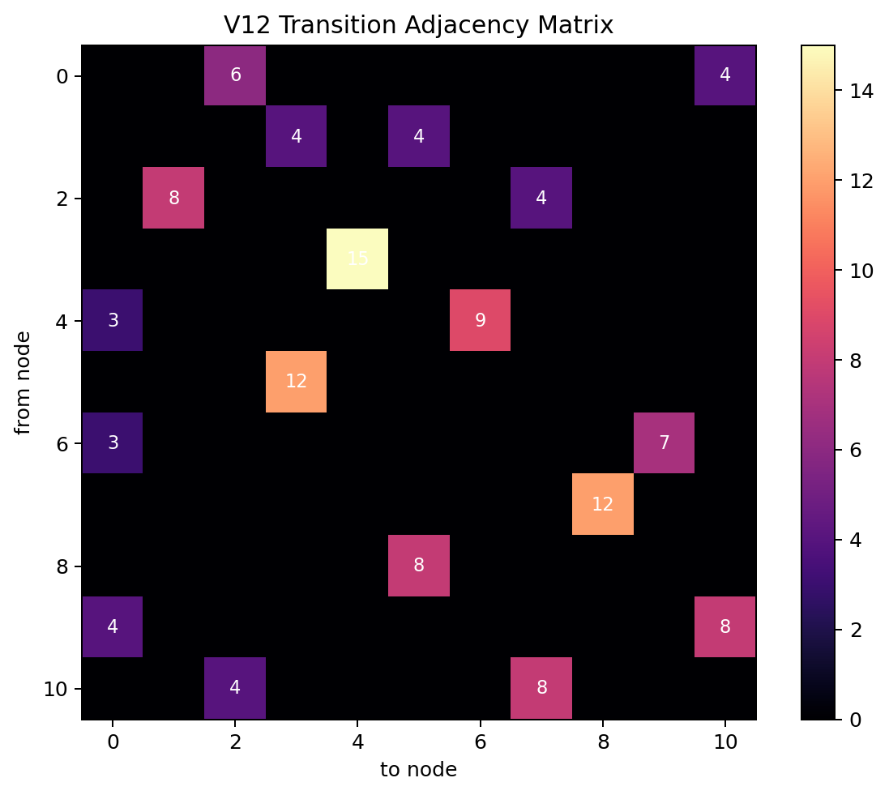
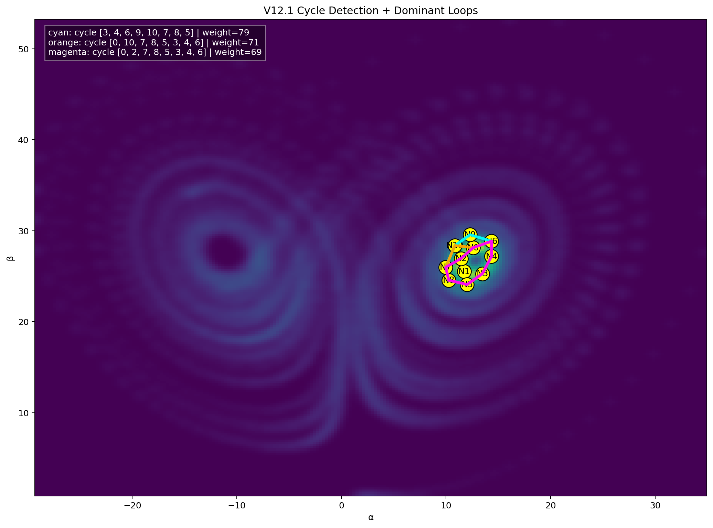
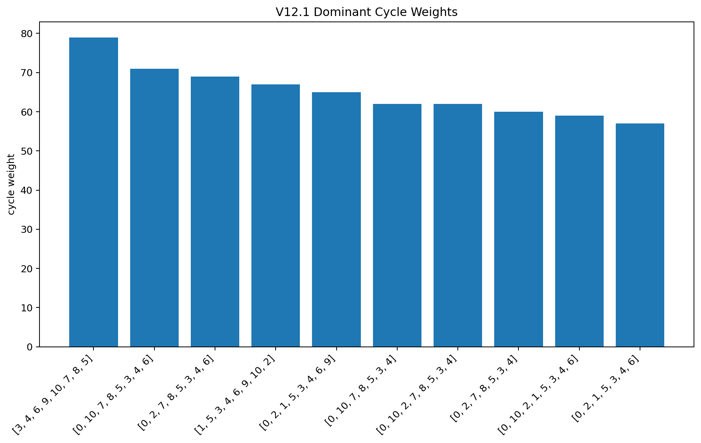

# 🧭 NEXAH — Field Layer

The **Field Layer** connects structure discovery with navigation.

It transforms raw system dynamics into a **structured, interpretable coordinate system** —  
and extends this into a **transition-aware field representation**.

---

# 🔥 Core Idea

Discovery reveals:

- events  
- transitions  
- probability fields  
- energy landscapes  
- divergence and curl  

But this is not yet usable for navigation.

The Field Layer introduces:

> **a coordinate system aligned with the system's intrinsic flow**

and builds on top of it:

> **a structured representation of transitions as directional processes**

---

# 🧠 Concept

Instead of analyzing systems only in raw coordinates:

## Field-Aligned Representation

Each state is decomposed into:
```text
x(t) = α(t) · e₁ + β(t) · e₂ + γ(t) · e₃
```

Where:

* e₁ = dominant flow direction (PCA / intrinsic axis)
* e₂, e₃ = orthogonal deviation directions

## Interpretation

| Component | Meaning |
|----------|--------|
| α (alpha) | motion along the flow (system progression) |
| β, γ | deviation from structure (instability / transition) |

---

## Key Insight

> Systems are not defined by position —  
> but by **movement relative to their structure**

---

# 🔬 What This Enables

The Field Layer makes it possible to:

---

## 1. Detect Structure

- identify dominant flow directions  
- define transition channels  
- measure alignment vs deviation  

---

## 2. Quantify Stability

- low deviation → stable trajectory  
- high deviation → transition or instability  

---

## 3. Extract Transition Geometry

- transitions are not points  
- transitions occupy **structured regions in state space**  

---

## 4. Identify Transition Channels

- density fields reveal preferred paths  
- ridge detection extracts **transition skeletons**  

---

## 5. Model Transition Dynamics

- transitions are **directional**  
- flow fields define how systems move through instability  

---

## 6. Decompose Transition Phases

Transitions can be segmented into:

```text
ENTRY → CORE → EXIT
```
→ transitions are processes, not events

---

## 7. Prepare Navigation

Transforms raw system output into:

> **a structured state representation usable by the Navigator**

---

# 🧬 Extended Capabilities (V9 → V12)

The Field Layer has evolved beyond flow representation.

It now reconstructs the **discrete structure underlying continuous dynamics**.

---

## 🔷 8. Discrete State Emergence

Continuous trajectories collapse into:

- stable regions
- recurring spatial clusters

→ interpreted as **states**

---

## 🔷 9. Topological State Space

From V11.5:

- ~10–11 stable nodes detected
- strong clustering in attractor regions



> The system self-organizes into a finite state space

---

## 🔷 10. Transition Graph

From V12:

- transitions between nodes are directional
- edges are weighted by frequency




> The system behaves as a **directed weighted graph**

---

## 🔷 11. Dominant Transitions

Observation:

- not all transitions are equal
- certain edges dominate (e.g. weight ≈ 15)

→ emergence of **preferred system routes**

---

## 🔷 12. Cycle Structure

From V12.1:

- closed loops detected
- dominant cycle weight ≈ 79





> The system operates on **recurring transition cycles**

---

## 🔷 13. Multiple Dynamic Regimes

Observation:

- several competing cycles (79, 71, 69, 67…)
- shared structure, different entry points

→ interpreted as:

> **orbit families within the same system**

---

## 🔷 14. Attractors as State Machines

Combining:

- nodes
- transitions
- cycles

→ each attractor behaves like:

> a **cyclic state machine**

---

# 🧠 Updated Conceptual Model

The system is no longer just a flow field.

It is:

```text
continuous dynamics
→ structured flow
→ transition channels
→ discrete states
→ transition graph
→ cyclic system behavior
```

# 🔥 Key Shift

Previous view:

transitions are structured processes

New view:

the system is a closed, cyclic transition system

---

# 🧭 Implication for Navigation

Navigation is no longer:

- local (gradient following)
- event-based

Instead:

navigation must operate on  
cycle structure and state transitions

---

# 🧬 Final Insight

The Field Layer reveals:

a hidden discrete structure inside continuous dynamics

This structure is:

- stable  
- repeatable  
- navigable  

---

# 🚀 Updated Pipeline

~~~text
Raw Dynamics
→ PCA Projection (α, β, γ)
→ Deviation Field
→ Density Field
→ Ridge Extraction
→ Flow Field
→ Trajectories
→ Topology (Nodes)
→ Transition Graph
→ Cycle Detection
~~~

---

# ⚡ What This Means

The Field Layer is no longer just a transformation layer.

It is now:

a Dynamical System Reconstruction Engine

---

# 🚧 Next Steps

- cycle entry / exit analysis  
- stability ranking of cycles  
- control layer (active navigation)  


---

# 🔁 Role in NEXAH Architecture

~~~text
Dynamics
→ Discovery Engine
→ Field Layer
→ Navigator
~~~

---

## Responsibilities

| Layer | Role |
|------|------|
| Discovery | extract structure from dynamics |
| Field Layer | transform structure into coordinates + transition field |
| Navigator | act based on structured representation |

---

# ⚡ Current Status

✔ Flow-aligned coordinate system (PCA-based)  
✔ Deviation-based instability metric  
✔ Transition detection (peaks vs switches)  
✔ Pre-transition signal mapping (predictive structure)  
✔ 3D transition geometry  
✔ Density field representation  
✔ Ridge (transition channel) extraction  
✔ Directional flow field  
✔ Flow segmentation (ENTRY / CORE / EXIT)  

---

# 🧪 Pipeline (Implemented)

~~~text
Raw Dynamics
→ PCA Projection (α, β, γ)
→ Deviation Field D(t)
→ Transition Detection
→ Density Field
→ Ridge Extraction
→ Directional Field
→ Flow Segmentation
~~~

---

# ⚠️ Important Clarification

The Field Layer does NOT assume:

- a universal coordinate system  
- a fixed global axis  

Instead:

> it computes **data-driven, system-specific structure**

---

# 🧠 Final Insight

The Field Layer introduces a new perspective:

> systems are best understood as  
> **flow + deviation within a structured transition field**

---

# 🔥 Summary

The Field Layer is the missing link between:

- structure discovery  
- and actionable navigation  

It converts:

~~~text
raw dynamics → structured representation → transition field → usable intelligence
~~~

---

# 🚀 Next Steps

- ridge-based trajectory reconstruction  
- directional probability fields  
- integration into Navigator  

---

**Status:** Active Development  
**Role:** Core architectural bridge  

