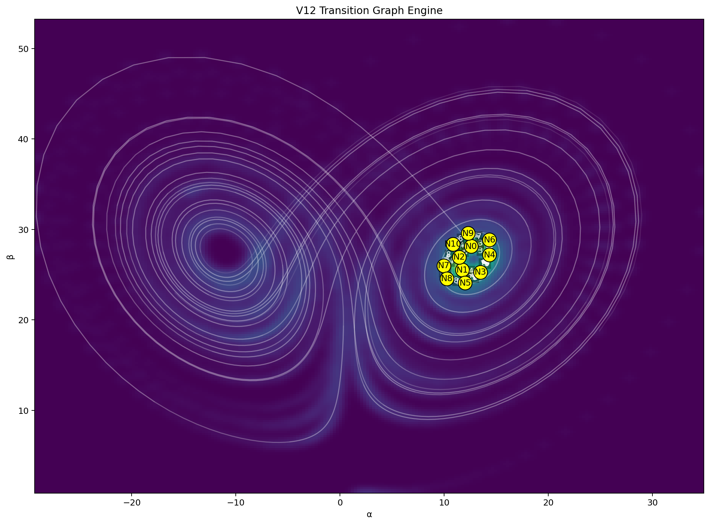
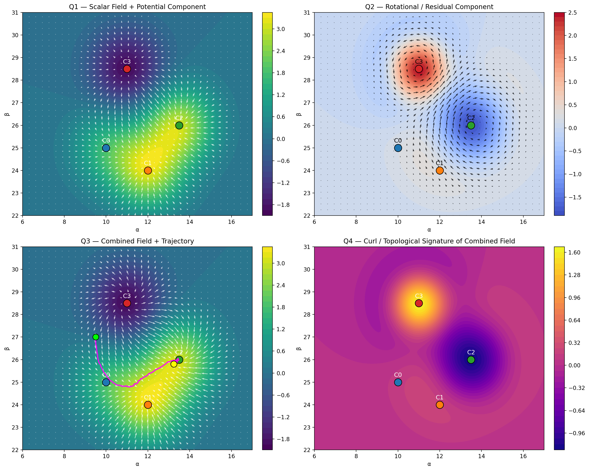
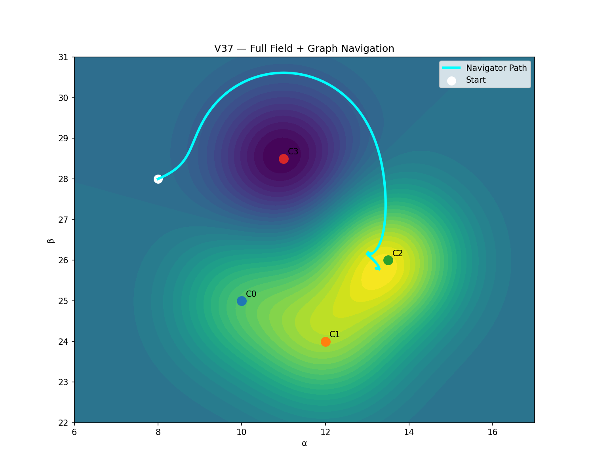
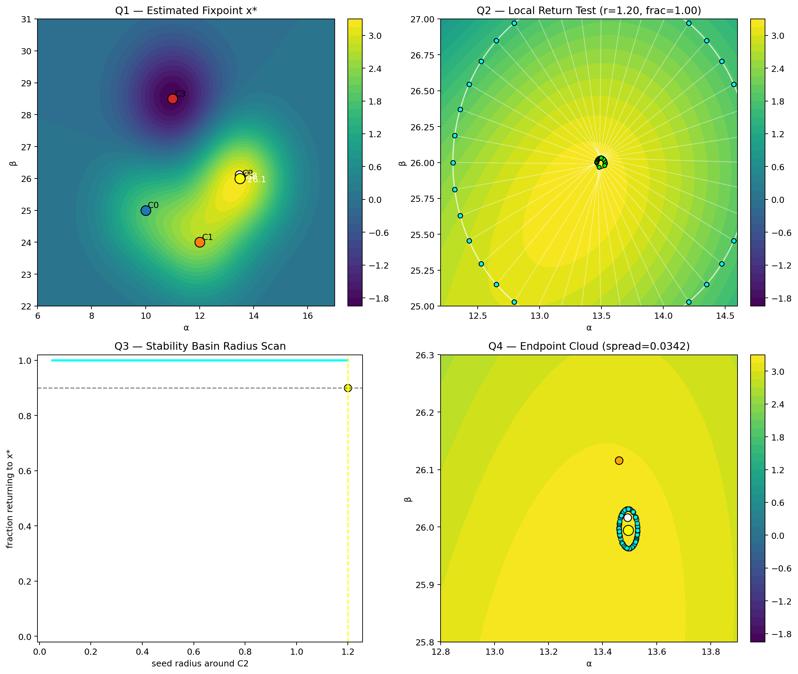

# 🧭 NEXAH — Field Layer


---

# 🔷 Quick Entry

NEXAH transforms complex dynamical systems into:

- structured fields  
- navigable trajectories  
- stability-aware geometries  

It reveals:

→ where systems move  
→ where they can move  
→ and where they must converge  

---

## 🧠 What NEXAH actually does

NEXAH converts time-series dynamics into a structured field  
where motion, transitions, and convergence become directly observable.

---

## 🔥 Core Insight

```text
The system does not offer choices.
It defines paths.
Those paths define outcomes.
```

---

# 🔥 Core Idea

Discovery reveals:

- events  
- transitions  
- probability fields  
- energy landscapes  
- divergence and curl  

But this alone is not sufficient.

The Field Layer introduces:

> a coordinate system aligned with the system’s intrinsic flow  
> and a field representation where motion, transitions, and convergence become explicit

---

# 🧠 Concept

## Field-Aligned Representation

x(t) = α(t) · e₁ + β(t) · e₂ + γ(t) · e₃

| Component | Meaning |
|----------|--------|
| α | motion along system flow |
| β, γ | deviation from structure |

---

## Key Insight

> Systems are not defined by position  
> but by movement relative to their intrinsic structure

---

# 🔬 What This Enables

- structure detection  
- stability quantification  
- transition geometry  
- flow modeling  
- phase decomposition  

ENTRY → CORE → EXIT

---

# 🎯 Core Result

The Field Layer reveals:

> a structured dynamical field  
> with explicit attractors and convergence

---

# 🧬 From Flow → Topology

## Discrete State Emergence

Continuous trajectories collapse into:

- stable regions  
- recurring clusters  

---

## Topological Structure


---

## Transition Graph



---

## Cycle Structure


---

# 🧭 Navigation Implication

Navigation is no longer:

- event-based  
- local  

Instead:

> navigation operates on structure and transitions

---

# ⚙️ Control & Learning

- control layer  
- energy-based transitions  
- policy learning  
- robustness  

---

# 🌊 Continuous Field Control

dx/dt ≈ -∇V(x)

- smooth convergence  
- attractor basins  

---

# 🌐 Geometry & Flow Structure



> The system is governed by global flow geometry

---

# 🎯 Control & Navigation



> complex dynamics collapse into structured navigation

---

# 🌀 Final Structure

Fixpoint:

x* ≈ (13.494, 25.994)

Local dynamics:

dx/dt = J(x - x*)



---

# 🧠 Final Model

dynamics  
→ field  
→ geometry  
→ topology  
→ control  
→ navigation  
→ convergence  

---

# 🔁 Role in NEXAH

Dynamics  
→ Discovery Engine  
→ Field Layer  
→ Navigator  

| Layer | Role |
|------|------|
| Discovery | extract structure |
| Field Layer | build geometry + topology |
| Navigator | act on structure |

---

# 🧪 Pipeline

Raw Dynamics  
→ Projection  
→ Deviation Field  
→ Density Field  
→ Ridge Extraction  
→ Flow Field  
→ Topology  
→ Transition Graph  
→ Control  
→ Continuous Field  
→ Dynamic Field  
→ Attractor  
→ Fixpoint  

---

# 🔬 Field Decomposition Module

A dedicated submodule explores:

- field structure  
- navigation geometry  
- stability geometry  
- transport & regime structure  

👉 Open here:

FIELD_DECOMPOSITION/

---

## What it adds

- gradient vs rotational decomposition  
- separatrix-like structures  
- cost-based navigation  
- Lyapunov stability maps  
- transport channels  
- dynamic boundary signals  

---

## Key Result

Boundaries are not static.  
They are dynamic signals of system change.

---

# ⚠️ Important Clarification

This system is:

- computational  
- empirical  
- structure-driven  

It does NOT:

- claim new physical laws  
- provide closed-form solutions  

---

# 🚀 Next Steps

- stochastic perturbations  
- multi-attractor systems  
- real-world system mapping  
- integration with Navigator  

---

# 🔥 Final Insight

Complex systems are not random.

They are structured fields  
with constrained motion and inevitable convergence.

---

# 🚀 Extension — From Reconstruction to Control

The FIELD_LAYER is no longer only a representation layer.

It now integrates:

- field reconstruction (how the structure emerges)
- navigation (how motion follows structure)
- control (how transitions are actively used)

---

## 🔹 Field Reconstruction (Input Layer)

The system field is reconstructed from trajectory data.

Key additions:

- validity regions (where reconstruction is reliable)
- boundary detection (where structure changes)
- flow channels (preferred motion paths)

👉 See module:
`CORE/field_reconstruction/`

---

## 🔹 Control Layer (Intervention Layer)

The system is not only navigable — it is controllable.

Control operates via:

- basin detection (stable regimes)
- separatrix extraction (transition boundaries)
- gate detection (optimal transition points)
- gate tracking (dynamic transitions)

👉 See module:
`CORE/control_layer/`

---

## 🔥 Key Extension Insight

> The field is not only a structure —  
> it is a space of possible transitions.

---

## 🧭 Updated Pipeline

```text
Dynamics
→ Reconstruction
→ Field Geometry
→ Stability Structure
→ Transition Boundaries
→ Gate Extraction
→ Control
→ Navigation
→ Convergence
```

## 🔹 Transition Geometry (NEW CORE)

New structural elements:

- Basins → stable long-term behavior  
- Separatrix → boundary between regimes  
- Gates → minimal-cost transition points  

👉 Control operates **on these structures**

---

## 🔹 Visual Example (Core Transition Structure)


→ boundaries define where control is possible

---

## 🔹 Gate Dynamics


→ transitions are dynamic  
→ control must adapt in time  

---

## 🧠 Updated System View

| Layer | Role |
|------|------|
| Reconstruction | builds field |
| Field Layer | defines geometry |
| Control Layer | enables intervention |
| Navigator | executes movement |

---

## 🔥 Final Insight

> The FIELD_LAYER is no longer passive.  
>  
> It becomes a **control-aware dynamical system representation**.

