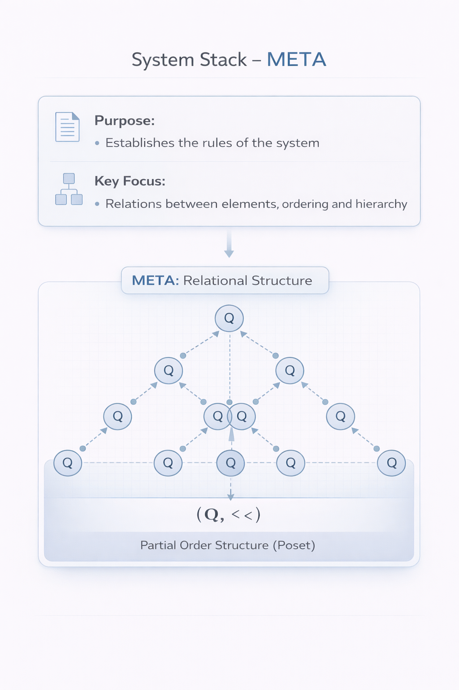
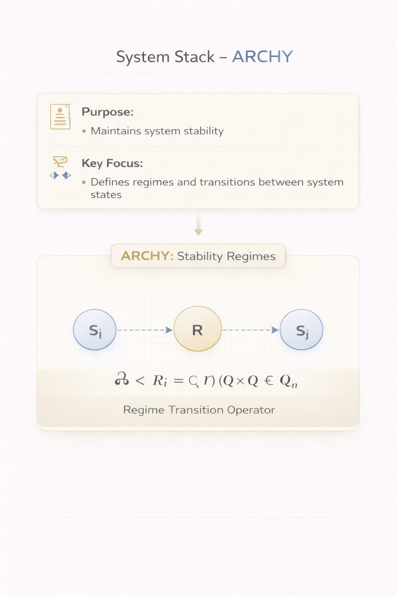
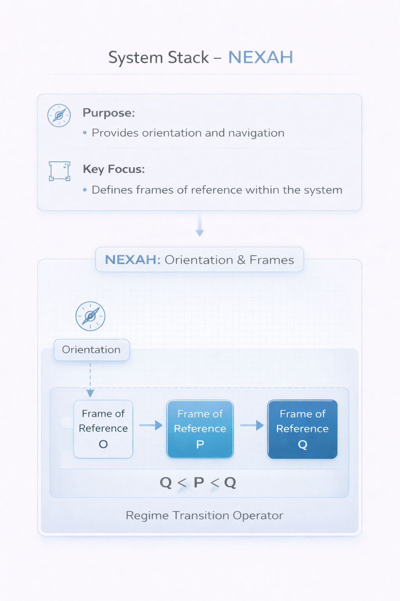
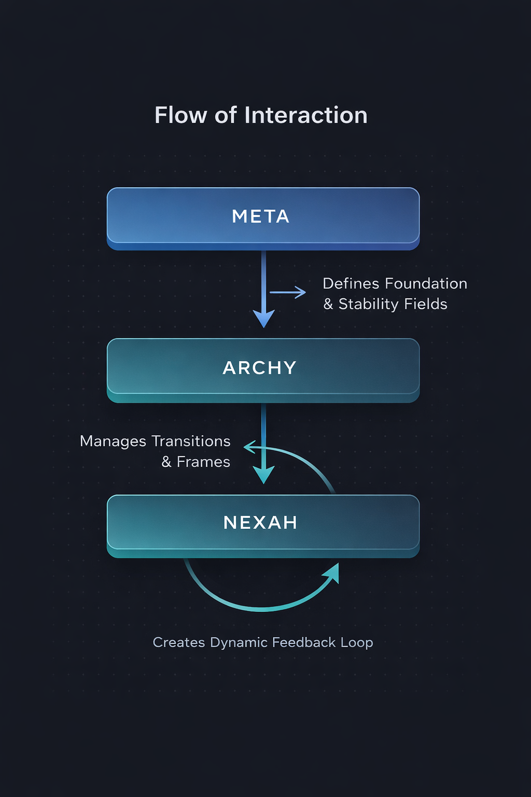

# NEXAH Framework - System Stack

The **System Stack** of the NEXAH Framework represents its core architecture, defining how the layers **META**, **ARCHY**, and **NEXAH** interact and form a cohesive system. This stack enables us to understand the relationships between the components of a complex system and manage how they evolve.

## System Stack Architecture

The system stack is composed of three fundamental layers:

### 1. **META**: Relational Structure
The **META** layer establishes the relational order within the system. It provides the foundational framework for understanding how system elements interact with each other.

- **Purpose**: Defines the system’s relational rules.
- **Key Focus**: Structures relationships, including hierarchy and ordering.

---

### 2. **ARCHY**: Stability Regimes
The **ARCHY** layer governs system stability by defining and enforcing transitions between different system states. It ensures that the system remains balanced despite any changes within its components.

- **Purpose**: Maintains stability and governs state transitions.
- **Key Focus**: Stability regimes, system state changes, and managing system dynamics.

---

### 3. **NEXAH**: Orientation & Frames
The **NEXAH** layer provides navigability within the system. It defines how elements are oriented and how users can interact with the system by providing reference frames.

- **Purpose**: Facilitates system navigation and orientation.
- **Key Focus**: Defines frames of reference and guides system interactions.

---

## The Flow of Interaction

The layers in the system stack work together in a continuous feedback loop. The interaction between **META**, **ARCHY**, and **NEXAH** ensures that the system remains dynamic and responsive:

- **META → ARCHY**: Defines the foundational relational structure and stability fields.
- **ARCHY → NEXAH**: Manages transitions between states and frames for better navigation.

This flow creates a well-structured and flexible framework that ensures system stability, navigability, and clarity in complex environments.

---

## Conclusion

The **System Stack** is the backbone of the NEXAH Framework. Understanding how each layer interacts and contributes to the overall system allows users to navigate and apply the framework to solve complex problems. This approach ensures that NEXAH is modular, flexible, and adaptable to a wide range of applications.

---

## 📚 **Explore the System Stack:**
- [META Layer](./FRAMEWORK/META/readme.md)
- [ARCHY Layer](./FRAMEWORK/ARCHY/readme.md)
- [NEXAH Layer](./FRAMEWORK/NEXAH/readme.md)

---

### Next Steps:
- **Explore Framework**: Dive deeper into each of the layers (META, ARCHY, and NEXAH) to understand their roles within the system.
- **Implement in Practice**: Use the system stack for real-world applications, tackling challenges and improving system behaviors.
