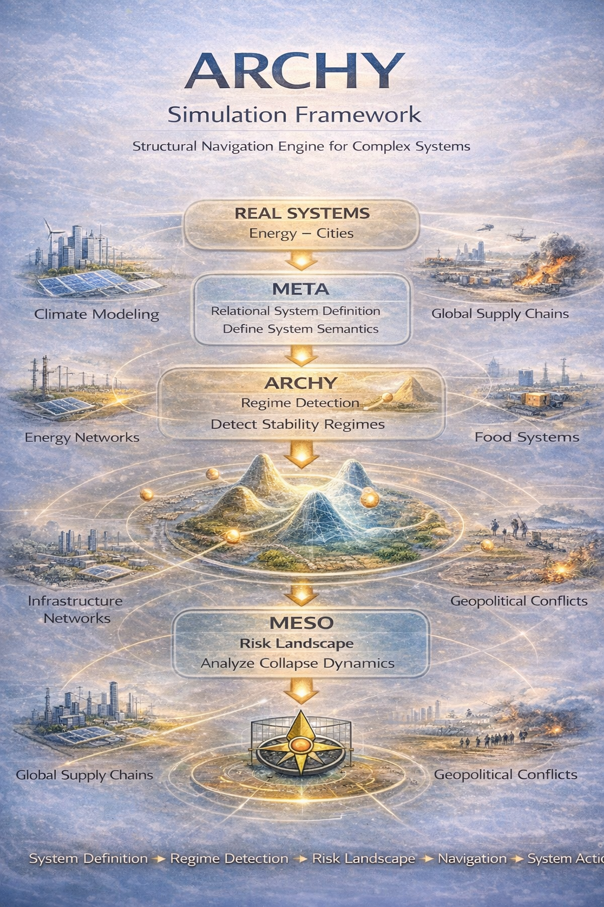

NEXAH Framework - ARCHY Layer

The **ARCHY Layer** is the second core layer of NEXAH and serves as the **dynamic stability regime engine**.

While the META layer defines relational order and the NEXAH layer handles explicit orientation, **ARCHY governs how systems maintain or lose stability** across regime transitions — without relying on external rewards, global objectives, or centralized control.

### Core Purpose

ARCHY explores how complex systems can **intrinsically navigate** between different stability regimes using only local structural information and orientational dynamics. It asks:

> How does a system “know” when it is approaching a critical transition — and how can it maintain coherence without a global controller?

### Key Concepts

- **Stability Regimes**  
  Discrete or continuous regions in state space where the system exhibits qualitatively different behavior (e.g. stable, meta-stable, critical, collapsing).

- **Regime Transitions**  
  The dynamic pathways and thresholds between regimes. ARCHY focuses on detecting early signs of transitions through orientational drift and structural coupling rather than traditional threshold monitoring.

- **Frames of Reference**  
  Local orientational anchors that allow subsystems to maintain coherence even when the global system is under stress.

- **Intrinsic Stabilization Mechanisms**  
  Helical locks, rejoin dynamics, phase coupling, and basin attraction — all emerging from NEXAH’s reward-free navigation principles.

### Simulation Environment

The ARCHY layer includes an experimental simulation environment for studying **interacting multi-domain systems**. Current focus areas include:

- Coupled energy networks and power grids
- Climate–energy–food system interactions
- Infrastructure and supply chain resilience
- Planetary-scale stress propagation (Earth System Stress)

These simulations are not intended to produce highly accurate forecasts, but to investigate **how regime shifts and cascading effects emerge** when subsystems interact under NEXAH’s orientation-based navigation.

Special emphasis lies on:
- Early detection of tipping points through structural signatures
- Emergence of resilient sub-structures during system stress
- Comparison between reward-driven vs. orientation-driven stabilization strategies

### Current Status

ARCHY is still in active development. While the conceptual framework and basic regime navigation mechanics are implemented, large-scale Earth System simulations are in early experimental stages. The layer currently builds upon the Discovery Engine and the energy grid adapter.

See also:
- `APPLICATIONS/power_systems/`
- `APPLICATIONS/adapters/energy_grid_adapter.py`
- Prime Modular Resonance Experiment (connection between discrete structures and emergent regimes)

---

*ARCHY simulation environment exploring regime transitions emerging from interacting planetary subsystems.*

