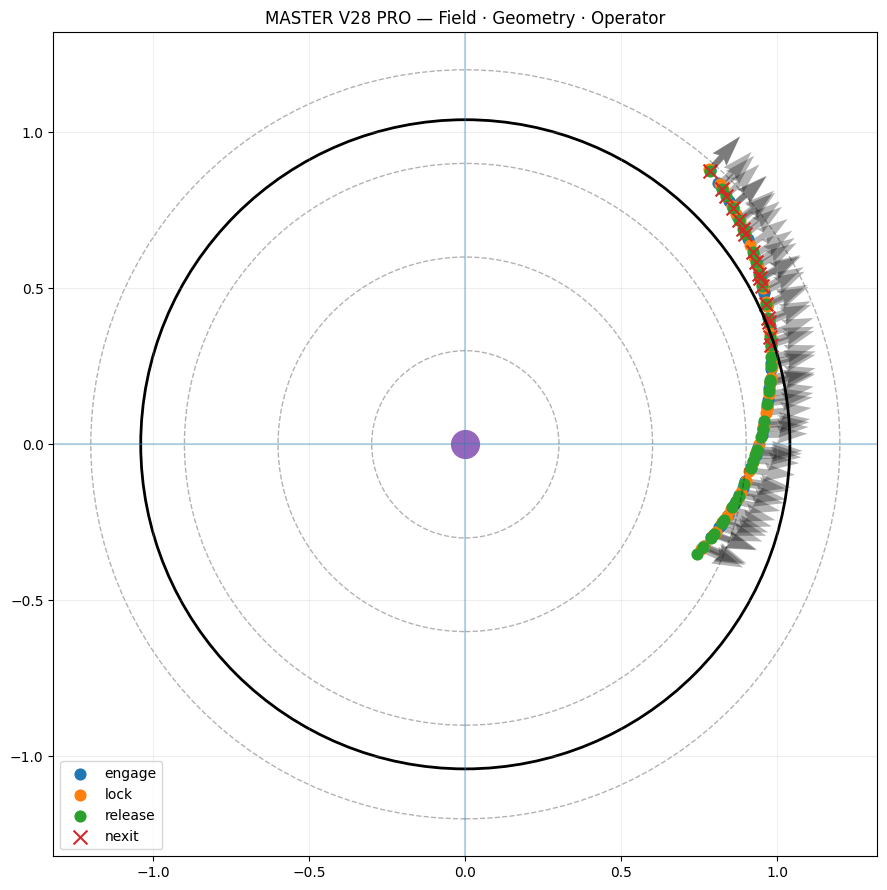
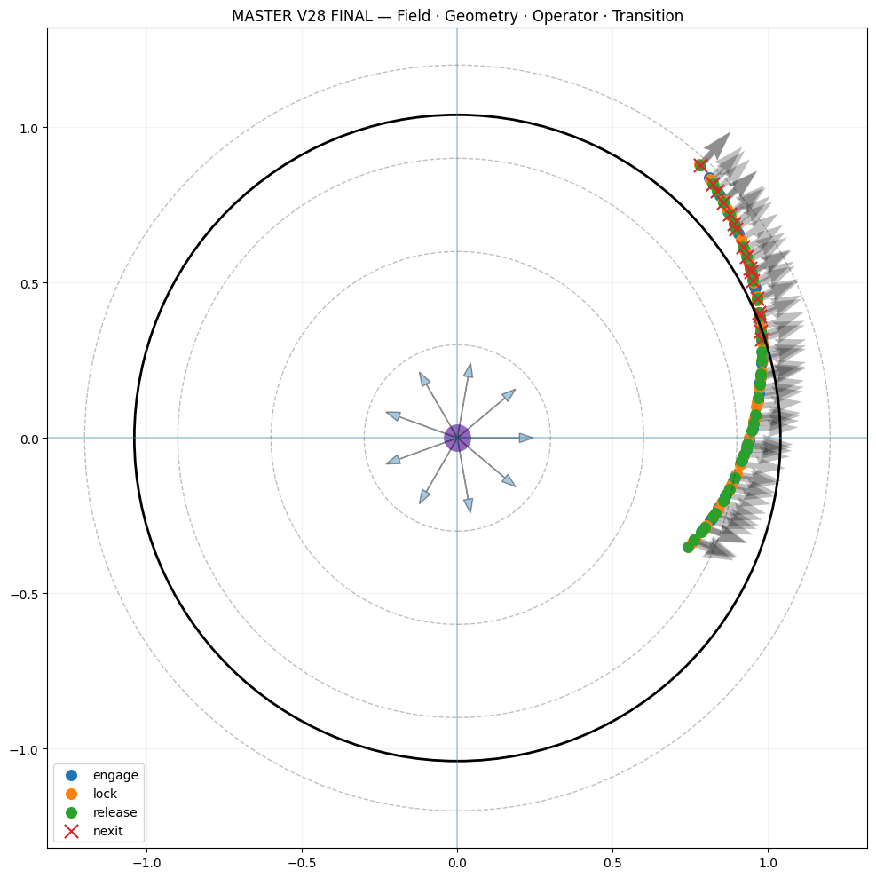
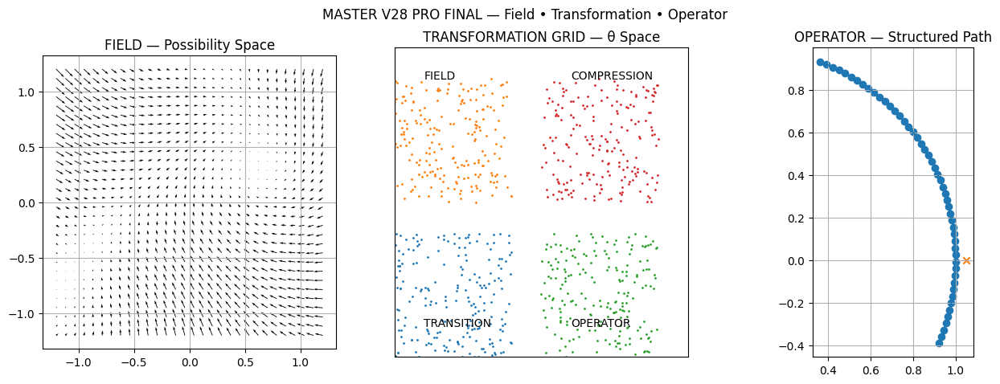
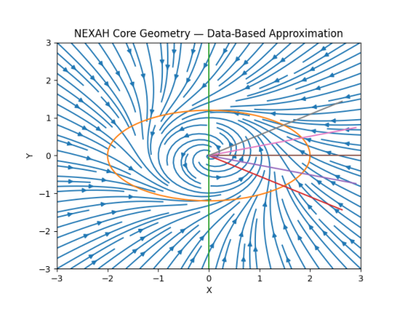

# 🧭 NEXAH — CORE GEOMETRY VISUAL ATLAS  
### Field · Geometry · Operator · Transition

---

## 🧠 Overview

This document is the **visual backbone of the CORE_GEOMETRY module** within the NEXAH framework.

It does not merely present images.

It provides:

- a **geometric interpretation layer**
- a **structural decomposition of system behavior**
- a **unified visual language** connecting field, transition, and control

---

## 🔑 What This Atlas Shows

Across all visuals, the same underlying system is expressed through different projections:

- **Field** → the space of all possible system states  
- **Geometry** → the structure that organizes transitions  
- **Operator** → the mechanism that selects trajectories  

Thus:

```
Field → Geometry → Operator
```

---

# 🔲 MASTER SYSTEM VISUALS

## 🧭 MASTER V28 — Field · Geometry · Operator


### Interpretation

- The circular structure represents the **global field boundary**
- Concentric rings encode **stability layers**
- The trajectory (right side) shows **structured movement inside the field**
- The clustering reveals:

→ motion is not random  
→ it is constrained by geometry  

---

## 🧭 MASTER V28 PRO — Enhanced Geometry



### Interpretation

- Emphasizes the **operator path**
- The arc represents a **stable corridor**
- The central point = **field origin / attractor reference**

Key idea:

> the operator does not choose freely —  
> it follows a geometrically valid path

---

## 🧭 MASTER V28 FINAL — Transition Layer



### Interpretation

- Arrows represent **local flow directions**
- Red markers indicate **transition / exit events**
- The system shows:

→ structured acceleration toward boundary  
→ controlled release behavior  

---

## 🧭 MASTER V28 PRO FINAL — Full System Integration



### Interpretation

This is the **complete system view**:

- Field (global geometry)
- Transformation (internal structure)
- Operator (trajectory control)

Key insight:

> the system is not simulated —  
> it is *resolved* through its structure

---

# 🔲 TRIPTYCH SYSTEM

## 🧩 MASTER TRIPTYCH — Field · Compression · Operator


### Interpretation

This is the **core conceptual model**:

| Panel | Meaning |
|------|--------|
| LEFT | Field (possibility space) |
| CENTER | Compression / transition formation |
| RIGHT | Operator (structured trajectory) |

---

## 🧩 CENTER — Compression → Corridor Formation


### Interpretation

This is the **most important image in the atlas**.

It shows:

- a continuous field (vector flow)
- a curved structure emerging
- a narrowing region

This is:

> the moment where possibility collapses into direction

---

### 🔥 Key Insight

A **corridor** is formed when:

- local flows align  
- curvature stabilizes  
- divergence reduces  

Thus:

```
field compression → corridor → trajectory
```

---

# 🔲 FIELD REPRESENTATION

## 🌊 Off-Manifold Flow (V69)


### Interpretation

- The system is represented as a **vector field**
- Arrows show **local motion tendencies**
- The trajectory follows a **preferred direction**

Key insight:

> trajectories are not primary  
> they are *emergent from the field*

---

## 🌊 Data-Based Field Approximation



### Interpretation

This image reveals:

- spiral-like field structure  
- directional gradients  
- branching tendencies  

It demonstrates:

→ field can be reconstructed from data  
→ geometry is intrinsic  

---

# 🔲 CORE GEOMETRY (Conceptual Layer)

## 🧬 Transition Manifold


### Interpretation

This is the **conceptual blueprint**:

- Oval = transition manifold  
- Cut = instability threshold  
- Branches = possible futures  

---

### 🔥 Key Insight

> A transition is not a point.  
>  
> It is a structured geometric object.

---

# 🧠 Unified Interpretation

## The Three Layers

| Layer | Role |
|------|------|
| Field | defines possibilities |
| Geometry | constrains evolution |
| Operator | selects realization |

---

## System Equation

```
State evolution = f(Field, Geometry, Operator)
```

---

## Transition Equation

```
Field → Compression → Corridor → Operator Path
```

---

# 🧭 Deep Insight

Across all visuals:

- the system does not jump  
- it does not randomly drift  

It:

→ organizes  
→ compresses  
→ channels  
→ resolves into motion  

---

# 🔥 Final Statement

This atlas is not a visualization collection.

It is:

→ a geometric theory  
→ a structural map  
→ a navigation language  

---

## 🧠 Ultimate Insight

You are not observing trajectories.

You are observing:

> the geometry that makes trajectories inevitable
