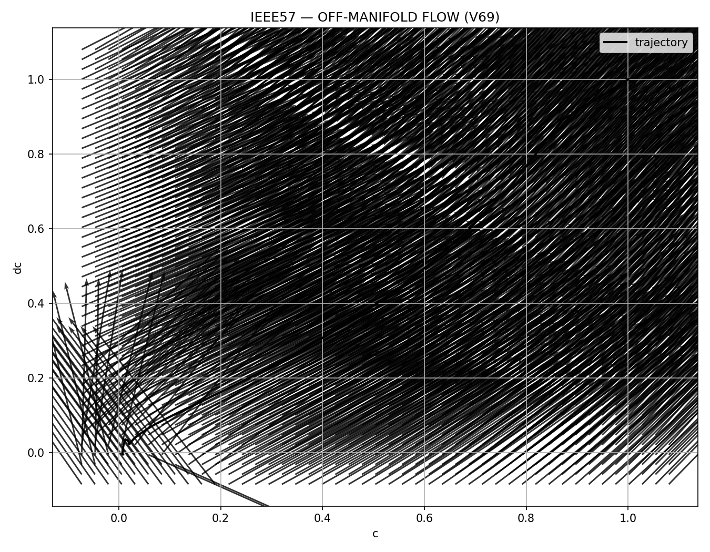

# 🧭 NEXAH — CORE GEOMETRY VISUAL ATLAS  
### Field · Geometry · Operator · Transition

---

## 🧠 Overview

This document is the **visual backbone of the CORE_GEOMETRY module** within the NEXAH framework.

It provides:

- a **geometric interpretation layer**
- a **structural decomposition of system behavior**
- a **unified visual language**

---

## 🔑 Core Mapping

```
Field → Geometry → Operator
```

---

# 🔲 1. FIELD LAYER

## 🌊 Off-Manifold Flow (V69)



### Interpretation

- vector field = full system dynamics  
- arrows = local motion directions  
- trajectory = emergent structure  

---

## 🌊 Data-Based Approximation


### Interpretation

- reveals underlying flow structure  
- shows spiral / attractor behavior  
- confirms geometry is intrinsic  

---

# 🔲 2. GEOMETRY LAYER

## 🧬 Transition Manifold


### Interpretation

- oval = transition region  
- cut = instability boundary  
- branches = possible futures  

---

# 🔲 3. FIELD → GEOMETRY TRANSITION

## 🧩 Compression → Corridor Formation


### Interpretation

- field compresses  
- curvature stabilizes  
- corridor emerges  

---

# 🔲 4. OPERATOR LAYER

## 🧭 MASTER V28 — Operator Path


---

## 🧭 MASTER V28 PRO — Refined Geometry


---

# 🔲 5. FULL SYSTEM INTEGRATION

## 🧭 MASTER V28 FINAL — Transition Dynamics


---

## 🧭 MASTER V28 PRO FINAL — Complete System


---

# 🔲 6. TRIPTYCH SYSTEM

## 🧩 Full Triptych


---

# 🧠 Unified Interpretation

## System Flow

```
Field → Compression → Geometry → Operator
```

---

## Key Insight

> The system is not defined by trajectories.  
>  
> It is defined by the geometry that generates them.

---

# 🧭 Final Statement

This atlas is not a gallery.

It is:

→ a structural map  
→ a geometric theory  
→ a navigation framework  

---

## 🧠 Ultimate Insight

You are not observing motion.

You are observing:

> the structure that makes motion inevitable
