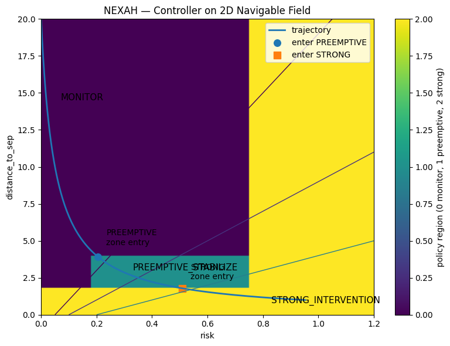
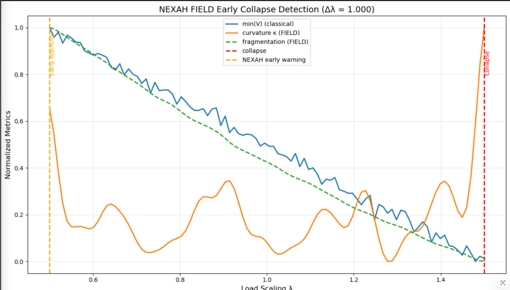

# 🧭 NEXAH — CORE GEOMETRY VISUAL GALLERY  
### Field · Geometry · Operator · Transition

---

## 🧠 Overview

This document is the **visual backbone of the CORE_GEOMETRY module** within the NEXAH framework.

It provides:

- a **geometric interpretation layer**
- a **structural decomposition of system behavior**
- a **unified visual language linking theory and data**

---

## 🔑 Core Mapping

```text
Field → Geometry → Operator → Navigation
```

---

# 🔲 1. FIELD LAYER

## 🌊 Off-Manifold Flow (Empirical Field Structure)


### Interpretation

- vector field = system dynamics  
- arrows = local motion directions  
- trajectories follow structured flow  

👉 **Insight:**  
Dynamics are not random — they are organized by an underlying field.

---

## 🌊 Data-Based Field Approximation


### Interpretation

- reveals intrinsic flow structure  
- shows attractor-like behavior  
- validates field-based representation  

---

# 🔲 2. GEOMETRY LAYER

## 🧬 Transition Manifold


### Interpretation

- oval = transition region  
- cut = instability boundary  
- branches = possible future paths  

👉 **Insight:**  
Transitions are not points — they are geometric regions.

---

## 🧭 Separatrix / Decision Boundary (NEW)

.png)

### Interpretation

- separatrix = boundary between stable / unstable trajectories  
- defines decision structure in the field  

👉 **Insight:**  
Control operates relative to geometric boundaries, not thresholds.

---

# 🔲 3. FIELD → GEOMETRY TRANSITION

## 🧩 Compression → Corridor Formation


### Interpretation

- field compresses under stress  
- curvature increases  
- structured transition corridor emerges  

---

# 🔲 4. OPERATOR LAYER

## 🧭 Operator on Navigable Field



### Interpretation

- controller acts within field geometry  
- reshapes trajectories instead of reacting locally  

---

## 🧭 Trajectory Steering


### Interpretation

- trajectories are guided away from instability  
- control acts as geometric steering  

👉 **Insight:**  
Control = trajectory shaping in field space.

---

# 🔲 5. SYSTEM INTEGRATION

## 🧭 Structural Navigation Framework


### Interpretation

- unifies field, geometry, and control  
- shows full navigation architecture  

---

## 🧭 Early Collapse Detection



### Interpretation

- collapse detectable before threshold  
- risk emerges geometrically  

---

# 🔲 6. MASTER GEOMETRY SYSTEM

## 🧭 MASTER Geometry Operator


---

## 🧭 MASTER PRO Geometry


---

## 🧭 MASTER FINAL — Full System


---

# 🔲 7. TRIPTYCH SYSTEM

## 🧩 Field → Compression → Operator


---

# 🧠 Unified Interpretation

## System Flow

```text
Field → Compression → Geometry → Operator → Navigation
```

---

## 🔥 Core Insight

> The system is not defined by trajectories.  
>  
> It is defined by the geometry that generates them.

---

# 🧭 Final Statement

This is not a visual collection.

It is:

- a structural map  
- a geometric theory  
- a navigation framework  

---

## 🧠 Ultimate Insight

You are not observing motion.

You are observing:

> the structure that makes motion inevitable
