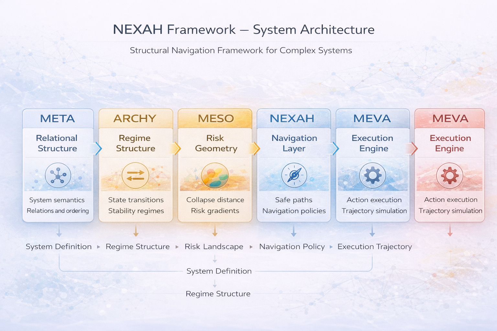
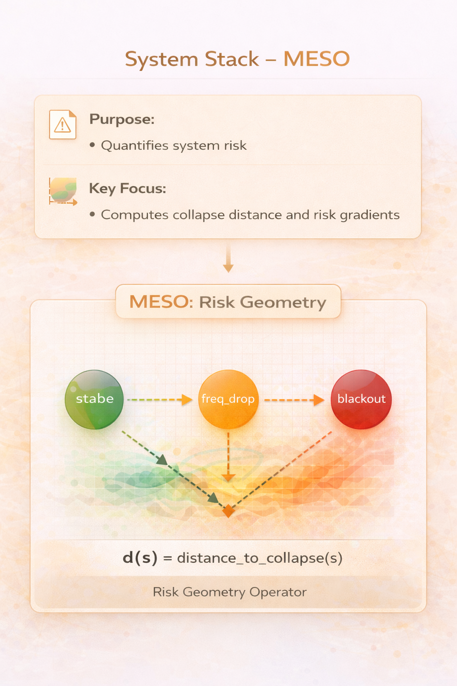
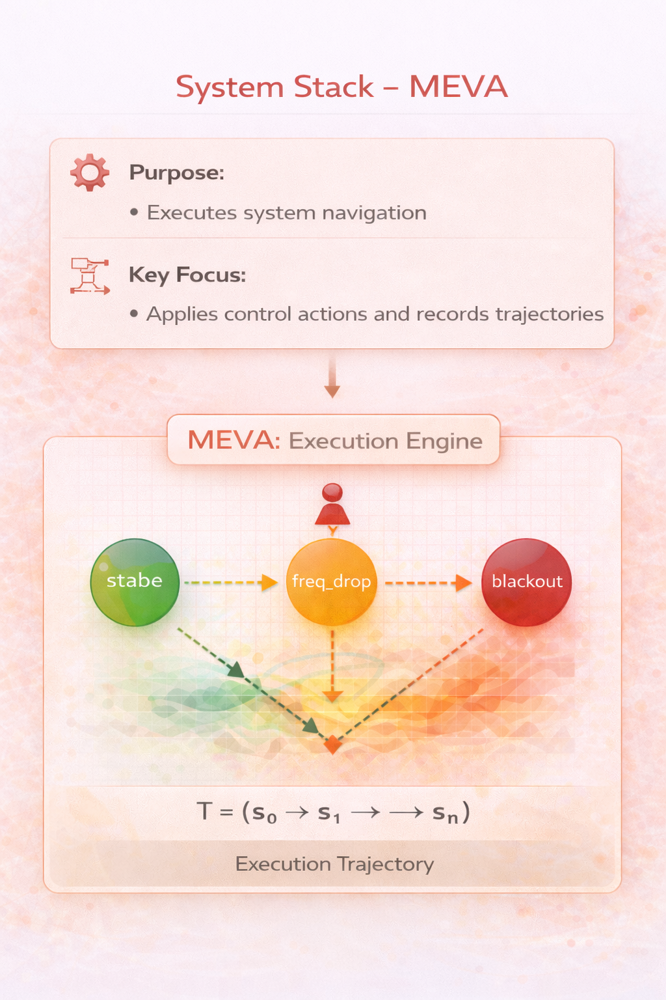
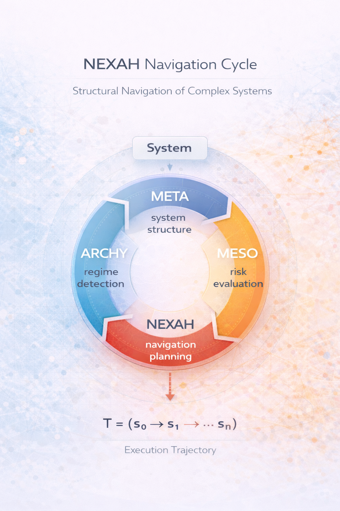

# NEXAH Framework — System Stack

The **System Stack** of the NEXAH Framework represents its core architecture. It defines how the layers **META**, **ARCHY**, **MESO**, **NEXAH**, and **MEVA** interact to form a cohesive system for navigating complex dynamic structures.

The stack transforms

system definitions → regime structures → risk landscapes → navigable trajectories

into an executable navigation architecture.

---

# System Stack Architecture

The NEXAH architecture is organized into five structural layers:

META → ARCHY → MESO → NEXAH → MEVA

Each layer adds a new capability to the system.

---

# 1. META — Relational Structure

The **META layer** establishes the relational structure of a system.

It defines the **semantic structure** of the system: elements, relationships, and ordering principles.

Purpose:

- define system entities  
- define relations between entities  
- establish ordering and hierarchy  

Key focus:

relational structure  
system semantics  
dependency structure  

Documentation:

- [META Layer Overview](./META/readme.md)

---

# 2. ARCHY — Stability Regimes & System Simulation

The **ARCHY layer** transforms relational structures into **regime structures**.

It identifies system states and transitions between them and provides experimental simulation environments for studying complex system dynamics.

Purpose:

- detect regime structure  
- detect transitions between states  
- detect stability regimes  
- simulate interacting subsystems  

Key focus:

regime detection  
state transitions  
collapse states  
basin structure  
planetary system simulation  

ARCHY now includes a large collection of experimental simulation models exploring interactions between:

• climate systems  
• water stress  
• food production systems  
• global energy networks  
• infrastructure systems  
• global supply chains  
• migration dynamics  
• geopolitical escalation  
• cascading collapse scenarios  

These simulations allow exploration of **tipping points, cascading failures, and resilience mechanisms** in complex planetary systems.

ARCHY documentation:

- [ARCHY Layer Overview](./ARCHY/readme.md)  
- [ARCHY Architecture](./ARCHY_ARCHITECTURE.md)  
- [ARCHY System Map](./ARCHY_SYSTEM_MAP.md)  
- [ARCHY Simulation Capabilities](./ARCHY_SIMULATION_CAPABILITIES.md)  
- [ARCHY Module Index](./ARCHY_MODULE_INDEX.md)

---

# 3. MESO — Risk Geometry

The **MESO layer** computes the **risk geometry** of the system.

It evaluates how far each state lies from collapse regimes and constructs a risk gradient across the regime graph.

Purpose:

- quantify system risk  
- compute distance to collapse  
- generate risk gradients  

Key focus:

collapse distance  
risk gradients  
basin geometry  
system resilience  

Documentation:

- [MESO Layer Overview](./MESO/readme.md)

---

# 4. NEXAH — Navigation & Frames

The **NEXAH layer** enables **navigation through regime landscapes**.

Using the structures produced by META, ARCHY, and MESO, the system can determine safe trajectories through the system state space.

Purpose:

- compute safe paths  
- guide system evolution  
- support agent navigation  

Key focus:

navigation policies  
frame operators  
trajectory planning  
regime-aware decision making  

Documentation:

- [NEXAH Layer Overview](./NEXAH/readme.md)

---

# 5. MEVA — Execution Layer

The **MEVA layer** executes navigation decisions.

It applies actions, overrides drift transitions, and records system trajectories.

Purpose:

- execute system control  
- apply navigation policies  
- simulate trajectories  

Key focus:

action execution  
state updates  
trajectory recording  
system simulation  

Documentation:

- [MEVA Layer Overview](./MEVA/readme.md)

---

# NEXAH Navigation Cycle

The system stack operates as a **continuous navigation cycle**.

Each layer transforms system knowledge into the next operational capability.

META → ARCHY → MESO → NEXAH → MEVA

This cycle allows agents to continuously:

• interpret system structure  
• detect regime transitions  
• evaluate risk landscapes  
• plan safe trajectories  
• execute system navigation  

---

# System Purpose

The NEXAH framework enables navigation through complex system regimes.

Agents can:

• detect unstable regimes  
• anticipate cascading failures  
• evaluate risk landscapes  
• navigate toward stable attractors  

The framework is designed for systems where **state transitions, risk propagation, and navigation decisions must be analyzed together**.

---

# Implementation Status (Current Build)

The core architecture of the NEXAH framework is now operational.

All structural layers of the system stack have been implemented and connected through a working navigation pipeline.

META → ARCHY → MESO → NEXAH → MEVA

The framework can now execute the full cycle from system definition to navigable system trajectories.

---

## META Layer — System Definition

Status: ✓ implemented

Capabilities:

• JSON-based system schema  
• system loader  
• relational system definition  
• standardized NEXAH system model  

Purpose:

Transform real systems into structured relational models.

---

## ARCHY Layer — Regime Structure & Simulation

Status: ✓ implemented

Capabilities:

• regime detection  
• state transition graphs  
• attractor detection  
• collapse basin identification  
• planetary system simulation models  
• cascade simulation environments  

Purpose:

Convert system definitions into regime graphs describing the structural behavior of the system and provide simulation environments for testing regime transitions.

---

## MESO Layer — Risk Geometry

Status: ✓ implemented

Capabilities:

• risk gradient computation  
• collapse distance  
• stability landscape  
• stability atlas  
• tipping point detection  
• early warning signal detection  
• cascade simulation  
• cascade probability estimation  
• system fragility analysis  
• phase space representation  
• system energy landscape  

Purpose:

Construct a geometric representation of system stability and collapse risk.

---

## NEXAH Layer — Navigation

Status: ✓ implemented

Capabilities:

• safe path computation  
• risk-aware navigation policies  
• regime-aware trajectory planning  

Purpose:

Guide agents through system regimes toward stable attractors.

---

## MEVA Layer — Execution

Status: ✓ implemented

Capabilities:

• state update execution  
• navigation policy execution  
• trajectory recording  
• simulation engine  

Purpose:

Execute navigation decisions and simulate system evolution.

---

# Current Framework Capabilities

The NEXAH framework can now:

• interpret relational system structures  
• detect regime transitions  
• quantify collapse risk  
• identify tipping points  
• detect early warning signals  
• simulate cascading failures  
• compute system resilience  
• model system energy landscapes  
• compute safe navigation trajectories  

These capabilities form a complete pipeline for **system stability analysis and navigation in complex dynamic environments**.

---

# Development Stage

The framework has reached the stage of a **functional core architecture**.

Future development will focus on:

• advanced navigation strategies  
• probabilistic cascade modeling  
• large-scale system datasets  
• interactive system explorers  
• real-world system integrations

---

# Explore the Framework

Detailed documentation for each layer:

- [META Layer](./META/readme.md)  
- [ARCHY Layer](./ARCHY/readme.md)  
- [MESO Layer](./MESO/readme.md)  
- [NEXAH Layer](./NEXAH/readme.md)  
- [MEVA Layer](./MEVA/readme.md)

---

# Key Documents

Core theoretical documents explaining the framework.

### Architecture

- [System Stack](./system_stack.md)  
- [Stack Structure](./stack_structure.md)

---

### Theory

- [Axioms](./axioms.md)  
- [Theorems](./theorems.md)

---

### Operators

- [Frame Operator](./frame_operator.md)  
- [Regime Operator](./regime_operator.md)

---

### Models

- [Relational Model](./relational_model.md)  
- [Minimal Logic](./minimal_logic.md)

---

### Applications

- [Modules Overview](./modules.md)  
- [Application Cases](./application_cases.md)

---

### Research

- [Research Papers](./research_papers.md)

---

# Summary

The NEXAH Framework provides a **structural navigation architecture for complex systems**.

By combining relational structure, regime analysis, risk geometry, and navigation policies, it enables systematic exploration and control of complex dynamic environments.

The layered architecture ensures that the framework remains:

• modular  
• extensible  
• adaptable to many application domains
It evaluates how far each state lies from collapse regimes and constructs a risk gradient across the regime graph.

Purpose:

- quantify system risk  
- compute distance to collapse  
- generate risk gradients  

Key focus:

collapse distance  
risk gradients  
basin geometry  
system resilience  

---

# 4. NEXAH — Navigation & Frames

The **NEXAH layer** enables **navigation through regime landscapes**.

Using the structures produced by META, ARCHY, and MESO, the system can determine safe trajectories through the system state space.

Purpose:

- compute safe paths  
- guide system evolution  
- support agent navigation  

Key focus:

navigation policies  
frame operators  
trajectory planning  
regime-aware decision making  

---

# 5. MEVA — Execution Layer

The **MEVA layer** executes navigation decisions.

It applies actions, overrides drift transitions, and records system trajectories.

Purpose:

- execute system control  
- apply navigation policies  
- simulate trajectories  

Key focus:

action execution  
state updates  
trajectory recording  
system simulation  

---

# NEXAH Navigation Cycle

The system stack operates as a **continuous navigation cycle**.

Each layer transforms system knowledge into the next operational capability.

META → ARCHY → MESO → NEXAH → MEVA

This cycle allows agents to continuously:

• interpret system structure  
• detect regime transitions  
• evaluate risk landscapes  
• plan safe trajectories  
• execute system navigation  

---

# System Purpose

The NEXAH framework enables navigation through complex system regimes.

Agents can:

• detect unstable regimes  
• anticipate cascading failures  
• evaluate risk landscapes  
• navigate toward stable attractors  

The framework is designed for systems where **state transitions, risk propagation, and navigation decisions must be analyzed together**.

---

---

# Implementation Status (Current Build)

The core architecture of the NEXAH framework is now operational.

All structural layers of the system stack have been implemented and connected through a working navigation pipeline.

META → ARCHY → MESO → NEXAH → MEVA

The framework can now execute the full cycle from system definition to navigable system trajectories.

---

## META Layer — System Definition

Status: ✓ implemented

Capabilities:

• JSON-based system schema  
• system loader  
• relational system definition  
• standardized NEXAH system model  

Purpose:

Transform real systems into structured relational models.

---

## ARCHY Layer — Regime Structure

Status: ✓ implemented

Capabilities:

• regime detection  
• state transition graphs  
• attractor detection  
• collapse basin identification  

Purpose:

Convert system definitions into regime graphs describing the structural behavior of the system.

---

## MESO Layer — Risk Geometry

Status: ✓ implemented

Capabilities:

• risk gradient computation  
• collapse distance  
• stability landscape  
• stability atlas  
• tipping point detection  
• early warning signal detection  
• cascade simulation  
• cascade probability estimation  
• system fragility analysis  
• phase space representation  
• system energy landscape  

Purpose:

Construct a geometric representation of system stability and collapse risk.

---

## NEXAH Layer — Navigation

Status: ✓ implemented

Capabilities:

• safe path computation  
• risk-aware navigation policies  
• regime-aware trajectory planning  

Purpose:

Guide agents through system regimes toward stable attractors.

---

## MEVA Layer — Execution

Status: ✓ implemented

Capabilities:

• state update execution  
• navigation policy execution  
• trajectory recording  
• simulation engine  

Purpose:

Execute navigation decisions and simulate system evolution.

---

# Current Framework Capabilities

The NEXAH framework can now:

• interpret relational system structures  
• detect regime transitions  
• quantify collapse risk  
• identify tipping points  
• detect early warning signals  
• simulate cascading failures  
• compute system resilience  
• model system energy landscapes  
• compute safe navigation trajectories  

These capabilities form a complete pipeline for **system stability analysis and navigation in complex dynamic environments**.

---

# Development Stage

The framework has reached the stage of a **functional core architecture**.

Future development will focus on:

• advanced navigation strategies  
• probabilistic cascade modeling  
• large-scale system datasets  
• interactive system explorers  
• real-world system integrations

---

# Explore the Framework

Detailed documentation for each layer:

- [META Layer](./META/readme.md)  
- [ARCHY Layer](./ARCHY/readme.md)  
- [MESO Layer](./MESO/readme.md)  
- [NEXAH Layer](./NEXAH/readme.md)  
- [MEVA Layer](./MEVA/readme.md)  

---

# Key Documents

Core theoretical documents explaining the framework.

### Architecture

- **[system_stack.md](./system_stack.md)**  
Overview of the NEXAH system stack architecture.

- **[stack_structure.md](./stack_structure.md)**  
Detailed description of layer interactions.

---

### Theory

- **[axioms.md](./axioms.md)**  
Foundational principles of the NEXAH framework.

- **[theorems.md](./theorems.md)**  
Formal derivations based on the axioms.

---

### Operators

- **[frame_operator.md](./frame_operator.md)**  
Definition of frame operations used for navigation.

- **[regime_operator.md](./regime_operator.md)**  
Logic governing system regime transitions.

---

### Models

- **[relational_model.md](./relational_model.md)**  
Description of the core relational system model.

- **[minimal_logic.md](./minimal_logic.md)**  
Minimal logical structure supporting the framework.

---

### Applications

- **[modules.md](./modules.md)**  
Overview of system modules.

- **[application_cases.md](./application_cases.md)**  
Example applications of the framework.

---

### Research

- **[research_papers.md](./research_papers.md)**  
Collection of theoretical and applied research related to the NEXAH framework.

---

# Summary

The NEXAH Framework provides a **structural navigation architecture for complex systems**.

By combining relational structure, regime analysis, risk geometry, and navigation policies, it enables systematic exploration and control of complex dynamic environments.

The layered architecture ensures that the framework remains:

• modular  
• extensible  
• adaptable to many application domains
