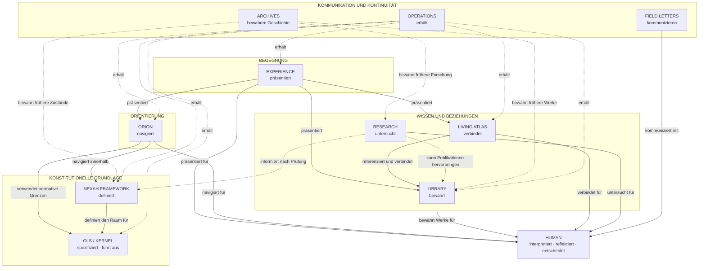
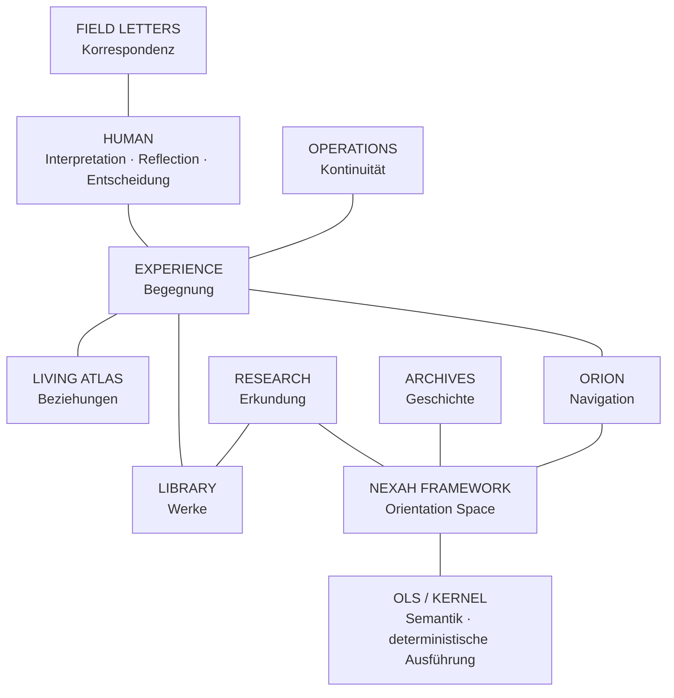
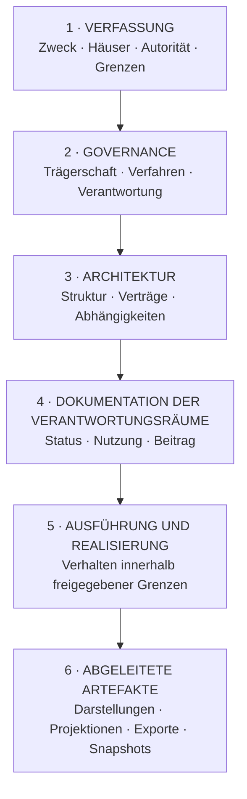

# NEXAH Ecosystem Constitution

**Verfassung des NEXAH-Ökosystems**  
**Version 1.0 — kanonische deutsche Fassung**

Die deutsche Fassung ist die kanonische Verfassungsgrundlage. Künftig
freigegebene Übersetzungen sind normative Übersetzungen derselben Verfassung,
keine eigenständigen Verfassungen. Bei Bedeutungsabweichungen ist die deutsche
Fassung maßgeblich.

## Konstitutionelles Axiom

> **Kein Haus besteht um seiner selbst willen.**  
> **Jedes Haus dient der menschlichen Orientierung.**  
> **Kein Haus darf die Fähigkeit des Menschen ersetzen, zu interpretieren, zu
> reflektieren oder zu entscheiden.**

## Präambel

NEXAH besteht, um Orientierung in komplexen Feldern zu ermöglichen, ohne
Komplexität durch unbelegte Gewissheit zu ersetzen.

Das Ökosystem unterscheidet zwischen Beobachtung, Darstellung, Beziehung,
Navigation, Evidenz, Interpretation und Entscheidung. Keine dieser Aufgaben
darf stillschweigend die Autorität einer anderen übernehmen.

NEXAH dient dem Menschen. Es entscheidet nicht an seiner Stelle.

Diese Verfassung schützt eindeutige Verantwortung, nachvollziehbare Herkunft,
sichtbare Grenzen, die Trennung von Evidenz und Interpretation sowie die
Freiheit, weiterzugehen, innezuhalten oder aufzuhören. Architekturen,
Technologien und Organisationsformen dürfen sich verändern. Diese Grundordnung
bleibt bestehen.

## I. Konstitutionelle Begriffe

### Haus

Ein Haus ist ein dauerhafter Verantwortungsbereich des Ökosystems. Es ist weder
an eine technische Plattform noch an eine bestimmte Organisationsform gebunden.

### Autorität

Autorität ist das ausschließliche Recht und die Pflicht eines Hauses, die ihm
anvertrauten Artefakte kanonisch zu definieren, zu prüfen und zu versionieren.

### Kanonischer Träger

Der kanonische Träger ist das eine Haus, dem ein Artefakt und seine Bedeutung
zugeordnet sind. Kanonische Trägerschaft ist keine Aussage über rechtliches
Eigentum.

### Verantwortung und Grenze

Verantwortung bezeichnet, was ein Haus tun und gewährleisten muss. Eine Grenze
bestimmt, wo seine Autorität endet und die eines anderen Hauses beginnt.

### Kanonisch und abgeleitet

Kanonisch ist die maßgebliche, kontrollierte Fassung eines Artefakts. Abgeleitet
ist ein Artefakt, das aus einer kanonischen Quelle erzeugt, übersetzt, gerendert,
zusammengefasst oder projiziert wurde.

### Referenz und Präsentation

Eine Referenz verweist auf ein kanonisches Artefakt, ohne dessen Bedeutung zu
übernehmen. Präsentation macht etwas zugänglich und wahrnehmbar, ohne seinen
Status oder seine Bedeutung zu verändern.

### Interpretation, Reflection und Entscheidung

Interpretation ist die menschliche Einordnung eines Ergebnisses oder einer
Erfahrung. Reflection ist das bewusste Nachdenken über Frage, Erfahrung,
Perspektive, Ergebnis und Bedeutung. Entscheidung ist die bewusste Wahl,
fortzufahren, zu handeln, zu warten, zurückzukehren oder aufzuhören. Alle drei
gehören dem Human.

## II. Die konstitutionellen Häuser

### 1. Human

**Zweck:** Der Human bringt Aufmerksamkeit, Fragen, Erfahrung, Werte und
Urteilskraft in das Ökosystem.

**Autorität:** Der Human besitzt die letzte Autorität über Intention,
Interpretation, Reflection, Zustimmung, Entscheidung, Fortsetzung und Abbruch.

**Verantwortung:** Er formuliert oder bestätigt seine Frage, unterscheidet
Systemergebnis und persönliche Bedeutung und übernimmt Verantwortung für seine
Entscheidungen.

**Nicht-Verantwortung:** Interpretation verändert weder Evidenz noch Provenienz,
Verträge, Invarianten oder den dokumentierten Status eines Ergebnisses.

**Beziehung:** Alle Häuser dienen der Orientierung des Human. Kein Haus ersetzt
ihn.

### 2. Experience

**Zweck:** Experience macht das Ökosystem wahrnehmbar und zugänglich.

**Autorität:** Experience besitzt die Form der Begegnung: Präsentation,
Navigation, Abfolge, Lesbarkeit, Zugänglichkeit und vorübergehenden
Interaktionszustand.

**Verantwortung:** Experience zeigt Ort, Möglichkeiten und Grenzen, präsentiert
Ergebnisse anderer Häuser getreu und ermöglicht Weitergehen, Rückkehr und
Verlassen.

**Nicht-Verantwortung:** Experience definiert keine Semantik, bewertet keine
Evidenz, erzeugt keine kanonischen Beziehungen, verändert keine Reports und
interpretiert nicht für den Human.

**Beziehung:** Experience präsentiert ORION, Library und Living Atlas innerhalb
der Grenzen des NEXAH Framework, ohne deren Autorität zu übernehmen.

### 3. Library

**Zweck:** Library bewahrt veröffentlichte Werke als identifizierbare,
zitierbare und fortsetzbare Einheiten.

**Autorität:** Library besitzt Werk- und Editionsidentität, Publikationsstatus,
kanonische Publikationsmetadaten, Serien, Sammlungen und redaktionelle
Provenienz.

**Verantwortung:** Library hält Werke unterscheidbar und referenzierbar, bewahrt
Ausgaben und Herkunft und dokumentiert redaktionelle Zustände.

**Nicht-Verantwortung:** Library validiert keine ORION-Ergebnisse, definiert
keine Framework-Semantik, inferiert keine Beziehungen und entscheidet nicht
über die persönliche Bedeutung eines Werkes.

**Beziehung:** Research kann Werke hervorbringen. Library bewahrt sie.
Experience präsentiert sie. Living Atlas setzt sie in ausdrückliche
Beziehungen.

### 4. Living Atlas

**Zweck:** Living Atlas macht ausdrücklich kuratierte Beziehungen zwischen
bestehenden Dingen navigierbar.

**Autorität:** Living Atlas besitzt Concepts, Themes, redaktionelle Operators,
Collections, explizite Relations und deren Provenienz.

**Verantwortung:** Living Atlas registriert Beziehungen mit stabiler Identität,
zeigt Nachbarschaften und unterscheidet Quelle, Ziel und Art jeder Verbindung.

**Nicht-Verantwortung:** Living Atlas inferiert keine verborgenen Beziehungen,
erzeugt keine Evidenz, verändert keine Publikationen und ersetzt keine
ORION-Navigation.

**Beziehung:** Living Atlas referenziert Werke der Library und andere
registrierte Objekte. Experience macht diese Beziehungen sichtbar.

### 5. ORION

**Zweck:** ORION navigiert deterministisch durch bekannte und registrierte
Strukturen.

**Autorität:** ORION besitzt seine Kontextzusammenstellung, registrierten
Transformationswege, Pläne, Verträge, Capability-Status, Validierung, Reports,
Evidenz- und Provenienzketten sowie LYRA als Sprachgrenze.

**Verantwortung:** ORION verwendet nur registrierte Wege, prüft Voraussetzungen
und Grenzen, bewahrt Identität und Provenienz und meldet Blocker sowie fehlende
Fähigkeiten.

**Nicht-Verantwortung:** ORION definiert keine Kernel-Wahrheit, erfindet keine
Übergänge, besitzt keine Publikationen, interpretiert keine menschliche
Bedeutung und entscheidet nicht für den Human.

**Beziehung:** ORION navigiert innerhalb der vom NEXAH Framework und seinen
normativen Verträgen gesetzten Grenzen. Experience präsentiert seine Reports.
LYRA übersetzt an seiner Grenze.

### 6. NEXAH Framework

**Zweck:** Das NEXAH Framework definiert den gemeinsamen Orientation Space des
Ökosystems.

**Autorität:** Das Framework besitzt grundlegende Begriffe, Strukturmodelle,
Verantwortungsgrenzen, normative Framework-Architektur sowie gemeinsame
Identitäts- und Referenzprinzipien.

**Verantwortung:** Das Framework hält die Häuser begrifflich kompatibel,
bestimmt normative Geltungsbereiche und schützt die Trennung zwischen
Definition, Ausführung, Anwendung und Interpretation.

**Nicht-Verantwortung:** Das Framework gestaltet keine konkrete Experience,
interpretiert keine Fragen, ersetzt keine Forschung und produziert keine
persönliche Bedeutung.

**Beziehung:** Das Framework bildet den gemeinsamen Bezugsraum. Andere Häuser
erforschen, spezifizieren, realisieren, navigieren oder präsentieren Ausschnitte
davon.

### 7. OLS / Kernel

**Zweck:** OLS definiert die normative Sprache der Orientierung. Der Kernel
führt freigegebene deterministische Verträge aus.

**Autorität:** OLS besitzt normative Semantik, Definitionen, Verträge,
Invarianten, Konformitätsregeln und veröffentlichte Sprachversionen. Der Kernel
besitzt die deterministische Ausführung freigegebener Verträge innerhalb seiner
erklärten Version.

**Verantwortung:** OLS und Kernel halten Definition und Ausführung
unterscheidbar, bewahren deterministische Grenzen und ermöglichen
reproduzierbare Prüfung.

**Nicht-Verantwortung:** Sie interpretieren keine menschliche Bedeutung,
erklären Forschung nicht automatisch zur Wahrheit und autorisieren keine reale
Handlung allein durch technische Gültigkeit.

**Beziehung:** Das Framework ordnet den Orientation Space. OLS spezifiziert
dessen normative Sprache. Der Kernel führt freigegebene Verträge aus. ORION
navigiert innerhalb dieser Grenzen.

### 8. Research

**Zweck:** Research untersucht offene Fragen und erzeugt nachvollziehbare
Evidenz.

**Autorität:** Research besitzt Beobachtungen, Hypothesen, Methoden,
Experimente, Datensätze, Unsicherheiten, negative Ergebnisse und
Forschungsprovenienz.

**Verantwortung:** Research trennt Beobachtung, Hypothese und Schlussfolgerung,
dokumentiert Methoden und Grenzen und ermöglicht Prüfung und Wiederholung.

**Nicht-Verantwortung:** Research wird nicht durch bloße Veröffentlichung
normativ, verändert keine Verträge ohne Annahmeverfahren und macht Spekulation
nicht zu Evidenz.

**Beziehung:** Research kann Framework, OLS, Library und zukünftige Verträge
informieren. Kanonische Übernahme erfordert ausdrückliche Prüfung.

### 9. Archives

**Zweck:** Archives bewahren die Entwicklungsgeschichte des Ökosystems.

**Autorität:** Archives besitzen die unveränderte historische Fassung ihrer
Artefakte und deren Provenienz.

**Verantwortung:** Archives erhalten frühere Zustände, dokumentieren deren
Kontext, verweisen auf Nachfolger und unterscheiden frühere von aktuellen
Aussagen.

**Nicht-Verantwortung:** Archives definieren keine aktuelle Architektur,
erhalten keine normative Autorität zurück und konkurrieren nicht mit aktuellen
kanonischen Trägern.

**Beziehung:** Alle Häuser dürfen Archives referenzieren. Kein Haus darf ein
Archiv als gegenwärtige Autorität darstellen.

### 10. Field Letters

**Zweck:** Field Letters ermöglichen öffentliche, zeitgebundene Korrespondenz
über Beobachtungen, Entwicklungen und offene Fragen.

**Autorität:** Field Letters besitzen ihre veröffentlichte redaktionelle Aussage
und deren historischen Zeitpunkt.

**Verantwortung:** Field Letters kommunizieren, laden zur Untersuchung ein,
verweisen auf kanonische Quellen und kennzeichnen Perspektive und Zeitpunkt.

**Nicht-Verantwortung:** Field Letters ersetzen keine Spezifikation, definieren
keine aktuelle Architektur und machen eine Idee nicht allein durch
Veröffentlichung kanonisch.

**Beziehung:** Field Letters vermitteln zwischen Research, Library und
Öffentlichkeit. Sie bleiben Korrespondenz, nicht Verfassung.

### 11. Operations

**Zweck:** Operations erhält Verfügbarkeit, Sicherheit und organisatorische
Kontinuität.

**Autorität:** Operations besitzt Zugriffsverwaltung, Betriebsprozesse,
Veröffentlichungs- und Wiederherstellungsverfahren sowie technische
Kontinuität.

**Verantwortung:** Operations schützt kanonische Artefakte, erhält
reproduzierbare Veröffentlichungen, dokumentiert betriebliche Abhängigkeiten
und setzt freigegebene Änderungen um.

**Nicht-Verantwortung:** Operations definiert keine Semantik, verändert keine
Evidenz, entscheidet nicht über Publikationsinhalt und wird durch technischen
Zugriff nicht zum kanonischen Träger.

**Beziehung:** Operations erhält die Arbeitsfähigkeit aller Häuser, ohne deren
inhaltliche Autorität zu übernehmen.

## III. Konstitutionelle Prinzipien

1. **Menschliche Souveränität.** Der Human bleibt letzter Interpret und
   Entscheider. Kein Haus darf persönliche Bedeutung, Zustimmung oder
   Reflection simulieren.
2. **Ein kanonisches Zuhause.** Jedes wichtige Artefakt besitzt genau einen
   kanonischen Träger und ein kanonisches Zuhause.
3. **Keine doppelte Autorität.** Mehrere Häuser dürfen dasselbe Artefakt
   referenzieren oder präsentieren, aber nicht parallel definieren.
4. **Autorität folgt Verantwortung.** Autorität entsteht nicht durch
   technische Kontrolle, Sichtbarkeit, Kopie oder Verbreitung.
5. **Präsentation bleibt Präsentation.** Sie darf ordnen, übersetzen und
   zugänglich machen, aber Bedeutung, Evidenz und Status nicht verändern.
6. **Ableitungen bleiben abgeleitet.** Erzeugte, übersetzte, gerenderte oder
   zwischengespeicherte Artefakte bleiben ihrer kanonischen Quelle untergeordnet.
7. **Provenienz bleibt erhalten.** Jede zulässige Ableitung bewahrt Identität,
   Version und bekannte Herkunft ihrer Quellen.
8. **Unsicherheit ist Information.** Unbekannte, vorläufige,
   widersprüchliche oder nicht überprüfte Zustände dürfen nicht verdeckt werden.
9. **Evidenz und Interpretation bleiben getrennt.** Evidenz begrenzt
   verantwortbare Aussagen; sie bestimmt nicht automatisch deren menschliche
   Bedeutung.
10. **Keine stille Aufwertung.** Research, Entwurf, Hypothese, Archivmaterial
    oder redaktionelle Nähe werden niemals ohne ausdrückliche Prüfung kanonisch.
11. **Navigation ist keine Autorisierung.** Ein gültiger Weg zeigt eine
    registrierte Möglichkeit, autorisiert aber weder Ausführung noch Handlung.
12. **Grenzen bleiben sichtbar.** Jedes Haus dokumentiert Beginn und Ende seiner
    Autorität.
13. **Übersetzung bewahrt Bedeutung.** Sie darf Ausdruck verändern, aber nicht
    Identität, Status, Evidenz, Provenienz oder Blocker.
14. **Archives bleiben historisch.** Wiederentdeckung verleiht einem Archiv
    keine gegenwärtige Autorität.
15. **Technologie bleibt austauschbar.** Keine Plattform, Programmiersprache,
    Speicherform oder Anbieterbeziehung ist konstitutionell.
16. **Wachstum folgt Verantwortung.** Neue Strukturen entstehen aus dauerhaft
    neuer Verantwortung, nicht aus Begeisterung oder Bequemlichkeit.
17. **Das Recht auf ein Ende.** Der Human darf innehalten, ablehnen,
    zurückkehren oder gehen. Kein Haus darf Fortsetzung erzwingen.
18. **Verfassung vor Ausführung.** Kein technischer oder organisatorischer
    Zustand darf eine konstitutionelle Grenze überschreiben.

## IV. Ownership-Regeln

| Artefaktart | Konstitutionelle Regel |
|---|---|
| Dokumente | Gehören dem Haus, dessen Verantwortung sie maßgeblich beschreiben. Andere Fassungen sind Referenzen oder abgeleitete Darstellungen. |
| Code | Gehört dem Haus, dessen Verhalten er realisiert. Ausführung begründet keine zusätzliche Autorität. |
| Publikationen | Gehören zur Library und besitzen stabile Werk- und Editionsidentität. |
| Metadaten | Gehören dem kanonischen Träger des beschriebenen Objekts. Projektionen bewahren Quelle und Revision. |
| Visuals | Normative Visuals gehören dem Haus der dargestellten Bedeutung. Publikationsvisuals gehören zur jeweiligen Publikation. |
| Relations | Redaktionelle Relations gehören zum Living Atlas. Technische Abhängigkeiten gehören dem ausführenden Haus. |
| Research | Gehört Research, einschließlich Methoden, Unsicherheit und negativer Ergebnisse. |
| Abgeleitete Artefakte | Werden vom erzeugenden Haus verwaltet, bleiben inhaltlich aber ihrer kanonischen Quelle untergeordnet. |
| Reports | Gehören dem Haus, das sie nach seinen Verträgen erzeugt. Präsentation und Interpretation bleiben getrennt. |
| Verträge | Gehören dem Haus, das ihren Geltungsbereich normativ definiert und versioniert. |
| Releases | Gehören dem veröffentlichenden Haus und gelten nur für dessen Verantwortungsbereich. |
| Reflection | Gehört dem Human. Sie wird nur durch ausdrückliche menschliche Entscheidung aufgezeichnet oder geteilt. |
| Historische Artefakte | Gehören dem zuständigen Archiv und behalten ihren ursprünglichen Kontext. |

Eine Referenz enthält, soweit anwendbar, kanonische Identität, kanonischen
Träger, Version oder Zeitpunkt, Herkunft, Ableitungsstatus und bekannte Grenzen.
Eine Referenz ersetzt niemals ihre Quelle.

## V. Boundary Rules

> **Experience präsentiert.** Es macht sichtbar, ohne umzudeuten.  
> **Library bewahrt.** Sie erhält Werke, Identität und Editionen.  
> **Living Atlas verbindet.** Es registriert ausdrücklich kuratierte Beziehungen.  
> **ORION navigiert.** Es findet und prüft registrierte Wege.  
> **NEXAH Framework definiert.** Es bestimmt den gemeinsamen Orientation Space.  
> **OLS spezifiziert.** Es definiert normative Semantik und Verträge.  
> **Kernel führt aus.** Er realisiert freigegebene deterministische Verträge.  
> **Research untersucht.** Es erzeugt Evidenz, ohne sich selbst zur Norm zu erklären.  
> **Archives bewahren Geschichte.** Sie besitzen keine gegenwärtige Autorität.  
> **Field Letters kommunizieren.** Sie vermitteln, ohne Spezifikationen zu ersetzen.  
> **Operations erhält.** Es sichert Kontinuität, ohne Bedeutung zu besitzen.  
> **Der Human interpretiert, reflektiert und entscheidet.**

## VI. Evolution Rules

### Dokument

Eine Idee wird ein Dokument, wenn sie erklärt, untersucht, geprüft oder
festgehalten werden muss, aber keine eigenständige ausführbare Verantwortung
besitzt. Ein Dokument begründet allein keine Autorität.

### Modul

Eine Fähigkeit wird ein Modul, wenn sie innerhalb eines bestehenden Hauses
bleibt, denselben kanonischen Träger und Lebenszyklus besitzt, eine klar
begrenzte Aufgabe erfüllt und unabhängig überprüfbar sein soll.

### Package

Eine Fähigkeit wird ein Package, wenn sie von mehreren Teilen des Ökosystems
konsumiert wird, eine stabile Schnittstelle und Version benötigt und weiterhin
der Autorität eines bestehenden Hauses untersteht. Ein Package ist eine
Verteilungsform, kein konstitutionelles Haus.

### Repository

Eine Arbeit erhält einen eigenständigen Verwaltungsraum, wenn sie dauerhaft
einen eigenen fachlichen Träger, Lebens- und Veröffentlichungszyklus,
unabhängige Konsumenten, eigene Zugriffsgrenzen oder eine klar abgrenzbare
Verantwortung besitzt. Mehr Ordnung oder Sichtbarkeit allein genügt nicht.

### Publikation

Ein Artefakt wird eine Publikation, wenn es für ein öffentliches Publikum
editioniert, redaktionell geprüft, stabil identifiziert und langfristig
referenzierbar ist.

### Archiv

Ein Bestand wird archiviert, wenn seine aktive Entwicklung beendet ist, er
keine gegenwärtige Autorität mehr trägt, sein historischer Wert erhalten werden
soll und sein Nachfolger oder abgeschlossener Status benannt ist.

### Neues Haus

Ein neues Haus entsteht nur, wenn eine dauerhaft neue Form von Autorität
existiert, kein bestehendes Haus sie widerspruchsfrei übernehmen kann, ihre
Grenzen bestimmt sind und eine ausdrückliche Verfassungsprüfung stattgefunden
hat. Nicht jedes Projekt, Package oder Repository ist ein Haus.

## VII. Kanonisches Verfassungsdiagramm

## VIII. Vereinfachtes Ökosystemdiagramm

## IX. Governance-Hierarchie

Eine untergeordnete Ebene darf eine übergeordnete Ebene weder ändern noch
umgehen.

## X. Verfassungsrang und Änderung

Diese Verfassung ist das höchste Governance-Dokument des NEXAH-Ökosystems.

Eine Verfassungsänderung erfordert:

1. eine ausdrücklich als Verfassungsänderung bezeichnete Prüfung;
2. eine Begründung der dauerhaft veränderten Verantwortung;
3. eine Analyse aller betroffenen Häuser;
4. eine dokumentierte Übergangsregel;
5. eine neue Verfassungsversion.

Technische Migrationen, neue Anwendungen und neue Publikationen benötigen keine
Verfassungsänderung, solange sie diese Ordnung respektieren.

## Constitution v1.0

> **Kein Haus besteht um seiner selbst willen.**  
> **Jedes Haus dient der menschlichen Orientierung.**
>
> **Jedes wichtige Artefakt hat genau ein kanonisches Zuhause.**  
> **Jedes Haus respektiert die Autorität der anderen.**
>
> **Jede Ableitung bewahrt ihre Quelle.**  
> **Jede Grenze bleibt sichtbar.**
>
> **Der Human interpretiert, reflektiert und entscheidet.**
