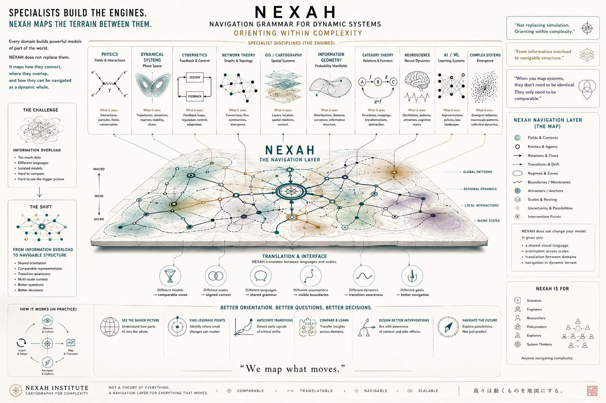

# Why NEXAH Exists

NEXAH was created as an exploratory framework for thinking about structure, transition, stability and motion in complex dynamical systems.

It began as an attempt to better understand how systems behave beyond isolated equations or thresholds — not as fixed objects, but as evolving structures with geometry, constraints, transition regions and flow.

The motivation behind this work is simple:

```text
to share perspectives, experiments and tools
that may help others think differently about complex systems
```

---

# NEXAH Manifesto



---

## What NEXAH Is

NEXAH is:

- an exploratory navigation grammar for complex systems
- a collection of experiments, models and visualizations
- a cartographic perspective on dynamics and transition
- a structure-oriented interpretation of instability and motion
- an interface for thinking across disciplines and scales

The project combines:

- simulation
- geometry
- dynamical systems
- visualization
- probabilistic modeling
- control concepts
- exploratory computational research

Its central intuition is that:

```text
complex systems may contain emergent structural organization
that can be mapped, interpreted and navigated
```

---

## What NEXAH Is Not

NEXAH is not presented as:

- a final theory of physics
- a replacement for scientific methodology
- proof of universal laws
- a complete mathematical framework
- an established scientific theory

Many parts of the project are:

- empirical
- heuristic
- experimental
- exploratory
- incomplete

Some concepts are speculative and require rigorous validation by experts in mathematics, physics, control theory and dynamical systems research.

The goal of this repository is not to claim certainty.

The goal is to explore structure openly.

---

## A Note on Interpretation

This repository contains:

- technical experiments
- conceptual models
- visual interpretations
- research notes
- unfinished ideas
- exploratory language

Not all terminology should be interpreted literally or physically.

Some concepts function as:

- organizational tools
- geometric metaphors
- visual abstractions
- experimental naming systems

The repository reflects an ongoing process of exploration rather than a finalized body of scientific conclusions.

---

## The Central Perspective

NEXAH proposes a shift in viewpoint:

Instead of seeing instability as purely random or threshold-based, systems may sometimes be understood as moving within structured state spaces containing:

- stable regions
- transition corridors
- competing flows
- geometric constraints
- regime changes
- interacting regions and transition geometries

In this interpretation:

```text
transitions are not isolated events,
but movements through structured regions of possibility
```

Whether this perspective generalizes beyond the tested systems remains an open question.

---

## Open Invitation

NEXAH is intended as an open interface for dialogue between disciplines,
not as ownership over a domain.

This work is shared publicly in the hope that it may:

- inspire new questions
- encourage experimentation
- support interdisciplinary thinking
- help visualize complex dynamics
- contribute useful ideas or tools to others

Criticism, testing, reinterpretation and refinement are welcome.

If parts of the framework prove useful,
they should evolve beyond the original author.

---

## Closing Perspective

NEXAH is ultimately an attempt to explore whether complex systems can be understood not only through prediction, but through structure, geometry and navigation.

Nothing here is intended as doctrine.

It is an open cartography of dynamic systems exploration.

---

Thomas K. R. Hofmann  
NEXAH · 2026

contact@nexah.com
