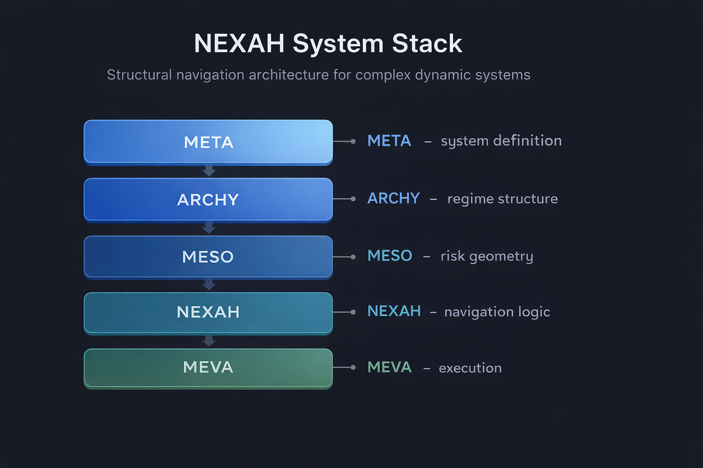
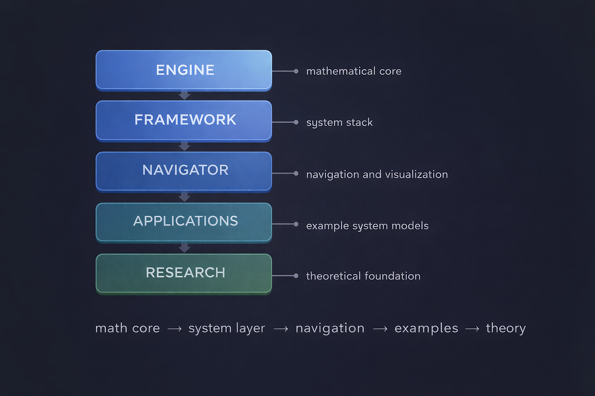
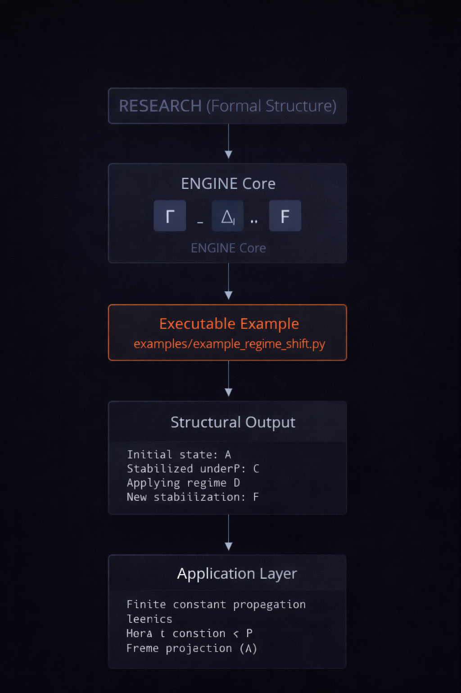

# NEXAH Navigator

This directory contains the **orientation layer** of the NEXAH repository.

It helps readers understand:

- how the repository is structured
- how the NEXAH architecture is organized
- which parts of the system are already operational
- what the framework is currently capable of
- where to go next depending on interest

The NEXAH framework is a structural navigation system for **complex dynamic environments**.

---

# Architecture Overview

## NEXAH System Stack

The architecture follows a layered model:

META → ARCHY → MESO → NEXAH → MEVA

These layers transform:

system definitions → regime structures → risk landscapes → navigable trajectories

| Layer | Function |
|-------|----------|
| META  | relational system definition |
| ARCHY | regime structure detection and structural simulation logic |
| MESO  | risk geometry computation |
| NEXAH | navigation strategies (incl. triple spiral coupling + URF Axial Space) |
| MEVA  | execution and simulation |

---

## Repository Architecture

The NEXAH repository is organized into several major components.

| Directory          | Role |
|--------------------|------|
| ENGINE             | structural algebra, analysis engine, research infrastructure |
| FRAMEWORK          | architectural system stack and integrated framework documents |
| NAVIGATOR          | repository orientation, architecture status, and overview documents |
| APPLICATIONS       | example systems and applied realizations |
| BUILDER_LAB        | demos, proto-models, and fast exploratory construction |
| DISCOVERY_ENGINE   | structure extraction and discovery logic |
| **urf_axial_space** | **3D coordinate system + Root Bridge + Matroschka mapping** ← **neu** |

---

## Engine Execution Flow

The NEXAH engine bridges formal structural research with executable system analysis.

Pipeline:

Formal Structure (Research)  
↓  
Structural Algebra Core  
↓  
Executable Analysis  
↓  
Structural Output

---

# Purpose of the Navigator

The `NAVIGATOR` directory is not the main theory layer and not the main experiment layer.

Its role is to provide:

- structural overview
- architectural status
- capability summaries
- repository-level orientation

This directory should remain **lightweight and navigational**.

It is the place to look when you want to understand the system **from above**.

---

# Documents in this Directory

## Repository Map
[REPOSITORY_MAP.md](./REPOSITORY_MAP.md)

## Architecture Completion Map
[NEXAH_ARCHITECTURE_COMPLETION_MAP.md](./NEXAH_ARCHITECTURE_COMPLETION_MAP.md)

## System Capabilities
[SYSTEM_CAPABILITIES.md](./SYSTEM_CAPABILITIES.md)

## Architecture Milestone
[ARCHITECTURE_MILESTONE.md](./ARCHITECTURE_MILESTONE.md)

---

# How These Documents Fit Together

| Document                        | Role |
|---------------------------------|------|
| Repository Map                  | repository structure and entry paths |
| Architecture Completion Map     | implementation status and open work |
| System Capabilities             | current operational functionality |
| Architecture Milestone          | historical and strategic breakthrough marker |

---

# Recommended Reading Order

**Quick orientation**
1. [REPOSITORY_MAP.md](./REPOSITORY_MAP.md)
2. [SYSTEM_CAPABILITIES.md](./SYSTEM_CAPABILITIES.md)

**Architecture and status**
1. [NEXAH_ARCHITECTURE_COMPLETION_MAP.md](./NEXAH_ARCHITECTURE_COMPLETION_MAP.md)
2. [ARCHITECTURE_MILESTONE.md](./ARCHITECTURE_MILESTONE.md)

**Full system entry**
1. [../README.md](../README.md)
2. [REPOSITORY_MAP.md](./REPOSITORY_MAP.md)
3. [../FRAMEWORK/README.md](../FRAMEWORK/README.md)
4. [../ENGINE/research/README.md](../ENGINE/research/README.md)

---

# Related Areas

**Framework**  
[../FRAMEWORK/README.md](../FRAMEWORK/README.md)

**Research**  
[../ENGINE/research/README.md](../ENGINE/research/README.md)

**Builder Lab**  
[../BUILDER_LAB/](../BUILDER_LAB/)

**Applications**  
[../APPLICATIONS/](../APPLICATIONS/)

**URF Axial Space** (new 3D layer)  
[../urf_axial_space/README.md](../urf_axial_space/README.md)

---

# Summary

The `NAVIGATOR` directory is the **top-level orientation space** of the NEXAH repository.

It does not replace the framework, research, or applications.

Instead, it helps connect them.

NEXAH combines structural modeling, regime analysis, risk geometry, navigation strategies and execution logic into a unified system for exploring and navigating **complex dynamic systems**.

---

**NEXAH Navigator**  
Orientation layer for repository, architecture status, and capability overview.
