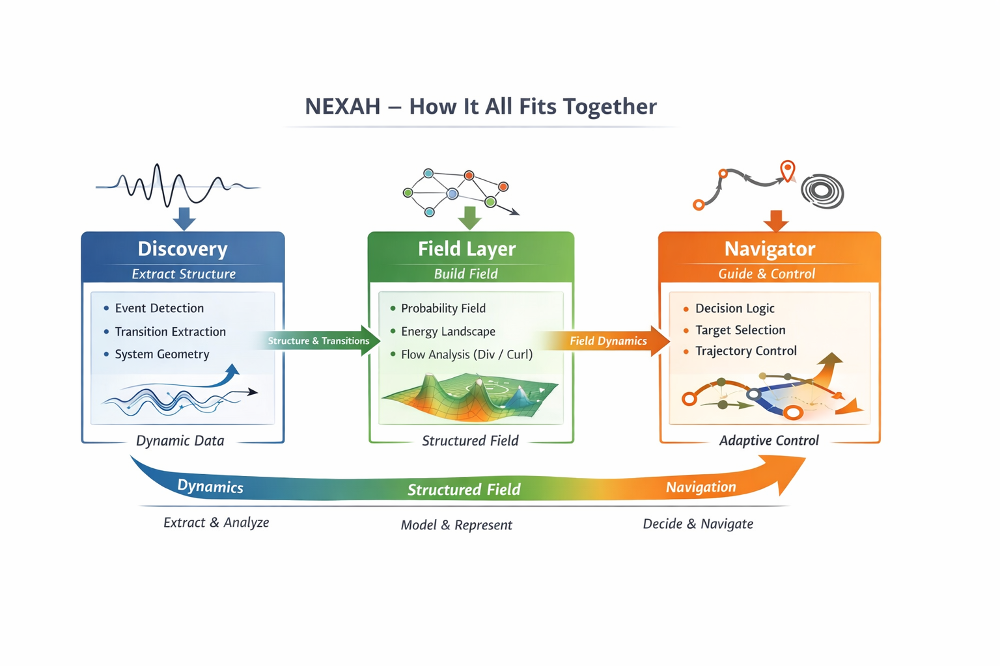

# 🧭 NEXAH — Navigator

The Navigator is the **decision and control layer** of NEXAH.

It operates on structured representations generated by:

- DISCOVERY_ENGINE  
- FIELD_LAYER (including decomposition & stability modules)

---

# 🧠 Core Role

The Navigator answers:

> Given a structured field,  
> how should the system move —  
> and where is movement actually possible?

---

# 🧭 How It All Fits Together

The NEXAH system operates as a layered transformation:

Dynamics → Structure → Field → Geometry → Stability → Control → Navigation

### 🔬 Discovery
Extracts structure from raw system dynamics:
- transition events  
- geometric patterns  
- system organization  

### 🌊 Field Layer
Reconstructs the system as a continuous field:

- probability and energy landscapes  
- flow (gradient + rotation)  
- channels, basins, and separatrices  
- convergence regions (fixpoints)  
- stability structure (Lyapunov field)  
- boundary structure and transition geometry  

Includes decomposition and stability analysis modules.

### 🔶 Stability (NEW — V8)
Measures:

- convergence vs divergence  
- sensitivity to perturbations  
- stability gradients across the field  

Key result:

> geometry alone does not define transitions —  
> stability constrains what is actually reachable  

### 🧭 Navigator
Operates on the field:

- selects direction  
- shapes trajectories  
- respects stability constraints  
- guides the system toward stable regions  

---

### 🧠 Key Insight

> NEXAH does not control systems by rules or thresholds.  
> It reconstructs their field and navigates within it under stability constraints.

---

# 🔗 System Context

NEXAH pipeline:

Dynamics  
→ Structure (Discovery)  
→ Field (Field Layer)  
→ Geometry (channels, basins, separatrices)  
→ Stability (Lyapunov, sensitivity, gates)  
→ Control (Navigator)  
→ Navigation  

---

# 🔥 Key Concept

The Navigator does not act on:

- raw trajectories  
- isolated states  

It operates on:

> field geometry AND stability structure

---

# 🧭 What the Navigator Uses

The Navigator receives:

### From DISCOVERY_ENGINE
- transition events  
- structural signals  

### From FIELD_LAYER
- probability field  
- energy landscape  
- gradient flow  
- rotational flow (curl)  
- channels and separatrices  
- convergence regions (fixpoints)  
- stability field (Lyapunov map)  
- gate candidates (low-stability regions)  

---

# ⚙️ Core Functions

## Decision

- evaluate system position in field  
- identify target regions (basins / attractors)  
- identify allowed directions (stability-constrained)  
- select direction of movement  

---

## Control

- apply trajectory shaping  
- bias movement toward desired regions  
- avoid unstable or non-viable transitions  

---

## Navigation

- follow structured paths (channels)  
- move between attractor basins  
- converge to stable regions  
- respect stability constraints  

---

# 🧠 Key Insight

> Navigation is not state-based  
> it is movement through a structured field under stability constraints

---

# ⚡ Control Principle

Control is not external forcing.

It is:

> field-aware trajectory shaping under stability constraints

---

# 🔁 Behavior Model

Field → Geometry → Stability → Decision → Control → Movement

---

# 🧪 Example (Lorenz System)

Using the Lorenz system:

- Field Layer reconstructs flow structure  
- channels and basins become visible  
- convergence regions are identified  
- stability gradients are measured  

Navigator:

- selects stable direction  
- follows channel structure  
- avoids unstable regions  
- converges to stable attractor  

---

# 🧭 Capabilities

- field-aware decision making  
- trajectory-based control  
- attractor targeting  
- stability-aware navigation  
- constrained transition handling  
- adaptive behavior  

---

# ⚠️ Current Limitations

- no unified API yet  
- partially coupled with Discovery pipeline  
- real-world validation ongoing  
- stability-navigation integration not fully automated  

---

# 🏗 Architecture

Full system architecture:

→ FRAMEWORK/architecture.md  

Field construction and decomposition:

→ FIELD_LAYER/README.md  

---

# 🚀 Status

Decision Logic: ✓  
Control Layer: ✓  
Field Integration: ✓  
Stability Integration: ✓ (new, evolving)  
Full Closed Loop: ⚠️ in progress  

---

# 🧠 Final Insight

The Navigator is not a controller in the classical sense.

It is:

> a system that moves within a structured and stability-constrained dynamical field

---

# 🔥 Summary

The Navigator enables:

- decision making in dynamic systems  
- control based on field geometry  
- navigation through structured dynamics  
- movement constrained by stability  

---

# License

Apache 2.0
