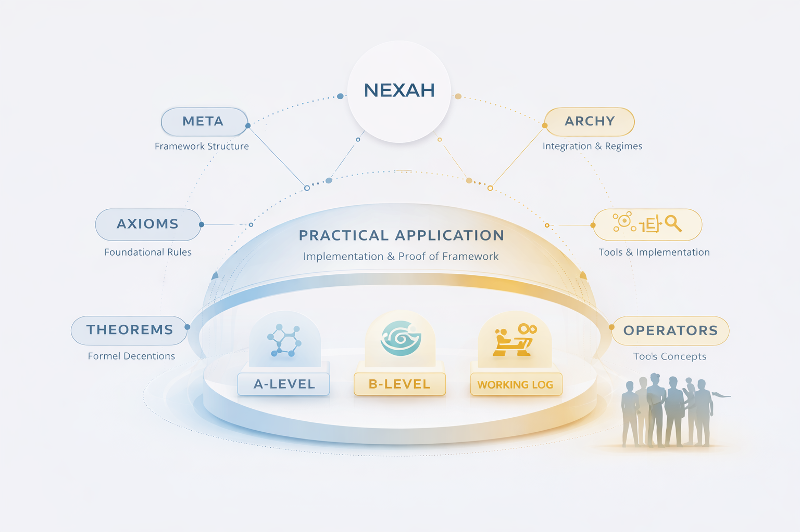

# NEXAH — Applications Portal

Welcome to the **NEXAH Applications Portal**.

This section explores how the NEXAH framework can be applied to **real-world systems and structured environments**.

Applications represent the **implementation and validation layer** of the NEXAH framework, where theoretical models and operators are used to analyze dynamic systems.

Within the repository, applications typically demonstrate:

• stability landscape modeling  
• regime detection  
• system drift and threshold behavior  
• structural navigation of complex environments  

Applications therefore connect **theoretical framework components** with **practical system analysis**.

---

# Application Layers in NEXAH

Applications in the NEXAH ecosystem operate across three layers.

### 1. System Models

Conceptual or simulated dynamical systems used to demonstrate NEXAH analysis tools.

Examples include gradient systems, regime systems, and drift systems.

### 2. Structural Analysis

Application models can be analyzed using the **NEXAH Stability Engine**, which extracts structural layers such as:

- stability landscapes  
- attractor basins  
- metastability regions  
- spectral structures  
- topological invariants  

See:
ENGINE/docs/VISUAL_GALLERY.md

### 3. External System Integration

Adapters allow NEXAH to connect to **external simulation environments** or real infrastructure models.

Examples may include:

- power grid simulators  
- infrastructure networks  
- logistics systems  
- environmental models  

Adapters translate simulator outputs into **NEXAH state graphs**, enabling structural analysis.

---

# Core Application Models

The repository currently contains several **dynamical system models** that demonstrate how NEXAH can analyze structured system behavior.

| Model | Description |
|------|-------------|
| **Stability Landscape** | Conceptual stability structure of system states |
| **Gradient Systems** | Dynamics along stability gradients |
| **Drift Systems** | Gradient dynamics influenced by external forces |
| **Regime Systems** | Systems with multiple attractor regimes and transitions |

Explore the modules:

- [STABILITY_LANDSCAPE](../APPLICATIONS/STABILITY_LANDSCAPE/)
- [GRADIENT_SYSTEM](../APPLICATIONS/GRADIENT_SYSTEM/)
- [DRIFT_SYSTEM](../APPLICATIONS/DRIFT_SYSTEM/)
- [REGIME_SYSTEM](../APPLICATIONS/REGIME_SYSTEM/)

These models illustrate how **regime transitions and stability structures** emerge in dynamical systems.

---

# Practical Applications

The NEXAH framework allows complex systems to be modeled through **relational structures, stability regimes, and orientation frameworks**.

Instead of treating systems as isolated variables, NEXAH analyzes how elements interact within **structural networks**.

Typical application workflows include:

- relational system modeling  
- stability regime analysis  
- threshold detection  
- structural orientation of complex environments  
- navigation of system states toward stable regimes  

---

# Example Application Domains

The following domains illustrate potential areas where the framework can be applied.

---

### Drift–Threshold Engineering

Analysis of systems where gradual drift leads to structural thresholds or regime shifts.

Possible contexts:

- environmental monitoring  
- infrastructure stability  
- resilience analysis  
- large-scale technical systems  

---

### Maritime Drift Systems

Modeling maritime movement patterns and environmental influences.

Examples include:

- vessel drift behavior  
- ocean current interactions  
- navigation pattern analysis  

---

### Urban Axis Systems

Structural analysis of urban environments and spatial orientation systems.

Applications may include:

- urban planning structures  
- infrastructure alignment  
- city-scale relational systems  

---

### Environmental Gradient Systems

Modeling systems where environmental gradients shape system behavior.

Examples:

- ecological transitions  
- climate-driven structural changes  
- landscape dynamics  

---

### Laminar Coupling Models

Analysis of systems where multiple structural flows interact.

Examples include:

- fluid systems  
- coupled infrastructure systems  
- layered environmental dynamics  

---

### Archaeological Alignment Models

Structural analysis of historical spatial systems.

Possible use cases:

- site alignment studies  
- spatial pattern analysis  
- cultural landscape modeling  

---

# Framework to Application Pipeline

The NEXAH repository supports the transition from **theoretical structure to applied modeling**.

Typical workflow:

Framework
↓
Operators
↓
Structural Models
↓
Applications
↓
System Analysis

This pipeline allows systems to evolve from conceptual theory to **real-world structural analysis**.

---

# Applying NEXAH

To start working with application models:

1. Explore the **framework architecture**
NAVIGATOR/framework_portal.md

2. Study the **research foundations**
NAVIGATOR/research_portal.md

3. Analyze structural dynamics using the **Stability Engine**
Experiment with models inside:

4. Experiment with models inside:
APPLICATIONS/

Typical modeling workflow:

- define system relations
- construct structural graphs
- identify regime transitions
- analyze stability basins
- design stabilization strategies

---

# Contributing Applications

The NEXAH framework is designed as a **modular ecosystem**, where new application domains can be added.

Possible contributions include:

- new modeling domains
- infrastructure simulation adapters
- research case studies
- visualization extensions
- system integration modules

Application modules should remain **self-contained and modular**.

---

# Continue Exploring

From here you can continue exploring the NEXAH ecosystem.

**Framework Portal**  
`framework_portal.md`

**Research Portal**  
`research_portal.md`

**Repository Navigator**  
`repository_portal.md`
