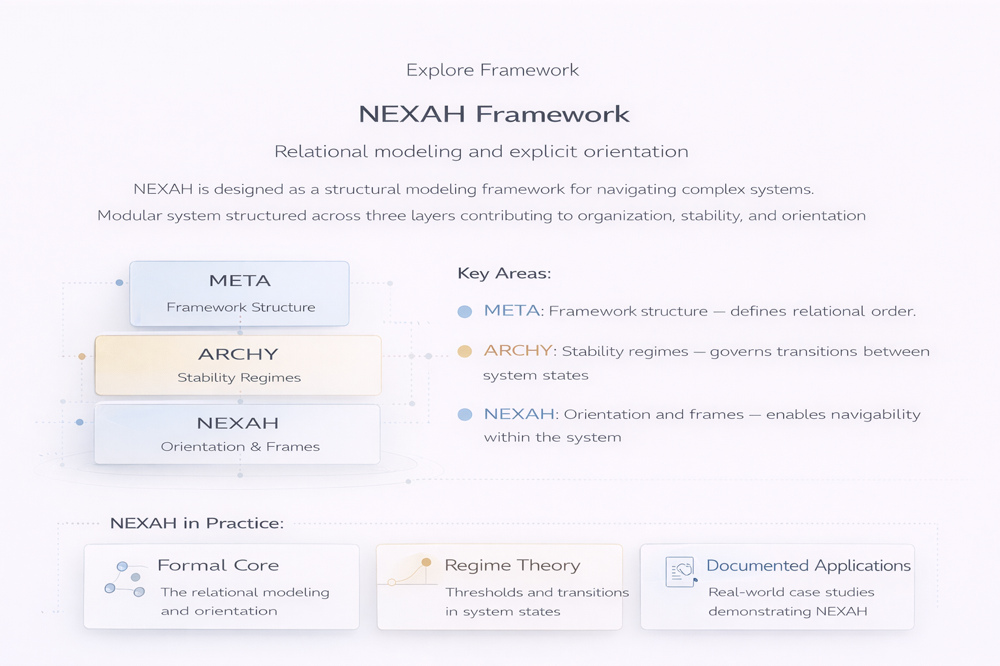

# NEXAH Framework — Portal

Welcome to the **NEXAH Framework portal**.

This section introduces the structural foundations of the NEXAH system — its conceptual layers, modeling principles, and practical applications.

NEXAH is designed as a **structural modeling framework for navigating complex systems** through **relational modeling and explicit orientation**.

---

## What is the NEXAH Framework?

The **NEXAH Framework** is a modular structural modeling system that describes complex systems using relational structure, stability regimes, and navigable orientations.

Rather than reducing systems to simplified variables, NEXAH focuses on **how elements are structurally related and how systems transition between states**.

The framework is organized into three conceptual layers:

- **META** — relational structure  
- **ARCHY** — stability regimes  
- **NEXAH** — orientation and frames  

Together these layers contribute to **organization, stability, and orientation** within complex systems.

---

## Framework Structure

The core architecture of the NEXAH framework is structured across three layers.

### META — Framework Structure

Defines the **relational order** of the system.

META establishes the structural foundation upon which all models are built.

Examples include:

- relational graphs  
- ordering relations  
- dependency structures  

---

### ARCHY — Stability Regimes

ARCHY models **stability conditions and regime transitions**.

It describes how systems move between states and how structural configurations stabilize.

Examples include:

- threshold behavior  
- regime transitions  
- system governance patterns  

---

### NEXAH — Orientation & Frames

NEXAH provides **explicit orientation within structural systems**.

It enables navigation and interpretation of structural models.

Examples include:

- structural navigation  
- relational frames  
- contextual positioning of models  

---

## NEXAH in Practice

The framework is designed not only as a conceptual model but also as a **practical system for analyzing real-world structures**.

Examples of applied structural modeling include:

### Formal Core
Relational modeling and orientation of complex systems.

### Regime Theory
Analysis of thresholds and transitions between system states.

### Documented Applications
Real-world case studies demonstrating NEXAH modeling.

Applications may include fields such as:

- infrastructure systems
- environmental modeling
- maritime systems
- urban structure analysis
- archaeological alignment studies

---

## Purpose of the Framework

The goal of NEXAH is to provide a **clear structural language for complex systems**.

Instead of describing systems only through metrics or variables, NEXAH models:

- structural relations
- stability regimes
- navigable system orientations

This allows complex domains to be explored through **structured relational models**.

---

## Next Steps

From this portal you can continue exploring the NEXAH ecosystem:

**Research**  
Explore theoretical foundations and structural principles behind the framework.

**Applications**  
Discover documented case studies and real-world structural modeling examples.

**Repository**  
Access the NEXAH implementation and computational tools.
