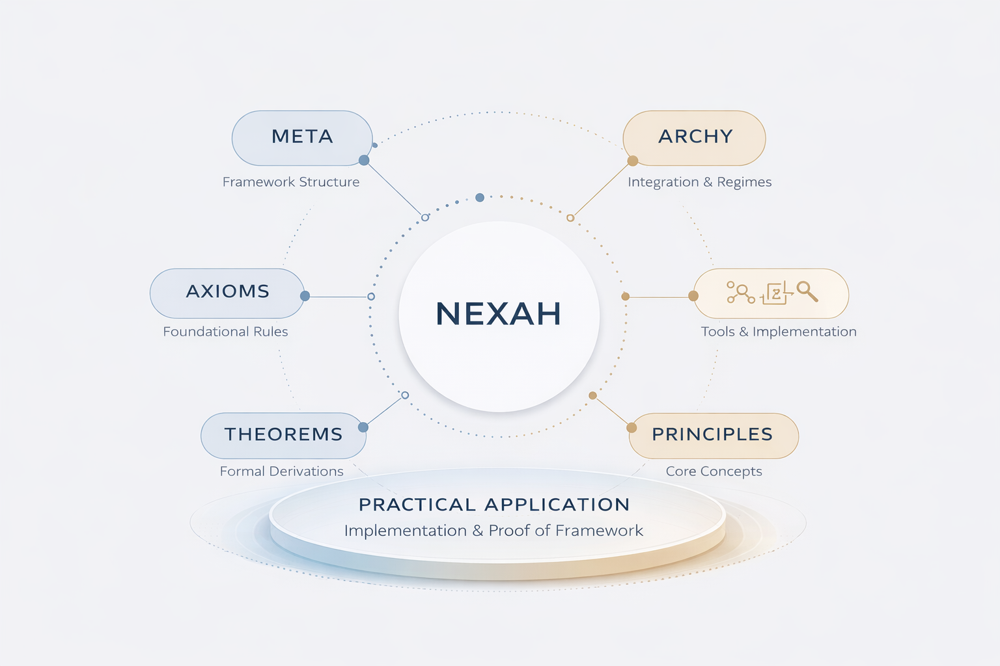

# NEXAH Framework - Explore Repository

Welcome to the **NEXAH Repository**! This portal is designed to help you navigate and explore the NEXAH framework and its components. It offers detailed documentation, an overview of the framework, and guidance on how to start applying NEXAH in your own projects.

## 🔎 Explore the Repository Structure

The **NEXAH framework** is organized into distinct layers, each addressing a specific part of system modeling and navigation. Below is a breakdown of the repository structure:

### **Framework Structure**
- **META**: Defines the relational structure and framework.
- **ARCHY**: Deals with stability regimes, managing the transitions between system states.
- **NEXAH**: Focuses on navigation and orientation within the system.

### **Core Components**
The main modules that power NEXAH are organized under the following components:

- **Relational Model**: The base model for relationships within the system.
- **Regime Operator**: Governs stability transitions.
- **Frame Operator**: Deals with system orientations.

---

## 📚 Explore the Repository Components

### **Code Documentation**
This section provides all the resources you need to browse and understand the NEXAH code, including the `README.md`, `FRAMEWORK/`, and `NAVIGATOR/` directories.

### **Modular Organization**
NEXAH is built using distinct and reusable modules. The framework is divided into the following categories:

- **FRAMEWORK/**: Core structure and setup.
- **OPERATORS/**: Includes relational models, regime operators, and frame operators.
- **APPLICATIONS/**: Practical examples and use cases for NEXAH.

### **Use Cases**
In this section, we document examples of how NEXAH can be applied across different fields, including:

- **Engineering**
- **Data Science**
- **Architecture**
- **Urban Systems**

---

## 🚀 Next Steps:
- **Explore the Framework**: Dive deeper into the details of the **NEXAH framework** structure.
- **Start Using the Code**: Explore the repository to see the core components in action.
- **Contribute**: Fork the repository, suggest improvements, and contribute to the growing NEXAH community.

---

This repository is your starting point for working with **NEXAH**—a modular and flexible framework designed for system modeling and relational navigation.

For further details, please check the [official documentation](link-to-docs).
