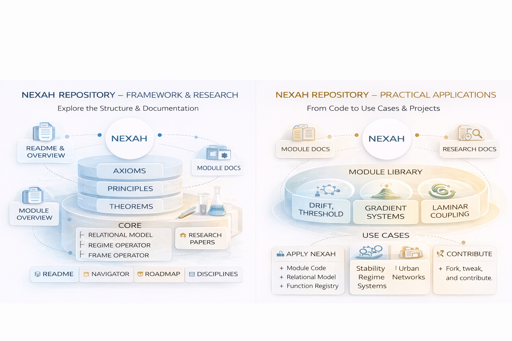

# NEXAH Framework - Research Portal

Welcome to the NEXAH Research Portal! This portal provides the necessary resources and documentation to dive deep into the theoretical foundations and research of the NEXAH framework.

## 🔎 Research & Exploration

### Why NEXAH?

NEXAH was created as a **universal model** for complex systems. It aims to provide the tools to understand dynamic changes, regime shifts, and structural orientation in systems of all types.

### Core Areas of NEXAH:

- **META**: Framework structure — defines relational order.
- **ARCHY**: Stability regimes — governs transitions between system states.
- **NEXAH**: Orientation and frames — enables navigability within the system.

---

### **Research Documentation**

Explore the research papers and documentation related to NEXAH's theoretical principles:

- **Axioms** – Foundational principles of NEXAH.
- **Principles** – Core structural logic for applying NEXAH.
- **Theorems** – Formal derivations and applications based on NEXAH.

---

## 🚀 Next Steps:
- **Dive Deeper**: Explore the full **framework structure** and understand the principles behind NEXAH.
- **Practical Applications**: Learn how NEXAH can be applied in real-world scenarios.
- **Contribute**: Contribute to the ongoing research by suggesting improvements or adding new insights.

---

This repository serves as the gateway to understanding and contributing to the **NEXAH framework**. The structure is designed to support research and applications that utilize relational modeling and explicit orientation.
