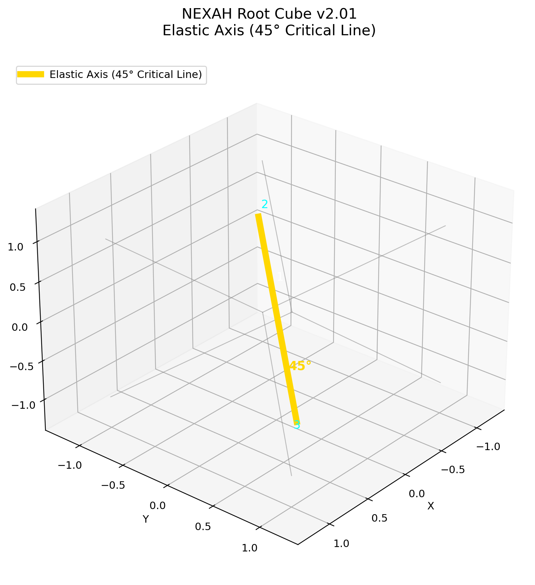
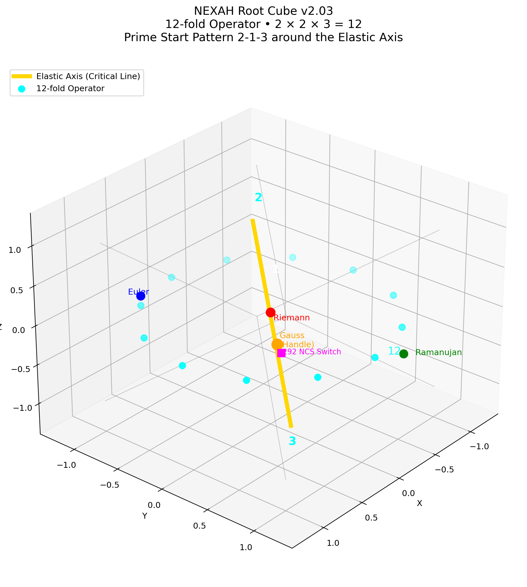
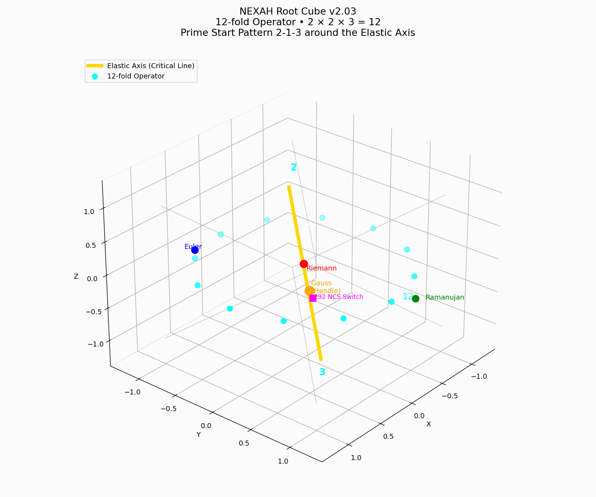
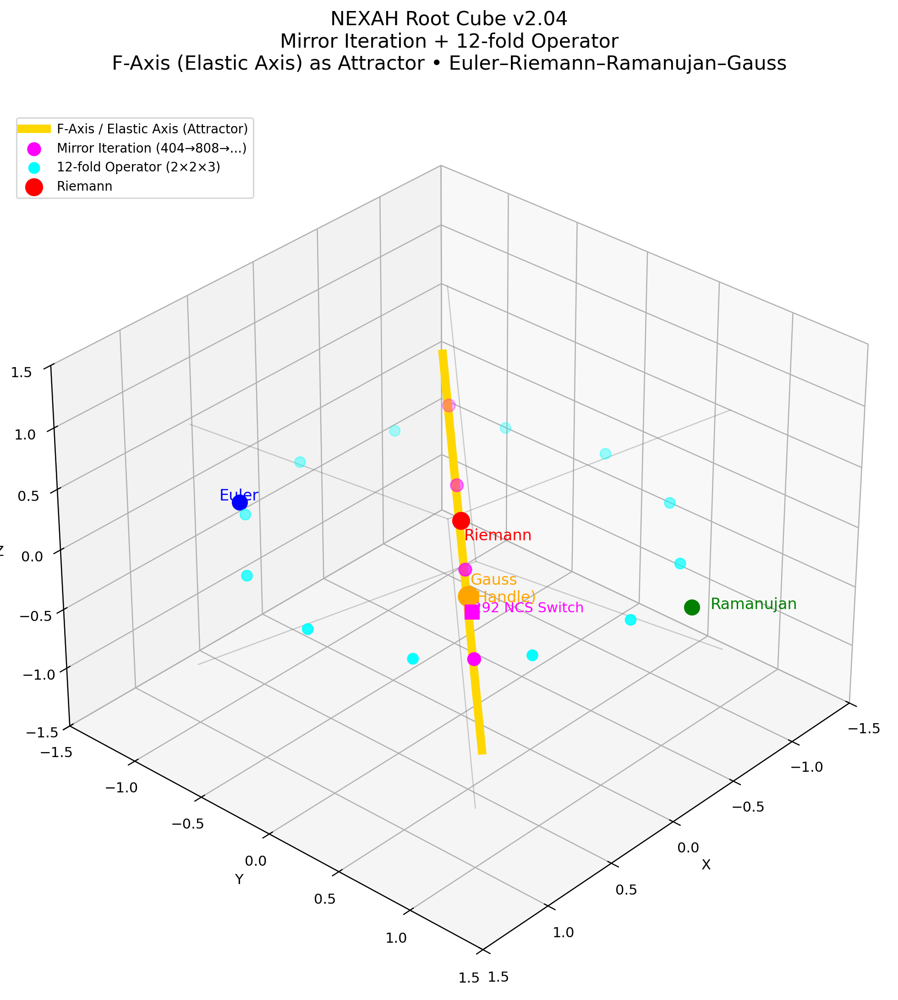
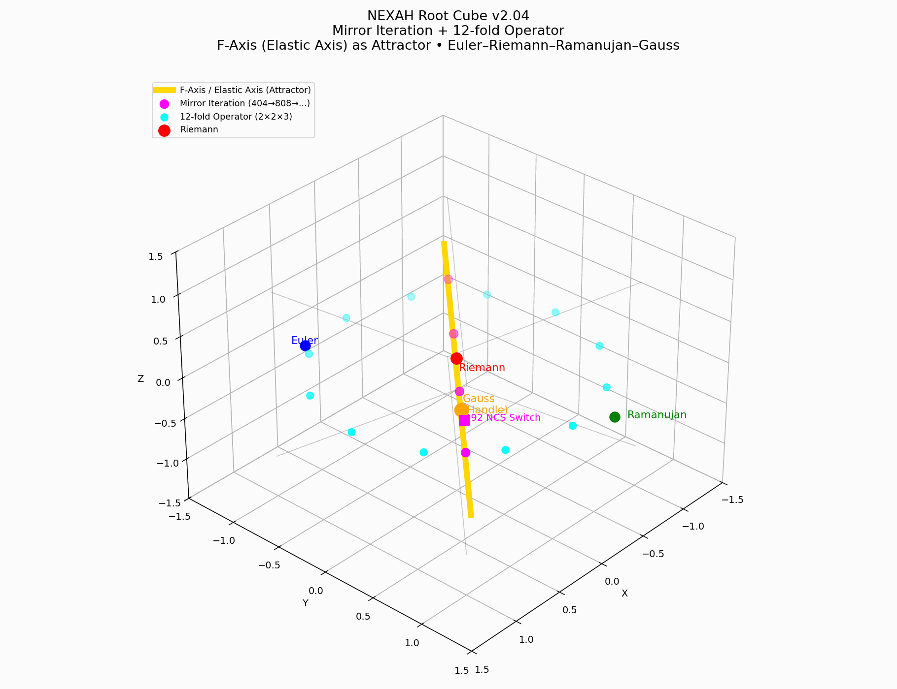
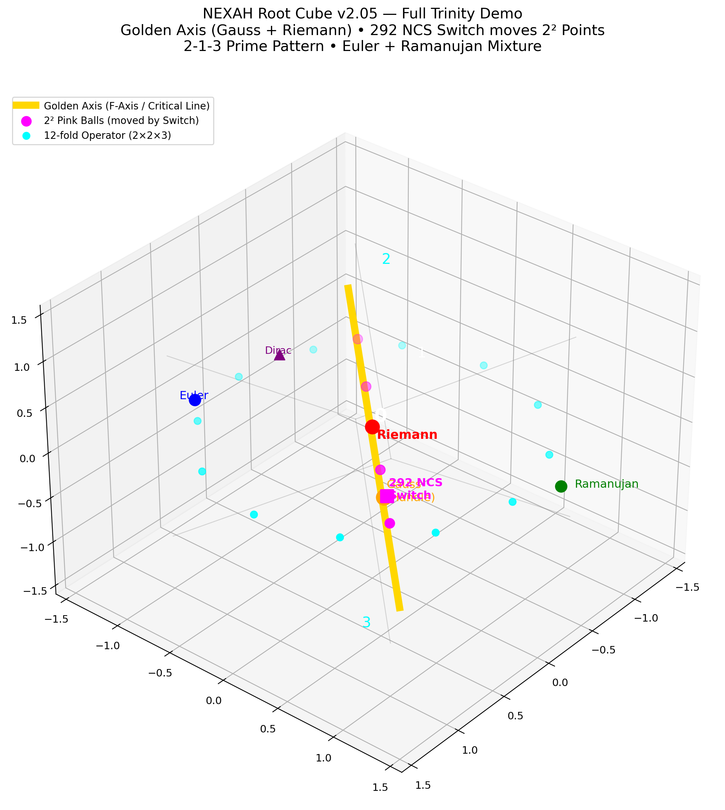
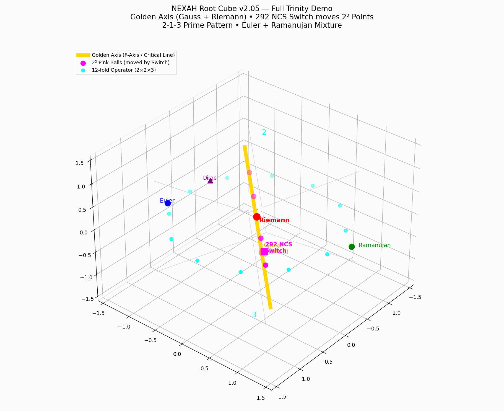
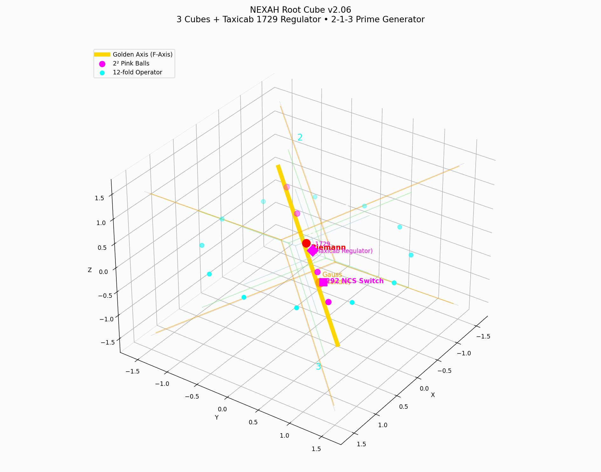
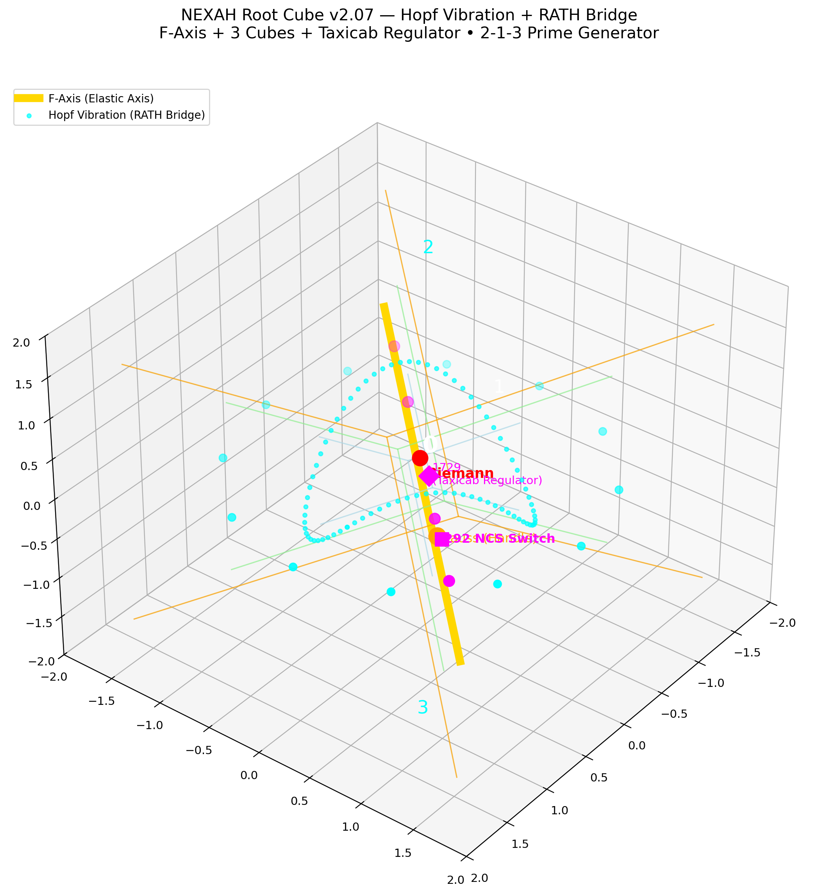
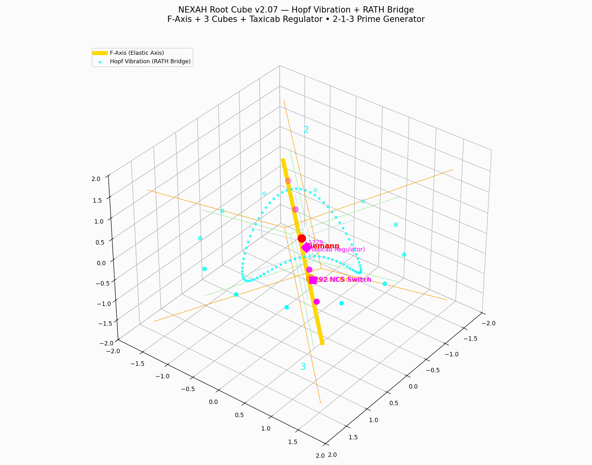

# Visual Gallery – Euler–Riemann–Ramanujan Trinity Experiment

**Version:** v2.10 (April 2026)  
**Location:** `NAVIGATOR/symbolic_layer/EXPERIMENTS/trinity_euler_riemann_ramanujan/`

This gallery shows the complete visual evolution of the Trinity Experiment.  
All images and animations are located in the `outputs/` folder and were generated programmatically.

We started with a simple cube and progressively built the full symbolic language of NEXAH: Golden Axis, Trinity, 12-fold Operator, mirror iteration, 3 cubes, Taxicab regulator, Hopf vibration and finally the Perlenkette fountain.

---

## 1. Foundation

**v2_01_root_cube_basic.png**  
Basic Root Cube with the Golden Axis (Elastic Axis / 45° Critical Line) as central attractor.

**v2_02_trinity_gauss.png**  
Introduction of the Euler–Riemann–Ramanujan Trinity + Gauss as stabilizing handle on the axis.

---

## 2. Rotational Symmetry

**v2_03_12fold_operator_static.png**  
The 12-fold Operator (2 × 2 × 3 = 12) rotating around the Golden Axis. Clear 2-1-3 prime start pattern.

**v2_03_12fold_operator_animation.gif**  
Animated version.

---

## 3. Mirror Dynamics

**v2_04_mirror_iteration_static.png**  
Mirror iteration (404 → 808 → …) along the axis. The 292 NCS Switch begins to move the 2² points.

**v2_04_mirror_iteration_animation.gif**  
Animated version.

---

## 4. Full Trinity Integration

**v2_05_full_trinity_demo_static.png**  
All core elements combined: Trinity, Gauss handle, 12-fold Operator and mirror points.

**v2_05_full_trinity_demo_animation.gif**  
Animated version.

---

## 5. Layered Structure + Taxicab Regulator

**v2_06_3_cubes_taxicab_regulator_static.png**  
Introduction of the 3 Cubes (+1 regulator layers) and Taxicab 1729 as central regulator.

**v2_06_3_cubes_taxicab_regulator_animation.gif**  
Animated version.

---

## 6. Hopf Vibration Layer (RATH Bridge)

**v2_07_hopf_vibration_rath_bridge_static.png**  
First Hopf vibration as the living, twisting background layer.

**v2_07_hopf_vibration_rath_bridge_animation.gif**  
Animated version.

