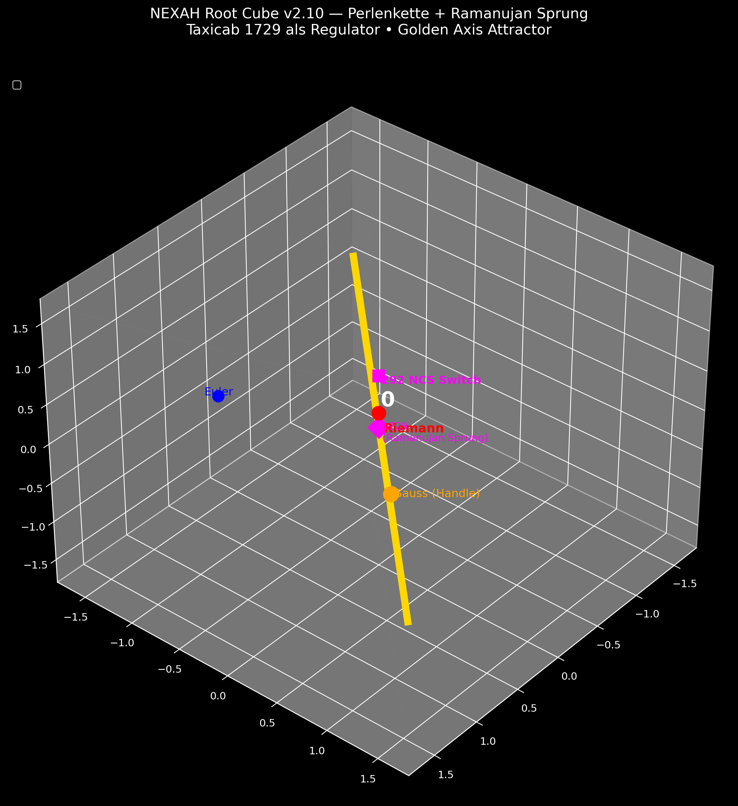
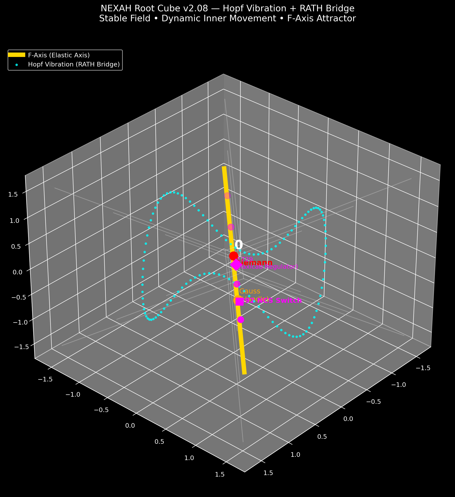
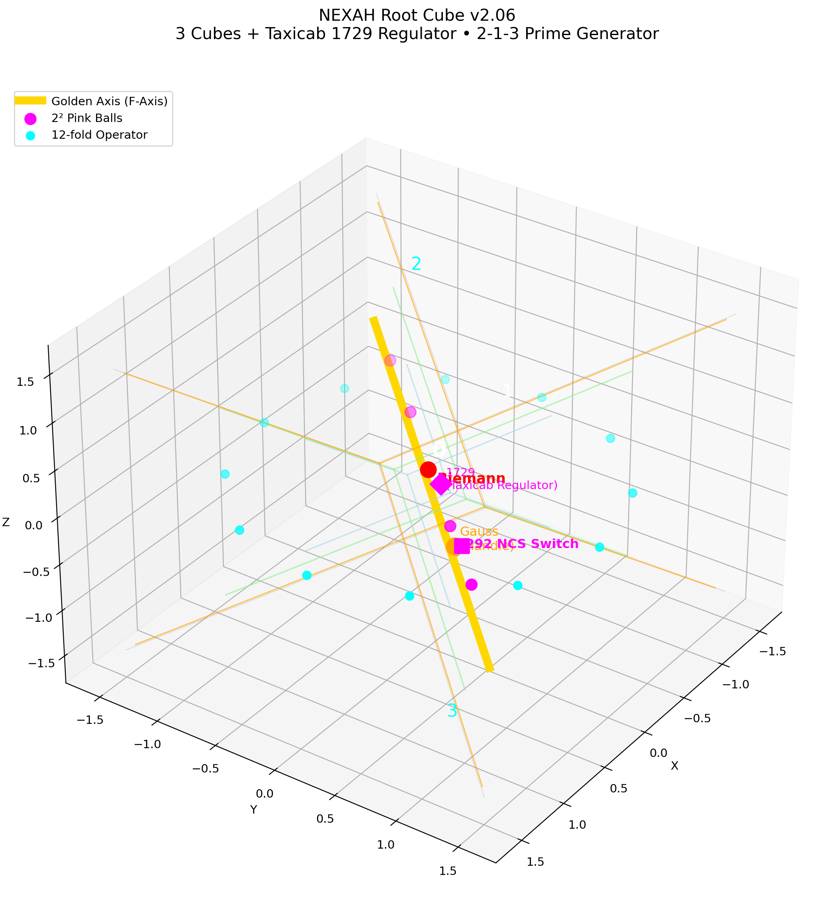
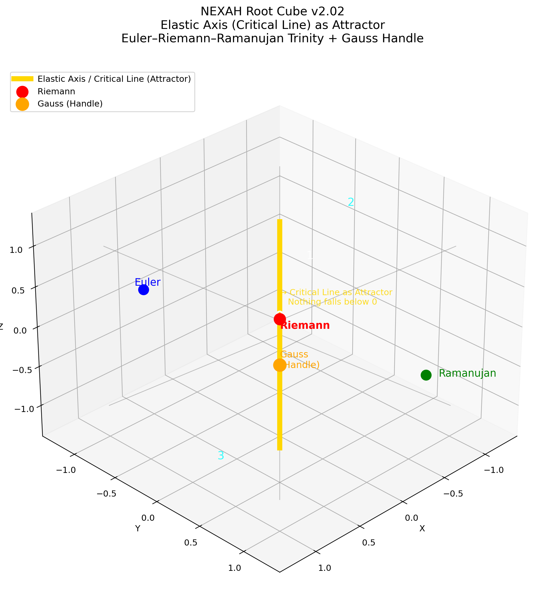

# NEXAH Emergent Symbolic Notation

This directory is the home of the **emergent symbolic notation** of the NEXAH framework.

It translates observed geometric, dynamical and numerical structures into a consistent, operational language — without relying on predefined or esoteric symbols.

---

## What is the Symbolic Notation?

The notation grows directly from what we actually see in simulations and experiments:

- Geometric structures (Root Cube, Elastic Axis, Matroschka layers)
- Dynamical patterns (mirror iteration, zig-zag crankshaft motion, 3-directional flow)
- Numerical relations (181 = 69 + 112, 292 NCS Switch, 1729/1770 Ramanujan binding, 404-808-… sequence)
- Connections to known mathematics (Riemann Critical Line, Ramanujan summation -1/12, 12-fold Operator)

It serves as the **operational language** that makes NEXAH readable, consistent and actionable.

---

## Highlight: Euler–Riemann–Ramanujan Trinity Experiment

One of the most developed visual explorations in this layer is the **Euler–Riemann–Ramanujan Trinity Experiment**.

It shows how the **Riemann Critical Line** appears as the **Golden Axis** inside the Root Cube, with:

- Euler, Riemann and Ramanujan forming a living triangle around the axis
- Gauss acting as the stabilizing “handle”
- The 12-fold Operator providing rotational symmetry
- The 292 NCS Switch moving the 2² points
- Taxicab 1729 as the Ramanujan jump regulator
- Hopf vibration as the living background fabric
- A dynamic “Perlenkette” (pearl chain) fountain visualising the flow

**Explore the full experiment here:**

→ **[trinity_euler_riemann_ramanujan/README.md](./EXPERIMENTS/trinity_euler_riemann_ramanujan/README.md)**  
→ **[trinity_euler_riemann_ramanujan/VISUAL_GALLERY.md](./EXPERIMENTS/trinity_euler_riemann_ramanujan/VISUAL_GALLERY.md)**

---

## Selected Visual Teasers from the Trinity Experiment

  
*Perlenkette Fountain – Final refined version with Ramanujan jump*

  
*Hopf Vibration (RATH Bridge) as living background layer*

  
*3 Cubes + Taxicab 1729 Regulator*

  
*Trinity + Gauss as Handle on the Golden Axis*

---

## Main Documents

| Document                          | Purpose |
|-----------------------------------|--------|
| **[NEXAH_SYMBOLIC_NOTATION.md](./NEXAH_SYMBOLIC_NOTATION.md)** | Core definitions of symbols, numbers and operators |
| **[Riemann_IEEE_Connection.md](./Riemann_IEEE_Connection.md)** | Link between Critical Line, Elastic Axis and IEEE applications |
| **[VISUAL_GALLERY.md](./VISUAL_GALLERY.md)** | Overview of all symbolic visuals |

---

## Bridge to the NEXAH-CODEX Library

The symbolic notation remains **internal** to the active NEXAH framework.  
Several patterns here have conceptual parallels in the frozen **NEXAH-CODEX library** (Scarabaeus1033/NEXAH-CODEX).  

These Codex references are **not part of the executable core** — they serve only as external symbolic background for orientation and historical context.

---

## Role in the NEXAH Stack

The symbolic notation connects:

- **Field Layer (V69)** → Elastic Axis / Critical Line  
- **Spiral Coupling & URF Axial Space** → 3-directional flow  
- **Navigation & Switch Layer** → 292 NCS Switch  
- **Applications** → IEEE power-system stability  

It turns raw observations into a **unified, navigable notation**.

---

**NEXAH**  
Structure becomes visible.  
The Critical Line becomes navigable.  
Mirror, resonance, rotation and 3-directional flow become controllable.
