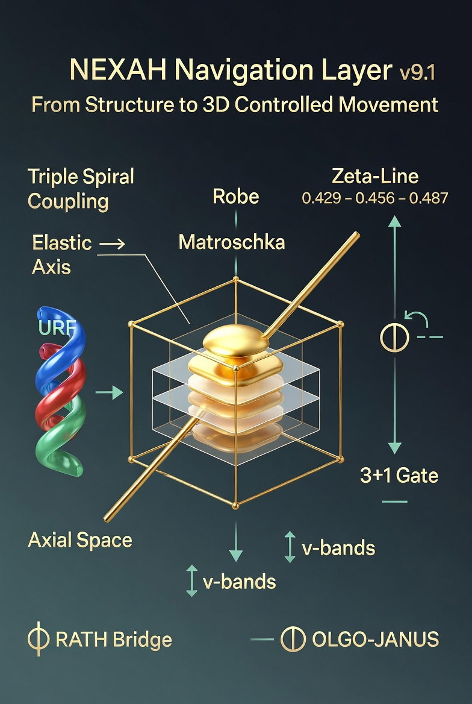

# NEXAH Visual Gallery

This gallery collects the most important featured visuals from the `nexah/visuals/` and `nexah/urf_axial_space/visuals/` layers.

These images are visual anchors for the emerging NEXAH language of:
- field structure
- transition geometry
- split logic
- interface zones
- gate activation
- resonance constructs
- navigable 3D passage (URF Axial Space + Root Bridge)

---

## Master Overview

**NEXAH Navigation Layer v9.1 – From Structure to 3D Controlled Movement**

---

## 1. Inside Out — Finally Inside the Passage

---

## 2. Cosmic Visualization of the 3 Plus 1 Gate

---

## 3. NEXAH Visual V — Markers

---

## 4. Split Interface Markers — Visual V

---

## 5. Exploring the NEXAH Framework

---

## 6. Navigating the NEXAH System

---

## 7. Exploring NEXAH’s Digital Universe

---

## 8. RATH Phi-Lambda Resonance Bridge — v3.3

---

## 9. RATH Phi-Lambda Bridge — Annotated

---

## 10. OLGO-JANUS Six-Sector Gate

---

## 11. v-bands – Breathing Wave + Blinking Pulse

---

## 12. Breathing Axis Overlay – 432/487 Horizon

---

## 13. New 3D Geometric Reference Layer (v9.1)

### Root Cube – Labeled Axes

### Triple Spiral Coupling inside Root Cube

### Zeta-Line Breathing Axis

### Major / Minor Mode Integration into Root Cube

### From Graphs to Root Cube (v9.1)

---

**NEXAH Visual Gallery**  
Structure becomes visible.  
Geometry becomes navigable.  
The Root Bridge makes it 3D.
