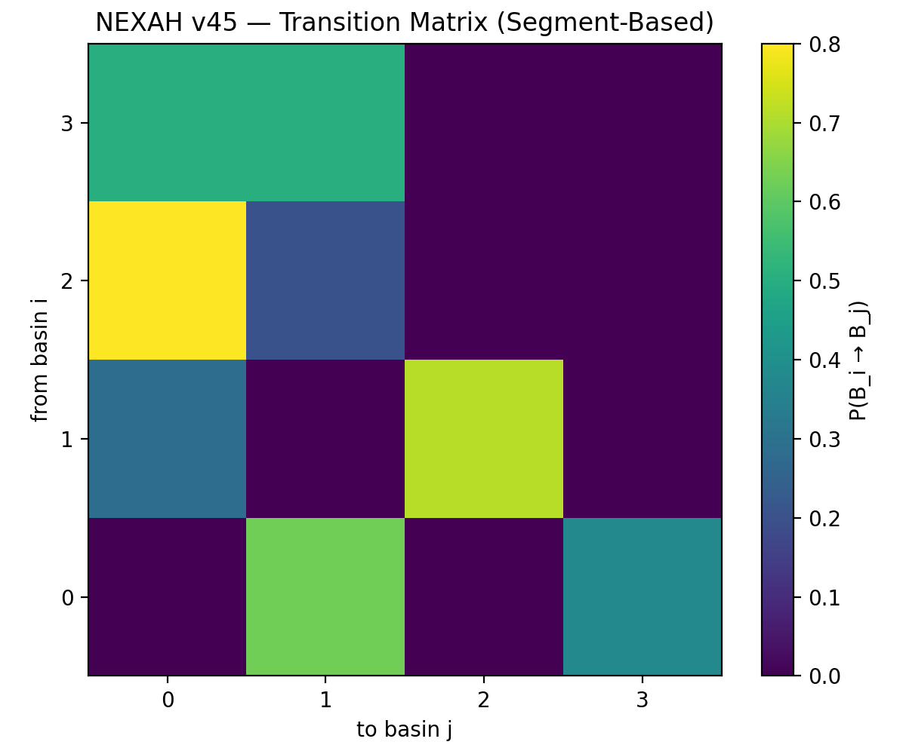
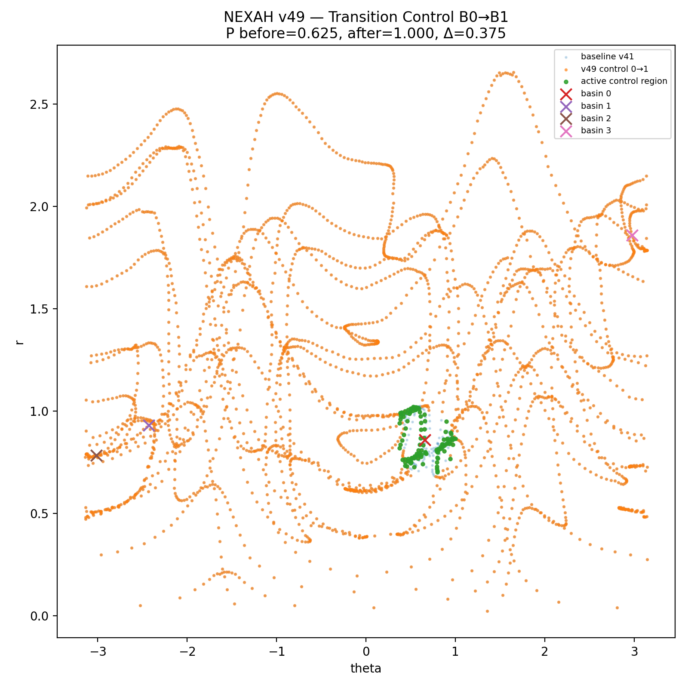
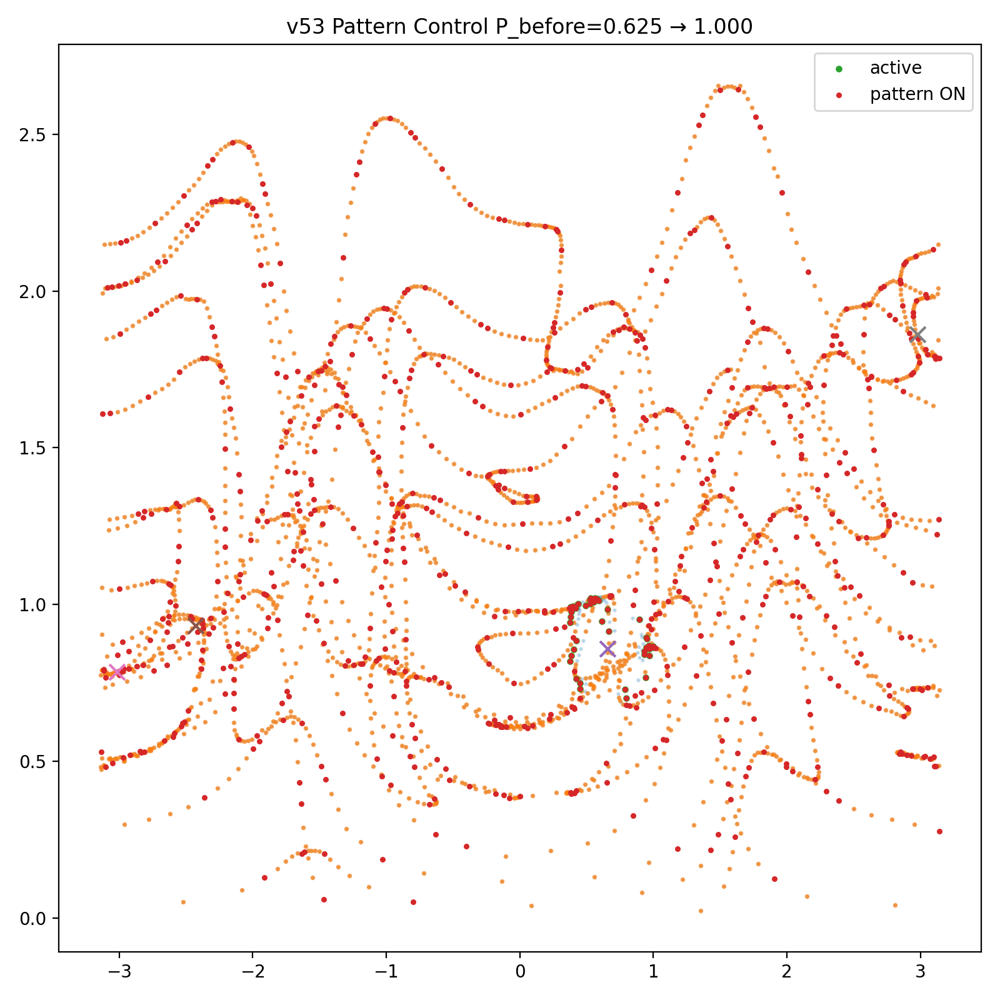
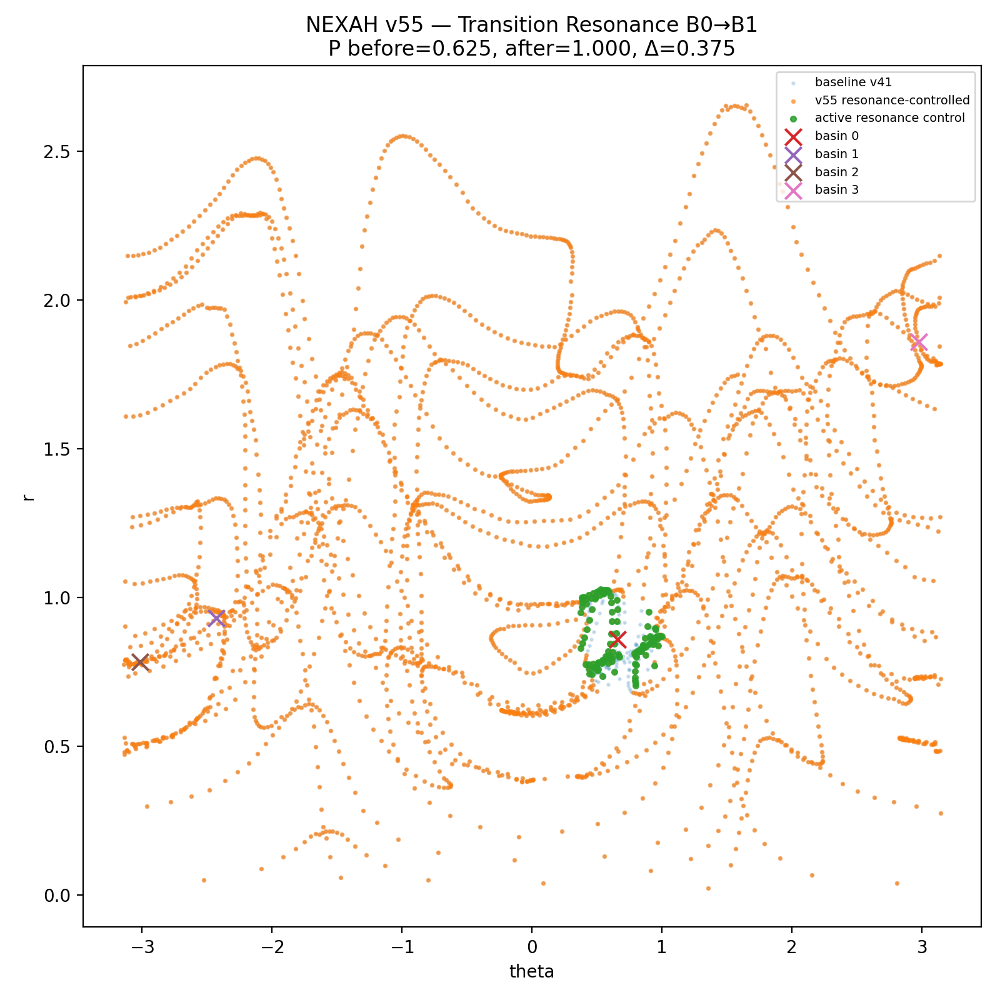
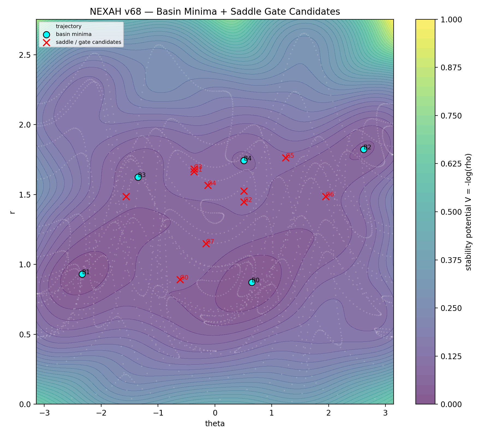
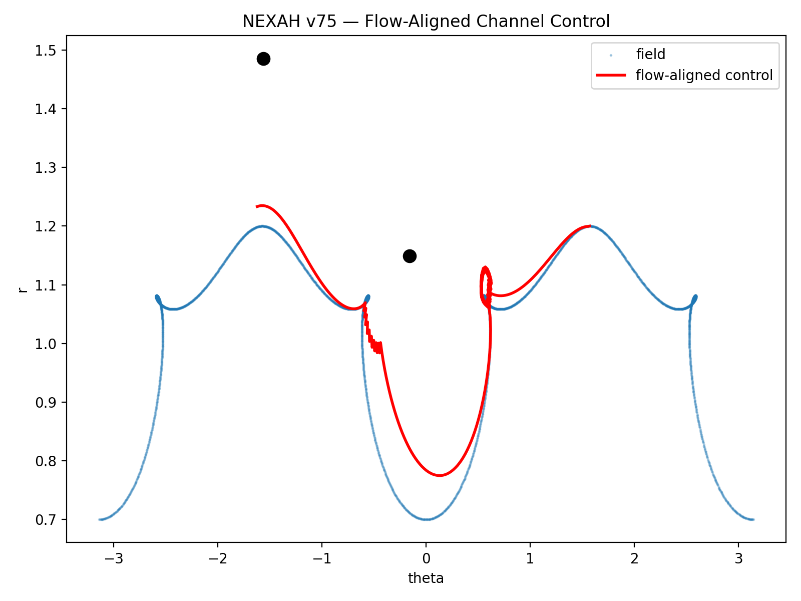
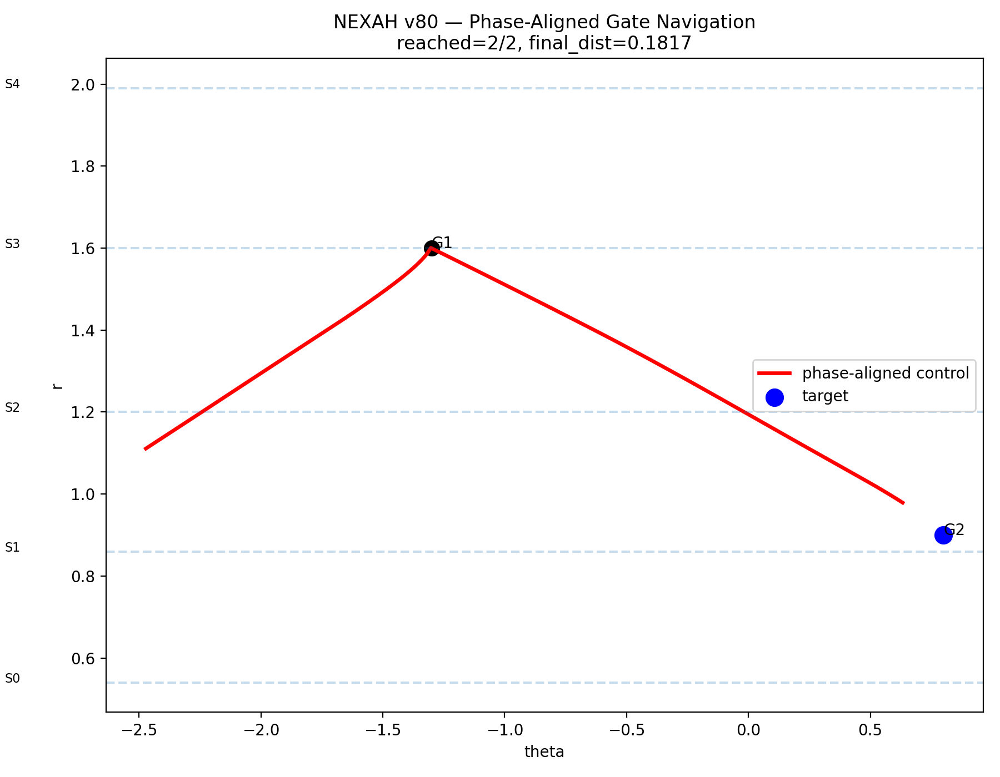

# 🧭 NEXAH — Field-Based Stability Navigation & Control

---

## 🌍 What is NEXAH?

NEXAH is a system for:

```text
detecting, understanding, predicting, and controlling
transitions in complex dynamical systems
```

---

## 🧠 Core Idea

A system does not fail randomly.

```text
It moves through a structured state space
and becomes unstable only in specific regions.
```

NEXAH maps this space and enables:

```text
→ early detection of instability  
→ structural understanding  
→ prediction of transitions  
→ active control of system behavior  
```

---

## 🔥 What makes NEXAH different?

Traditional approaches:

```text
thresholds → alerts → reaction
```

NEXAH:

```text
state space → structure → fields → transitions → control
```

---

## 🎯 System Capability

---

### Detection Layer (v1–v33)

```text
✔ detect transitions early  
✔ identify instability regions  
✔ map risk fields P(IOTA | r, θ)  
```

---

### Navigation Layer (v34–v37)

```text
✔ steer system away from instability  
✔ guide trajectories along structural manifolds  
✔ reduce collapse probability  
```

---

### Control Layer (v38–v55)

```text
✔ identify discrete basins (system regimes)  
✔ model transitions as P(B_i → B_j)  
✔ predict transitions using memory  
✔ actively modify transition probabilities  
✔ apply temporal, adaptive, and structured control  
```

---

### Gate Geometry & Transition Navigation (v56–v80)

```text
✔ model transitions as directional corridors (gates)
✔ identify saddle structures as transition regions
✔ represent system as basin + gate graph
✔ incorporate phase-dependent transition dynamics
✔ enable structure-aligned transition guidance
✔ shift from control → navigation through transitions
```

---

## 🧬 Extended Conceptual Model

```text
Signal
→ Phase space (r, θ)
→ Density field ρ
→ Greyspace G
→ Ridge structure
→ IOTA events
→ Risk field P(IOTA)
→ Basins (discrete regimes)
→ Transition matrix P(B_i → B_j)
→ Navigation field
→ Control layer
→ Gate geometry (transition corridors)
→ Structured transition navigation
```

---

## 🧭 Updated Core Insight

```text
Instability is not noise

Instability is:

geometry
+ probability
+ structure
+ competing flows
+ transition corridors
```

---

## 🚀 Updated Status

```text
✔ Field model
✔ Transition detection
✔ Structural analysis
✔ Navigation
✔ Transition prediction
✔ Transition control
✔ Gate geometry
✔ Transition corridor modeling

→ Next:

- constrained optimal control
- multi-step planning
- long-horizon navigation
- real-world deployment
```

---

## 🧬 Conceptual Model

```text
Signal
→ Phase space (r, θ)
→ Density field ρ
→ Greyspace G
→ Ridge structure
→ IOTA events
→ Risk field P(IOTA)
→ Basins (discrete regimes)
→ Transition matrix P(B_i → B_j)
→ Navigation field
→ Control layer
```

---

## 🧭 Core Insight

```text
Instability is not noise

Instability is geometry
+ probability
+ structure
```

---

## 📁 Project Structure

```text
NEXAH_CORE/
│
├── README.md
├── nexah_foundation.md
├── findings.md
│
├── scripts/
│   ├── ... (v1–v33 detection)
│   ├── ... (v34–v37 navigation)
│   ├── ieee_gate_detection_v38_control_layer.py
│   ├── ieee_gate_detection_v44_basin_identity.py
│   ├── ieee_gate_detection_v45_transition_matrix.py
│   ├── ieee_gate_detection_v46_2_memory_basin_prediction.py
│   ├── ieee_gate_detection_v49_transition_probability_control.py
│   ├── ieee_gate_detection_v52_pattern_control.py
│   ├── ieee_gate_detection_v53_phase_pattern_control.py
│   ├── ieee_gate_detection_v54_adjacency_pattern_control.py
│   ├── ieee_gate_detection_v55_transition_resonance_control.py
│
├── outputs/
│   └── ieee_gates/
│       ├── v37_structure_trajectory.png
│       ├── v45_transition_matrix.png
│       ├── v49_transition_control_B0_to_B1.png
│       ├── v53_phase_pattern_B0_to_B1.png
│       ├── v55_transition_resonance_B0_to_B1.png
│
└── visuals/
```

---

## 📊 Key Visuals

---

### 🔹 Structure-Aware Navigation (v37)


---

### 🔹 Transition Matrix (v45)



---

### 🔹 Transition Control (v49)



---

### 🔹 Phase Pattern Control (v53)



---

### 🔹 Resonance-Aligned Control (v55)



---

### 🔹 Basin & Gate Structure (v68)



---

### 🔹 Flow-Aligned Transition Channels (v75)



---

### 🔹 Phase-Aligned Gate Navigation (v80)



---

## 🔬 Mathematical Foundation

Core definitions:

- state:
  ```
  s(t) = (r, θ)
  ```

- density:
  ```
  ρ(r, θ)
  ```

- greyspace:
  ```
  G = 1 / ρ
  ```

- risk field:
  ```
  P(IOTA | r, θ)
  ```

- transition system:
  ```
  P(B_i → B_j)
  ```

Full formulation:

```text
NEXAH_CORE/nexah_foundation.md
```

---

## 🧭 Navigation Field

```math
u =
- ∇P(IOTA)
+ ∇T
+ ∇ρ
```

---

## 🎯 Control Layer

Control objective:

```math
maximize P(B_source → B_target)
```

Subject to:

```math
Σ_j P(B_source → B_j) = 1
```

---

### Control Types

```text
v49 → transition control  
v50 → multi-policy  
v51 → adaptive selection  
v52 → temporal gating  
v53 → phase control  
v54 → topology constraints  
v55 → resonance-aligned control  
```

---

## 🌍 Applications

- power grid stability  
- financial systems  
- climate tipping points  
- biological dynamics  
- complex network control  

---

## 🚀 Status

```text
✔ Field model
✔ Transition detection
✔ Structural analysis
✔ Navigation
✔ Transition prediction
✔ Transition control

→ Next: constrained optimal control (v56+)
```

---

## 🧠 Final Statement

```text
We are not analyzing signals.

We are modeling and controlling
a structured dynamical field.
```

---

© Thomas K. R. Hofmann  
NEXAH — 2026
