# 🖼️ NEXAH — Visual Discovery Log (v1–v25)

This is not a collection of visuals.

It is a **record of discovery**:

```text
how structure emerges from dynamics
→ and becomes navigable
```

---

# 🧭 Core Pipeline

```text
Dynamics → Density → Structure → Gates → Navigation → Control
```

---

# 🔥 KEY INNOVATIONS (READ FIRST)

## 1. Gate is NOT a threshold

```text
Gate =
low density
+ low coherence
+ rotation breakdown
```

---

## 2. π → Rotation Principle

```text
Stable regions → coherent rotation
Transitions → rotation breakdown
```

---

## 3. Slice ≠ Structure

```text
Observed channels = projections of higher-dimensional geometry
```

---

## 4. Janus Field (Bidirectional Awareness)

```text
Forward + backward flow simultaneously

→ system encodes origin + destination
```

---

## 5. Cross-System Invariance

```text
Lorenz, Kuramoto, Rössler → same structural geometry
```

---

# 🧩 PHASE 1 — Field Emergence (v1–v4)


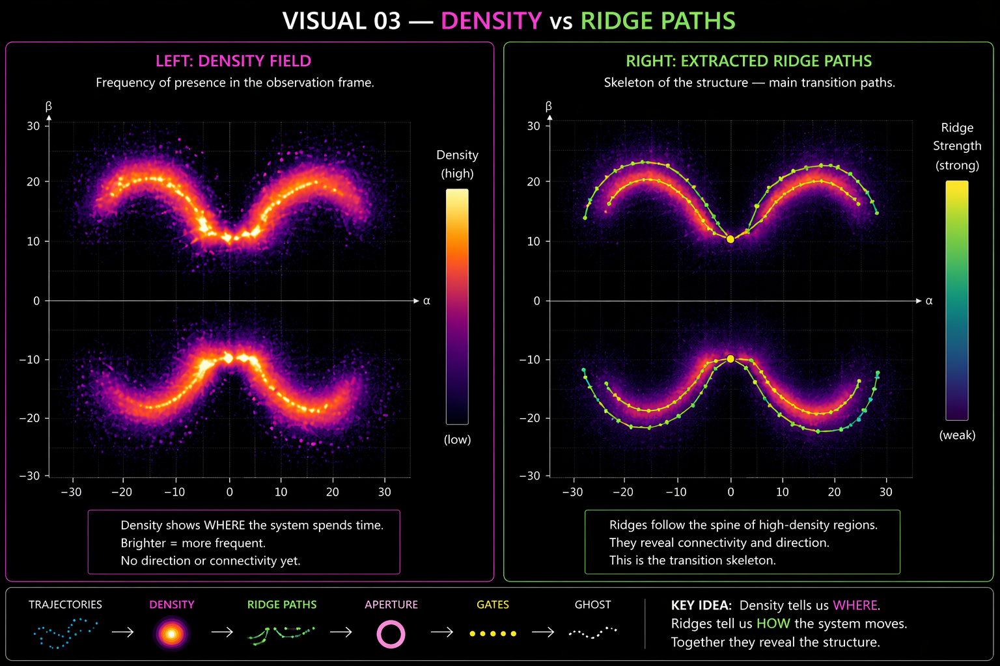

```text
Discovery:
structure emerges from density, not equations
```

---

# 🧩 PHASE 2 — Structure & Pathways (v5–v9)

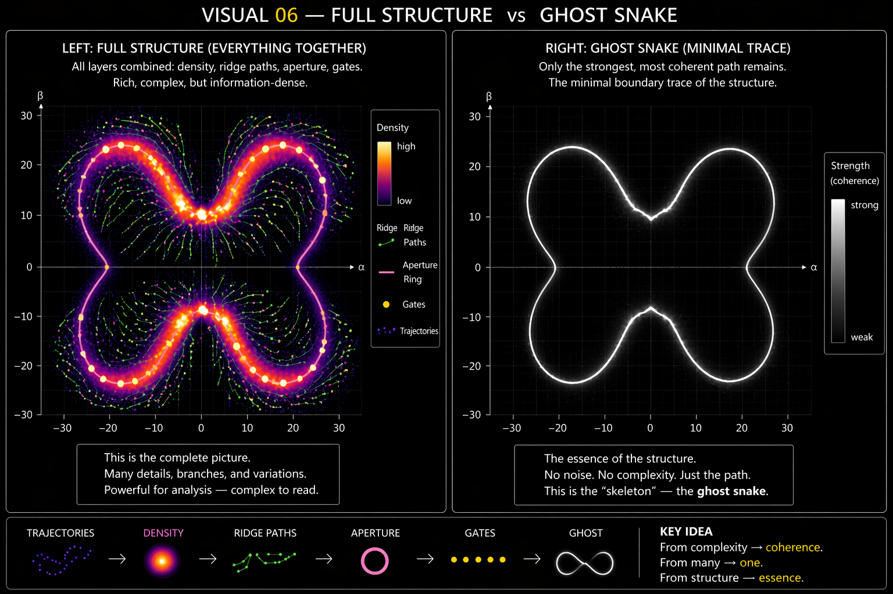

```text
Discovery:
systems form stable pathways (ridges)
→ geometry appears
```

---

# 🧩 PHASE 3 — Transition Geometry (v10)


```text
Discovery:
transitions are not points
→ they are regions (gates)
```

---

# 🧩 PHASE 4 — Navigation & Control (v11–v20)

## 🔷 Kernel Navigation (v11)


```text
Discovery:
agents can move using gate-aware dynamics
```

---

## 🔷 Goal Navigation (v13)


```text
Navigation follows structure, not shortest path
```

---

## 🔷 Janus Field (v14)


```text
Forward + backward flow simultaneously
→ bidirectional stability awareness
```

---

## 🔷 Manifold Navigation (v18)

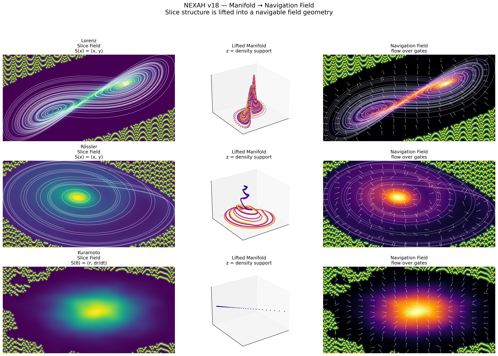

```text
Navigation happens on embedded manifolds
→ not flat geometry
```

---

## 🔷 Policy Navigation (v19)


```text
Control reshapes transition structure
```

---

## 🔷 Multi-Agent Navigation (v20)

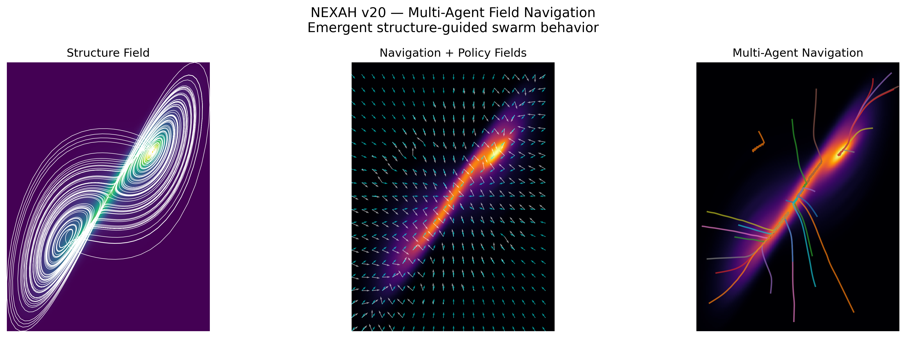

```text
Multiple agents interact through shared geometry
```

---

## 🧠 Interpretation

```text
Navigation =
alignment with structure
+ anticipation of transitions
+ interaction across agents
```

---

# 🧩 PHASE 5 — Slice vs Structure (v15–v17)

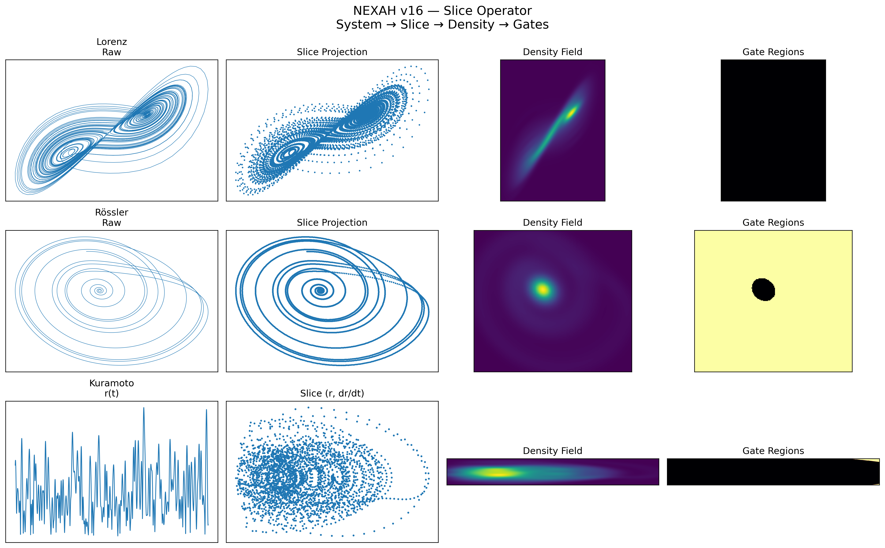
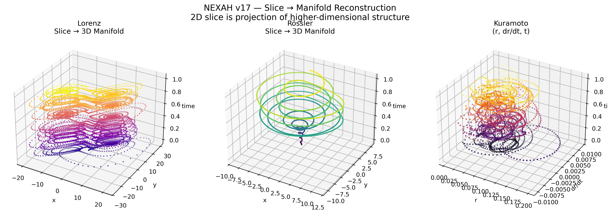

```text
Discovery:
observed channels are projections

true structure is higher-dimensional
```

---

# 🧩 PHASE 6 — Synchronization & Regimes (v21–v22)


```text
Discovery:
synchronization creates regime structure
→ transitions between regimes become visible
```

---

# 🧩 PHASE 7 — Cross-System Invariance (v23)

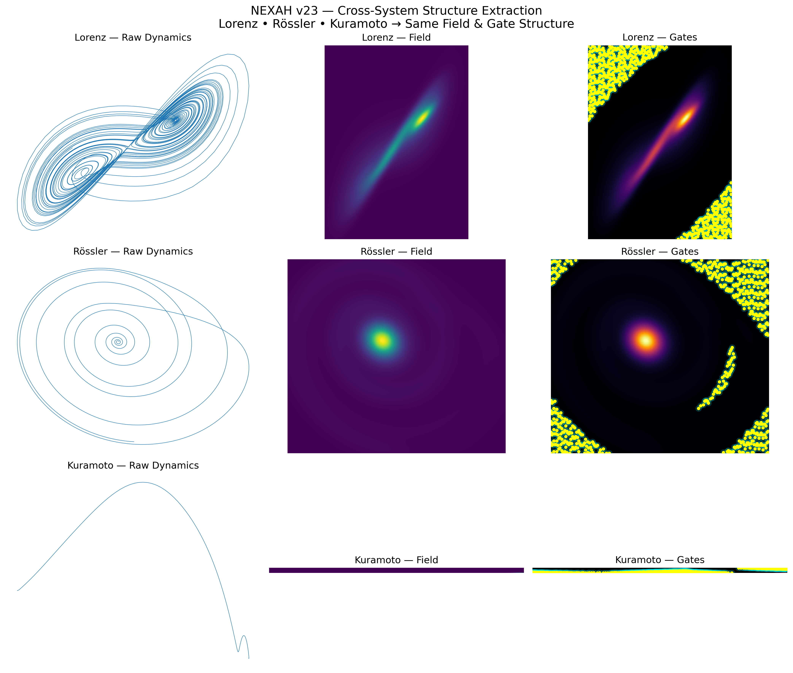

```text
Discovery:
same structural patterns across fundamentally different systems
```

---

# 🧩 PHASE 8 — Rotation & Stability (v24)

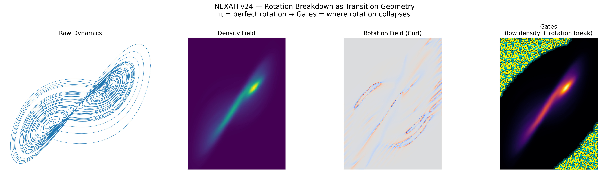

```text
Discovery:
rotation encodes stability

stable = coherent rotation
transition = rotation collapse
```

---

# 🧩 PHASE 9 — Unified Gate Operator (v25)

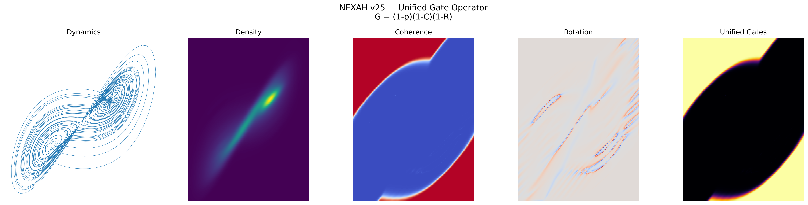

```text
G(s) = (1 - ρ)(1 - C)(1 - R)
```

```text
Discovery:
gates emerge from combined structural weakness
```
---

# 🧩 PHASE 10 — Transition Structure (v26–v28)

## 🔷 Sheet Partition (Phase Space)

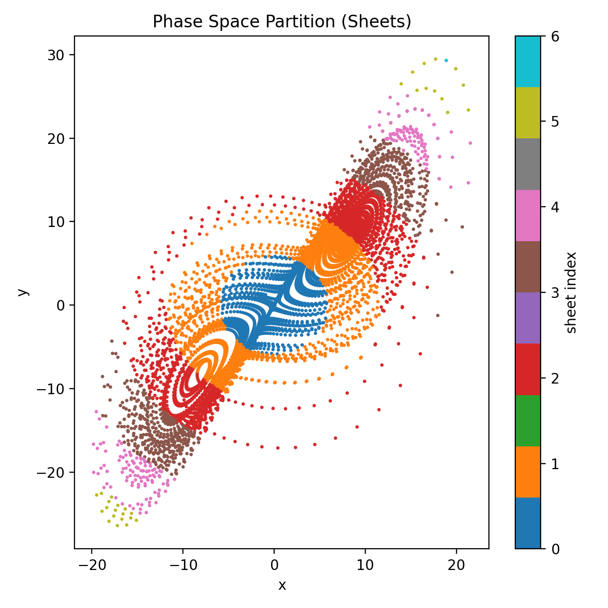

```text
Discovery:
continuous dynamics induce discrete structural layers (sheets)
```

---

## 🔷 Transition Time Series

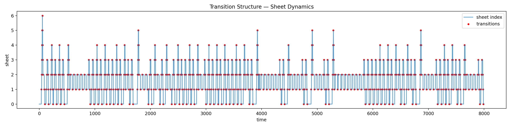

```text
Discovery:
system switches continuously between adjacent structural states
→ transitions are distributed over time
```

---

## 🔷 Transition Matrix

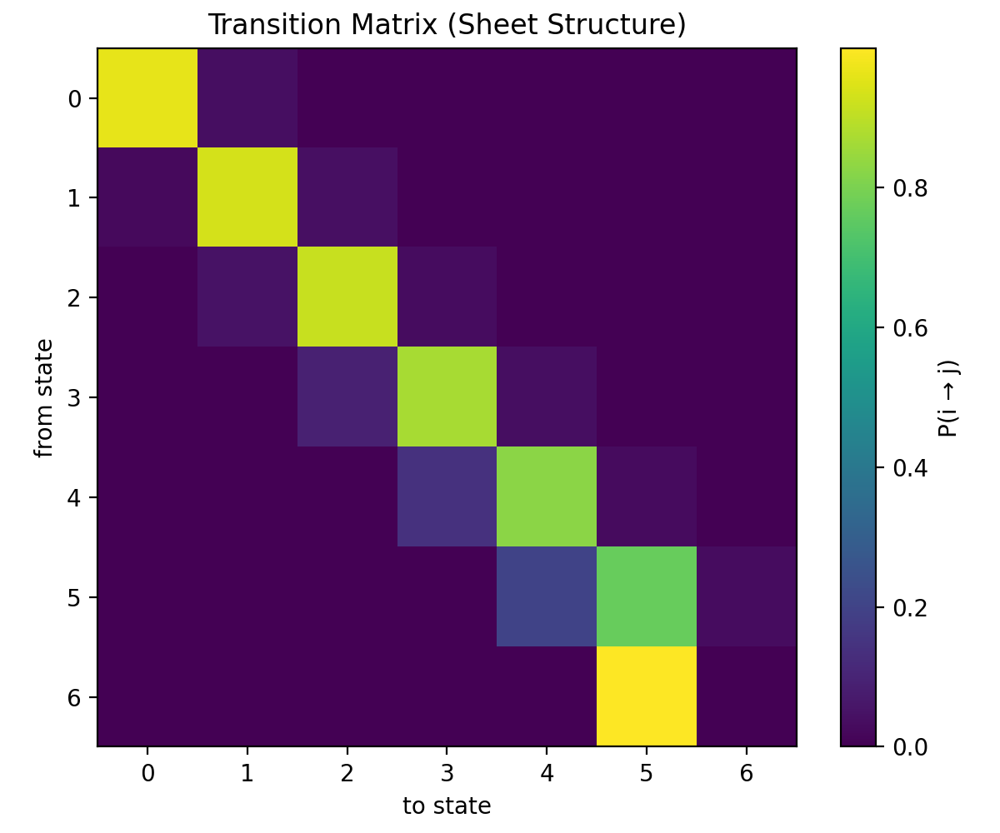

```text
Discovery:
transition structure is banded and local

→ system behaves like a constrained Markov process
```

---

## 🧠 Interpretation

```text
Continuous dynamics → induces discrete transition structure

The system does not jump randomly.

It evolves along an ordered adjacency graph
defined by geometric constraints.
```

---

## 🔥 Key Insight (NEW)

```text
The system is not only a field.

It is a field that induces a discrete state space.
```

---

## 🔁 Upgrade to Previous Phases

Before:

```text
Dynamics → Density → Structure → Gates
```

Now:

```text
Dynamics → Density → Structure → Sheets → Transitions → Gates → Navigation
```

---

## 🚀 Conceptual Impact

```text
G(x) describes instability

BUT

s(t) describes structural position

→ both are required to understand transitions
```

---

# 🧠 FINAL INSIGHT

```text
Systems do not randomly evolve.

They move through structured fields,
lose coherence,
and transition through geometry.
```

---

# 📌 Notes

- empirical  
- cross-system consistent  
- partially formalized  

---

# 🚀 Next

→ docs/gate_operator.md  
→ navigation kernel  
→ formalization
