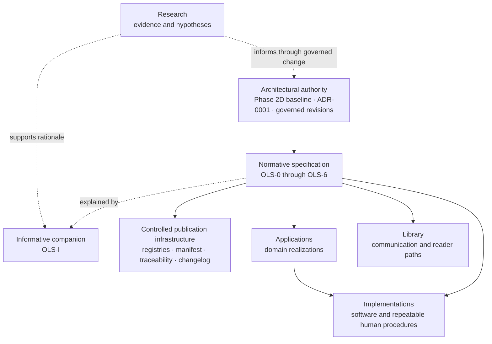
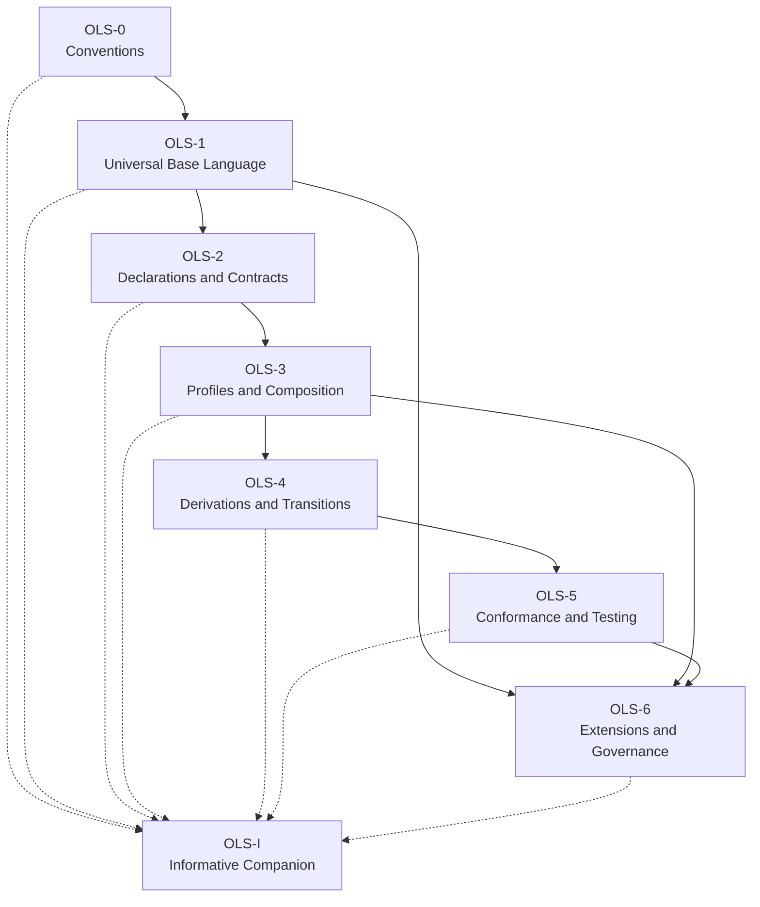

# Orientation Language Architecture

## Purpose

This document explains the layered subsystem architecture without redefining the Orientation Language. Normative meaning remains in the OLS suite.

## Layers

Solid arrows express authority, governed realization, or publication dependency. Dotted arrows are informative. No arrow authorizes a lower layer to redefine an upper layer.

## Normative suite dependency

The canonical architectural dependency diagram for the published suite shall be derived from the Phase 3A complete dependency graph and maintained against the release manifest:

This is an editorial simplification of the existing complete graph. The release manifest and each document’s normative dependency metadata remain controlling.

## Ownership boundaries

| Concern | Owner | May reference | Shall not become |
| --- | --- | --- | --- |
| Universal semantics | OLS-1 | OLS-0 conventions | Research claim, Library metaphor, or implementation type |
| Declarations and primitive contracts | OLS-2 | OLS-1 | Profile-specific redefinition |
| Profiles and composition | OLS-3 | OLS-1 and OLS-2 | Universal semantics by activation |
| Derivations and transitions | OLS-4 | OLS-1 through OLS-3 | Workflow or causal guarantee |
| Conformance | OLS-5 | OLS-0 through OLS-4 | Truth, quality, safety, or performance certification |
| Evolution and release governance | OLS-6 | Frozen architecture and applicable OLS parts | Silent architecture revision |
| Explanation and implementation guidance | OLS-I | Any compatible normative part | Normative authority |

## Repository boundaries

- `SPECIFICATION/RELEASES/` contains complete immutable release units; part directories provide reader navigation to their one canonical released file.
- `COMPANION/` provides the explicitly informative OLS-I entry point without duplicating the release-contained document.
- `REGISTRIES/` exposes controlled indexes without duplicating definitions.
- `VISUALS/` contains informative diagrams with source and status metadata.
- `EXAMPLES/` contains examples linked to controlling Requirement and Test IDs.
- `CHANGELOG/` records releases and migration without rewriting historical records.
- `HISTORY/` preserves standardization phases, reviews, rejected alternatives, and superseded diagrams.
- repository-wide Research, Library, Applications, and Implementations remain outside this subsystem.

## Invariants

1. One released Document ID has one canonical file per suite release.
2. Stable IDs survive path changes unchanged.
3. A path is never the sole normative reference.
4. Informative material cannot fill a normative gap.
5. Applications and implementations report mappings; they do not own semantics.
6. Historical material remains accessible and visibly historical.
7. Migration is content-preserving and checksum-verified.
