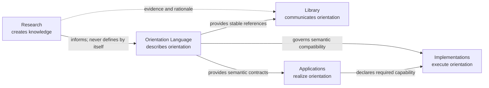
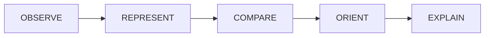

# Orientation Language Ecosystem Overview

## Ecosystem position

The repository has five distinct responsibilities:

Arrows indicate documented interfaces, not transfer of responsibility. No downstream domain becomes semantic authority merely by using the language.

## Orientation Language subsystem

The subsystem has six publication zones:

| Zone | Purpose | Authority |
| --- | --- | --- |
| Specification | OLS-0 through OLS-6 | Normative according to each document’s marked clauses and annexes |
| Companion | OLS-I | Informative, historical, analytical, and implementation guidance only |
| Registries | Controlled indexes, manifest, ownership, terminology, requirements, tests, and traceability | Authority only where a normative OLS annex assigns it |
| Examples | Worked and negative cases | Informative unless a normative test registry explicitly incorporates a case |
| Visuals | Public, ecosystem, and dependency diagrams | Informative navigation aids |
| Changelog | Release and migration history | Documentary; cannot silently alter semantics |

## Specification suite

| Part | Responsibility | Minimum dependency |
| --- | --- | --- |
| OLS-0 | Suite conventions, identifiers, references, and document registry | None |
| OLS-1 | Universal Base Language | OLS-0 |
| OLS-2 | Declarations and primitive operator contracts | OLS-0 and OLS-1 |
| OLS-3 | Semantic profiles and composition | OLS-0 through OLS-2 |
| OLS-4 | Derivations and semantic transitions | OLS-0 through OLS-3 |
| OLS-5 | Conformance and testing | OLS-0 through OLS-4 |
| OLS-6 | Extensions, versioning, and governance | Dependencies declared by OLS-0 and OLS-6 |
| OLS-I | Explanations, examples, implementation guidance, history, and research trace | Applicable normative parts; no authority edge back |

The table is navigational. Each OLS document remains authoritative for its own responsibility.

## Public mental model

The simplest public path through the language is:

This diagram explains the universal process only. It does not imply recommendation, authorization, execution, outcome, or learning. Profiles add declared capability under their own rules.

## Interfaces between domains

### Research to Orientation Language

Research supplies evidence, competing models, experimental findings, limitations, and rationale. Language changes occur only through the governance and architecture-revision boundaries of the OLS suite.

### Orientation Language to Library

The Library may explain, teach, visualize, and contextualize the language. It cites stable OLS identifiers and marks its own material informative. Reader popularity, editorial approval, or visual polish does not alter semantics.

### Orientation Language to Applications

An application declares which base semantics, profiles, operators, declarations, derivations, and authority boundaries it uses. Domain policy remains application-owned.

### Orientation Language to Implementations

An implementation maps language elements to software or repeatable human procedures. It reports supported and unsupported capability and produces OLS-5 evidence. Its internal types never become language definitions.

## Public subsystem rule

There shall be one canonical published copy of each OLS part per suite release. All other materials link to that copy by stable identifier and compatible suite version. Historical copies remain preserved and visibly non-current.

