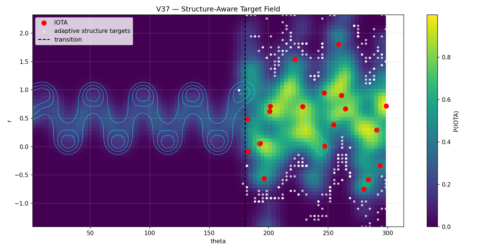

# ⚙️ PROTO_CORE — Experimental Structural Engine

> Core experimental layer of the NEXAH framework.

PROTO_CORE contains the active structural engine behind:

- field reconstruction
- transition geometry
- navigation behavior
- phase dynamics
- control experiments
- stability field extraction

It is the primary development environment where:

```text
raw dynamics
→ structure extraction
→ transition geometry
→ navigation behavior
→ control logic
```

are explored and iteratively expanded.

---

# 🧠 Purpose of PROTO_CORE

PROTO_CORE is not a finalized framework.

It is:

> an active experimental architecture for discovering and validating geometric structure in dynamical systems.

The directory combines:

- implemented experimental systems
- structural reconstruction methods
- navigation experiments
- empirical validation
- evolving control logic
- prototype field abstractions

---

# 🧭 Core Structure

```text
PROTO_CORE/
├── FIELD_LAYER/
├── NEXAH_CORE/
└── NEXAH_DEMONSTRATOR/
```

---

# 🌊 FIELD_LAYER/

```text
PROTO_CORE/FIELD_LAYER/
```

Continuous geometric and field representation layer.

This subsystem reconstructs:

- density fields
- flow structure
- ridge geometry
- basin boundaries
- transition topology
- directional flow structure

Core transformation:

```text
trajectory
→ density
→ geometry
→ navigable field structure
```

---

## 🔬 Major Components

### FIELD_DECOMPOSITION/

Experimental reconstruction system for:

- manifold extraction
- field decomposition
- orbit structure
- separatrix analysis
- Lyapunov overlays
- transport maps
- transition geometry

Contains:

```text
outputs/
scripts/
visual_gallery.md
README.md
```

---

### NAVIGATION_ENGINE/

Experimental navigation and control layer.

Includes:

- ridge-following behavior
- gate-aware motion
- adaptive navigation
- transition steering
- regime locking
- observer-guided control
- field shaping
- control energy mapping

This layer explores:

```text
navigation within learned geometry
```

rather than traditional state control.

---

# 🔶 NEXAH_CORE/

```text
PROTO_CORE/NEXAH_CORE/
```

Primary transition and instability engine.

Implements:

- gate detection
- transition fields
- basin dynamics
- phase-space localization
- trajectory steering
- structure-aware control
- adaptive transition control

This is the central experimental system layer.

---

## 🔥 Key Experimental Themes

### Transition Geometry

Transitions are treated as:

```text
structured geometric regions
```

rather than isolated threshold events.

---

### Basin Dynamics

The system reconstructs:

- basin identities
- basin transitions
- basin memory
- transition probabilities
- transition resonance

---

### Structure-Aware Control

Recent experiments explore:

```text
phase-aligned control
phase-opposed stabilization
gate-aware trajectory steering
```

Core insight:

> effective stabilization emerges from alignment with system geometry.

---

## 📊 Key Output Systems

```text
outputs/ieee_gates/
```

Contains hundreds of generated experiments including:

- transition maps
- control trajectories
- gate fields
- ridge extraction
- basin memory systems
- adaptive control layers
- learned flow fields
- stability landscapes

---

## 🌊 Example — Learned Structure Field



*Control emerges from alignment with system geometry rather than external forcing.*

---

## 🌊 Example — Navigation Geometry


*System trajectories move along structured admissible flow paths.*

---

# 🧪 NEXAH_DEMONSTRATOR/

```text
PROTO_CORE/NEXAH_DEMONSTRATOR/
```

Minimal reproducible implementation of the NEXAH structural pipeline.

Designed as:

- demonstration system
- reproducible reference layer
- onboarding environment
- visualization showcase

---

## Includes

- transition structure extraction
- gate operator logic
- navigation kernel
- Kuramoto synchronization examples
- manifold navigation
- unified gate operators
- cross-system demonstrations

---

## 🎞 Visual Systems

The demonstrator contains:

```text
visuals/
├── core/
├── hero/
├── navigation/
├── kuramoto/
├── structure/
├── unified/
└── cross_system/
```

Including:

- animated transition dynamics
- gate geometry
- synchronization fields
- manifold navigation
- multi-agent structure
- regime transition overlays

---

## 🔥 Hero Visualization


*Geometry-aware transition navigation across structured dynamical regions.*

---

# 🧠 Conceptual Architecture

PROTO_CORE explores the hypothesis that:

```text
complex systems evolve within structured geometric fields
```

where:

- stability is spatial
- transitions are geometric
- phase dynamics trigger shifts
- control depends on directional alignment

---

# 🔬 Current Status

PROTO_CORE currently contains:

```text
✔ active experimental systems
✔ reproducible demonstrations
✔ large empirical output layers
✔ geometric transition models
✔ navigation experiments
✔ structure-aware control experiments
```

But also:

```text
❗ evolving architecture
❗ incomplete kernel integration
❗ exploratory abstractions
❗ partially unified interfaces
❗ ongoing validation work
```

---

# 🧭 Recommended Exploration Path

## 🔹 New Visitors

Start here:

```text
NEXAH_DEMONSTRATOR/
```

Then explore:

```text
FIELD_LAYER/
NEXAH_CORE/
```

---

## 🔹 Researchers

Focus on:

```text
FIELD_LAYER/FIELD_DECOMPOSITION/
NEXAH_CORE/outputs/
```

---

## 🔹 Developers

Focus on:

```text
scripts/
outputs/
navigation systems
control systems
```

---

# ⚡ Central Insight

```text
Stability is not merely a value.

It is a geometric region inside a structured field.
```

---

# 🧭 Final Orientation

PROTO_CORE should currently be understood as:

> an experimental structural engine for discovering geometry, transitions, and navigable structure in dynamical systems.

---

**Thomas K. R. Hofmann · NEXAH · 2026**
```
