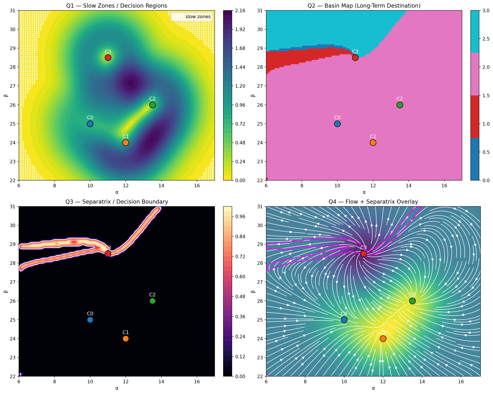
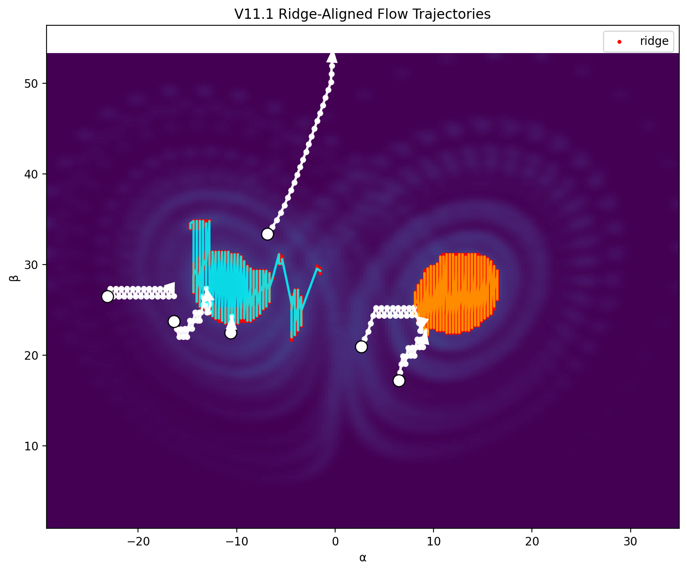
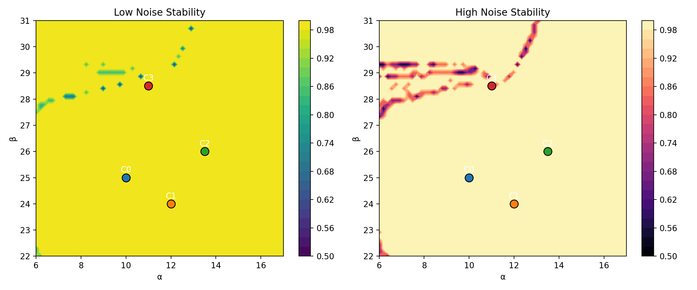
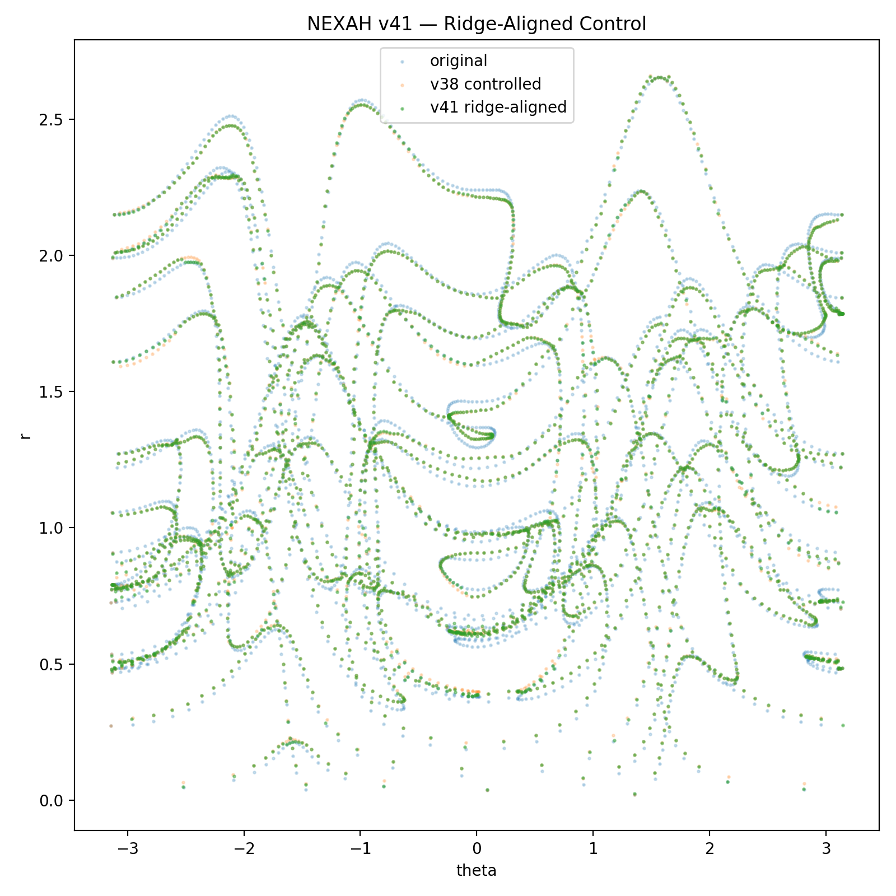
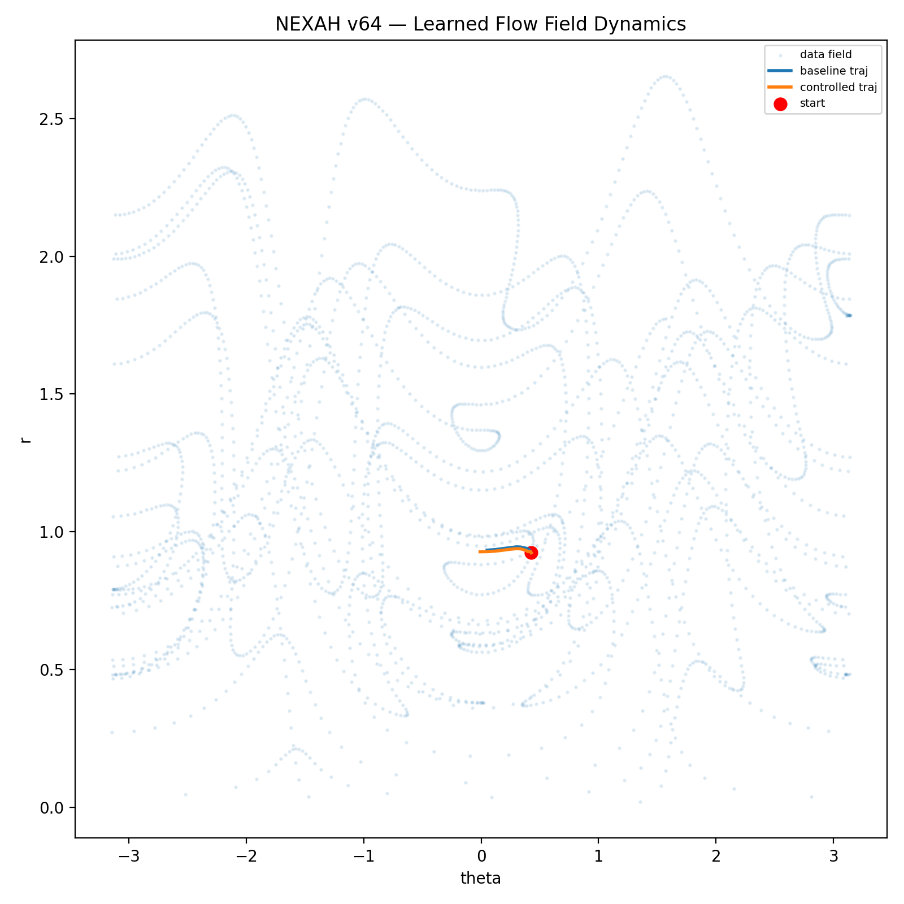
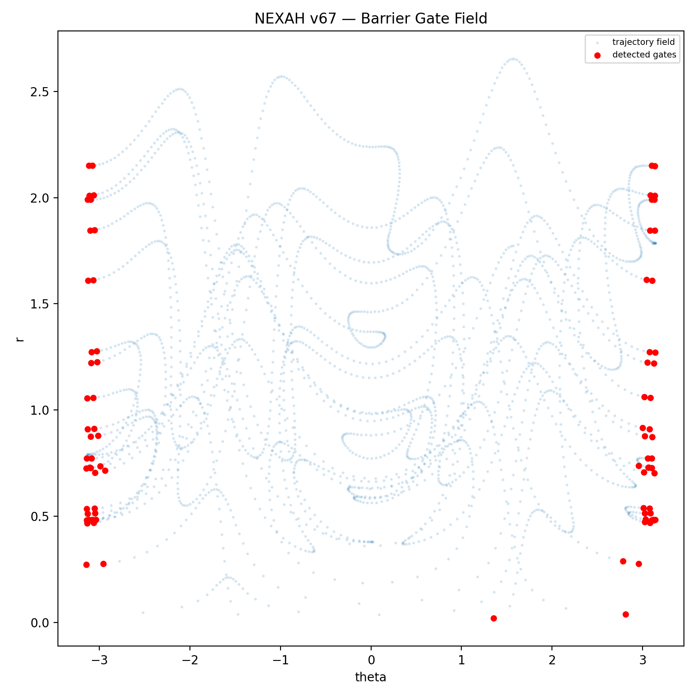
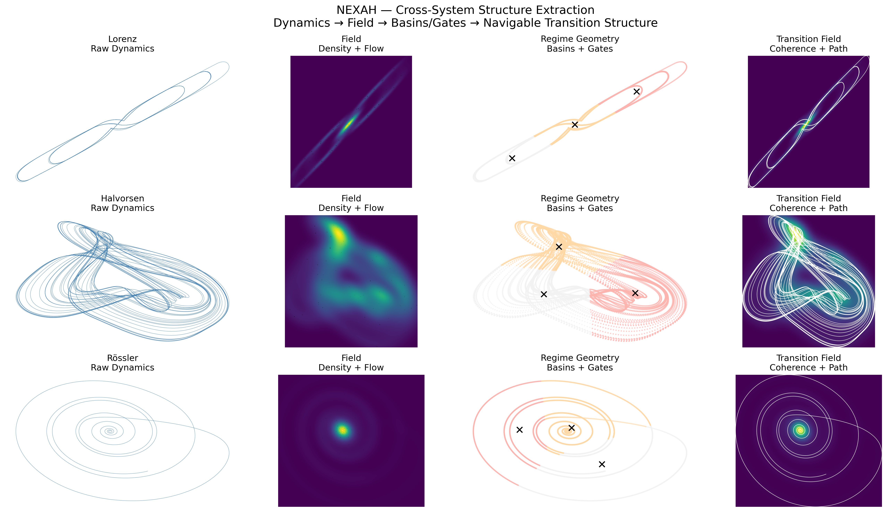

# 🌀 PROTO_CORE — Visual Gallery

> A curated visual atlas of the experimental structural systems inside PROTO_CORE.

This gallery documents the evolution of:

- field reconstruction
- transition geometry
- navigation behavior
- basin dynamics
- structure-aware control
- adaptive stabilization
- multi-regime organization

within the NEXAH framework.

---

# 🧭 Gallery Structure

```text
PROTO_CORE/
├── FIELD_LAYER/
├── NEXAH_CORE/
└── NEXAH_DEMONSTRATOR/
```

---

# 🌊 FIELD_LAYER — Geometry & Flow Structure

The FIELD_LAYER reconstructs continuous geometric structure from system trajectories.

Core transformation:

```text
trajectory
→ density
→ geometry
→ flow structure
→ navigable field
```

---

## 🔹 Separatrix Detection



*Boundary extraction between dynamically distinct regions.*

This visualization explores:

- regime separation
- basin geometry
- boundary topology
- transition surfaces

---

## 🔹 Ridge-Aligned Flow



*Flow trajectories align with emergent structural ridges.*

Shows how:

```text
system motion follows learned geometric structure
```

rather than unconstrained state evolution.

---

## 🔹 Full Navigation Geometry


*Geometry-aware navigation across structured flow fields.*

This experiment demonstrates:

- admissible transition paths
- constrained flow geometry
- structured navigation behavior

---

## 🔹 Noise Robustness



*Structural geometry remains stable under perturbation.*

Key observation:

```text
transition structure persists under noise
```

which supports the hypothesis that:

> geometry is an intrinsic system property rather than a visualization artifact.

---

# 🔶 NEXAH_CORE — Transition & Control Geometry

NEXAH_CORE contains the primary transition and instability systems.

Focus areas:

- gate dynamics
- phase transitions
- basin identity
- structure-aware control
- learned flow stabilization

---

## 🔹 Structure-Aware Field


*Control emerges from alignment with system geometry.*

This experiment introduced:

```text
geometry-aware steering
```

instead of traditional direct forcing.

---

## 🔹 Ridge-Aligned Control



*Control trajectories stabilize by aligning with structural ridges.*

Core insight:

```text
effective stabilization depends on directional alignment
```

rather than magnitude reduction.

---

## 🔹 Learned Flow Field



*System trajectories reconstructed inside learned stability geometry.*

This experiment demonstrates:

- learned attractor geometry
- trajectory reconstruction
- flow-consistent stabilization

---

## 🔹 Barrier Gate Field



*Emergent gate barriers define admissible transition regions.*

Introduces:

```text
transition permeability
```

as a geometric system property.

---

## 🔹 Basin Saddle Geometry


*Stable regions connected through saddle transition geometry.*

This layer explores:

- basin connectivity
- transition topology
- saddle-mediated movement

---

# 🧪 NEXAH_DEMONSTRATOR — Reproducible Structural Systems

The demonstrator provides minimal reproducible implementations of core NEXAH concepts.

Includes:

- gate operators
- transition geometry
- synchronization systems
- manifold navigation
- structural overlays

---

## 🔥 Transition Navigation (Animated)


*Geometry-aware navigation across dynamically evolving transition regions.*

One of the core visual demonstrations of:

```text
trajectory → structure → navigation
```

---

## 🔹 Unified Gate Operator


*Unified representation of instability, gates, and transition geometry.*

Combines:

- flow fields
- transition sheets
- instability localization
- navigable structures

---

## 🔹 Kuramoto Regime Graph


*Synchronization systems exhibit structured regime transitions.*

Shows how:

```text
collective synchronization
```

naturally forms:

- structured transition layers
- regime partitions
- synchronization geometry

---

## 🔹 Cross-System Structural Consistency



*Transition geometry persists across distinct dynamical systems.*

One of the strongest indicators that:

```text
transition structure may be system-independent
```

within broad classes of dynamical behavior.

---

# 🧠 Central Observation

Across many experiments, systems repeatedly exhibit:

```text
persistent geometric organization
localized transition structure
structured instability regions
```

This motivates the broader NEXAH hypothesis:

> systems evolve within structured geometric fields that constrain motion and transitions.

---

# ⚠️ Research Status

PROTO_CORE currently contains:

```text
✔ active experimental systems
✔ reproducible visual demonstrations
✔ empirical structural findings
✔ geometry-aware control experiments
✔ navigation field prototypes
```

But also:

```text
❗ evolving abstractions
❗ incomplete kernel integration
❗ ongoing validation work
❗ experimental control systems
```

---

# 🧭 Final Orientation

This gallery should be understood as:

> a visual research atlas documenting the emergence of geometry, transitions, and navigable structure in dynamical systems.

---

**Thomas K. R. Hofmann · NEXAH · 2026**
