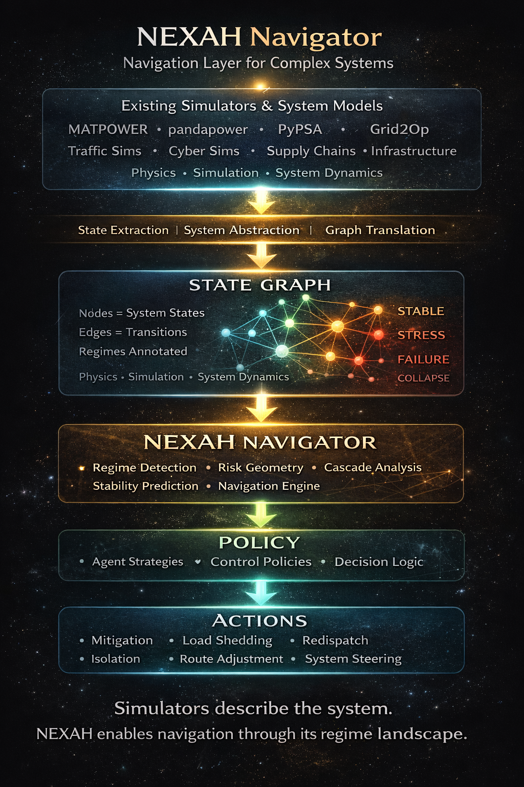
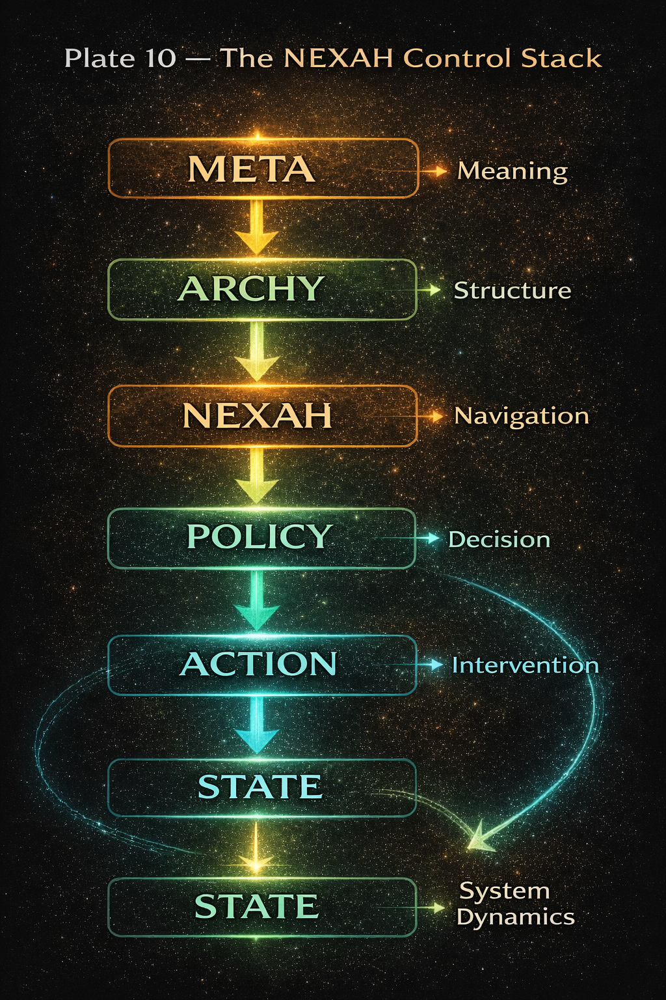

# NEXAH Framework

## Structural Navigation for Complex Systems

**NEXAH** is a computational framework for **structural analysis, stabilization, and navigation of complex dynamical systems**.

It provides tools to:

• model systems as finite regime graphs  
• analyze stability landscapes and cascade risks  
• compute navigation strategies toward stable attractors  

NEXAH combines ideas from:

- dynamical systems theory
- control theory
- abstract interpretation
- topology and geometry
- policy optimization

Rather than only simulating system evolution, **NEXAH focuses on navigating systems through regime landscapes toward stability.**

---

## Example Stability Dynamics


The **NEXAH Stability Engine** extracts multiple structural layers from dynamical systems:

• stability landscapes  
• gradient dynamics  
• attractor basins  
• metastable regions  
• spectral operators  
• topological invariants  

Full visual documentation:

ENGINE/docs/VISUAL_GALLERY.md

---

## Repository Orientation

Recommended entry points for exploring the framework:

1. Framework overview  
   NAVIGATOR/framework_portal.md

2. Stability Engine visual gallery  
   ENGINE/docs/VISUAL_GALLERY.md

3. Example system simulation  
   python BUILDER_LAB/demos/nexah_demo.py

4. Research foundations  
   RESEARCH/

The official repository for the **NEXAH Framework** —  
a modular system for **structural modeling, stabilization, and navigation of complex systems**.

> **NEXAH is a framework for navigating stability and risk landscapes in complex dynamical systems.**

The framework models **finite dynamical systems as state graphs with regimes and risk geometry**, enabling agents to navigate systems toward stability.

---

# Quick Start

Clone the repository:

```
git clone https://github.com/Scarabaeus1033/NEXAH.git
cd NEXAH
```

Install dependencies:

```
pip install -e .
```

Run the demo simulation:

```
python BUILDER_LAB/demos/nexah_demo.py
```

Example system evolution:

```
freq_drop
→ start_reserve
→ congestion
→ reconfigure_grid
→ stable
```

This demonstrates the core **NEXAH stabilization cycle**:

```
State → Regime → Risk → Navigation → Action → Next State
```


---

# Why NEXAH

Many complex systems share structural challenges:

- cascading failures  
- unstable regime transitions  
- limited system observability  
- difficult stabilization strategies  

Traditional simulators can **simulate system dynamics**, but they rarely provide tools to **navigate regime landscapes**.

NEXAH introduces a structural layer enabling:

- regime detection  
- risk geometry analysis  
- cascade prediction  
- policy-guided stabilization  

This allows agents to **steer systems toward stable attractors and away from collapse states**.

---

# Where NEXAH Fits

NEXAH does **not replace system simulators**.

Instead, it operates **on top of existing models** as a **navigation layer for complex systems**.

Existing simulation ecosystems include:

- power grid simulators (MATPOWER, pandapower, PyPSA)  
- traffic simulation systems  
- cyber-physical infrastructure models  
- supply chain simulators  
- large-scale system dynamics models  

These tools simulate **how systems evolve**.

NEXAH analyzes **how systems can be navigated**.

Conceptually:

```
Simulator → State Graph → NEXAH → Policy → Actions
```

Simulators describe system dynamics.

NEXAH extracts a **state graph representation**, analyzes **regime geometry and cascade risks**, and enables **policy-guided system navigation**.

---

# NEXAH Navigator Architecture



NEXAH acts as a **navigation layer between simulators and control policies**.

Conceptual flow:

```
Simulators
↓
State Graph
↓
NEXAH Navigation
↓
Policy
↓
Actions
```

Simulators describe the system.

**NEXAH enables navigation through regime landscapes.**

---

# The NEXAH Control Stack



The framework follows a layered architecture:

```
META → ARCHY → NEXAH → POLICY → ACTION → STATE
```

### META — Semantic Layer

Defines the system ontology:

- nodes
- edges
- regimes
- transitions
- control actions
- risk targets

### ARCHY — Structural Layer

Transforms semantic models into structural geometry:

- state graphs
- regime partitions
- stability basins
- transition structures

### NEXAH — Navigation Layer

Determines:

- regime transitions
- cascade risks
- stabilization strategies
- navigation trajectories

### POLICY — Decision Layer

Defines decision strategies for agents.

### ACTION — Intervention Layer

Applies control actions that modify system states.

---

# External System Adapters

NEXAH can connect to **external simulation environments** via adapters.

Adapters translate simulator outputs into **NEXAH state graphs**.

Location:

```
APPLICATIONS/adapters
```

Examples include adapters for:

- power grid simulators  
- infrastructure models  
- traffic systems  
- supply chain simulations  

Adapter interface specification:

```
APPLICATIONS/adapters/nexah_adapter_spec.md
```

This allows NEXAH to analyze real systems while remaining **simulation-agnostic**.

---

# Repository Map


| Layer | Description |
|------|-------------|
| ENGINE | Finite algebra core and structural operators |
| FRAMEWORK | Conceptual architecture (META / ARCHY / NEXAH) |
| RESEARCH | Mathematical foundations |
| APPLICATIONS | Dynamical system models |
| BUILDER LAB | Simulation sandbox |
| NAVIGATOR | Visual documentation |

---

# Research Pipeline


```
Axioms
↓
Principles
↓
Theorems
↓
Operators
↓
Framework
↓
Applications
```

---

# Dynamical Systems Framework


| Model | Description |
|------|-------------|
| Stability Landscape | conceptual stability structure |
| Gradient Systems | dynamics along stability gradients |
| Drift Systems | gradient dynamics with external forcing |
| Regime Systems | multi-attractor regime systems |

---

# Builder Lab

Location:

```
/BUILDER_LAB
```

Provides a sandbox for experimentation:

- cascade dynamics
- infrastructure simulations
- system navigation experiments
- visualization tools

Example:

```
python BUILDER_LAB/demos/nexah_demo.py
```

---

# Explore the Repository

| Portal | Link |
|------|------|
| Framework Portal | NAVIGATOR/framework_portal.md |
| Research Portal | NAVIGATOR/research_portal.md |
| Applications Portal | NAVIGATOR/applications_portal.md |
| Repository Navigator | NAVIGATOR/repository_portal.md |

---

# Implementation Status

Current release: **v1.0.0**

- finite algebra engine stable
- monotone and fixpoint structures validated
- worklist fixpoint solver operational
- constant propagation example implemented
- ~95% test coverage
- `mypy --strict` clean

---

# Versioning

```
v1.0 → stable finite core
v1.x → backward compatible extensions
v2.x → structural changes
```

Current version: **v1.0.0**

---

# License

Code: **Apache License 2.0**  
Documentation: **CC BY 4.0**

© 2026 Thomas K. R. Hofmann
